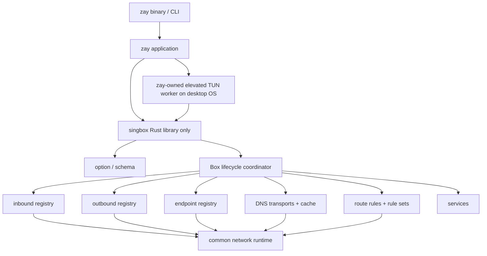
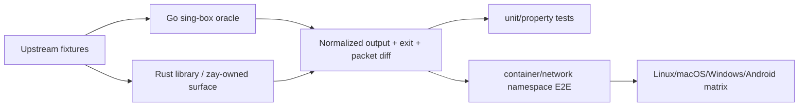

# sing-box 原生 Rust 迁移

<!-- SINGBOX_PROGRESS:BEGIN -->
## 迁移进度追踪（持续更新，先读这里）

> [!IMPORTANT] 当前估算：**99%（当前加权估算 99.9%，置信区间约 ±1.5%）**
> 这是本次迁移的进度单一真源。百分比按功能风险加权，不按代码行数或测试数量计算；只有进入 `crates/singbox` library、接入 Runtime、具备回归，并且没有已知关键 wire/lifecycle 差异的能力才计为完成。

| 追踪项 | 当前值 |
| --- | --- |
| 最后更新 | 2026-09-13 |
| 交付形态 | `crates/singbox` 只提供可嵌入 Rust library；最终 binary/CLI 由 zay 实现 |
| 完成分母 | 配置与 Runtime、DNS/路由、代理协议、TLS/transport、TUN/平台网络及 zay library 集成 |
| 明确排除 | 上游独立 CLI、daemon、顶层 service、experimental 应用控制 API 的完整兼容 |
| 最近完成 | platform network fallback 已补齐固定 Go `DefaultDialer` 的完整快速回退状态机：普通 fallback 获胜后由同一 library dialer 及其 route-action 克隆共享 15 秒状态；窗口内 primary/fallback 立即并拨；fallback 先返回后仍短暂保留 primary 探测，若主链在配置的 `fallback_delay` 内恢复则清除状态；调用方取消时不会遗留后台任务。Apple 图形客户端的 platform network bridge 已从仅 Android/iOS 扩展到 macOS library host：`RuntimeHost.platform_network_provider`、route 默认值、DNS underlay、普通 outbound 与规则级 direct 共用同一 runtime-scoped provider；TCP、UDP 和 ICMP 均在 socket 创建后、连接/监听前调用宿主 `bind_socket`，继续执行 default/hybrid/fallback 选择与延迟竞速。provider 严格受 `auto_detect_interface` 门控；无 provider 的普通 macOS host 与固定 Go 一样忽略图形客户端专属 hint 并保留原生默认接口检测。`sniff` action 调用链继续对齐：TCP 遇到仅含 packet sniffer 的 action 会立即跳过，绝不消费或等待 stream；UDP 与 TCP 统一应用 SMTP/IMAP/POP3 server-first 端口跳过。QUIC Initial 嗅探已恢复固定 Go 的客户端指纹分类：解密后保留 frame 顺序，TLS ClientHello 同时解析 cipher suites、extensions、supported groups、supported versions 与 signature algorithms，按上游顺序识别 Firefox、Safari、Chromium、quic-go 和 unknown；Go TLS 特有的 X25519Kyber768Draft00 与 renegotiation_info 检测也已接入，跨 datagram CRYPTO 重组保持不变；固定 Go 的 uQUIC/Firefox/Safari 三份真实 wire capture 已原样迁入回归。动态 rule-set 更新已恢复固定 Go 的完整 DNS metadata 校验：初始 legacy address-filter/现代 response 模式按实际 `contains_ip_cidr_rule`、`contains_non_ip_cidr_rule`、`contains_dns_query_type_rule` 元数据选择；local/remote/library reload 在提交前不仅拒绝模式切换，也拒绝 modern 模式下未启用 `match_response` 的纯 IP rule-set，以及切换时暴露出的直接 response fields/旧 accept-empty 约束。失败时旧 rules、metadata、generation 与订阅状态均原子保留；DNS resolver 释放后其弱生命周期 validator 自动失效，不会阻塞后续 library reload。`RuleSet::reload`、更新订阅、metadata 与可注册 validator 都是公开 library API，不依赖 binary/service。DNS `reject.method=reply` 同时恢复上游专用错误。完成固定 Go `option` 全部 4 个回归文件的逐项复核：无 `type`/显式 `legacy` DNS server、顶层 `dns.fakeip`（含 `null`）现在返回上游迁移错误；DNS record 拒绝 owner/RDATA 相对域名、base64 记录 canonical 化且 RFC 2136 匹配忽略 TTL；route/DNS 递归子规则对 action key 返回上游专用错误，未知 key 仍走普通 unknown-field 校验。DNS 执行层已复用公开 `DnsRecordOptions`，不再维持第二套漂移的解析器。iOS 已从 Go `Libbox.xcframework` 完整切换到 `ZayCore` 内嵌的 Rust `singbox` library：新增稳定 C ABI 的 start/reload/stop、selector/URLTest/group snapshot，Network Extension 通过同步 JSON callback 配置系统网络并把 `dup(2)` 后的真实 utun FD 转移给 Rust；物理接口枚举、Wi-Fi/蜂窝优先级和 `IP_BOUND_IF`/`IPV6_BOUND_IF` socket 绑定也由 Rust runtime-scoped provider 承接。iOS 工程、构建脚本和 Swift 源码均已移除 Libbox/Go 依赖；aarch64 iOS Rust check、release 静态库、动态 framework 及 App+Packet Tunnel 无签名整包构建通过。Tor outbound 已补齐上游 `executable_path`、`extra_args` 与 `torrc` 兼容路径：默认继续选用成熟 Arti，显式进程配置则由 library 懒启动并托管 C Tor，通过本机随机认证 SOCKS5 bridge 让 bootstrap 流量完整经过配置的 detour，使用 ControlPort 注入代理、任意 torrc option、启用网络并发现 Tor SOCKS listener；data directory/torrc/GeoIP 自动参数、配置基目录解析、取消及进程回收均已接入，无新增 binary/daemon。Windows TUN 的接口、`auto_route` 与 `strict_route` 生命周期已和固定 `sing-tun` 对齐；Linux TUN 启动也恢复了固定 Go 的 per-interface `rp_filter=2` best-effort 写入，并在配置 `netns` 时于目标 namespace 内完成 |
| 自动验证基线 | 1621 项 crate unit 注册：1614 通过、7 忽略；50 项 public-library integration 通过；singbox 稳定全量基线采用单线程执行，合计 **1664 项、零失败**。新增 fast-fallback 跨克隆状态/15 秒过期和主链快速恢复清除边界回归，以及 macOS platform provider 实际 TCP socket bind 回调、无 provider hint 兼容路径及 crate 外公开 host API 回归；固定 Go uQUIC/Firefox/Safari 真实 QUIC capture、QUIC 客户端分类/TLS 指纹字段解析、真实 Quinn Initial 与跨 datagram 重组、TCP packet-only sniff 不读流、UDP server-first skip、RDP 增量 reader 的 14-byte 成功边界/早期非法拒绝、rule-set 原子 validator、DNS 双向模式切换/modern 同模式纯 IP 更新拒绝、validator 生命周期、DNS reply 专用错误、logical-race 多 selector 等待/命中抢占/miss 让位、DNS TCP/TLS multiplexer read-epoch/timeout/retry/demotion、公开 DNS response-address adapter、SRS 上游恶意输入语料、AdGuard 双向转换 library API、HTTP authority/IPv6 Host 修复及公开 reload/validator API 均有回归；本轮另单独执行并通过 macOS `mDNSResponder` 现场测试；Tor 的 Arti、认证 bootstrap bridge、ControlPort、torrc/GeoIP 专项回归均通过；本地 Quinn 兼容补丁、Linux resolved 探针、pinned Go ECH 互通、zay unit/worker integration 等专项基线保持通过；原生严格 Clippy、Windows 全目标严格 Clippy、Linux x86_64 Zig 全特性整库构建、格式及根工作区联编已按本轮复核；本轮 `aarch64-apple-ios` 全特性交叉检查再次通过，额外 GNU Linux 交叉复核受宿主缺少 `x86_64-linux-gnu-gcc` 阻断。iOS 新增通过 `cargo check -p zay-ios --target aarch64-apple-ios`、release staticlib/framework 链接、`cargo test -p zay-ios` 以及 `xcodebuild` 的 App+Packet Tunnel 无签名 device build；PageMD 在本轮文档更新后复核。受宿主条件限制的 Linux tests 动态 sqlite3、Android NDK，以及管理员权限 WinDivert/system TUN/桌面与移动真机矩阵继续列为外部验证边界 |
| DNS race 对齐 | 固定 Go `dns/router_race_test.go` 的 logical-race 双结果已迁入 Rust：logical rule 会等待匿名与 tagged response selector 全部完成，命中时抢在较慢 race 前提交匿名响应，任一子规则 miss 时则让位给下一条 race；完整单线程基线已覆盖该行为。 |
| DNS multiplexer | 固定 Go TCP multiplexer 的自适应 probe、单连接 fallback、乱序 query-ID、复用读错误重拨、连续死亡降级、静默 pipeline 与 query timeout 语义均已对齐。每个 pending query 保存注册时 read epoch：超时且此后无任何响应才淘汰连接；其他 query 有新响应时只移除该慢 query，不中断活连接。 |
| QUIC 客户端指纹 | QUIC Initial 解密器保留当前 datagram 的 frame 顺序，并从重组后的 TLS ClientHello 提取 SNI、cipher suites、extensions、supported groups/versions 与 signature algorithms；按固定 Go 的优先级识别 Firefox、Safari、quic-go、Chromium 与 unknown，包含 Go crypto/tls 的 PQ curve 和 renegotiation extension 特征。固定 Go 测试中的 uQUIC Chrome 115、Firefox 与 Safari 原始捕获已成为 Rust 内嵌 fixture，三类真实 wire 均验证 SNI 和 client。 |
| sniff action 调用链 | TCP/UDP action 统一执行上游 server-first 端口跳过；显式仅 packet sniffer 的 TCP action 不再读取或等待 stream，显式仅 stream sniffer 的 packet action 也不误运行。payload replay、超时、QUIC 多包状态和 sniff 后重路由保持原行为。 |
| Apple 平台网络策略 | macOS 与 iOS 现在都从公开 `RuntimeHost.platform_network_provider` 接收宿主物理接口枚举及 socket 绑定；route 默认、dialer 配置和单连接 route-options 统一覆盖 TCP/UDP/ICMP，保留 own-TUN 排除、default/hybrid/fallback、fallback delay 与冲突校验。provider 只在 `auto_detect_interface` 开启时接入；普通 macOS host 无 provider 时继续使用 native auto-detect。TCP fallback 命中后的 15 秒 fast-fallback、窗口内并拨、主接口在 delay 内恢复后异步清除状态及取消安全均已与固定 Go 对齐。 |
| RDP 嗅探边界 | RDP sniffer 改为按固定 Go reader 的字段读取顺序逐步判定：已出现的非法首部立即拒绝，字段截断返回 need-more-data；读取到 14-byte negotiation header 即可确认协议，不再错误要求第 15 个字节或完整 19-byte TPKT。 |
| adapter DNS 地址 | 新增公开 library helper `dns_response_addresses`，与固定 Go adapter 行为一致：仅从 NOERROR 响应提取 A、AAAA 与 HTTPS `ipv4hint`/`ipv6hint`，IPv4 hint 保持 IPv4 地址类型；DNS 执行器复用该入口，不再保留私有重复实现。 |
| SRS 恶意输入 | 固定 Go `common/srs/malformed_test.go` 的 10 类语料已逐项迁入：超大 rule/string/uint16/IP-range/prefix/bitmap 长度均在分配前拒绝，非法 IP 地址长度、空 succinct matcher 与一万层 logical nesting 均 fail-closed。 |
| AdGuard 转换 | 新增公开 `route::adguard` 双向 library API：DNS filter/hosts 文本会转换为强类型 headless rule tree，保留 `$important`、allowlist、正则、hosts 零地址、unsupported 行统计、Go `net.isDomainName` 字节级校验及上游 SRS v2 输出选择；固定 Go 三组 matcher/round-trip fixture 与 crate 外调用均已覆盖。 |
| HTTP authority | HTTP client 的 authority key 已按固定 Go 覆盖 HTTP/HTTPS 默认端口、显式端口、host 大小写、IPv4 与 IPv6；两条 H1/H2 request 构造路径共用 IPv6-safe Host formatter，修复此前 literal 未加方括号而产生的歧义 wire。 |
| UDP NAT 精确语义 | TProxy 与 userspace endpoint 共用有界过滤 LRU；域名、首对端、IPv4-mapped、filtering/mapping 级别、命中刷新、淘汰和 session 清理均与固定 `sing-tun` 对齐。TProxy 网络更新仅关闭绑定接口已失效的 session；userspace session 只由客户端入站数据刷新，服务端持续回包不会延长生命周期 |
| 当前主线 | `crates/singbox` 保持纯 library。规则级 `action: direct` 现在完整消费上游 `AbstractDialerOptions`，并为每条规则建立不暴露于公共 outbound tag 列表的独立 dialer；默认 interface/mark/resolver 的继承顺序已修正，ShadowTLS inbound 的 handshake 直连也不再绕过嵌套 dialer 配置。显式 direct outbound 与协议/endpoint/规则 underlay 的 UDP 分片默认值已经分离：前者按上游允许，后者按通用 `dialer.New` 默认禁止，显式 `udp_fragment` 始终优先。普通协议 underlay 会在合并 route 默认值后选择 resolver；有 detour 时仅显式 `domain_resolver` 触发 detour 前预解析，并携带 timeout/cache/rewrite-TTL/client-subnet，按解析顺序逐地址回退及恢复 UDP 原域名。远程 DNS bootstrap 及 WireGuard/OpenVPN/OpenConnect/Tailscale/cloudflared endpoint 的独立目标解析也携带完整 query options 并继承 route 默认 resolver；Naive 与这些 endpoint 按上游 `ResolverOnDetour` 在 detour 前解析，而普通 SOCKS/HTTP 等保持由代理解析。Naive 以及域名目标的 OpenVPN/OpenConnect/Tailscale 还恢复 `NewDialer` 歧义保护：存在多个 DNS transport 且无明确 resolver 时构造期拒绝；WireGuard/cloudflared 则保持固定上游的 DNS Router 默认选择行为。SOCKS4 目标与上游一样使用 DNS Router 默认查询而不误用服务器 dialer resolver。WireGuard、OpenVPN client/server、OpenConnect 与 Tailscale endpoint 共用 raw L3 flow-NAT dispatcher；MTU/分片/PTB、ICMP error 反向 NAT、TCP forward-entry timeout/双 FIN/RST tombstone、route UDP timeout、accept/reject/drop cache、拒绝报文、规则级 reject flood protection、packet-flow 计量/宿主关闭及重大网络变化 reset 均已按固定 `sing-tun` 基线对齐。返回包通过有序无损 writeback pump 进入有界 egress；flow/simple 表在当前 packet dispatch 后按上游 2048 项窗口 sweep/evict；ICMP flow 使用 sing-box 的 10 秒 timeout；每个 packet port 独立维护 selector 与 reverse NAT。公开 `IpPacketPort` selector range 已恢复上游 `(start, count)` 契约。`bridge` outbound 已接通 macOS utun/PF、Linux TUN/rtnetlink/nftables/iptables 与 Windows WinDivert/netdev 原生 backend，并进入 Runtime 生命周期 |
| 本轮新增对齐 | 动态 rule-set metadata 在首次 DNS rule 编译和每次候选更新时均参与 legacy/modern 模式判定；模式变化以及 modern 同模式下未启用 response matching 的纯 IP 更新都会在发布前失败并保持旧快照，直接 response fields、旧 accept-empty 和 DNS reply reject 的错误路径也与固定 Go 对齐。公开 reload/validator API 允许 zay 以 library 方式驱动同一事务语义，弱生命周期绑定避免已释放 DNS 实例留下永久校验。固定 Go `option` 的 DNS legacy/record 与递归 rule action 错误语义已经逐测试对齐，runtime record parser 复用同一个公开强类型。顶层 route 与 DNS rules 均已从 `Vec<Value>` 收敛为公开严格 matcher/action AST；default/logical 父 matcher 先排除字段再解码 action，递归子节点在类型层面不能携带 action，跨 action 字段、空 route-options、非法 type/action、DNS rcode/match-response/record wire 均提前拒绝。route/DNS 的 geosite、GeoIP 与旧 `rule_set_ipcidr_match_source` 保留迁移解析面并返回固定 Go 版本错误。DNS 同时恢复 1.14 legacy address-filter 自动模式：直接 IP、rule-set IP、invert、logical、失败后续规则、`rule_set_ip_cidr_accept_empty`、旧 action strategy 和 RDRC 均进入真实执行路径；与新 `match_response` 冲突时返回固定迁移错误。新模式内 domain、直接响应 IP 与 rule-set IP 共享上游目标地址 OR 类别。`ip_is_private` 已改用固定 `sing` 的“非公网”定义，覆盖 RFC private/ULA、回环、链路本地、组播及未指定地址；DNS 前导点 suffix 保持“仅子域”语义，空 domain/suffix item 按 Go 拒绝；source MAC/Wi-Fi BSSID 也按 Go 规范化后匹配；端口范围恢复仅冒号、开放端点及降序空范围语义；route `ip_version` 支持显式元数据且由实际 IP 目的地址覆盖，非法版本构造期拒绝；DNS IP 条件仅消费 NOERROR 地址，并纳入 HTTPS `ipv4hint`/`ipv6hint`。DNS default reject 的 30 秒/50 次 flood window 与 `no_drop` 也已对齐。Runtime 只在内部边界转换成既有执行器输入。rule-set inline/local/remote 与 source/SRS headless tree 同样保持强类型；SRS 单元素 `Listable` canonical 输出对齐固定 Go。experimental V2Ray API/stats 与 Go debug knobs 只保留强类型迁移面，不启动已排除的 application-control API/service |
| 下一批关键缺口 | WireGuard/OpenVPN client+server/OpenConnect/Tailscale system interface 的 macOS/Linux/Windows 有权限真实数据面、协商重连、地址/MTU/route 热变更、DNS、休眠恢复与异常回滚矩阵；Linux kTLS 真实主机 TX-only/RX-only/双向、5.1/6.0/6.14、KeyUpdate、Vision/splice/zero-copy 长时矩阵，以及 Windows Schannel 真实主机回环/生产矩阵；三桌面平台其他有权限实机矩阵（PF、nftables/iptables、WinDivert、系统代理、动态路由、process、neighbor）与 Android/iOS 真机网络切换；Windows IP Helper 事件的真实网卡 metric/断连/休眠现场差分及 WinDivert filter 现场验证；外部 C Tor 的真实 bootstrap/bridge/进程异常与不同 Tor 版本矩阵；Naive BBRv2 对固定 Cronet 的丢包/乱序/带宽突变差分、Chrome/Hysteria 长时公网与高损耗矩阵、Cloudflared/OpenConnect/Tailscale 生产互通、ECH reject/retry 公网矩阵，以及其余协议错误时序长尾 |

| 工作流 | 权重 | 完成度 | 加权贡献 | 当前边界 |
| --- | ---: | ---: | ---: | --- |
| 配置、schema、constant、common | 10% | 99.8% | 10.0% | 顶层 route/DNS matcher+action、NTP、全局 certificate、experimental V2Ray API/stats/debug 固定配置与核心 scalar 已强类型化；rule-set 的 inline/local/remote 固定变体及递归 action-free headless rule 已成为公开强类型，source/SRS library API 复用同一 AST；动态 inbound/outbound/endpoint/DNS transport 注册表保留与固定 Go `TypedMessage` 等价的 tag+map 边界，而不是遗漏的裸规则树；证书仓库提供 system/Mozilla/Chrome/none 根集合、内联/文件/目录加载和原子热更新；三桌面 process ownership 及 Linux/macOS neighbor/DHCP lease 已有内建 platform backend，特权系统时钟写入采用 zay 可实现的窄宿主 trait；Unix/Android `protect_path` 已支持文件系统与 abstract socket |
| Runtime、adapter、lifecycle、log | 8% | 100% | 8.0% | library 生命周期和取消已接入；URLTest/selector 状态更新可由宿主订阅，内部/外部连接中断语义已对齐；主要 VPN endpoint 均进入统一 staged lifecycle；Tailscale 后台交互登录、control reconnect/map resume、DERP/disco/WireGuard/smoltcp 装配、状态 handle 与稳定 outbound tag 已接入 Runtime，生产互通风险计入对应协议工作流 |
| DNS transport、cache、fake-IP、规则 | 10% | 99.8% | 10.0% | 主 transport/缓存/response race 已有；新 response-matching 与 1.14 legacy address-filter 两套规则状态机均已接通，覆盖直接/rule-set IP、logical/invert、共享地址类别、失败续选、accept-empty、legacy strategy 与 RDRC；`reverse_mapping` 按 answer TTL/LRU 建表并在 route 前恢复 IP 目的域名，排除 FakeIP 且随 cache clear 清空；local、全部远程 DNS transport、DHCP、OpenConnect、Tailscale 与 OpenVPN 动态 transport 已接入，OpenConnect 含 Fortinet 规则专属 DNS/server route/search/default policy，OpenVPN 支持 pushed UDP/DoT/DoH、priority、route/search/default policy 和重协商替换；local 保留 hosts、宿主邻居表、系统 search 策略、UDP→TCP fallback 和 server-set 热更新；Apple scoped resolver/mDNSResponder、非 Apple raw mDNS 自动分流及 Linux systemd-resolved link/DoT 数据面已接通，剩余为平台生产矩阵和少量错误时序差分 |
| route、rule-set、sniff、process/network match | 10% | 100% | 10.0% | 主数据面已接入；route/route-options 单连接网络策略、TLS spoof 已传至全部最终 TCP direct，`udp_timeout`、connected UDP、domain unmapping 与 DNS reverse mapping 已进入 packet/NAT session；neighbor/process resolver 会在匹配前回填源 MAC/hostname 及进程、包名、用户 metadata，macOS/Linux/Windows process resolver 与 Linux/macOS neighbor resolver 均有内建实现并按配置需求自动启用，宿主实现优先；rule-set 原子更新/订阅、H1/H2/H3 持久下载、cached-H3 优先/fallback race/broken-authority backoff、Apple NSURLSession engine + NTP verify-time + 动态证书仓库、TUN auto-redirect 动态消费及 SRS succinct 零展开运行时已完成 |
| 基础 inbound/outbound | 8% | 100% | 8.0% | direct/block/SOCKS/HTTP/mixed/redirect/TProxy 主路径已有；HTTP/mixed `set_system_proxy` 已接入 macOS/Linux/Windows/Android 平台 backend、默认接口更新和先禁用后关闭的 listener 生命周期；规则级 direct 与 ShadowTLS handshake 已消费完整嵌套 dialer options，SOCKS4/4a/5 outbound BIND 已通过公共 Dialer 与组合包装暴露；通用 listener `detour` 已覆盖全部现有 TCP listener、完整固定 Go `TCPInjectableInbound` 目标、链式循环保护和 metadata 传递，UDP 对当前不存在 injectable 目标的错误路径也已对齐；SOCKS outbound 的 `network` 能力由 route 在拨号前检查 |
| 主代理协议 | 18% | 98.5% | 17.7% | Shadowsocks/VMess/VLESS/Trojan/AnyTLS/ShadowTLS/Snell/Naive 主路径已有；VMess client/server 与 Shadowsocks AEAD-2022 TCP/UDP 已动态使用 Runtime NTP 时钟，AEAD-2022 EIH relay 的 TCP/UDP 也会把 FakeIP 恢复后的 metadata destination 交给最终拨号；所有提供 `network` 的主协议 outbound 已接入 route 能力门，Naive H2 多池、H2/H3 flow-control 与 BBRv2 数据面已接入，剩余主要是生产互通及少量 wire/错误时序差分 |
| TLS、证书、V2Ray transport、mux | 10% | 99.5% | 10.0% | 标准 TLS 1.2/1.3、OpenSSL stream TLS 1.0/1.1、macOS Apple/Windows Schannel raw system TLS、Linux TLS 1.3 kTLS TX/RX、ECH 静态与 DNS HTTPS 动态发现、uTLS+静态 ECH、Rustls ECH server、ACME 双后端/多算法 account key/三种 DNS-01、Origin CA 与 Tailscale provider 已有；动态 ECH 已贯通 TCP/QUIC，并支持服务端 retry-config 的 TTL 内更新与单次重拨。kTLS 代码与跨目标编译已完成，剩余 Linux/Windows 真实主机和生产矩阵，不把未执行的平台数据面记为 100% |
| QUIC、Hysteria v1/v2、TUIC、Naive | 8% | 99.6% | 8.0% | TCP/UDP/认证/分片/复用主路径已有；Hysteria2 三种 BBR profile、逐包 conservative sampler、controller-rate pacer 及 Chrome Parrot 的 transport/TLS/packet-layout wire 已进入实际连接；Naive QUIC 默认 Cubic、6/15 MiB flow-control 和原生 BBRv2 状态机已进入真实 H3 TCP/UoT 数据面，剩余为固定 Cronet 差分及公网高损耗/带宽突变生产矩阵 |
| TUN、平台路由、auto-redirect | 10% | 98.5% | 9.9% | macOS/Linux/Windows library 路径均已接入，三端普通 TUN 与 VPN endpoint system interface 均接受 IPv4-only、双栈及 IPv6-only 地址：Linux 用 rtnetlink 补齐所有未由设备层配置的地址，并在正确 netns 内 best-effort 设置接口 `rp_filter=2`；Windows 的 IPv6-only 地址/route/DNS 走事务型 netsh lease，macOS 的 IPv6-only utun 由 kernel-control socket 与原生 ioctl 配置。Windows 按地址族设置 MTU、router-discovery/DAD/stateful-config、IPv4 forwarding 与 auto-route metric，并关闭 DNS registration；普通 TUN 仅在 `auto_route` 下安装 route/刷新 resolver cache，`strict_route` 已用动态 WFP 子层覆盖当前进程保护、缺失 IPv6 阻断、TUN interface 放行和 hijack DNS 端口阻断，失败及关闭均随事务清理。Linux auto-redirect 可原子消费动态 rule-set，并使用与 sing-tun 一致的双栈 input/output mark、goto/nop 和 32768/自定义 fallback policy rule；raw L3 dispatcher 已覆盖 MTU/分片/PTB、ICMP error 反向 NAT、TCP 精确 lifecycle、simple verdict cache、reject wire/flood protection、流量计量、宿主关闭及重大网络变化 reset。TProxy 与 userspace VPN endpoint 的 endpoint-independent UDP NAT 都会按当前 UP+broadcast、非 loopback/point-to-point 接口的最长前缀把真实 OS interface index 分类进 session key，避免跨本地链路或虚拟隧道错误复用 socket，并在接口快照变化时刷新；TProxy 仅关闭原接口已不再有效的分类 session，不会因无关接口变化清空整张 NAT 表。userspace UDP 在初始快照就绪后才建立首个 session，首包固定 route/outbound/timeout，响应按 Go 顺序先执行 FakeIP/route NAT 再 filtering。过滤状态已统一为跨 session 的容量受限 LRU：域名来源始终放行，IPv4-mapped 地址规范化，首个 IP 对端不占缓存，后续对端命中刷新、淘汰有界且随 session 清理；默认容量与固定 `sing-tun` 的 iOS/内存规则一致。ICMP 则走有序 pre-match。Windows 网络更新使用 route、unicast-address 与 interface 三类 IP Helper 回调，并在状态差分后驱动所有连接池和 endpoint reset。bridge 已完成 Linux pinned/custom policy table、动态出口/MSS/full-cone/iptables fallback，macOS 动态出口/connected segment/PF reply-to，以及 Windows 端口保留、动态接口/source 选择和 WinDivert 双向数据面；Android/iOS 已提供宿主 FD、有效 DNS/最终路由请求和 socket 网络选择。剩余主要是管理员权限实机、动态协商/网络变化/休眠恢复及移动真机矩阵 |
| WireGuard/OpenVPN/SSH/Tor/OpenConnect/Tailscale/cloudflared | 6% | 99.8% | 6.0% | 前四项及 OpenConnect/Tailscale 主要 library 主链已有；Tor 默认 Arti 会把 relay TCP 交给完整 singbox dialer，显式 C Tor 配置也支持 executable/args/torrc、配置基目录、自动 GeoIP、认证 bootstrap bridge、ControlPort、SOCKS listener 发现及 Drop 回收；OpenVPN 客户端动态 DNS、pushed `block-ipv6` 和 endpoint route/domain preference 已接入；WireGuard/OpenVPN client+server/OpenConnect/Tailscale 的 system interface、OS-bound endpoint dialer、动态地址/MTU/route 重建已接入；OpenConnect 已消费显式 DTLS 本地端口、HTTP/1.1 keep-alive 禁用、TLS 1.2 PFS cipher filter、Fortinet split-DNS rules、三类 DTLS path-MTU 探测和 CSTP 保活下的指数退避恢复；cloudflared 已完成 Runtime inbound、edge/HA/factory、动态 feature/ingress、origin、Access JWT、HTTP framing/trailer/gzip 与 Datagram v2/v3 UDP/ICMP，源站 TCP/UDP 使用 pipe-backed 完整 route action pipeline，ICMP 使用只接受 FlowOutbound 且校验 port address 的 pre-match 语义；尚缺 system interface/外部 Tor 特权实机与生产 edge/公网 origin 互通矩阵及长尾 transport 差分 |
| zay library 集成与去 Go 化 | 2% | 100% | 2.0% | Unix/Windows 主路径与 iOS Packet Tunnel 均直接托管 Rust library；Windows 只保留 zay 自有 UAC/命名管道 worker，iOS 只保留窄 C ABI/utun callback，构建及运行路径均不再依赖 sing-box binary、Go 或 Libbox |
| **合计** | **100%** |  | **99.9%** | 表内完成度为便于追踪的四舍五入值，精确估算使用未显示的小数；完成定义见下文门槛 |

追踪规则：每完成或重新打开一个工作项，都必须同步修改上面的总体百分比、对应模块行、自动验证基线和“下一批关键缺口”；单纯增加测试数量不会自动提高完成度。`SINGBOX_PROGRESS` 注释界定首屏进度区，便于脚本或人工稳定定位。
<!-- SINGBOX_PROGRESS:END -->

本轮完成此前未纳入百分比的 iOS 去 Go 化收口。`zay-ios` 现在作为根 workspace 成员直接依赖 `crates/singbox`，在 `ZayCore.framework` 内托管 library runtime；C ABI 提供同步 start/reload/stop、group snapshot、selector 切换与 URLTest。Rust 在启动 TUN inbound 时把最终 MTU、地址、已展开并扣除 exclude 的 routes、DNS server 编成 JSON 请求，Swift `NEPacketTunnelProvider` 应用 `NEPacketTunnelNetworkSettings` 后以 `dup(2)` 返回独立 FD，Rust 明确接管并在关闭时释放。出站网络策略不再依赖 Go platform interface：Rust 每次拨号枚举 UP、非 loopback 的 iOS 物理接口，排除 utun/ipsec/Apple peer helpers，按 Wi-Fi、蜂窝、其他排序，并在 connect 前使用 `IP_BOUND_IF`/`IPV6_BOUND_IF` 绑定借用 socket。旧 `Libbox` command server/client、Swift protocol adapter、`Libbox.xcframework` 工程引用、Go 构建脚本和文档要求全部移除。iOS aarch64 check、258 MiB release staticlib、154 MiB 动态 `ZayCore.framework` 与 App/Packet Tunnel device SDK 无签名构建均成功；真机签名、实际 utun 收发、切网、睡眠与 jetsam 仍属于外部矩阵。总体加权估算由 99.8% 上调到 99.9%。

本轮补齐 Tor outbound 此前仍会明确拒绝的三个上游字段。没有显式进程选项时继续使用成熟 Rust Arti，并把 relay TCP 交给配置的 singbox dialer；配置 `executable_path`、`extra_args` 或 `torrc` 时，library 改用懒启动的外部 C Tor backend。它会创建/验证 data directory 与空 torrc，按上游规则自动发现同目录 `geoip`/`geoip6`，相对路径以 embedding Runtime 的 `base_path` 为准；随机认证且仅监听 loopback 的 SOCKS5 bridge 把 Tor bootstrap 的每次 CONNECT 交回完整 detour，cookie-authenticated ControlPort 随后设置 bridge credential、过滤保留键后逐项应用 torrc、解除 `DisableNetwork` 并读取实际 SOCKS listener。初始化被取消、配置失败或最后一个 outbound 引用释放时，bridge task、子进程和临时目录都会回收。7 项 Tor 专项测试、1593 项 crate unit（1586 通过、7 忽略）和 47 项 public-library integration 全绿；原生/Windows 严格 Clippy、iOS check 与 Linux x86_64 Zig 全特性 library 构建通过。总体精确加权估算保持 99.8%，未安装真实 Tor 的本机不替代各版本 C Tor 公网/异常矩阵。

Linux TUN 启动路径本轮也恢复了固定 `sing-tun` 在 link-up 后执行的 best-effort reverse-path-filter 配置：使用接口专属 `/proc/sys/net/ipv4/conf/<name>/rp_filter` 写入 `2`，开启 loose reverse-path validation，避免 strict mode 把策略路由进入 TUN 的有效包误丢弃。存在 `netns` 时写入通过已有的 namespace guard 在目标 namespace 内执行，不会修改宿主同名接口；写入失败与 Go 一样不阻断 TUN 启动。路径构造拒绝空名称与目录穿越，Linux x86_64 全特性 library Zig 交叉构建通过。

本轮继续逐行核对固定 `sing-tun` 的 Windows `NativeTun.configure/Start/Close`，补齐了此前 Wintun/netsh lease 未覆盖的接口参数和两个运行时边界。每个已配置地址族现在都通过 `GetIpInterfaceEntry`/`SetIpInterfaceEntry` 关闭 router discovery、DAD、managed-address 与 other-stateful configuration 并写入 MTU；IPv4 同上游启用 forwarding，auto-route 时两族关闭 automatic metric 并设为 0；DNS registration 也按上游 best-effort 关闭。普通 TUN 在 `auto_route=false` 时完全跳过 route plan，即使配置里存在显式 `route_address` 也不会错误修改系统路由；VPN endpoint 的 protocol-owned system-interface route 不受这条普通 TUN 门控影响。`auto_route + strict_route` 在 Windows 10 及以上会建立动态 WFP engine session 和最高权重 sublayer：权重 13 的 ALE app-id filter 保护当前 zay 进程，权重 12 在无 IPv6 TUN 地址时阻断 IPv6，权重 11 按本机 TUN interface index 放行相应地址族，hijack DNS 时再以权重 10 阻断 IPv4/IPv6 remote port 53；permit app filter 同样保留 `CLEAR_ACTION_RIGHT`。WFP 任一步失败会由动态会话自动删除已加规则并触发既有 address/route 回滚，正常关闭也一次释放全部 filter。auto-route 安装完成和关闭时还调用与 Go 相同的 `dnsapi!DnsFlushResolverCache`，避免系统继续使用旧 resolver cache。新增 Windows route 门控回归；稳定全量更新为 1589 项 crate unit（1582 通过、7 忽略）及 47 项 public-library integration，自动执行合计 1629 项、零失败；原生与 Windows 全目标全特性严格 Clippy、iOS 全目标检查、Linux x86_64 Zig 全特性 library 构建、根工作区联编及格式通过。总体精确加权估算保持 99.8%，TUN 子项由 98% 调整到 98.5%，剩余边界主要是管理员权限 Windows 真机 Wintun/WFP/DNS/休眠恢复矩阵。

本轮按固定 `sing-tun` 的 system stack 重新审计桌面 TUN 地址族后，移除了 Rust runtime 对首个 IPv4 prefix 的额外要求。Linux IPv6-only 设备先无地址创建，再由既有 rtnetlink lease 安装全部 prefix；Windows 对 IPv6-only Wintun 启用 `skip_config`，由事务 lease 配置首地址、附加地址、route 和同地址族 DNS，并像 Go 一样为每个已配置地址族先清除旧 DNS、仅在 `auto_route` 且 DNS 未禁用时重新加入服务器；macOS 则绕过 `tun-easytier` 的 IPv4-only alias，实现 kernel-control utun 打开、实际接口名读取、MTU/flags ioctl 及 IPv6 alias 配置，同时继续由依赖处理四字节 packet-information framing。该路径同时服务普通 TUN inbound 与 WireGuard/OpenVPN/OpenConnect/Tailscale 的 endpoint system interface。新增配置、utun unit 与 Windows DNS 命令回归；稳定全量更新为 1588 项 crate unit（1581 通过、7 忽略）及 47 项 public-library integration，自动执行合计 1628 项、零失败；原生与 Windows 全目标全特性严格 Clippy、iOS 全目标检查、Linux x86_64 Zig 全特性整库构建及格式通过。总体精确加权估算保持 99.8%，剩余风险仍为需要管理员权限、不同内核/驱动和真实网络条件的现场矩阵，而非已知库内功能空壳。

最新按固定 Go `protocol/cloudflare/routerDialer` 把 Cloudflared 源站拨号从“注册时同步挑一次 outbound”改为真正的 pipe-backed routing。TCP 先向 origin dispatcher 返回 duplex client half，server half 在独立任务里执行完整 `sniff_and_route_stream`，因此 HTTP/TLS 等实际首包会被检查、原字节会被重放，`resolve` 与累计 route-options 会按规则顺序继续到终态后才拨号；reject 与 hijack-dns 也走公共语义。UDP 使用双向有界 packet pipe，首包及 QUIC 多包 sniff 缓冲全部按序重放，终态 packet connection 的 FakeIP/route override 由公共 destination NAT 双向翻译，调用方仍看到 edge 注册的原始 source。ICMP metadata 从误用 UDP 改为 ICMP，并按 Go PreMatch 跳过 sniff、执行 resolve、拒绝空 outbound bypass和 destination override；公共 `Dialer` 新增 ICMP flow capability，并由 direct、metering、network restriction、selector、URLTest、resolver wrapper 与所有 packet-port endpoint 透传。Cloudflared 只接受真正 FlowOutbound，且当前地址族 port address 必须有效并为 unspecified，避免普通协议或带具体 L3 source 的 endpoint 被错误接受。真实 TCP/UDP 回环分别验证 sniff 后选中覆盖端口、载荷未被消费及 UDP response source 恢复；独立回归验证 `resolve → destination CIDR → direct` 的有序选择。HTTP 正向代理的专用 request dial 路径同步改成有序 action loop：已有 `protocol=http` 会跳过重复 sniff，但 `resolve` 可以填充地址后继续命中 CIDR 终态规则，真实 hosts-resolver + block-default 回环证明不再提前落到默认 outbound。同步审计固定 `sing-tun` 后，把直连接口最长前缀分类器提升为公共网络组件：TProxy 及 WireGuard/OpenVPN client+server/OpenConnect/Tailscale userspace endpoint 的 endpoint-independent NAT key 都以客户端原目标和真实 OS interface index 组成，IPv4-mapped 地址先 unmap；分类只接受 UP+broadcast、非 loopback/point-to-point 接口，避免虚拟隧道误分类，网络重大变化时刷新并 purge 旧 session。userspace endpoint 在首个 UDP session 前等待初始接口快照，只在首包执行 route/sniff、固定 outbound/override/timeout，后续数据报沿同一 packet connection 并通过公共 `PacketDestinationNat` 处理动态目标；回包先反向 NAT 再做 endpoint/address/address+port filtering。随后将 TProxy 与 userspace endpoint 重复的无界过滤集合替换为共享 `UdpNatFilter`：严格复刻域名来源无条件放行、首个 IP 对端不进入 LRU、只有 filtering 严格于 mapping 时缓存后续 IP 对端、命中刷新、跨 session 容量淘汰、会话结束清理以及 IPv4-mapped unmap；未配置容量时 iOS 固定 4096，其他平台按总内存推导并 clamp 到 4096–16384。endpoint ICMP 改为有序 PreMatch 且只接受 FlowOutbound，公共 TCP proxy 的最终 dial 也读取 FakeIP 恢复后的 metadata destination，新增真实回环覆盖后者。Shadowsocks AEAD-2022 EIH relay UDP 同步修正该目标。稳定全量更新为 1586 项 crate unit（1579 通过、7 忽略）与 47 项 public-library integration，共执行 1626 项、零失败；原生及 Windows 全目标全特性严格 Clippy、iOS 全目标检查、Linux x86_64 Zig 整库构建、zay 根工作区联编和格式检查通过。总体精确加权估算保持 99.8%。

最新将 Go `Router.prepareMatchMetadata` 的 FakeIP 阶段收口到 Rust 公共 TCP/UDP 路由边界。此前大多数代理协议在握手后自行恢复 FakeIP，但 Snell、direct、redirect 与 TProxy 依赖中央路由语义而会只用恢复后的域名匹配规则、最终仍拨向原 FakeIP；cloudflared 的内部 route dialer 也存在同类旁路。现在所有这些路径都会在首个 rule match 前恢复目的域名并把恢复后的地址交给最终 dial，同时缺失 FakeIP 记录仍 fail closed。透明入口新增独立 process lookup 目的快照：进程归属查询使用 FakeIP 替换前的 listener/original destination，随后公开 route metadata 再切换为 Go 的 fake origin。TProxy UDP 同时按固定 `sing-tun` 重构 session：NAT key 基于客户端原地址，首包一次性确定 outbound、route override 与 timeout，后续 packet 沿同一连接转发；响应先做 route/FakeIP 反向 NAT，再执行 endpoint/address/address+port filtering。统一 `PacketDestinationNat` 进一步复刻 `fakeIPNATPacketConn` 的 address-scoped 行为，同一个无绑定 UDP session 中只有选路 FakeIP 地址按端口恢复到域名，后来出现的其他 IP 被记为 direct destination，即使端口相同也不会被 fallback 错误翻译。Cloudflared UDP route dialer 新接入 `PacketDestinationNatConnection`：调用方继续按 edge 注册的原地址收发，而底层 packet connection 双向翻译成 FakeIP 恢复或 route override 后地址，修复“listen hint 已改写、实际 `send_to` 仍使用原目标”的无绑定 UDP 漏洞。新增公共 TCP/UDP metadata 回归同时断言 process-before-FakeIP，Direct TCP/UDP 真实回环证明最终拨号使用恢复域名，packet NAT 单测覆盖同地址异端口、其他 FakeIP/direct 地址及 connection wrapper 双向收发。稳定全量更新为 1575 项 crate unit（1568 通过、7 忽略）与 47 项 public-library integration，共执行 1615 项、零失败；原生与 Windows 全目标全特性严格 Clippy、iOS 全目标检查、Linux x86_64 Zig 整库构建、zay 根工作区联编、格式与 diff 检查通过。总体精确加权估算保持 99.8%。

最新补齐 packet session 的 route destination NAT 与 QUIC inbound FakeIP 路径。固定 Go 在 route/route-options 覆盖 UDP 地址或端口时以 `DestinationNATPacketConn` 双向翻译：只将建立 packet connection 的原始目的地改到 routed destination，后续携带其他目的地的数据报保持原样，返回包的 source 再恢复成客户端看到的原地址。Rust 新增统一 `PacketDestinationNat`，同时记录精确地址和域名解析后必要的端口映射；SOCKS/UoT、managed/AEAD-192/legacy-multi/relay 四条 Shadowsocks UDP 路径、Hysteria v1/v2、TUIC 都改用同一状态机，userspace VPN endpoint 也不再只为 FakeIP 建响应映射，而会覆盖 local-address 与 route override。逐行审计还发现 Hysteria v1/v2 与 TUIC 绕过了 Go 中央 `prepareMatchMetadata` 的 FakeIP 恢复；其 TCP 与 UDP 入口现在都会恢复真实域名、设置 `origin_destination`/`fake_ip`，UDP 每个携带地址的数据报也独立恢复并进入同一响应 NAT。新增 helper 单测证明 route override 不污染 packet session 内其他目的地；真实 SOCKS UDP 回环证明覆盖后的响应仍报告原 source；现有 Hysteria QUIC TCP/UDP 互通改为向保留地址发包并由规则覆盖到真实 echo，验证 wire 返回 source 保持原地址。稳定全量更新为 1571 项 crate unit（1564 通过、7 忽略）与 47 项 public-library integration，共执行 1611 项、零失败；原生与 Windows 全目标全特性严格 Clippy、iOS 全目标检查、Linux x86_64 Zig 整库构建、zay 根工作区联编及格式检查通过。总体精确加权估算保持 99.8%。

最新修正 route-options 与动态 `preferred_by` 的执行顺序。固定 Go 会在 `override_address` 改写连接目的地址后重新查询 endpoint/bridge 的 preferred route；Rust 现在同样先清除当前 endpoint/bridge 产生的旧动态 tag，应用累计 route-options，再对当前目标重新计算偏好。普通 `route` 与有状态 `route_next` 会像 Go 一样清空与原目标对应的 `destination_addresses`，避免旧地址偏好泄漏；Linux NFQUEUE pre-match 则保持 Go 的特殊语义，保留原解析集并使新目的地址和旧解析地址都能参与 endpoint/bridge 匹配。调用方预先注入、但不属于当前 endpoint/bridge 集合的其他 metadata tag 保持不变。端到端回归将旧偏好规则放在新偏好之前，证明普通两条执行路径只能命中新 endpoint，而 pre-match 仍命中旧解析地址。稳定全量更新为 1569 项 crate unit（1562 通过、7 忽略）与 47 项 public-library integration，共执行 1609 项、零失败；原生与 Windows 全目标全特性严格 Clippy、iOS 全目标检查、Linux x86_64 Zig 整库构建、zay 根工作区联编及格式检查通过。总体精确加权估算保持 99.8%。

最新补齐 route `preferred_by` 的构造期约束与 WireGuard/bridge 实际匹配。Runtime 在所有 endpoint 注册完成后递归扫描 default/logical route rule：引用不存在的 tag 返回 `outbound not found`，引用 direct、普通代理或 OpenVPN server 等不实现 preferred routes 的类型返回固定不支持错误；bridge、WireGuard、OpenVPN client、OpenConnect 与 Tailscale 才能通过。WireGuard 只在 endpoint 已启动时按 peer AllowedIPs 最长前缀路由表报告地址偏好，停止后立即失效。bridge 与固定 Go 一样只参与 Linux NFQUEUE pre-match，并排除 loopback、unspecified、IPv4-mapped loopback 和主机任一接口地址；接口快照以一秒缓存避免逐包系统枚举，普通连接 route 不会被 bridge 的广域偏好误捕获。稳定全量更新为 1568 项 crate unit（1561 通过、7 忽略）与 47 项 public-library integration，共执行 1608 项、零失败；总体精确加权估算保持 99.8%。

最新修正 DNS rule `preferred_by` 的上游语义。该字段引用的是 DNS server tag，并要求对应 transport 实现域名归属判断；此前 Rust 路径误用了 route outbound 的同名 metadata。`Resolver`/`Transport` 现在以可选能力表达支持状态，rule 构造时解析并验证引用，缺失 tag 或普通 UDP/TCP/DoH 等不支持该能力的 transport 会立即拒绝。local 组合 hosts、配置的邻居域和 mDNS local zone；独立 hosts/mDNS、OpenConnect/OpenVPN pushed split-DNS、Tailscale live netmap 也分别提供实时判断，组合 resolver 保持任一命中即命中。route matcher 的 `preferred_by` metadata 不再泄漏进 DNS rule。同步收紧 DNS `ip_version`，只接受 null 或数值 0/4/6。端到端回归证明命中归属时选择指定 DNS、未命中时继续 fallback，且伪造的 route metadata 无法影响结果。稳定全量更新为 1565 项 crate unit（1558 通过、7 忽略）与 47 项 public-library integration，共执行 1605 项、零失败；总体精确加权估算保持 99.8%。

最新补齐 DNS 1.14 的双规则状态机及废弃 matcher 迁移边界。公开 route AST 新增 geosite、source-GeoIP、GeoIP 与旧 `rule_set_ipcidr_match_source` 字段；route/DNS 执行器会在 matcher/action 排除后返回固定 Go 的版本错误，旧拼写在没有 `rule_set` 时仍按 Go 忽略。DNS 不再只实现新 `match_response`：全局规则能力分析会按固定 Go 选择 legacy address-filter 或现代 evaluate/respond/race 模式，并对 legacy strategy 与新能力冲突返回带迁移链接的错误。legacy 执行会先忽略未知响应地址做可满足性 pre-match，查询候选 server，再用 A/AAAA/HTTPS hints 响应复核直接 IP、private/accept-any、inline/动态 rule-set、logical 与 invert；非 NOERROR 响应不再泄漏地址进入 IP matcher。不匹配时从下一条规则继续，route-options 按轮次重建，拒绝结果写入/读取 RDRC。`rule_set_ip_cidr_accept_empty` 在纯 legacy 模式继续执行，在现代冲突下才返回上游迁移错误；rule-set 的实际 metadata 决定非地址查询是否跳过，domain-only set 因而仍能匹配 TXT。现代模式同时修正 domain、直接响应 IP 与 rule-set IP 的目标地址类别为 OR，多个直接 IP matcher 也按同组 OR，而 response rcode/record 保持独立 AND。本轮继续修正 matcher 长尾：route/DNS 的 `ip_is_private` 统一为固定 `sing` 的 `!IsPublicAddr` 范围；DNS `.example.com` suffix 不再错误匹配根域；空 domain/suffix item 返回 Go 固定错误；source MAC 与 Wi-Fi BSSID 接受 Go 的 canonical 拼写；port range 恢复固定 Go 的冒号专用语法、`:end`/`start:` 开放端点和降序空范围行为；route `ip_version` 新增显式 metadata 来源、实际目的 IP 优先级和非法版本错误。稳定全量更新为 1563 项 crate unit（1556 通过、7 忽略）与 47 项 public-library integration，共执行 1603 项、零失败；原生与 Windows 全目标全特性严格 Clippy、iOS 全目标检查、Linux x86_64 Zig 整库构建、zay 根工作区联编及格式检查通过。DNS 工作流与总体精确加权估算保持 99.8%。

最新完成顶层 route 与 DNS rule 的公共强类型化，并按固定 Go `badjson.UnmarshallExcluded` 修正执行器的父字段排除顺序。`RouteOptions.rules` 现在使用 `RouteRuleOptions::{Default,Logical}`，公开 action-free 的递归 matcher 与 route/route-options/direct/bypass/reject/hijack-dns/sniff/resolve action；规则级 direct 仍消费完整 `AbstractDialerOptions`。`DnsOptions.rules` 同样使用 default/logical matcher AST 与 route/evaluate/respond/route-options/reject/predefined action，覆盖 `race`、lookup override、bool/string `match_response`、名称/数值 rcode 以及经解析验证的文本/base64 DNS record。default matcher 拥有的同名字段会先从 action 输入移除，而 logical 只排除 mode/rules/invert；因此 `network_type`/`outbound` 等字段不再泄漏到错误 action，也不会在 logical rule 中被静默忽略。嵌套 action、跨 action 字段、空 route-options、非法非字符串 type/action 均在配置边界拒绝；TLS fragment 互斥只作用于固定 Go 实际限制的 route-options action。DNS `reject` 现在也复用固定 Go 的每规则 30 秒/50 次 flood window：第 51 次 default reject 转为 drop，`no_drop` 保持 REFUSED，显式 drop 始终丢弃。Runtime、DNS manager、弃用收集及 clash/process/neighbor 扫描在内部一次性转换 typed tree，不向嵌入方重新暴露 JSON。稳定全量为 1544 项 crate unit（1537 通过、7 忽略）与 47 项 public-library integration，共执行 1584 项、零失败；原生与 Windows 全目标全特性严格 Clippy、iOS 全目标检查、Linux x86_64 Zig 整库构建及格式检查通过。配置工作流提高到 99.8%，平台与公网生产矩阵风险未因 API 强类型化下降，因此总体精确加权估算保持 99.8%。

最新完成 rule-set 固定外层与 headless rule 树的强类型化。`RouteOptions.rule_set` 现在公开 `RuleSetOptions::{Inline,Local,Remote}`，每个变体只接受自己的 tag/format/path/url/initial-path/http-client/update-interval/download-detour 字段；命名 network namespace 会直接修改 remote inline HTTP client 的 dialer，不再递归扫描任意 JSON。inline 与 `SourceRuleSet` 统一使用递归 `HeadlessRuleOptions::{Default,Logical}`：default 覆盖固定 Go 的 query/network/domain/IP/port/process/package/network-interface 等 matcher，logical 只接受 and/or、子规则与 invert，类型结构本身不提供 action 字段，因而不能误构造上游明确禁止的嵌套 action。source compile/decompile/merge、SRS succinct matcher、远程 rule-set Runtime、弃用提示和 crate 外构造均已回归；同时把反编译后单元素 `Listable` 从旧数组输出修正为固定 Go canonical 标量。稳定全量更新为 1536 项 unit（1529 通过、7 忽略）与 46 项 public-library integration，共执行 1575 项、零失败；原生与 Windows 全目标全特性严格 Clippy、iOS 全目标检查、Linux x86_64 Zig 整库构建及格式检查通过。剩余配置裸 AST 已缩窄为顶层 route/DNS matcher+action 组合，总体精确加权估算保持 99.8%。

最新收紧 experimental 配置的 library 迁移边界。原先的 `v2ray_api` 与 `debug` 两个无约束 JSON 字段已替换为公开 `V2RayApiOptions`、`V2RayStatsServiceOptions` 与 `DebugOptions`，覆盖 listen、stats 选择器以及 GC、stack、thread、panic、traceback、memory-limit、OOM killer 固定字段，并统一严格拒绝未知字段。该实现只让 zay/其他嵌入方能够强类型读取、构造、序列化和迁移这些上游配置；按照本项目明确排除项，不启动 V2Ray stats/debug application-control API 或 daemon/service。新增 crate 内严格反序列化回归和 crate 外公开 API 构造回归；稳定全量更新为 1535 项 unit（1528 通过、7 忽略）与 45 项 public-library integration，共执行 1573 项、零失败。4 项 pinned Go ECH client/server/reject-retry opt-in 互通测试也已逐项复跑通过；原生与 Windows 全目标全特性严格 Clippy、iOS 全目标检查、Linux x86_64 Zig 整库构建和格式检查通过。当时剩余无约束配置集中在递归 route/DNS rule 多态 AST，而不是遗漏的固定 experimental shape；总体精确加权估算保持 99.8%。

最新补齐 Windows 网络更新监测与固定 Go `sing-tun` 的差异。依赖监测器原有 route 与 unicast-address 回调之外，crate 现在注册 `NotifyIpInterfaceChange`，把纯 metric、connected 与 operational-state 更新注入同一 250ms 去抖/状态差分 actor；所有 DNS、rule-set、协议连接池、TProxy/TUN、系统代理、默认接口选择及 endpoint reset 调用点统一经过该 wrapper。回调 context 保持稳定地址，Drop 先 `CancelMibChangeNotify2` 再释放并取消转发任务，避免运行库关闭时的悬空回调。文档原称 “Network List Manager” 不准确，固定 Go 实际使用 Windows IP Helper，已据源码修正。稳定全量更新为 1534 项 unit（1527 通过、7 忽略）与 44 项 public-library integration，共执行 1571 项、零失败；原生/Windows 全目标全特性严格 Clippy、iOS 全目标检查、格式及 Linux x86_64 Zig 整库构建通过。该批消除内部事件源缺口，真实网卡/管理员权限/休眠现场矩阵仍保留，故总体精确加权估算保持 99.8%。

最新按锁定的 `sing-openconnect` Go module 收紧 AnyConnect DTLS 错误分类。Rust 后台任务不再把错误提前擦成字符串：缺失 PSK、非法 X-DTLS session ID/master secret、unsupported cipher 与禁用的 deprecated cipher 对应上游 `ErrProtocolNotSupported`/`ErrDeprecatedCryptoDisabled`，会从 data channel 结构化贯通到 endpoint supervisor 并终止该 session；UDP 不可达、握手 timeout、DPD、peer close 等仍保持 CSTP 并按退避恢复。初次建立与已运行 tunnel 的失败使用相同判定，不会在 supervisor 层重新误判为 retryable。稳定全量更新为 1533 项 unit（1526 通过、7 忽略）与 44 项 public-library integration，共执行 1570 项、零失败；原生/Windows 全目标全特性严格 Clippy、iOS 全目标检查、格式及 Linux x86_64 Zig 整库构建通过。总体精确加权估算保持 99.8%。

最新补齐 AnyConnect 可选 DTLS 的后台恢复生命周期。首次 DTLS 握手或运行中 UDP/DPD/peer-close 失败后不再永久停留在 CSTP：CSTP 继续承载控制与数据，独立任务按 1、2、4 秒指数退避重拨并封顶 60 秒；成功恢复 legacy DTLS 0.9、injected DTLS 1.2 或 PSK-NEGOTIATE 后退避复位为 1 秒。`rekey-method: ssl` 会取消等待并立即尝试恢复，`new-tunnel` 仍只触发完整 CSTP tunnel 重建；取消和 Drop 都会中止尚未完成的拨号、握手与 path-MTU 探测，PSK 副本继续逐份 zeroize。新增 transport-state event 后，DTLS 降级、重试失败及恢复无需等待下一枚用户数据包即可同步到 `OpenConnectEndpointHandle`。恢复探测若进一步降低 path-MTU，会在保留 CSTP 和现有 flow 的同时原位修改 smoltcp device capabilities、raw response fragmentation、`IpPacketPort` MTU 与公开 tunnel configuration；system 模式的配置监视器随后有序替换 OS TUN/route lease。稳定全量更新为 1532 项 unit（1525 通过、7 忽略）与 44 项 public-library integration，共执行 1569 项、零失败；格式、原生/Windows 全目标全特性严格 Clippy、iOS 全目标检查及 Linux x86_64 Zig 整库构建通过。总体精确加权估算保持 99.8%。

最新修正 AnyConnect 的 DTLS/CSTP 失效分界。DTLS peer disconnect、普通 UDP/DPD 错误和 `rekey-method: ssl` 不再错误升级为整条 CSTP tunnel 失败，而是关闭可选 DTLS 并继续通过仍存活的 CSTP 收发；只有 `rekey-method: new-tunnel` 会返回 supervisor 触发完整重建，与固定 Go 的 `requestDTLSRekey`/fallback 边界一致。后台指数退避重拨仍在下一步接入，未从缺口表移除。稳定全量更新为 1530 项 unit（1523 通过、7 忽略）与 44 项 public-library integration，共执行 1567 项、零失败；原生全目标全特性严格 Clippy 通过。总体估算保持 99.8%。

最新接通 AnyConnect DTLS path-MTU 的运行时调用链。此前 legacy DTLS 0.9 与 injected DTLS 1.2 虽已有逐字节 DPD echo 二分探测和完整测试，建立实际 AnyConnect data channel 时却没有调用；PSK-NEGOTIATE 也缺同等入口。现在三种 DTLS 后端都在握手后按 IPv4 576、存在 IPv6 address 时 1280 的下界及协商 MTU 上界执行固定 Go 的 50 ms/10 s/6 次重试探测；record 层不再拿 tunnel payload MTU 错误限制包含 DTLS overhead 的 datagram。探测结果只允许降低协商值，并在 OpenConnect userspace stack 或 system interface 创建前写回公共 `TunnelConfiguration`，因此 packet MTU、状态和宿主接口保持一致；探测失败只禁用可选 DTLS，既有 CSTP 继续工作。稳定全量更新为 1529 项 unit（1522 通过、7 忽略）与 44 项 public-library integration，共执行 1566 项、零失败；原生/Windows 全目标全特性严格 Clippy、iOS 全目标检查、格式及 Linux x86_64 Zig 整库构建通过。总体精确加权估算保持 99.8%。

最新继续按固定 `sing-openconnect` 与 sing-box endpoint 的事件转换路径校准 tunnel configuration。公共归一化现在与上游一样在 `IPv6Disabled` 时同步过滤 IPv6 tunnel address、include/exclude route、DNS、NBNS 和规则专属 DNS server，并删除失去全部 server 的 split-DNS rule；F5 在计算后 MTU 小于 1280 时也进入该路径，Fortinet 则在获得 IPv6 地址但没有 IPv6 include route 时补 `::/0`。所有 OpenConnect 协议的 `MTU=0` 统一回退公开常量 1500，remote host route 会先把 IPv4-mapped IPv6 地址还原为 IPv4；Network Connect 的 oNCP 配置此前跳过了 endpoint 转换，现在同样补远端排除与 DNS host route。相关 IPv6、双栈 Fortinet、默认 MTU/unmap 回归通过。完整稳定基线为 1528 项 unit（1521 通过、7 忽略）与 44 项 public-library integration，共执行 1565 项、零失败；默认并行运行在本机一次触发大量共享 loopback 资源竞争，单项复核及单线程全量均绿色，因此稳定基线明确采用 `--test-threads=1`。格式、原生/Windows 全目标全特性严格 Clippy、iOS 全目标检查及 Linux x86_64 Zig 整库构建通过。该批继续关闭内部精确差分，但不替代尚未执行的特权真机和公网生产矩阵，总体精确加权估算保持 99.8%。

最新补齐 OpenConnect/Fortinet 的规则专属 DNS 全链路。此前 Fortinet XML 的 `split-dns` 已被解析为旁路字段，却没有写回公共 `TunnelConfiguration`，导致该规则既不能选择专属 DNS server，也不会为专属 DNS 地址补 host route，endpoint 的 `preferred_by` 域名判断同样看不到它。现在新增公共 `TunnelSplitDnsRule`，Fortinet 解析结果直接进入协商配置；归一化阶段同时为默认 DNS 与全部规则 server 补齐不被 excluded route 覆盖的主机路由。动态 OpenConnect DNS transport 按固定 Go 顺序先合并重复 domain 的专属 server，再补 split/search 的默认 server route，执行最长后缀匹配；命中空 server rule 时返回 NXDOMAIN 而不落到默认 resolver，`tunnel_all_dns`、`accept_default_resolvers`、单标签 search expansion、逐 server transport-error 回退和原 question/Answer owner 恢复均已对齐。endpoint domain preference 也包含全部规则 domain。另修复 OpenVPN modern DNS 的边界：最低 priority server 只要显式提供非空 `resolve-domains` 列表，即使列表项归一化后为空，也与上游一样不成为默认 resolver。专属 DNS mock-wire、重复 server 合并、最长 route、默认门控、Fortinet 解析/host route/preference 与外部 library API 回归通过。完整基线为 1526 项 unit（1519 通过、7 忽略）与 44 项 public-library integration，默认执行 1563 项、零失败；格式、原生与 Windows 严格 Clippy、iOS 全目标检查及 Linux x86_64 Zig 整库构建通过。该批消除明确内部差分，但生产公网/特权矩阵仍在完成分母内，因此总体精确估算保持 99.8%。

最新补齐固定 Go `protocol/openvpn/dns_transport.go` 对应的动态 DNS transport。`type: openvpn` 现在只允许绑定匹配的 OpenVPN client endpoint，并在 Runtime 构造期拒绝缺失或重复绑定；每次查询读取最新协商配置，配置变化会释放旧 transport。传统 pushed DNS 使用 UDP；modern DNS 按最小 priority 只选择第一组，支持 `plain`、DoT、DoH 及 53/853/443 默认端口，SNI 默认为服务器 IP，DoH 使用 `/dns-query` 与 H2/H1 ALPN；要求 DNSSEC 时因当前上游同样没有验证器而 fail-closed。域名选择按最长 suffix route，search domain 只扩展单标签并在 NXDOMAIN 后顺序回退，`accept_default_resolvers` 精确控制默认组，多个地址顺序尝试；扩展成功后恢复原 question 和直接 Answer owner。OpenVPN packet port 同时开始执行 pushed `block-ipv6`，并把 include/exclude route、DNS route/search domain 及最低 priority modern resolve-domain 暴露为 endpoint preference；system endpoint 的 OS-bound direct wrapper 继续转发这些 preference。真实 UDP wire 回环、构造/重复绑定、priority/port/DNSSEC/route/search 及外部 library API 回归通过。完整基线为 1525 项 unit（1518 通过、7 忽略）与 44 项 public-library integration，默认执行 1562 项、零失败；格式、原生与 Windows 严格 Clippy、iOS 全目标检查及 Linux x86_64 Zig 整库构建通过。DNS 工作流更新为 99.5%，总体精确加权估算更新为 99.8%。

最新补齐五类 VPN endpoint 的桌面系统接口模式。WireGuard、OpenVPN client/server、OpenConnect 的 `system` 以及 Tailscale 的 `system_interface` 不再构造期拒绝：Runtime 继续以 userspace engine 处理隧道加解密，但创建 macOS/Linux/Windows 原生 TUN，事务性持有地址和 route lease，并以有界双向 raw-IP pump 连接 endpoint `IpPacketPort`。从隧道返回的 IP 包按目的地址分类：命中接口分配网段的包交回内核，其他包继续进入现有 userspace flow router，与固定 Go `systemStackDevice` 的混合分流一致。公开 endpoint tag（以及 OpenConnect/Tailscale DNS endpoint）改用绑定原生接口的 direct dialer，使 zay 仍只嵌入 library，无需 sing-box binary。WireGuard 的 peer AllowedIPs 严格保持固定 Go 平台分界：仅 Darwin 的 system device 启用 `AutoRoute` 并安装这些 route，Linux/Windows 在 `AutoRoute=false` 时只配置接口地址；OpenVPN/OpenConnect 按协商地址与 MTU 延迟启动并在变化时重建；Tailscale 在后台等待 netmap，使用既有 route policy 计算 accept-routes/exit-node 前缀，并随 node、route、packet-port 变化重建；重复 peer route 保序去重。构造与分流回归、完整 1516 项 unit（1509 通过、7 忽略）和 43 项 public-library integration 均通过，默认执行 1552 项、零失败；格式、原生/Windows 严格 Clippy、iOS 全目标检查和 Linux x86_64 Zig 整库构建通过。首次全量运行只有既有 REALITY 随机握手项失败，精确复跑和随后完整复跑均通过。未擅自在用户主机改写真实默认路由，五类 endpoint 的三桌面特权数据面、动态重连和休眠恢复仍保留为生产门槛；总体精确加权估算升至 99.7%。

最新补齐 Naive QUIC BBRv2。由于 Quinn 官方只有 BBRv1，且成熟的 Cloudflare quiche BBRv2 与其私有 recovery API 强耦合，本地 Quinn 兼容层新增了不破坏既有 controller 的逐包 loss hook，以及在 RTT 更新和 ACK 触发/定时 loss detection 全部结束后调用的 congestion-event 收尾 hook；这让 BBRv2 可以把同批 ACK、loss、最新 RTT 和剩余 inflight 作为一个模型事件处理。`crates/singbox` 新增独立控制器，覆盖 Startup 带宽平台/高损耗退出、Drain、ProbeBW Down/Cruise/Refill/Up、ProbeRTT，维护 10-round delivery-rate filter、min RTT、`bandwidth_lo`、`inflight_lo`/`inflight_hi`、loss threshold、headroom、probe 时间/round 门槛、pacing/cwnd 与 MTU 缩放；Naive 的 `bbr2` 现在真实选择它，不再返回 Unsupported，也没有回退伪装为 BBRv1。状态转换、loss bounds、ProbeRTT 和 MTU 回归通过；Naive H3 inbound/outbound 以 `bbr2` 完成真实本机 TCP CONNECT 与 UoT UDP 双数据面，五种上游 congestion-control 值均可构造。完整本机测试为 1511 项 crate unit（1504 通过、7 忽略）与 43 项 public-library integration，默认自动执行 1547 项、零失败；本地 Quinn 267 项 unit/3 项 doctest、原生和 Windows 严格 Clippy、iOS 全目标 check、Linux x86_64 Zig library build 均通过。固定 Cronet 在受控丢包、乱序、ACK aggregation 与带宽突变下的逐事件数值差分仍保留为生产门槛，因此没有将 QUIC 工作流提前记为 100%。总体精确加权估算升至 99.6%。

最新补齐 Linux/macOS 原生邻居解析与 DHCP lease 跟踪。Linux 以 `NETLINK_ROUTE` 请求双栈 ARP/NDP dump，解析 `NDA_DST`/`NDA_LLADDR`，并订阅 `RTNLGRP_NEIGH`；macOS 以 `sysctl` 读取 IPv4/IPv6 `NET_RT_FLAGS + RTF_LLINFO` RIB，按 Darwin `rt_msghdr`/sockaddr 对齐取出目标地址与 `AF_LINK` 硬件地址，并监听 `AF_ROUTE` 更新。任一内核邻居事件都会即时重载完整快照，定时 fallback 同时处理丢失事件。租约层逐格式复刻 dnsmasq/odhcpd、ISC dhcpd、Kea v4/v6 和 macOS bootpd，保留过期/active state 过滤、DUID-LLT/DUID-LL MAC 提取、IPv6 EUI-64 回退、IP/MAC/hostname 双向关联、大小写无关 hostname 与 scoped IPv6 不写入 AAAA 的语义。Resolver 初始加载后在 runtime 作用域内持续刷新，最后一个 `Arc` 释放后线程自行退出；每次查询也会补做过期刷新。Runtime 仅在 `route.find_neighbor`、递归 route/DNS 邻居规则或 local DNS `neighbor_domain` 实际存在时自动创建，显式 `RuntimeHost.neighbor_resolver` 始终优先，Windows/移动端继续保持上游的平台宿主边界。macOS 路由 sysctl 实机读取、格式解析、联表查询及自动启用条件回归通过；Linux x86_64 整库 Zig 编译通过；Windows 严格全目标/全特性 Clippy 与 iOS 全目标检查通过。完整本机测试为 1506 项 crate unit（1499 通过、7 忽略）与 43 项 public-library integration，默认自动执行 1542 项、零失败。common 工作流升至 99%，总体精确加权估算升至 99.5%。

最新补齐 macOS、Linux 与 Windows 三平台原生进程归属查询。macOS 逐字段对齐固定 Go Darwin searcher：TCP/UDP 读取 `net.inet.*.pcblist_n`，按内核版本选择 384/408-byte PCB 结构和 TCP 208-byte 附加区，支持 200ms 快照、缓存刷新、UDP 本地/unspecified 回退，再以 `proc_pidpath` 取得路径。Linux 使用 `NETLINK_INET_DIAG`：四个 family/protocol 连接保持独立和可重建，先查精确端点，失败后以临时 dump 查询源端点；返回 inode/UID 后仅扫描同 UID 的 `/proc/<pid>/fd`，按 64 UID、1 秒缓存映射 exe，并补全用户名。Windows 使用系统 IP Helper owner-PID 表，TCP/UDP 与双栈、UDP unspecified listener 均对齐，再以有限查询权限调用 `QueryFullProcessImageNameW`，PID 0/4 保留系统别名。Runtime 仅在 `route.find_process`、递归 route/DNS 进程规则或动态 rule-set 可能需要时创建平台 resolver；zay 注入的公共 `RuntimeHost.process_resolver` 始终优先，纯 library 边界不变。macOS 真实 TCP 回环和纯匹配通过；Linux library 两架构编译通过且条件测试完成 Rust 编译，最终链接仍仅受当前交叉 sysroot 缺 `libsqlite3.so` 阻断；Windows 全目标/全特性编译及严格 Clippy 通过。完整本机测试仍为 1498 项 crate unit（1491 通过、7 忽略）与 43 项 public-library integration，默认自动执行 1534 项、零失败；原生严格 Clippy、格式和 iOS 隔离检查通过。common 工作流升至 98%，总体精确加权估算升至 99.4%。

此前已补齐 DNS/route 的 `reverse_mapping` 与 OpenConnect 三项此前只解析未消费的配置。DNS transport 在成功 exchange 后提取非 FakeIP 的 A/AAAA answer，以 record owner 去尾点域名、原始 TTL 和 1024 项 LRU 保存 IP→domain；零 TTL 删除、过期惰性淘汰、cache clear 同步清空。Router 在任何 domain rule 前恢复 IP 目的域名，同时保持 FakeIP 分支不重复映射。OpenConnect 所有 flavor 的认证、配置、HIP、logout、TNCC HTTP 路径默认复用同 authority 的 HTTP/1.1 连接；`http_keep_alive_disabled` 改为每请求新建连接并发送 `Connection: close`。`dtls_local_port` 通过 dialer wrapper 强制进入所有物理 UDP open，显式 bind 不支持时 fail-closed；`pfs` 将 TLS 1.2 限制为六组 ECDHE AES-GCM/ChaCha20 suite，TLS 1.3 保持天然 PFS。公共 `NeighborResolver` 增加可选 MAC/hostname lookup，新增 crate-root `ProcessInfo`/`ProcessResolver` 让 zay 或平台层按 network/source/original-destination 返回进程、包名和用户 metadata；Runtime 将两者同时提供给 DNS/route，匹配前只填充空字段，不覆盖 inbound 已给出的值。交叉验证还发现并修复 Tailscale SSH `getpwnam_r` 缓冲区被 rustfmt 固化为 macOS `i8` 的 ABI 问题，现使用目标 `libc::c_char`。完整测试为 1494 项 crate unit（1487 通过、7 忽略）与 43 项 public-library integration，默认自动执行 1530 项、零失败；严格 all-targets/all-features Clippy、格式、Windows/iOS 全目标检查及 ARM64/x86_64 Linux Zig library build 通过。DNS 工作流升至 99%，总体精确加权估算保持 99.3%。

最新补齐 HTTP/mixed inbound 的 `set_system_proxy`。listener 成功绑定后以实际端口发布系统代理；配置监听 unspecified address 时按固定 Go 改用 `127.0.0.1`，mixed 同时启用 SOCKS/HTTP/HTTPS，HTTP 仅启用 HTTP/HTTPS。macOS backend 通过 `networksetup` 解析当前默认设备对应的 Hardware Port，并监听默认接口变化后迁移代理设置；Linux backend 覆盖 GNOME `gsettings` 与 KDE 5/6 `kwriteconfig`，保留 root→`SUDO_USER` 行为；Windows 通过 WinInet `InternetSetOptionW` 广播 per-user proxy；Android 覆盖 privileged `settings put global http_proxy` 与 rish 路径。不支持的平台明确报错。lease 关闭严格先禁用平台代理再取消 listener，即使禁用失败也继续回收网络资源。地址选择和 macOS service 解析回归已编入；完整测试为 1487 项 crate unit（1480 通过、7 忽略）与 43 项 public-library integration，默认自动执行 1523 项、零失败；原生严格 Clippy、Windows/iOS 全目标交叉检查及 Linux x86_64 Zig library build 通过。Android target check 在第三方 `aws-lc-sys` 编译前置阶段因环境缺少 NDK clang 阻断。基础 inbound/outbound 升至 100%，总体精确加权估算升至 99.2%。

最新补齐 Linux TUN `auto_redirect` 的 policy-rule 模式。固定 Go 在非 Android auto-redirect 下会令 sing-tun 进入 `AutoRedirectMarkMode`，而 Rust 此前仍安装普通 auto-route 规则，导致 nftables 标记与 policy routing 语义没有真正闭环。现在每个启用的 IPv4/IPv6 地址族均按固定顺序安装 output mark→`goto rule+2`、input mark→TUN table、nop，以及位于系统 main/default 规则之后的 fallback→TUN table；默认 priority 32768 和显式 `auto_redirect_iproute2_fallback_rule_index` 均进入运行时，启动前遗留规则清理与 lease 关闭也覆盖 fallback。普通非 auto-redirect TUN 保持原规则生成器。双栈规则形状、mark、goto/table/nop 与 fallback priority 的 Linux 条件回归已编入；x86_64 Linux library Zig build 通过，tests target 完成 Rust 编译后仅在最终链接受交叉 sysroot 缺少动态 `libsqlite3.so` 阻断。本机完整测试仍为 1485 项 crate unit（1478 通过、7 忽略）与 43 项 public-library integration，默认自动执行 1521 项、零失败。TUN 工作流升至 97%，总体精确加权估算升至 99.1%。

最新补齐 outbound `network` 的运行时能力差分。固定 Go 在 route 选定 outbound 后、实际协议拨号前检查 TCP/UDP 是否存在于 `Outbound.Network()`；Rust 此前虽然为 SOCKS、TUIC、Hysteria v1/v2、Shadowsocks、VMess、VLESS、Trojan 与 Snell 解析了该字段，数据面却没有消费。现在 OutboundManager 保存 9 类配置的能力，并在 route `select` 时套用统一门控；默认 outbound、显式规则、selector 与 URLTest 都会递归读取当前选中子项，group 拒绝仍报告外层 tag。内部 `outbound()` 和构造期依赖保持原始 dialer，不会把 route-only 检查错误扩散到协议 detour/underlay。TCP-only/UDP-only、selector 和 9 类注册表回归通过。完整测试为 1485 项 crate unit（1478 通过、7 忽略）与 43 项 public-library integration，默认自动执行 1521 项、零失败；原生、Windows、iOS 全目标严格 Clippy、格式及 Linux x86_64 整库 Zig build 通过。该项关闭一个 schema 已接受但运行时被绕过的真实差分，整体精确加权估算保持 99.0%。

最新补齐 Naive outbound 的连接池与 flow-control 差分。固定 Go/Cronet 的 `insecure_concurrency` 在非 QUIC 模式下会用 network-isolation key 建立 N 个独立 HTTP/2 pool，并按 `counter.Add(1) % N` 分配请求；Rust 现在以惰性 session slot 实现相同轮转，不再构造期拒绝合法配置，不同 pool 的建流锁也彼此独立。重大网络变化和显式 reset 会清空全部缓存 session。HTTP/2 的 `stream_receive_window` 按上游含义设置 session window、单 stream 取一半，默认 iOS 4 MiB、其他平台 128 MiB；超过 HTTP/2 wire 上限时 fail-closed。QUIC 路径同时从错误的默认 BBR/Quinn 默认窗口修正为 Chromium/Cronet 默认 Cubic、6 MiB stream 与 15 MiB session；Naive inbound 的默认/显式 BBR 与 outbound 的显式 BBR 则复用项目已有、从 sing-quic 语义适配的 `BbrConfig(Standard)`，避免误用 Quinn stock BBR。QUIC concurrency 大于 1 仍按上游拒绝。3 池 6 次真实 TLS/H2 CONNECT、H3 TCP/UoT、窗口边界和 Runtime 构造回归通过。完整测试为 1482 项 crate unit（1475 通过、7 忽略）与 43 项 public-library integration，默认自动执行 1518 项、零失败；原生、Windows、iOS 全目标严格 Clippy、格式及 Linux x86_64 整库 Zig build 通过。Naive BBRv2 因 Quinn 无现成实现仍明确保留，整体精确加权估算保持 99.0%。

固定 Go 公共 listener 的 `ListenOptions.detour` 差分现已补齐。Runtime 在构造期登记目标和前向引用，为全部 TCP 来源 listener 注册共享注入器；缺失或非 injectable 目标保留到首个实际连接再报错，与 Go Router 的数据面时序一致。协议解码后的 stream 会在各自成功响应时点交给 HTTP/mixed、SOCKS、Shadowsocks、VMess、VLESS、Trojan、Snell 或 AnyTLS；HTTP 非 CONNECT forward body 与 h2mux TCP 子流也通过 pipe/task context 进入同一路径。目标 listener 自身的 TLS、ALPN、Trojan fallback 与 VLESS Vision switch 均继续执行，而不是把注入误当成 TLS 后明文连接。metadata 不再降格为单一 peer address：source、origin destination、用户、process/sniff 字段随链传递，`LastInbound` 按上游阻止即时回环。审计固定 revision 未发现任何 `UDPInjectableInbound` 实现，因此所有 UDP session 在带 detour 时现在明确返回同上游的不可注入错误，而不是继续普通 route。真实 SOCKS→HTTP→TCP echo、前向引用/缺失目标、上下文继承和 UDP 拒绝回归通过。基础 inbound/outbound 恢复到 99%，总体精确加权估算恢复为 99.0%。

最新补齐固定 Go 的 ShadowTLS inbound-detour 注入集合。`http` 与 `mixed` inbound 现在和 SOCKS、Shadowsocks、VMess、VLESS、Trojan、AnyTLS、Snell 一样实现 library 内的已接受 TCP stream 注入；外层 ShadowTLS 仍拥有物理 listener 与生命周期，内层完整保留用户认证、HTTP CONNECT/UoT、mixed 首字节分流、可选 TLS、NTP/certificate-store 上下文、路由 metadata 和 UDP timeout。普通 HTTP、mixed 及内层 TLS 三条真实 CONNECT→TCP echo 数据面均通过，Runtime 构造回归覆盖全部固定 Go `TCPInjectableInbound` 类型；非注入型 detour 的错误文本也对齐为 `inbound detour is not TCP injectable`。最新全量为 1474 项 crate unit（1467 通过、7 忽略）与 43 项 public-library integration，默认自动执行 1510 项、零失败；原生严格 Clippy 与格式通过。该项消除基础 inbound 的明确功能差异，但不替代剩余平台/公网矩阵，总体精确估算保持 99.0%。

最新完成 Linux TLS 1.3 kTLS 的 library 数据面。成熟 `nix` 0.28 承担 `TCP_ULP=tls`、`TLS_TX`/`TLS_RX` 与 crypto-info socket wire；本地 rustls 兼容 fork 在既有 external-record API 上补齐 buffered client/server 的安全交接和 exporter，握手、证书验证、uTLS/REALITY/ECH 仍由已有 Rust TLS 主链完成。TX/RX 与上游一样可独立启用：下沉方向由 Linux 内核处理应用记录，另一方向由 RustCrypto AES-128-GCM、AES-256-GCM 或 ChaCha20-Poly1305 处理 TLS 1.3 record，因此不会把单向配置偷偷升级为双向。post-handshake 路径会重组 NewSessionTicket/KeyUpdate，按旧 TX key 发 KeyUpdate response 后再换 key；内核不具备 6.14 rekey 时 fail-closed。alert、close-notify、ALPN、peer chain、exporter、rustls confidentiality limit、TLS record sequence、ECH retry 重拨和真实 socket metadata 均保留。配置阶段按固定 Go 检查 Linux 5.1 基线和 `tls` module，root 可执行 `modprobe tls`；RX、zero-copy/no-padding 与 rekey 分别遵守 6.0、5.19/6.0、6.14 门槛。VLESS Vision 也按方向对齐：已有 kernel ULP 的方向继续走内核 record，未下沉方向在 Direct 后绕过 userspace record；QUIC 明确拒绝 TCP-only kTLS。Linux x86_64 library 已通过 Zig 交叉编译，三种方向组合的真实 TCP/TLS 回环作为 Linux 条件测试编入；当前 macOS 主机不能执行 Linux ULP，因此真实内核、splice、KeyUpdate 与长期负载仍保留为平台门槛。TLS 工作流升至 99.5%，总体精确加权估算升至 99.0%。

最新完成 Windows raw Schannel system TLS。实现仍是可嵌入 library：选用成熟 `schannel` 0.1.29 直接驱动 Windows SSPI/Schannel 的握手和记录层，并用薄 Tokio readiness 适配器承载已有 `Stream`，没有启动外部 binary。版本边界、SNI、ALPN、系统/独占自定义/动态 Runtime roots、DNS/IP hostname、NTP verify-time、insecure、SPKI 与内部 OpenConnect fingerprint pin、完整 peer chain、socket metadata、timeout/cancel 均已接入；握手后的独立证书验证保持固定 Go Windows backend 的边界。不兼容 system-engine 的配置继续构造期拒绝。Windows 条件真实 TCP+TLS 回环已经编入测试集；当前 macOS 主机不能执行 Schannel，Windows GNU 整库 `check` 与全目标严格 Clippy 已通过，`cargo test --no-run` 也完成 Rust 编译后仅在链接阶段受本机 MinGW sysroot 缺少既有 `-lsqlite3` 阻塞，因此仍保留 Windows 真机数据面门槛。TLS 工作流升至 99%，总体精确加权估算升至 98.9%。

最新完成 macOS raw Apple system TLS。实现保留在 `crates/singbox` library 内：Rust 复制已有 TCP descriptor，Objective-C ARC shim 使用 Network.framework 的 connected-socket TLS 路径，原始 Rust stream 继续承担宿主生命周期；异步 `ClientTlsStream` 通过受控 blocking task 提供 read/write/flush/shutdown，drop、握手超时和 future 取消都会取消 native connection。配置边界逐项对齐上游 system engine：支持 TLS 1.0–1.3 min/max、SNI、ALPN、系统/独占内联或文件根、动态 Runtime certificate store、insecure、SPKI SHA-256 pin 与 NTP 校正验证时间；上游不支持的 uTLS/REALITY/ECH、disable-SNI、cipher/curve、client certificate、fragment/spoof/kTLS 等组合构造期拒绝。真实 fd-backed TCP 回环强制 TLS 1.2，分别验证自签 CA 信任和错误 hostname 下的 SPKI pin，并确认 ALPN、peer chain 及双向 payload。完整结果为 1470 项 crate unit（1463 通过、7 忽略）与 43 项 public-library integration，默认自动执行 1506 项、零失败；原生 macOS、Windows GNU 与 iOS 全目标严格 Clippy、格式检查通过。TLS 工作流升至 98%，总体精确加权估算升至 98.8%。

最新一批完成 raw stream TLS 的多后端入口和显式 TLS 1.0/1.1。TCP/DoT/DoH、HTTP origin/client、Naive、OpenConnect、cloudflared origin、URLTest 与通用 TLS dialer 不再自行创建 tokio-rustls stream，而是统一取得保留 ALPN、peer chain、exporter 与底层 socket metadata 的 backend-neutral `ClientTlsStream`；fragment、record fragment、spoof 与 handshake timeout 也由一个入口一致执行。TLS 1.0/1.1 选用仓库已有的成熟 `openssl` 0.10.81 与 `tokio-openssl` 0.6.5，支持显式 min/max、Go 兼容 legacy cipher、配置曲线、ALPN、独占自定义 CA、可热更新 Runtime trust anchors、client certificate、insecure、SPKI SHA-256/内部 OpenConnect fingerprint pin、NTP 校正验证时间及 RFC 5705 exporter。回环服务端分别强制只接受 TLS 1.0 与只接受 TLS 1.1，确认不是配置层占位；另以不受信自签名证书验证 custom root 和故意错误 hostname 下的 SPKI pin。QUIC、Vision 与 ShadowTLS 专用握手会明确拒绝 legacy stream backend，避免悄悄使用内部 rustls TLS 1.2 占位配置。全量为 1468 项 crate unit（1461 通过、7 忽略）与 43 项 public-library integration，默认自动执行 1504 项、零失败；原生、Windows 与 iOS 全目标严格 Clippy 通过。TLS 工作流升至 97%，总体精确加权估算升至 98.7%。

前一轮审计重新打开了此前被过早记为 100% 的 TLS 工作流。固定 sing-box 的 raw outbound TLS 支持 macOS Apple engine、Windows Schannel engine、显式 TLS 1.0/1.1，以及 Linux kTLS TX/RX；它们不属于已排除的 CLI/daemon/experimental API，因此重新进入完成分母。四项代码路径现均已实现：显式 TLS 1.0/1.1 与 Apple system engine 已完成本机真实数据面验证，Windows Schannel 与 Linux kTLS 已完成各自跨目标编译并编入条件回环测试；后两者仍等待对应系统真实主机/生产矩阵，因此 TLS 工作流保持 99.5% 而不是提前记为 100%。

最新继续按固定依赖 `github.com/sagernet/sing@v0.9.0/common/ntp` 逐行校准 NTP，而不是只对照顶层 sing-box 配置。省略 `server` 现在与 Go 一样落到 `time.apple.com:123`，非正 interval 使用 30 分钟；默认 query deadline 从 10 秒修正为 5 秒。请求首字节恢复上游的 LI=unsynchronized、VN=4、mode=client（`0xE3`），transmit 字段优先使用加密随机 nonce；解析使用本地实际发送时间计算 offset，并保持固定 `Exchange` 未调用 `Response.Validate` 的接受边界，不再额外拒绝 originate/header/stratum。`NtpService::start` 会等待首次查询完成后再返回，随后无论查询或系统时钟回调是否失败都按完整 interval 刷新，不再引入上游不存在的 10 秒短重试。相关 option、wire、响应与同步启动回归全部通过；全量仍为 1466 项 crate unit（1459 通过、7 忽略）与 43 项 public-library integration，默认自动执行 1502 项、零失败，原生、Windows 与 iOS 全目标严格 Clippy 通过。前文较早里程碑中关于 10 秒查询、失败短重试和额外响应校验的描述由本段取代；该批自身不改变完成百分比。

最新一批修正 NTP 的默认出站选择。固定 Go 在构造 NTP 时调用普通 `dialer.New`，因此未配置 `ntp.detour` 必须直接访问服务器，而不能自动套用 route 的 final/default outbound；Rust Runtime 现在使用 endpoint dialer 的同一普通语义，显式 detour 仍完整生效。新增真实 UDP NTP 回归把 `route.final` 指向 block outbound，确认无 detour 的 NTP 查询仍直达本地服务器并同步共享时钟。全量回归为 1466 项 crate unit（1459 通过、7 忽略）与 43 项 public-library integration，默认自动执行 1502 项、零失败；原生、Windows 与 iOS 全目标严格 Clippy 通过。总体估算保持 99.0%。

最新一批把运行期创建的直连 HTTP client、inbound handshake 与 endpoint dialer 接回共享 `ConfiguredResolver`。此前这些入口虽选对 resolver，却只传 strategy，导致 resolver 的 timeout、禁用普通/乐观缓存、rewrite TTL、client subnet，以及 `strategy: as_is` 对 legacy `domain_strategy` 的回退被丢弃；现在与构建期 outbound、远程 DNS bootstrap 使用同一完整 query-options 路径。新增 IPv6-only hosts + IPv4-only legacy strategy 回归锁定该分界。全量回归为 1465 项 crate unit（1458 通过、7 忽略）与 43 项 public-library integration，默认自动执行 1501 项、零失败；原生、Windows 与 iOS 全目标严格 Clippy 通过。总体估算保持 99.0%。

最新一批补齐固定 Go `DetourDialer` 的空 direct 保护。普通协议 underlay、inbound handshake、VPN/cloudflared endpoint 与 detour 前解析包装都会在构造期拒绝“detour 到完全空的 direct outbound”；direct 含任一显式拨号选项时正常允许。旧 `rule_set.download_detour` 继续传递上游唯一的 `DisableEmptyDirectCheck=true` 兼容例外，而 named/inline HTTP client 不享受该例外。全量回归为 1464 项 crate unit（1457 通过、7 忽略）与 43 项 public-library integration，默认自动执行 1500 项、零失败；原生、Windows 与 iOS 全目标严格 Clippy 通过。总体估算保持 99.0%。

最新一批修复了此前“schema 接受、运行时却绕过配置”的拨号路径。route `action: direct` 现按固定 Go `DirectActionOptions` 完整解析 `AbstractDialerOptions`，每条规则获得独立且不污染公共 outbound tag 的 direct dialer；interface/address bind、mark、netns、protect、timeout、TCP/UDP socket、DNS resolver/domain strategy 和 network fallback 字段都会真实生效，错误 resolver 在 Runtime 构造期按规则位置 fail-closed。route 平台默认值会先合并、再选择 resolver/strategy，普通协议 underlay 也修复了相同的先后顺序。ShadowTLS inbound 的 handshake target 同样改用统一 endpoint dialer，显式 detour 与完整直连参数均不再被绕过。显式 direct outbound（默认允许 UDP 分片）与通用协议/endpoint/规则 underlay（默认禁止 UDP 分片）的构造入口已经分开，对齐上游 `NewOutbound` 与 `dialer.New` 的不同缺省语义。进一步按 Go `dialer.New` 精确恢复 detour 分界：普通 outbound 无显式 resolver 时不由 route 默认 resolver 包装 detour；显式 resolver 则在 detour 前生效，完整传递 timeout/cache/rewrite-TTL/client-subnet，串行尝试全部解析地址，并为 UDP 恢复原始域名。相同的完整 query options 已覆盖 UDP/TCP/DoT/DoH/DoQ/DoH3 远程 DNS bootstrap，以及 WireGuard/OpenVPN/OpenConnect/Tailscale/cloudflared endpoint 的独立目标解析；后者和 Naive 按各自上游 `ResolverOnDetour` 明确在 detour 前解析，并在解析前合并 route 平台默认值。Naive 以及域名目标的 OpenVPN/OpenConnect/Tailscale 同时恢复 `NewDialer` 的歧义保护：多个 DNS transport 且无显式或 route 默认 resolver 时在构造期 fail-closed；WireGuard/cloudflared 保持固定 Go 调用传入 `RemoteIsDomain=false` 的 DNS Router 默认行为。SOCKS4 目标域名改回 DNS Router 默认查询，不再误用用于连接 SOCKS 服务器的 resolver。Tailscale certificate provider 的 ACME HTTP 路径也不再错误继承全局默认 HTTP client，而是与固定 Go 一样使用独立直连拨号器及 DNS Router 默认解析。完整回归为 1463 项 crate unit（1456 通过、7 忽略）与 43 项 public-library integration，默认自动执行 1499 项、零失败；原生、Windows 与 iOS 全目标严格 Clippy 及格式检查通过。该批消除内部配置/数据路径差异，但不替代权限、真机和生产公网矩阵，因此总体估算保持 99.0%。

最新一批把 raw return writeback 改为有序无损泵：同步 NAT 返回侧先按顺序入队，异步任务再向有界 smoltcp egress 施加真实背压，队列瞬时满载不再静默丢弃 matched return/reject/PTB。flow table 的周期 sweep 与容量淘汰改为和固定 `sing-tun` 一致的 dispatch 后执行、flow/simple 合并窗口、每次最多 2048 项；ICMP flow timeout 从内部 fallback 60 秒修正为 sing-box 明确传入的 10 秒；selector counter、占用与 reverse NAT 按 packet port 隔离，并保留上游的 preferred-address 查找顺序。完整回归为 1451 项 unit（1444 通过、7 忽略）与 43 项 public-library integration，默认自动执行 1487 项、零失败；格式检查通过。该批消除更多已知内部数据面差异，但不替代权限、真机和生产公网矩阵，因此总体估算保持 99.0%。

最新补齐 raw L3 flow 的长期状态语义。TCP 不再因客户端正向 ACK 被误判为 established：packet port 返回首个 TCP packet 时只记录 reverse activity/established 状态，由下一枚正向 packet 把 forward entry 切换到 2 小时 4 分钟 timeout；reverse FIN 同样只记录状态，由下一枚正向 ACK 安装 10 秒 closing timeout。单侧正向 FIN 回到 4 分钟 transitory，双侧 FIN 切换 closing，后续非 FIN 报文报告 finished；reverse RST 先完成本包回写并关闭 tracker，再由后续正向命中或 sweep 建立可刷新的 4 分钟 drop tombstone。30 秒分批 sweep、16384 项容量淘汰和 route `udp_timeout` 已进入同一状态表。accept/reject/drop 判定会按 flow 缓存；reject 直接生成序号/ACK 规则、TTL、quote 上限和 checksum 与 `sing-tun` 一致的 TCP RST、ICMPv4/ICMPv6 unreachable，显式 outbound 的 bypass 可继续进入 packet port。packet-port flow 还接入 zay 现有连接快照、上下行计量与宿主主动关闭；本地生成 IPv4 fragmentation-needed/IPv6 Packet Too Big 不再错误计为上传流量，而实际分片/重分段仍只按原 packet 计量一次。对应 WireGuard E2E 已由旧的“reject 必须超时”断言改为校验真实 ICMP host-unreachable。

最新继续补齐 flow reset 与拒绝洪泛语义。每个 userspace endpoint 监听 `netwatch` major interface change，变化后清空 raw NAT、accept/reject/drop cache、tombstone、UDP NAT 与 packet sniff session，关闭对应活动 flow tracker并取消该 endpoint 已接受的 TCP proxy flow，同时保留 listener 与已挂接的 packet port，使网络恢复后仍可接收新连接；表生命周期与 `ForwardDispatcher.ResetNetwork` 一致。默认 reject 规则的 30 秒滑动窗口现在按规则独立计数：前 50 次返回 RST/ICMP reject，第 51 次起 silent drop；`no_drop: true` 禁用降级，显式 `method: drop` 始终静默。该有效 verdict 同时进入 raw dispatcher 与 Linux NFQUEUE pre-match，不会由不同规则或不同 Runtime 共享计数。公开 `IpPacketPort::port_selector_range` 的第二项已按上游恢复为 selector 数量而非结束端口，内置 bridge 返回 `(start, 1024)`，第三方/zay packet port 不再因契约误读产生错误范围。

最新按固定 `sing-tun` 源码逐分支校准 raw L3 dispatcher。WireGuard、OpenVPN client/server、OpenConnect 与 Tailscale 共用的 `IpPacketPort`/`IpPacketReturn` flow-NAT 链现会按有效 MTU 对 TCP payload 重分段，保持 sequence、IPv4 ID、FIN/PSH 与校验和；IPv4 非 TCP 在 DF 未置位时生成 8-byte 对齐分片，DF 置位时返回 ICMP fragmentation-needed；IPv6 超限返回最小 1280 MTU 的 Packet Too Big。返回方向的 ICMPv4/ICMPv6 error 会解析内嵌 IPv4/IPv6 与扩展头，定位原 NAT flow，回写地址/selector 并修复内外层校验和。源码核对同时确认上游 dispatcher 对所有 IP fragment 都直接 pass-through，并不存在需要移植的“非首片 flow tracking”，因此该项已从缺口中删除，而不是虚报为完成。

`bridge` 现已完成三桌面平台的 library backend。公共层仍按上游限制租用最多 254 个实例及 `192.0.2.1+index`/`2001:db8::1+index` packet-port 地址，只接受 L3 packet 写入，支持多 return path、批量写确认、逆序关闭和启动失败回滚。macOS 以 utun/PF 完成动态出口、connected subnet、NAT、route-to/reply-to、MSS 与 fail-closed；Linux 以 TUN/rtnetlink 完成 pinned interface、自定义 policy table、动态 route/MSS，优先使用 nftables full-cone/masquerade并提供 iptables fallback。Windows 采用已固定的成熟 `windivert-rust` 与 `netdev`，通过 `SIO_ACQUIRE_PORT_RESERVATION` 保留 1024 selector，动态发现默认或指定接口、实际 MTU、双栈地址和 connected segment，最长前缀选择 source；每个地址族的 capture worker 捕获保留端口、echo reply 与 ICMP error，执行增量 checksum/NAT 改写，未认领报文重新注入，关闭时按取消、interrupt receive、join、释放 reservation 的顺序回收。Windows 全目标严格 Clippy和纯逻辑回归已通过；当前 macOS 主机无法代替 Windows 管理员权限、驱动/filter 及 suspend/resume 现场验证。平台工作流由 86% 更新为 95%，总体精确加权估算更新为 98.9%。

最新把顶层 `route` 从 `Option<Value>` 升为公开 `RouteOptions`：稳定 scalar、默认 resolver/network/interface/mark/http-client、GeoIP/Geosite 兼容字段均获得编译期类型，未知字段直接拒绝；递归 rule/rule-set 作为多态 AST 保持 wire 保真。Runtime 不再二次手工探测 JSON 类型，弃用检查、移动网络默认值和 named netns 深层重写也直接消费强类型对象。进一步审计并修复了此前“能解析但未生效”的桌面默认 dialer 配置：`default_interface`、Linux `default_mark` 与 `default_domain_resolver` 现在由所有 direct、协议 underlay、HTTP/NTP 和 DNS transport 继承，显式 bind/mark/resolver 始终优先；network strategy 冲突和平台专属 mark/Android VPN 配置在 Runtime 构造前 fail-closed。Windows `bind_interface`/`default_interface` 同时改为通过系统适配器表解析 index，再按上游相同的 `IP_UNICAST_IF`/`IPV6_UNICAST_IF` 及 IPv4 网络字节序设置 Winsock。public integration 验证 zay 可直接构造 route API，并通过缺失默认 resolver/显式 resolver 覆盖证明真实消费路径。配置工作流从 96% 更新为 97%。

随后补齐桌面 `auto_detect_interface` 的真实 socket 数据面。每个 Runtime 创建并共享一个延迟初始化的 `netwatch` monitor，每次 TCP、UDP 或 ICMP 建连前先用内核 UDP route probe 定位目标地址实际采用的 source interface，无法取得目标专用路由时回退 monitor 的当前默认接口；因此局域网、静态路由与默认路由切换都不会固化为 Runtime 构造时快照。显式 `bind_interface`/IPv4/IPv6 bind address 会禁用自动绑定，保持上游优先级。该 provider 已装入普通 direct、route-action direct、协议 underlay、HTTP/NTP 与 DNS transport；公开集成回归从 `Runtime` 启用配置后完成真实 TCP 回环传输。全量为 1413 项 crate unit（1406 通过、7 忽略）与 43 项 public-library integration，默认自动执行合计 1449 项、零失败；原生、Windows 与 iOS 全目标严格 Clippy 通过。平台路由工作流从 81% 更新为 83%，总体精确加权值更新为 97.7%。

此前补齐 Hysteria2 Realm 控制面的 outbound-aware HTTP 主链。Runtime 不再用绕过 outbound registry 的 reqwest client；普通 JSON 请求和长连接 SSE 现在共用 library 内部的 Dialer HTTP transport，支持 H1/H2/H3、TLS/NTP、DNS/domain strategy、bind/protect 及任意 outbound detour。SSE 按 chunk 保持背压，HTTP/1 使用独立连接，避免永不结束的事件流占住 authority pool 并阻塞 heartbeat/connect-response；H3 保持 session pool，并在允许时回退 H2；跨 origin redirect 会移除 Realm bearer authorization，避免令牌泄漏。真实 Realm 注册→SSE→connect-response→STUN→UDP 打洞回环、独立 H3 streaming 回环和双 origin redirect 回归均通过。入站 TLS legacy `acme` 同时从裸 `Value` 提升为已有的严格强类型配置；zay 旧进程路径审计确认特权 TUN 子进程只执行 zay 自有 Rust-library worker，相关类型/日志已消歧。全量为 1406 项 crate unit（1399 通过、7 忽略）与 41 项 public-library integration，默认自动执行合计 1440 项、零失败；原生、Windows 与 iOS 全目标严格 Clippy 及格式通过。该长尾收口不重复抬高当时 97.4% 的估算。

此前补齐 Hysteria2 masquerade proxy 的端到端流式背压，并进一步校准精确 pacer/app-limited phase。HTTP/3 request stream 直接作为 reqwest streaming body 被上游 HTTP client 按需拉取，不再先聚合为 `Vec<u8>`；origin response 也按 chunk 逐块写回 H3，保留 method、path/query、Host rewrite、header 清理、状态码和错误 502 语义。真实 H3→HTTP/1 回归刻意先发送 `pay`，必须等 origin 确认收到该块后才发送 `load`，从而锁定“请求 EOF 前已转发”的行为。controller-rate pacer 按一个最大 datagram 判断放行，custom BBR 的 app-limited phase 则保持到空闲点之后的新包被确认才退出。全量 1404/1397+7 与 40 项 public-library integration 保持零失败，原生、Windows 与 iOS 全目标严格 Clippy 通过。该长尾收口不重复抬高 97.4% 估算。

此前补齐 Hysteria2 的精确 pacing 与 conservative bandwidth sampling，并保持为可嵌入 library 能力。锁定的 Quinn 0.11.14 compatibility fork 现在优先消费 controller 上报的 bit/s 速率，以 sing-quic 一致的 2 ms 或至少 10 MTU token bucket、1 ms 最小等待直接驱动 BBR 与 Brutal，而 Cubic/NewReno 保持 Quinn 原 pacing。向后兼容的逐包观察钩子向自定义 BBR 提供 packet-number space、包号、发送前在途字节与 app-limited 状态；sampler 按 space+packet 保存至多 256 个发送快照，维护两个不同时间的近期 ACK 点和 256 个 A0 候选，空闲后首个 flight 重新锚定，逐包取 send/ACK slope 较小值，app-limited 样本仅在创新高时进入带宽窗口。conservative profile 的 ACK aggregation threshold 为 2×，带宽上升时保留三组窗口事件并按新带宽重算 extra-ACK height，不再清零历史。真实 Chrome Parrot Hysteria2 会话、9 项 BBR 定向回归、fork 的 267 项 unit 与 3 项 doctest 均通过；全量为 1403 项 crate unit（1396 通过、7 忽略）与 40 项 public-library integration，默认自动执行合计 1436 项、零失败，原生、Windows 与 iOS 全目标严格 Clippy 和格式通过。QUIC 工作流由 96% 更新为 99%，总体精确加权值更新为 97.4%；剩余边界为 Chrome 公网抓包/服务端 wire 矩阵及长时高丢包、突变带宽现场。

此前已补齐 Hysteria2 Chrome Parrot 的握手 packet layout。`disable_chrome_parrot: false`（上游默认）会强制采用 Chrome 的 idle timeout、stream/connection receive window、双向/单向 stream 数、1250 initial MTU、1472 receive UDP payload 与 65536 DATAGRAM frame size；client endpoint 使用零长度本地 CID、固定随机 8-byte initial DCID，首个 Initial packet number 从 1 开始。独立 Chrome QUIC ClientHello 使用 TLS 1.3-only cipher/group/key-share/signature/ALPN/certificate-compression/ALPS/ECH-GREASE profile 和每连接扩展乱序，不复用形状不同的 TCP Chrome preset。成熟 Quinn 的公开 API 无法表达这些 transport/packet 差分，因而只对锁定的 0.11.14 `quinn-proto` 做最小本地兼容补丁：发送 RFC 9368 version information、`ORIG` google connection options、大 varint 范围 GREASE 参数并省略 Chrome 不发送的默认项；加密前按固定上游 `QuicChaosProtector` 算法尝试增加 2–10 个 CRYPTO frame、混入 2–10 个 PING、把剩余 padding 分散为随机 run 后整体洗牌，且保持 packet 长度与重传元数据不变。超出一个 Initial 的 ClientHello 会在首包先发 55–86 byte head 与末尾片段、把中段留给后续包；client 握手期间每个 UDP datagram 只承载一个 encryption level，Handshake ACK 与 Finished CRYPTO 分包。非 Parrot Quinn 连接保持原行为。真实 Hysteria2 HTTP/3 认证/TCP 回环、15 项 Hysteria2 模块测试、fork 的 266 项 unit 与 3 项 doctest 均通过；全量为 1399 项 crate unit（1392 通过、7 忽略）与 40 项 public-library integration，默认自动执行合计 1432 项、零失败，原生、Windows 与 iOS 全目标严格 Clippy 和格式通过。该阶段 QUIC 工作流由 92% 更新为 96%，总体精确加权值更新为 97.2%。

最新补齐 Linux local DNS 的 systemd-resolved 差分，并保持解析器为 library 内部能力。仅当 `/etc/resolv.conf` 在第一个实际配置行前声明由 systemd-resolved 管理且 `prefer_go` 未开启时启用；成熟 `zbus` 负责 system bus IPC，crate 按 `/proc/net/route`/`ipv6_route` 的最低 metric 默认路由选择 link，再读取 `DNSEx`（旧版回退 `DNS`）与 `DNSOverTLS`。server set 保留扩展端口、TLS server name 和 IPv6 link-local scope ID；`yes` 使用 DoT，`opportunistic` 先 DoT、传输失败后回退 UDP/TCP，其他模式使用 UDP 并保留截断后的 TCP fallback。配置与默认路由每秒重新读取并按签名原子替换，失败时保留最后可用集合；`prefer_go` 会明确绕过 resolved。继续审计发现并补齐了 local transport 在非 Apple 平台对六个 link-local zone 的自动 raw mDNS 分流；此前独立 `type: mdns` 虽已实现，但 local 未自动委派。Linux 整库经 x86_64 Zig 编译通过；独立解析探针的 managed-header、双栈默认路由、扩展 server/scope 三项测试及严格 Clippy 通过，公共 transport fallback 另进入默认单元回归。全量为 1398 项 crate unit（1391 通过、7 忽略）及 40 项 public-library integration，默认自动执行合计 1431 项、零失败；原生、Windows 与 iOS 全目标严格 Clippy 通过。DNS 工作流由 97% 更新为 98%，总体精确加权值更新为 96.8%。当前还需在真实 resolved/VPN/default-route 变化环境验证 D-Bus 与 socket 路由矩阵。

最新补齐 Apple local DNS 的平台差分。普通 DNS 从成熟 `system-configuration` crate 读取当前 primary IPv4/IPv6 service 的 scoped DNS 字典，保留 server、search domain、port 与 timeout，并继续复用统一 `Dialer` 的 UDP/TCP 数据面和一秒原子刷新；读取失败才降级至 Hickory 全局配置或 `resolv.conf`。只有 `local.`、IPv4 link-local reverse 与四个 IPv6 link-local reverse zone 进入 mDNSResponder 私有 Unix IPC；新实现覆盖 Apple 28-byte 大端 framing、异步错误、任意 RDATA、more-coming、NODATA/NXDOMAIN、超时与取消，每次查询独立连接以保持 library 多实例隔离。生态审计未发现提供该任意 RR 私有 IPC 的成熟 Rust 库，因此仅这层按 Apple 开源头文件重写；SystemConfiguration 本身不重复造轮子。mock responder、scoped dictionary 和真实宿主 `/var/run/mDNSResponder` 的 `localhost.` 查询均通过。全量为 1397 项 crate unit（1390 通过、7 忽略）及 40 项 public-library integration，默认自动执行合计 1430 项、零失败；原生、Windows 与 iOS 全目标严格 Clippy 通过。DNS 工作流由 96% 更新为 97%，总体精确加权值更新为 96.7%。剩余平台项为 Linux systemd-resolved 语义及 Apple VPN/interface-change 生产矩阵。

最新补齐 Hysteria2 `bbr_profile` 的实际拥塞控制主链。生态复核确认 Quinn 的公开 `BbrConfig` 只能设置初始窗口，不能表达 sing-quic 的 profile 状态机，因此 crate 内新增基于 Quinn `Controller` 接口、带来源声明的 BBR 实现；`standard`、`conservative`、`aggressive` 分别采用上游一致的 startup pacing/CWND gain、ProbeBW CWND gain、startup RTT 数、drain-to-target、loss multiplier、startup ACK aggregation/expiration 与 overshoot 开关，初始/最小窗口也恢复为 32/4 个当前 MTU packet；ProbeRTT 固定最小窗口、startup loss threshold 与 recovery 启用时机亦按上游修正。profile 已从入站、普通出站、packet dialer、Realm 出站及低层 client session API 贯通到认证前 fallback controller；Hysteria v1 继续固定 standard。未知 profile 仍 fail-closed。参数/解析/窗口/状态转换回归与 aggressive profile 的真实 TCP+UDP-over-QUIC 回环均通过。Quinn 回调不暴露 sing-quic sampler 的完整逐包发送状态，conservative 的 A0 overestimate-avoidance 与三候选 extra-ACK 重估仍登记为精确差分，不虚报完成。全量为 1391 项 crate unit（1385 通过、6 忽略）及 40 项 public-library integration，默认自动执行合计 1425 项、零失败；zay 85 项 unit 与 1 项 native worker process integration 通过；原生、Windows 与 iOS 全目标严格 Clippy 通过。QUIC 工作流由 90% 更新为 92%，总体精确加权值更新为 96.6%。

最新补齐 local DNS 的 `neighbor_domain` 数据面。新增公开、运行时隔离的 `NeighborResolver` 宿主接口，并通过 `RuntimeHost` 注入 library；zay、移动平台或桌面宿主可用 Netlink、routing socket 或平台回调维护动态邻居表，无需 DNS 引擎持有进程全局监视器。local resolver 保持上游的优先级与匹配语义：先查 hosts，再仅把配置后缀前的单标签主机名交给邻居表，按 A/AAAA 查询过滤地址族并使用默认 DNS TTL；多标签误匹配、空结果和未注入 provider 均继续回退系统 DNS。公共 library 回归证明宿主注入后 `printer.lan` 可由配置的 `.lan` 邻居域直接回答，内部回归同时覆盖大小写/FQDN 规范化、IPv4/IPv6 和嵌套名称拒绝。全量为 1386 项 crate unit（1380 通过、6 忽略）及 40 项 public-library integration，默认自动执行合计 1420 项、零失败；原生、Windows 与 iOS 全目标严格 Clippy 通过。DNS 工作流由 95% 更新为 96%，总体精确加权值更新为 96.4%。

最新补齐 local DNS 的 library 数据面。新增 system-config transport：成熟 Hickory 负责读取各平台 nameserver/search/ndots/attempts/timeout，查询则复用 crate 既有 UDP/TCP transport 和统一 `Dialer`，因此 `bind_interface`、bind address、protect、routing mark、物理网络及普通 outbound/后注册 endpoint detour 不再被 local DNS 绕过；UDP 截断会继续 TCP fallback，search 查询会恢复调用者原始 question/answer owner，`.onion` 保持不向 DNS 泄漏。transport 每秒检查系统配置签名，变化时原子替换完整 server set，读取失败则保留最后一个可用集合；macOS System Configuration 不可访问时降级解析 `/etc/resolv.conf`，并保留 `rotate`、`use-vc`、`trust-ad`。默认 hosts 文件仍优先于远程查询。`neighbor_domain` 格式现按上游校验，mDNS 中本来不参与数据面的 dialer detour 改为与上游一致地接受但不绑定。回归覆盖 ndots 顺序、onion 拒绝、真实 UDP search 改写、local detour 实际拨号、非法 neighbor 及 mDNS 配置。全量为 1385 项 crate unit（1379 通过、6 忽略）及 39 项 public-library integration，默认自动执行合计 1418 项、零失败；原生、Windows 与 iOS 全目标严格 Clippy 通过。DNS 工作流由 94% 更新为 95%，总体精确加权值更新为 96.3%。

最新补齐 DNS transport 的 outbound detour。UDP、TCP、DoT、DoQ、DoH1/2、DoH3 与 DHCP 不再因 `detour` 拒绝构造；DNS manager 先创建延迟 dialer，在普通 outbound registry 完成后绑定，并允许 WireGuard/OpenVPN/OpenConnect/Tailscale endpoint 在随后注册时补绑，Runtime 启动前统一拒绝未解析引用。绑定只保留弱引用，避免 `DNS → outbound → DNS` 的 `Arc` 生命周期环；域名 server 在 detour 未显式配置 resolver 时保持交给代理解析，配置 `domain_resolver` 时则先按指定策略解析，与上游 `DirectResolver` 行为一致。DoQ/DoH3 通过既有 packet-connection→Quinn abstract socket 适配器承载任意 UDP-capable outbound。回归覆盖六类远程 transport 实际进入 block detour、DHCP 绑定、显式 resolver 的 IP 目标、缺失引用、空 direct 拒绝及 endpoint 延迟绑定。全量为 1380 项 crate unit（1374 通过、6 忽略）及 39 项 public-library integration，默认自动执行合计 1413 项、零失败；zay 85 项 unit 与 1 项 native worker process integration 通过；原生、Windows 与 iOS 全目标严格 Clippy 及格式通过。DNS 工作流由 93% 更新为 94%，总体精确加权值更新为 96.2%。

最新补齐 selector/URLTest 的 internal/external connection interruption 语义。`NetworkDialOptions` 新增只承载连接来源的 `external_connection` 标记，`RouteDecision` 在所有入站与 endpoint 的最终拨号选项上统一设置，普通协议 underlay 保持 internal；selector 与 URLTest 各自维护内部、外部两套取消代际，选择变化时始终轮换内部代际，仅在 `interrupt_exist_connections` 开启时轮换外部代际。标记会经嵌套 group 和流量包装继续传到 TCP、UDP 与 ICMP 路径。真实 pending stream 回归分别证明“关闭选项仍中断 internal、保留 external”及“开启选项中断 external”，URLTest 还通过动态延迟反转实际触发选择变化。ACME 生命周期测试同步改用隔离临时基目录，完整回归后确认不再把 `cached_account_*` 私钥测试产物留在工作树。全量为 1374 项 crate unit（1368 通过、6 忽略）及 39 项 public-library integration，默认自动执行合计 1407 项、零失败；zay 85 项 unit 与 1 项 native worker process integration 通过；原生、Windows 与 iOS 全目标严格 Clippy 通过。Runtime/adapter 工作流由 99% 收口为 100%，精确加权值更新为 96.1%。

最新补齐 TLS spoof，并保持其为 `crates/singbox` 的公共 library 能力而非 binary 命令。生态审计确认现有 `sni-spoofing-rust` 是独立转发程序，不能包装 sing-box 的任意既有连接，因此复用成熟 Rustls 生成合法 TLS 1.2/1.3 假 ClientHello，并在本 crate 实现与上游一致的五种 TCP 拒绝机制：错误序号、错误校验和、错误 ACK、MD5 option 与 timestamp option。Linux 后端使用 raw socket、`TCP_REPAIR` 与 `TCP_TIMESTAMP`，macOS 后端使用 raw socket 和 `kern.osrelease` 对应的 `pcblist_n` PCB 解析，Windows x86/x86_64 后端复用项目已固定的 WinDivert，并用同一 handle 捕获真实首包和注入伪包以保证顺序。标准 outbound TLS 与 route/route-options 均完成参数校验、平台门控及 wrapper 装配；fragment wrapper 会保留 socket metadata，使 fragment+spoof 能组合；通用 inbound 及 direct、HTTP、SOCKS、redirect、Trojan、VLESS、VMess、AnyTLS、Naive、Snell、TUIC、Hysteria v1/v2、Shadowsocks、Cloudflared 等 17 个 TCP route 出口全部应用累积后的设置。纯 packet 回归覆盖 ClientHello SNI、长度、五种变异及 checksum，公共 API 回归证明配置可由宿主构建 Runtime。全量为 1372 项 crate unit（1366 通过、6 忽略）及 39 项 public-library integration，默认自动执行合计 1405 项、零失败；zay 85 项回归和原生/Windows/iOS 全目标严格 Clippy 通过。当前 macOS 无法替代管理员权限实机测试；Linux Zig 交叉构建已深入依赖编译，但被项目既有的非 vendored OpenSSL sysroot 环境阻断，因此 Linux raw-socket 仍需原生 CI/现场验证。精确加权值更新为 96.0%。

最新补齐 route/route-options 的单连接物理网络覆盖。新增对象安全的 `NetworkDialOptions` 拨号扩展；普通代理 outbound 保持上游语义忽略物理网络选择，direct、selector、urltest 与流量计量包装则完整透传。所有通用及协议专用 TCP/UDP 入站、TUN userspace router、TProxy 和 Cloudflared route dialer 均把累积后的 `network_strategy` 与 `fallback_delay` 传给最终 direct TCP/UDP/ICMP socket；delay 严格按 pinned schema 的 unsigned 32-bit nanosecond 整数解析。direct 每次拨号克隆并覆盖网络选择，不污染 Runtime 或后续连接。随后接通 route action `udp_timeout`、`udp_connect` 与 `udp_disable_domain_unmapping`：主要协议 packet session 与 TUN/TProxy NAT 表逐流执行覆盖后的超时；通用 connected packet 包装固定单一目的地；direct UDP 用有界映射恢复域名响应源，显式禁用时保留 IP。四种 connect/unmapping 组合均经真实 UDP 回环验证。全量为 1367 项 crate unit（1361 通过、6 忽略）及 38 项 public-library integration，默认自动执行合计 1399 项、零失败；zay 85 项回归保持通过；精确加权值更新为 95.8%。

此前补齐移动平台网络策略主链，继续保持 `crates/singbox` 纯 library 和 Runtime 级多实例隔离。新增公开 `PlatformNetworkProvider`、`PlatformNetworkInterface` 与只在同步回调期间有效的借用 socket handle；Android 宿主可映射到 `Network.bindSocket`，Apple 宿主可使用 per-interface socket control。direct TCP 对 primary 网络并发竞速，在首个主网络错误或默认 300 ms/配置延时后启动 fallback；UDP 和 ICMP 按主/备顺序建 socket，ICMP flow key 同时隔离物理网络。default/fallback/hybrid 的筛选严格排除宿主标记的自有 TUN，支持默认接口、指定 `network_type` 与单独 `fallback_network_type`。provider 已贯通普通 direct outbound、所有协议 underlay、endpoint/http-client dialer 与远程 DNS dialer；`route.auto_detect_interface`、`default_interface`、`default_network_strategy/type/fallback/delay` 在 Runtime 构造时校验冲突并继承到所有下游。该阶段尚未把 route rule 的单连接 network override 传入已选 dialer；全量为 1364 项 crate unit（1358 通过、6 忽略）及 38 项 public-library integration，默认自动执行合计 1396 项、零失败；zay 85 项回归、singbox 原生/Windows/iOS 全目标严格 Clippy 均通过；精确加权值当时更新为 95.4%。

此前继续收紧移动端嵌入边界，保持 `crates/singbox` 纯 library。Android/iOS 的 `auto_route: true` 不再被桌面平台检查误拒绝；公开 provider 改为接收 `TunDeviceRequest`，除原始强类型配置外，直接提供移动端默认值归一化后的 MTU、启用地址族对应的有效 DNS、以及由 library 展开 `route_address_set`/`route_exclude_address_set` 并完成排除运算的最终路由。iOS Network Extension 使用真实 `/0` 默认路由而不是原生 macOS 的八段 workaround，宿主无需复制 sing-box 路由语义即可建立 `VpnService`/`NEPacketTunnelProvider` 设备。新增回归固定动态 include/exclude rule-set 与派生双栈 DNS；iOS 全目标交叉构建和原生严格 Clippy 通过。该阶段全量为 1359 项 crate unit（1353 通过、6 忽略）及 38 项 public-library integration，默认自动执行合计 1391 项、零失败；精确加权值当时更新为 95.1%。

此前补齐移动端嵌入边界与 Unix socket 保护协议，继续保持 `crates/singbox` 纯 library。Android/iOS 新增公开 `TunFileDescriptorProvider`：宿主从 `VpnService` 或 `NEPacketTunnelProvider` 返回拥有所有权的文件描述符，Runtime 在 TUN lifecycle 的 start 阶段取得并转交给异步设备，停止时自动关闭；IPv6-only 外部设备不再被桌面后端的 IPv4 要求误拒绝，未配置 MTU 时分别采用 Android 9000 与 Network Extension 4064，并在设备成功挂接后回调宿主处理 `platform.http_proxy`。普通 Unix/Android 出站的 `protect_path` 现按上游协议连接文件系统或 Linux abstract Unix socket，以 `SCM_RIGHTS` 发送实际 TCP/UDP/ICMP FD，等待一字节确认后才继续拨号；真实 Unix listener 回归验证了接收描述符有效且错误路径不会静默放行。移动端 OpenSSL 改为 vendored，使 iOS 全目标能独立交叉编译。该阶段全量为 1358 项 crate unit（1352 通过、6 忽略）及 38 项 public-library integration，默认自动执行合计 1390 项、零失败；zay 85 项回归、singbox 原生/Windows 严格 Clippy、iOS 全目标和 zay Windows build check 均通过。Android 专用 abstract-socket/SCM_RIGHTS 路径已由 `aarch64-linux-android` 编译探针验证，完整 Android crate build 仍需 Android NDK。精确加权值当时更新为 95.0%。

最新补齐 Windows 原生 TUN 与 zay 去 Go 化主链，保持 `crates/singbox` 纯 library 边界。TUN 设备现在按 `AsyncRead`/`AsyncWrite` 拆分收发，避开依赖库 Windows 便捷 `recv/send` 的未实现分支；Wintun 创建时写入派生或显式 DNS，额外 IPv4/IPv6 地址与 route-plan 通过 `netsh` 按事务顺序安装，失败和关闭时反序回滚。Windows route-plan 同样消费静态地址与已解析 rule-set 前缀。zay UAC worker 保留随机命名管道、token 鉴权和 graceful stop 协议，但直接启动/停止 `NativeRuntime`；隐藏参数、asset materialization、`ZAY_SINGBOX_BIN` fallback 及 build.rs 的 Go 编译/嵌入链均已删除。`x86_64-pc-windows-gnu` 的 singbox 全目标严格 Clippy、zay 完整 build check，以及原生 1387 项 singbox 与 85 项 zay 回归全部通过；Windows 命令构造回归已交叉编译，尚不能替代管理员权限实机验证。精确加权值更新为 94.5%。

此前补齐 Rustls ECH server，保持 `crates/singbox` 纯 library 边界。实现从 sing-box `ECH KEYS` PEM 提取多组私钥/ECHConfig，以 AWS-LC HPKE suite 解密 outer ClientHello 并按 RFC 结构恢复 ClientHelloInner；TLS 1.3 transcript 会生成并回填 ServerHello accepted confirmation，拒绝时在 EncryptedExtensions 返回 retry configs，HelloRetryRequest 同时覆盖 accepted confirmation、GREASE 与第二次 ECH 解密状态。公开连接信息包含 config ID 与 outer public-name，QUIC 连接也能读取 accepted 状态；证书 resolver 无法服务 inner SNI 时会清除 accepted 状态并重新选择 outer ClientHello。实现基于 rustls server-ECH PR 2993（commit `3e80839`）适配到本地 0.23.40 ShadowTLS/uTLS/REALITY fork，没有引入会与现有 OpenSSL 冲突的第二套 TLS 链接后端。真实内存 TLS 回归已经验证 accepted inner SNI、ALPN、应用数据、missing-inner-certificate 的 outer rewind，以及强制 P-256 HelloRetryRequest 后的第二次 ECH accepted；pinned Go/sing-box 标准客户端也已实际连接 Rust ECH server 并完成双向 payload。QUIC 回归使用只为 inner `secret.example` 返回证书的 resolver，确认 ECH 后完成真实 UDP/QUIC 双向流。该阶段全量为 1355 项 crate unit（1349 通过、6 忽略）及 38 项 public-library integration，默认自动执行合计 1387 项、零失败；新增跨语言互通项另以 opt-in 实际执行通过，严格 all-targets Clippy 与格式通过。精确加权值当时更新为 93.5%。

此前补齐 Tailscale certificate provider，保持 `crates/singbox` 纯 library 边界。新增与上游 `tailcfg.SetDNSRequest` 对齐的 `/machine/set-dns` 强类型 control wire，provider 从绑定 endpoint 的动态 netmap 读取 `CertDomains`，严格规范化与限制 SNI，并兼容仅传主机短名时展开为首个允许域名。证书签发复用成熟 `instant-acme`，通过独立认证 TS2021/H2 control session 完成 Let's Encrypt DNS-01；账户、证书和 P-256 私钥在 endpoint state directory 下跨 provider 加锁、原子写入，并采用 `0700/0600/0644` 目录与密钥/证书权限。缓存加载会验证私钥匹配、精确 SAN、NTP 修正后的有效期及公共 WebPKI 根链；续期优先采用 ACME Renewal Information 随机窗口，服务端不支持时回退到证书寿命的三分之二。endpoint control 身份在 node-key rotation 后动态切换，Runtime 同时支持顶层共享及 inline Tailscale provider；移出 `CertDomains` 的证书会立即从 resolver 删除。rustls resolver 保持同步且不在握手线程联网，后台 worker 会在 netmap/control 就绪后主动签发；首次证书尚未就绪时握手严格失败，这是相较 Go 同步回调的已知启动时序差异，真实 Tailscale SaaS 签发仍列入生产互通矩阵。该阶段全量为 1350 项 crate unit（1345 通过、5 忽略）及 38 项 public-library integration，自动执行合计 1383 项、零失败；严格 all-targets Clippy 与 workspace/vendor 格式通过。精确加权值当时更新为 93.1%。

最新补齐 Shadowsocks AEAD-2022 的校时时钟缺口。当前 `shadowsocks-rust` 发布版及主分支仍在 TCP/UDP codec 内直接读取 `SystemTime::now()`，因此保留成熟的 1.25.0 密码学、wire codec 与 replay protection，只在 `crates/singbox/vendor/shadowsocks` 维护极小 fork：新增线程安全 `TimeProvider`，所有 AEAD-2022 收包时间窗和发包时间戳由 context 提供；默认实现仍是系统时钟，Runtime 则为 Shadowsocks inbound、TCP injector、managed server 和 outbound 注入共享 `NtpClock`。回归使用 +120 秒偏移证明普通系统时钟服务端拒绝该 UDP 包、共享校时时钟服务端接受；已有多用户 AEAD-2022 TCP/UDP 端到端回归也在相同偏移下通过。vendor 保留 MIT 许可证和独立 delta 说明，不改写密码算法。最新全量为 1346 项 crate unit（1341 通过、5 忽略）及 38 项 public-library integration，自动执行合计 1379 项、零失败；严格 all-targets Clippy 与格式通过。精确加权值更新为 93.0%。

本轮关闭全局 TLS 运行时上下文的已知遗漏：`OutboundTlsOptions` 现在可携带 serde 跳过的 NTP 时钟与可重载证书仓库，标准 TLS 构建入口会自动继承它们。Runtime 已将同一上下文贯通 DNS over TLS/HTTPS/QUIC/H3、Tailscale 动态 DoH/control/DERP、OpenConnect 各 flavor、Hysteria2 双向 Realm 与 proxy masquerade、URLTest HTTPS probe、Shadowsocks `v2ray-plugin`、HTTP 入站的 HTTPS origin、rule-set 和 certificate-provider 下载，以及 Cloudflared HTTPS origin、Access JWKS 和固定 edge trust 的证书时间校验；Cloudflare edge 继续使用协议专用根证书而不是错误混入全局根。保持纯 library 交付，没有新增 `main.rs`、`src/bin` 或 `[[bin]]`。最新验证仍为 1345 项 crate unit 注册（1340 通过、5 忽略）及 38 项 public-library integration，自动执行合计 1378 项、零失败；严格 all-targets Clippy 与格式通过。精确加权值更新为 92.9%。

最近完成：Tailscale 控制面新增真实 `/key?v=142` bootstrap、HTTPS wrapper、TS2021/H2 register 与 streaming map supervisor，支持断线指数退避、授权 URL、增量 netmap 顺序应用和 `MapSessionHandle/Seq` 精确续传。节点状态使用与上游 `control/tsp.NodeFile` 相同的 `privkey:` JSON，私钥 Debug 脱敏、Drop 清零，目录/文件权限固定为 `0700/0600` 并原子落盘。DERP map 可动态增删区域、切换 home region 并保留未变 supervisor；完整 actor 链已经装配成后台 `TailscaleEndpointService`，注册到 Runtime，向 zay 提供稳定 TCP/UDP/ICMP dialer、登录/运行状态及动态 preferred routes，仍不生成任何 sing-box binary。新增 `TailscaleRoutePolicy`，将 peer 自身地址、普通子网路由和指定 exit node 默认路由分开门控，WireGuard 与端点拨号器共享过滤后的路由视图，并把配置的 UDP timeout 传入 userspace network。endpoint discovery 现在通过实际承载 disco/WireGuard 的 IPv4/IPv6 双 socket 按地址族并行探测 DERP STUN 节点，合并本地接口候选，保留上游 EndpointType 1/2/4 wire 值；映射变化会补充 STUN-IP/local-port 候选，候选集写入 disco CallMeMaybe，并使 control map 立即无退避重连上报。Runtime 每 23 秒执行周期 ReSTUN，一轮全部失败时保留旧候选；同时复用已验证的 gateway lease 实现依次尝试 PCP、NAT-PMP、UPnP，成功映射作为 EndpointType 3 优先上报，10 分钟租约按半生命周期续期并在关闭时撤销，失败不阻断启动。无 disco key 的 legacy WireGuard peer 使用静态 endpoint 直连并可镜像 home DERP，接收路径仍绑定已配置源 endpoint。Tailscale DNS 作为公开 library resolver 绑定 Runtime endpoint，每次查询读取最新 netmap，支持 ExtraRecords、peer/self MagicDNS、子域回退、split routes、search domains、default/fallback resolver、UDP、HTTP 与 HTTPS（含 bootstrap resolution）；所选出口节点支持 PeerAPI DNS proxy 时严格筛选 `UseWithExitNode` resolver 和 split routes，无显式 override 时合成出口节点 DoH，WireGuard-only 节点则采用其 `ExitNodeDNSResolvers`。`exit_node_allow_lan_access` 现按非回环网卡动态前缀让本地 IPv4/IPv6 目标直连，域名解析到 LAN 也适用；exit `/0` 不再让 endpoint 错误成为所有地址的自动首选出站。当前注册 1198 项 crate unit，其中 1193 项自动执行并全部通过、5 项固定 Go 互通测试默认忽略；33 项 public-library integration 通过，本轮自动验证合计 1226 项，零失败，严格 all-targets Clippy 通过。剩余 Tailscale 主项为生产 control/DERP 互通、key rotation、TKA/debug、Taildrop 与 SSH；LocalAPI 属于已明确排除的应用控制 API，不计入完成门槛。精确加权值更新为 86.8%。

随后补齐：`TailscaleTkaInfo` 与剩余 `TailscaleDebug` control payload 已强类型化。`SleepSeconds` 按上游规则限制到最多 5 分钟并可由 lifecycle 取消；`Exit`/`DisableLogTail` 作为 `DebugCommand` 事件交给 zay 决定，库本身不会擅自终止进程或修改宿主日志。最新验证为 1199 项 crate unit（1194 通过、5 忽略）及 33 项 public-library integration，自动执行合计 1227 项、零失败，严格 all-targets Clippy 通过；精确加权值更新为 86.9%。

最新补齐：NodeKey rotation 增加显式事务对象，注册请求同时携带旧公钥、新公钥、待提交私钥、`Followup` 与可选 TKA signature；只有新身份注册成功并完成原子持久化后才切换内存中的 active identity，过期事务及落盘失败均保留旧身份。control supervisor 现会在同一 TS2021/H2 session 中把服务端 `AuthURL` 原样写入后续 register 的 `Followup`，持续完成交互授权，而不是只显示 URL 后断线重拨；重复即时 URL 也有本地节流，响应 `Error` 不再被忽略。`NodeKeyExpired` 或服务端返回的旧 node-key signature 会先阻止 map stream，再通过 control event、endpoint status 和公开 `TailscaleEndpointEvent` 贯通到 zay；debug process command 也经同一 endpoint 事件面暴露，不依赖上游 LocalAPI。endpoint 会有序关闭旧 control/DERP/disco/WireGuard 网络，用 `OldNodeKey + NodeKey` 注册新身份、完成可能的交互授权，在原子落盘后重建整条数据面；取消和失败均不提交待定私钥。Network Lock 私钥现独立以 `nlpriv:` 格式、`0600` 权限原子持久化，每次 register 携带稳定 `NLKey`；受 TKA 保护时以 minicbor 的规范整数键 CBOR、BLAKE2s-256 和 ed25519-dalek 对旧 NKS 生成 rotation signature，包含 16 层上限前的 chain trimming，并与固定 Go oracle 字节完全一致。剩余 TKA 缺口是 authority state/AUM 同步而非 node-key rotation，因此总体精确值更新为 87.1%。最新验证为 1205 项 crate unit（1200 通过、5 忽略）及 33 项 public-library integration，自动执行合计 1233 项、零失败。

本轮补齐：TKA control wire 新增与 `tailcfg` 一致的 `/machine/tka/bootstrap`、`/machine/tka/sync/offer`、`/machine/tka/sync/send` 强类型模型，严格使用上游的 HTTP GET-with-JSON-body、1 MiB/10 MiB 响应上限与 base64 AUM 数组。新增可嵌入的 `TailscaleTkaAuthority`：解析并重编码 CTAP2 canonical CBOR，使用 BLAKE2s-256 计算 AUM/SigHash，以 `ed25519-dalek` 验证父状态授权签名，原子执行 Add/Remove/Update/Checkpoint、确定性 signature-weight/remove-key/hash 分叉选择、指数间隔 sync offer、missing-AUM 计算与 archive 恢复；畸形、非 canonical、未知父节点或篡改签名不会进入状态。固定 sagernet/tailscale Go oracle 的 genesis/update CBOR、hash、状态与 offer 全部逐字一致。Runtime supervisor 收到 `TKAInfo` 后会自动 bootstrap、按“先算 outbound delta、再 Inform remote AUM”顺序执行双向 offer/send，验证 disablement secret 的 Argon2id construction，原子保存完整已验证 authority archive，并重启携带新 `TKAHead` 的 map 流。总体精确值更新为 87.2%；最新全量为 1210 项 crate unit（1205 通过、5 忽略）与 33 项 public-library integration，自动执行合计 1238 项、零失败，严格 all-targets Clippy 通过。

最新推进：新增纯 library Taildrop 发送端，不引入 sing-box binary。它从动态 netmap 校验本机文件共享能力、同用户或 `file-sharing-target` 权限、tvOS 限制和 peer `peerapi4`/`peerapi6` 服务，随后经 Tailscale endpoint 自身的 `Dialer` 建立 PeerAPI HTTP/1.1 连接。发送前以 GET 读取有界 NDJSON SHA-256 分块清单、逐块比对本地内容并从首个差异处以 `Range: bytes=N-` 续传，PUT 请求采用流式 body、精确 Content-Length、路径段转义和累计进度回调；失败响应体限制为 1 KiB。真实 TCP 回环覆盖权限选择、Unicode/空格文件名、校验块探测及仅发送剩余后缀。该阶段尚不包含接收端 PeerAPI、inbox/open/delete/cancel/watch 与 partial-file 生命周期，因此总体精确进度保持 87.2%。最新全量为 1213 项 crate unit（1208 通过、5 忽略）与 33 项 public-library integration，自动执行合计 1241 项、零失败；严格 all-targets Clippy 通过。

随后接通 Taildrop 接收端与 Runtime PeerAPI：`TailscaleTaildropReceiver` 以 `{name}.{senderStableID}.partial` 隔离发送者，校验 UTF-8/local basename/255-byte/suffix、单一开放式 Range 和声明长度，支持 SHA-256 NDJSON resume probe、并发冲突 409、接收方取消 403、失败 partial 保留、完成时原子 rename、相同内容去重及 `name (N).ext` 十次冲突退让。公开 inbox/receiving/sender/未读计数、broadcast watch、mark-read、open/delete/cancel API；endpoint 默认采用上游 `Taildrop` 目录并纳入 start/close 生命周期。Runtime 在动态 tailnet IPv4/IPv6 地址自动监听 HTTP/1.1 PeerAPI，把 `peerapi4`/`peerapi6` 端口写入 register/map Hostinfo，按 WireGuard 来源地址还原 peer，执行 `UnsignedPeerAPIOnly`、untagged self、`file-send` 和本机 file-sharing 能力门控，NodeKey 数据面重建时 listener 同步回收。真实双 disco/WireGuard/smoltcp 网络已验证发送端通过内网 TCP 上传并由另一端 inbox 落盘，非仅 handler 单测。失败 partial 与 delete marker 现会在运行期按一小时延迟回收，活跃续传会延期，endpoint 关闭后不会由遗留计时任务继续改盘；仍缺 Windows 删除失败前的精确 5 秒 retry cadence、错误响应后的 3 秒 request-body drain 和由 zay 提供的平台通知呈现，生产 tailnet 互通继续单列。总体精确进度更新为 87.4%；最新全量为 1219 项 crate unit（1214 通过、5 忽略）与 33 项 public-library integration，自动执行合计 1247 项、零失败；严格 all-targets Clippy 通过。

继续启动 Tailscale SSH server 迁移：复用成熟 `russh`，不重写 SSH 密钥交换/加密。新增公开 policy engine，按 rule 顺序处理 RFC3339 expiry、any/node/stable-ID/node-IP/user-login principal、精确用户优先于 `*`、`=` 映射、reject/accept/hold-and-delegate 边界；环境变量只无条件接受 TERM/LANG/LC_*，即使 policy 为 `*` 也拒绝 LD_/DYLD_/IFS/ENV/BASH_ENV 及 USER/HOME/SHELL/PATH 等身份或 loader 变量，额外模式必须同时具备 `ssh-env-vars` capability。delegation URL 对六种占位符采用 Go QueryEscape 语义，常量固定 10 跳与 30 分钟。`TailscaleSshConnectionHandler` 对 none/password/public-key/certificate 一律忽略凭据内容、只以预先绑定的 tailnet peer identity 评估 policy；允许的 `direct-tcpip` 通过 library `Dialer` 双向转发，`disable_forwarding` 或 policy 未授权时 fail-closed。真实 russh client/server 回环验证密码内容不产生权限、未知用户拒绝和 TCP channel echo。该阶段尚不含 shell/PTY/SFTP、reverse/Unix forwarding、hold-and-delegate 网络循环、session recording 与 Runtime :22 listener，因此只将总体精确值更新为 87.5%。最新全量为 1225 项 crate unit（1220 通过、5 忽略）与 33 项 public-library integration，自动执行合计 1253 项、零失败；严格 all-targets Clippy 通过。

最新推进：Tailscale SSH host key 以 Ed25519 OpenSSH 私钥格式持久化到 endpoint state directory 的 `ssh_host_ed25519_key`，首次生成采用原子 rename 和 Unix `0700/0600` 权限，损坏的既有密钥会 fail-closed 而不会静默覆盖；对应 authorized public key 写入 `Hostinfo.sshHostKeys`。启用 `ssh_server` 后，Runtime 会在本机每个 tailnet IPv4/IPv6 地址监听 userspace TCP `:22`，由 WireGuard 来源地址从当前 netmap 恢复 node stable ID、node ID、tag 和 user profile，并共享动态更新的 `SSHPolicy`；关闭或数据面重建时 listener 与连接一并取消。真实双节点测试已经穿过 disco→WireGuard→smoltcp→SSH，完成忽略密码内容的 policy 登录和经 library Dialer 的 `direct-tcpip` echo。`holdAndDelegate` 不再被误作最终 accept：新增显式 pending 决策、10 跳/30 分钟/1 秒重试/连接取消状态机和窄化的 authenticated-control 注入 trait；实际 endpoint 的 Noise request adapter 仍待接通，因此无 adapter 时严格拒绝。总体精确值更新为 87.7%；最新全量为 1230 项 crate unit（1225 通过、5 忽略）与 33 项 public-library integration，自动执行合计 1258 项、零失败；严格 all-targets Clippy 通过。

随后补上 SSH session library 边界与默认执行后端：公开 `TailscaleSshSessionBackend`、shell/exec/SFTP request、PTY metadata、resize/signal event，使 zay 的平台 helper 可以注入安全身份切换、PTY 或 recording，而协议库继续不拥有 binary。russh handler 现处理 session channel、AcceptEnv capability gate、agent 请求门控、stdout/stderr extended-data、exit-status、信号、连接取消及 `sessionDuration`；完成的 session 会从活动表移除。内建后端清空继承环境并重建 USER/LOGNAME/HOME/SHELL/PATH，只允许 policy 映射到当前 OS 用户，避免在未实现 credential drop 时冒充其他用户；支持非 PTY login shell/exec，并优先复用系统 OpenSSH `sftp-server`，不重新实现 SFTP。真实客户端回环验证自定义环境变量进入 exec、输出和 exit code，以及 SFTP INIT/VERSION（含服务端扩展）握手。跨用户 setuid/setgid/groups、PTY、实际 agent socket 转发仍明确未完成。总体精确值更新为 87.9%；最新全量为 1231 项 crate unit（1226 通过、5 忽略）与 33 项 public-library integration，自动执行合计 1259 项、零失败；严格 all-targets Clippy 通过。

当前用户后端现复用成熟 `portable-pty` 接通真实 PTY，不自行实现平台伪终端：shell/exec 可获得 controlling terminal、TERM 与初始行列/像素尺寸，SSH `window-change` 会实时 resize 并触发子进程 SIGWINCH，客户端 signal 发送到 PTY process group，连接取消和 `sessionDuration` 会终止子进程；PTY stdout/stderr 按终端语义合并后回送。真实 russh 回环将 80×24 调整为 100×40，子进程 `stty size` 确认 40×100，同时验证 TERM 与 exit-status。默认后端继续只运行当前 OS 用户，安全跨用户降权仍不作虚假兼容。总体精确值更新为 88.0%；最新全量为 1232 项 crate unit（1227 通过、5 忽略）与 33 项 public-library integration，自动执行合计 1260 项、零失败；严格 all-targets Clippy 通过。

SSH remote TCP forwarding 现按最终授权的 `allow_remote_port_forwarding` 与全局 disable 开关双重门控，支持请求端口 0 后回传实际端口；每个入站 TCP 连接通过 russh `forwarded-tcpip` channel 交还客户端并双向复制，`cancel-tcpip-forward`、SSH 连接关闭和 Runtime 取消都会释放 listener。真实客户端完成动态端口申请、外部 TCP echo 与取消。Unix streamlocal 与 agent socket 数据面仍未完成。总体精确值更新为 88.1%；最新全量为 1233 项 crate unit（1228 通过、5 忽略）与 33 项 public-library integration，自动执行合计 1261 项、零失败；严格 all-targets Clippy 通过。

Unix 平台的 SSH streamlocal forwarding 已双向接通：`direct-streamlocal@openssh.com` 按 local-forward policy 连接既有 Unix socket；`streamlocal-forward@openssh.com` 按 remote-forward policy 创建 listener，并以 `forwarded-streamlocal@openssh.com` channel 回送客户端。取消/连接关闭会回收 listener；删除 socket path 前核对 device/inode，只清理由本次 listener 创建且未被替换的节点。真实 russh 客户端对两个方向均完成 echo 与 cancel 验证。

`holdAndDelegate` 的生产适配器现使用独立、机器认证的 TS2021/HTTP2 control session 发起上游要求的 GET，不与 streaming map session 争用；delegate URL 必须和 bootstrap control authority 同源，query 原样保留，响应上限 1 MiB。Runtime 从当前 self node 注入 destination IP/node ID 和连接级取消，已不再只停留在测试注入 trait。总体精确值更新为 88.3%；最新全量为 1235 项 crate unit（1230 通过、5 忽略）与 33 项 public-library integration，自动执行合计 1263 项、零失败；严格 all-targets Clippy 通过。

Unix SSH agent forwarding 数据面已接通：只有 policy `allowAgentForwarding` 与全局 forwarding 开关同时允许时才接受请求；每个 session 创建随机、短路径的 `0700` 临时目录与 `0600` Unix socket，内部注入 `SSH_AUTH_SOCK`，每个本地连接通过 russh `auth-agent@openssh.com` channel 双向转发到客户端。路径长度显式适配 Darwin 104-byte `sockaddr_un` 上限；session 结束、超时或连接取消后按 device/inode 所有权清理 socket 与空目录。修正了 russh agent request 原本重复发送 success reply 的协议错误。真实客户端/自定义 session backend 完成 socket→agent channel→socket echo。Windows named pipe 仍为平台缺口。总体精确值更新为 88.4%；最新全量为 1236 项 crate unit（1231 通过、5 忽略）与 33 项 public-library integration，自动执行合计 1264 项、零失败；严格 all-targets Clippy 通过。

SSH PTY 现保存并应用客户端 RFC 4254 terminal mode 列表，不再只处理 TERM 与窗口尺寸：控制字符、输入/输出/本地/control flags、字符位/奇偶校验及标准输入输出波特率通过宿主 `termios` 写入 `portable-pty` master；BSD/macOS 与 Linux/Android 的扩展 opcode 按平台条件映射，宿主没有对应常量的模式安全忽略。直接读取 `termios` 的测试验证 ECHO/ECHOCTL、IXANY、VINTR/VEOL2 与 115200 baud，真实 russh 会话同时验证 `stty -echo`、resize、TERM 和 exit-status。总体精确值更新为 88.5%；最新全量为 1237 项 crate unit（1232 通过、5 忽略）与 33 项 public-library integration，自动执行合计 1265 项、零失败；严格 all-targets Clippy 通过。Linux 交叉构建已由 Zig 验证到工程既有 OpenSSL sysroot 边界，完整 Linux 构建仍需目标 sysroot。

Tailscale SSH session recording 已作为公开 library 模块接入，不依赖 sing-box binary。录制格式对齐 asciinema v2 NDJSON，只包装 stdout/stderr/PTY 输出而绝不记录客户端输入；header 包含窗口、TERM、命令、源 node/user/tag、SSH/local user 与连接级 ID。上传依次尝试 policy recorder，按 5 秒拨号、10 秒 v2 探测、30 秒总尝试和 30 秒 ack 窗口执行 h2c `HEAD /v2/record` + streaming POST，探测失败则回退 HTTP/1.1 `/record`、`100-continue` 与 chunked body。`RejectSessionWithMessage`、`TerminateSessionWithMessage` 和 fail-open 三类运行语义均进入 handler；失败通知以精确 Go JSON 字段和数值事件 1/2/3，经独立认证 TS2021/H2 control 连接 POST 到 policy `NotifyURL` 路径，携带 node key、capability version 和逐 recorder 失败；30 秒总超时或 server cancellation 也会保留已开始的 recorder attempt，避免通知丢失诊断。真实 SSH 回环确认输出可回放而输入秘密不入录制，并验证 recorder 不可用时拒绝、退出码 1 及控制通知。总体精确值更新为 88.8%；最新全量为 1245 项 crate unit（1240 通过、5 忽略）与 33 项 public-library integration，自动执行合计 1273 项、零失败；严格 all-targets Clippy 与格式通过。尚需生产 recorder/control 互通矩阵和跨平台故障注入。

Tailscale SSH Unix 默认 backend 不再局限于 zay 当前账户：使用线程安全的 `getpwnam_r` 与 `getgrouplist` 解析目标用户名、UID/GID、home、shell 和 supplementary groups；非 root 的跨身份请求在 spawn 前拒绝，privileged zay 只在 fork 后、exec 前执行 `setsid`，并严格按 `setgroups → setgid → setuid` 降权，父进程身份不变。普通 shell/exec、系统 SFTP 与 PTY 共用该规则；PTY 改为直接使用成熟系统 `openpty`，设置 controlling terminal、close-on-exec、窗口和 termios，取消时杀死 session process group。跨用户 agent socket 会切换 owner/mode 并开放临时父目录的 traversal。会话环境补齐上游 `SSH_CLIENT`/`SSH_CONNECTION` 和 Unix PATH，PTY 的权威 TERM 不再能被 client env 覆盖。当前用户真实 SSH 的 exec、SFTP、agent、PTY resize/termios、recording 全部复跑通过；非 root 跨用户 fail-closed 已验证，root→其他真实账户仍需特权现场矩阵。因此总体精确值更新为 89.0%；最新全量为 1247 项 crate unit（1242 通过、5 忽略）与 33 项 public-library integration，自动执行合计 1275 项、零失败；严格 all-targets Clippy 与格式通过。

Taildrop 补齐接收失败后的连接生命周期：PUT 在并发冲突、接收方取消或写入错误后会立即返回完整响应，显式携带 `Content-Length`，HTTP/1.x 同上游设置 `Connection: close`；剩余上传体由独立任务最多排空 3 秒，避免未读 body 导致连接 reset 并吞掉错误响应。Windows 删除现不再首次失败就创建 marker，而是在总计 5 秒窗口内使用上游同型的 $n^2 \times 10\text{ms}$、单次基值最多 1 秒及 0.5–1.5 倍抖动反复尝试，仍失败才创建 `.deleted` 并进入一小时回收。回归覆盖响应长度/状态/后台 drain 和退避边界；Windows 目标已进入条件编译检查，但完整交叉构建被工程既有的目标 OpenSSL sysroot 缺失阻断。总体精确值更新为 89.1%；最新全量为 1249 项 crate unit（1244 通过、5 忽略）与 33 项 public-library integration，自动执行合计 1277 项、零失败；严格 all-targets Clippy 与格式通过。

Taildrop 平台通知改为符合 library 边界的强类型宿主事件，不在 `crates/singbox` 内直接调用系统 UI：公开 `IncomingStarted`、`FileReceived`、`IncomingStopped`，携带发送者 stable ID/名称、原始或最终文件名、声明/实际大小，并提供与上游相同的通知 type 11、类型名、标题及 `taildrop/{endpoint}/{name}` identifier。事件顺序对齐上游的 receiving notification、完成 notification 与 receiving cancel，`TailscaleEndpointHandle` 可直接订阅，zay 负责本地化、展示与取消。总体精确值更新为 89.2%；最新全量为 1250 项 crate unit（1245 通过、5 忽略）与 33 项 public-library integration，自动执行合计 1278 项、零失败；严格 all-targets Clippy 与格式通过。

TKA authority archive 已接通上游 compaction 规则：默认至少保留从 head 回溯的 24 层与最近 14 天，压缩边界只能落在 checkpoint；年轻分叉、从保留节点到活动链交点的祖先路径及保留节点的全部后代不会被误删，交点早于候选边界时会回退到更早 checkpoint。压缩后 archive 的根 checkpoint 可以保留指向已删除父 AUM 的 hash，恢复时仍重建同一 oldest/head/state/sync offer。每个已验证 AUM 的 commit time 随 `tailscale-tka.json` 原子持久化，旧文件缺少时间索引时按当前时间安全迁移，避免首次升级立即删除历史；control 同步后自动按默认策略压缩，落盘失败不会提交内存候选。31 节点真实 Ed25519 签名链及年轻分叉回归验证精确删除集合和压缩后恢复。总体精确值更新为 89.4%；最新全量为 1251 项 crate unit（1246 通过、5 忽略）与 33 项 public-library integration，自动执行合计 1279 项、零失败；严格 all-targets Clippy 与格式通过。

Cloudflared 迁移已从空壳进入可验证的协议基础层：新增与 `option.CloudflaredInboundOptions` 对齐的十项强类型字段，主 `Options::validate` 会解析 remote-managed tunnel token，并校验 HA 默认 4、30 秒 grace、`auto/quic/http2/h2mux`、post-quantum、edge IP 版本、datagram v2/v3 与 token endpoint/region 冲突。公开协议 API 已实现 QUIC 优先及 HTTP/2 fallback、PQ 禁止降级、FNV-1a 账户 rollout、区域 SRV 排序和 IPv4/IPv6 筛选、HTTP/2 Cloudflared header 序列化/过滤、data/RPC stream signature、v2 UDP 的 payload+UUID+type 尾部布局，以及 v3 registration/payload/response framing、1280-byte 上限和 210 秒 idle 默认值。固定 wire 回归和外部 crate 配置入口均通过；尚未完成 Cap’n Proto registration/control、QUIC/HTTP2 长连接、HA supervisor、动态 ingress、TCP/HTTP/WebSocket/UDP/ICMP 分发及 Runtime inbound，因此只把总体精确值更新为 89.5%。最新全量为 1257 项 crate unit（1252 通过、5 忽略）与 34 项 public-library integration，自动执行合计 1286 项、零失败；严格 all-targets Clippy 与格式通过。

Cloudflared control wire 继续推进：采用成熟的 `capnp`/`capnp-rpc` 0.27 系列，并通过 `capnpc-embedded` 在构建期运行官方编译器，避免要求 zay 用户另装系统 `capnp`。本 crate 固定了上游 QUIC metadata 与现代 tunnelrpc 的 schema ID、interface/type ID、field ordinal，已实现 connect request 解码、connect response 编码，以及 `registerConnection`、`unregisterConnection`、`updateLocalConfiguration` 客户端字段映射和服务端 error/retry/result 解析。回归不仅调用内存 capability，还用 Tokio duplex 驱动两端真实 `VatNetwork/RpcSystem` 完成 registration；外部 integration 同时确认 zay 可直接构造这些 library 类型。incoming `ConfigurationManager`/`SessionManager` server、QUIC/HTTP2 edge transport、HA supervisor、动态 ingress 和 Runtime 分发仍未完成。总体精确值更新为 89.6%；最新全量为 1260 项 crate unit（1255 通过、5 忽略）与 34 项 public-library integration，自动执行合计 1289 项、零失败；严格 all-targets Clippy 与格式通过。

Cloudflared incoming RPC server 已接入：宿主通过公开 trait 接收 remote configuration 和 v2 UDP session register/unregister，完整保留 session UUID、IPv4/IPv6 destination、端口、带符号纳秒 idle hint、trace context、spans、latest-applied-version 与 error 字段。v3 分支按上游保持“不用 RPC 注册 UDP session”的行为：register 返回协议级错误结果，unregister 返回 RPC 错误；配置更新仍正常处理。`cloudflared_incoming_rpc` 可直接在 zay 提供的双向流上作为 Cap’n Proto server 运行，内存 capability 与真实双端 `VatNetwork` 均有回归。总体精确值更新为 89.7%；最新全量为 1263 项 crate unit（1258 通过、5 忽略）与 34 项 public-library integration，自动执行合计 1292 项、零失败；严格 all-targets Clippy 与格式通过。

Cloudflared QUIC stream parser 已从只处理完整内存切片扩展为公开的 Tokio `AsyncRead` 增量 API：精确消费 6-byte data/RPC signature、2-byte protocol version 和一条标准 Cap’n Proto stream message；与上游一致，版本字节会被消费但不因未知值拒绝。逐字节分片输入回归证明 metadata framing 不依赖一次 read 返回完整 header，为 Quinn accept-stream 数据面接入解除阻塞。该步骤不单独增加完成百分比；最新全量为 1264 项 crate unit（1259 通过、5 忽略）与 34 项 public-library integration，自动执行合计 1293 项、零失败；严格 all-targets Clippy 与格式通过。

Cloudflared 新增公开 `cloudflared_quic` Quinn edge transport：连接参数对齐上游的 5 秒 handshake/idle、1 秒 keepalive、datagram enable 与 IPv4 1232/IPv6 1252 initial packet；`next_event` 在同一连接上并发等待 bidirectional stream/datagram，data stream 增量返回 connect request 与剩余 body，RPC stream 只消费 signature，`open_rpc_stream` 则生成上游 signature。真实本地 TLS+QUIC 对端已经覆盖 HTTP-independent data、RPC、双向 datagram、地址和 v3 标记。quic-go 的 `1<<60` 静态 stream limit 在 Quinn 中不能原样使用：Quinn 会动态回补 credit，直接使用极大 VarInt 会让驱动产生病态工作，因此采用 1024 个并发 stream credit 窗口；这不改变 wire framing，且远高于单 edge connection 的正常并发需求，后续压力矩阵继续验证。总体精确值更新为 89.8%；最新全量为 1266 项 crate unit（1261 通过、5 忽略）与 34 项 public-library integration，自动执行合计 1295 项、零失败；严格 all-targets Clippy 与格式通过。

Cloudflared QUIC 注册生命周期已装入公开 session：连接建立后的第一条 client-initiated bidirectional stream 不写 RPC signature，直接运行与 Go 相同的 registration Cap’n Proto control RPC；注册选项会以实际 endpoint local IP 覆盖 origin local IP，RPC 受 5 秒超时约束，并拒绝非 remote-managed tunnel。`CloudflaredQuicSession` 持有 RPC driver 与 edge，正常关闭先在 grace period 内发送 unregister、关闭 control RPC，再保留同长度 drain window 后关闭 QUIC；drop/force-close 则立即中止。真实本地 TLS+QUIC edge 已验证 register result、remote-managed 标记、unregister 到达与关闭时序，外部 crate 编译回归同时锁定 session API。总体精确值更新为 89.9%；最新全量为 1267 项 crate unit（1262 通过、5 忽略）与 34 项 public-library integration，自动执行合计 1296 项、零失败；严格 all-targets Clippy 与格式通过。

Cloudflared QUIC session 新增公开 `CloudflaredQuicHandler` serve supervisor：data stream、incoming RPC stream 与 datagram 各自进入独立 Tokio task，长连接不会阻塞新事件；handler 获得 connection index 和可克隆 sender，可按协商版本回发 datagram 或新开带正确 signature 的 outbound RPC stream。supervisor 跟踪所有活动 handler，transport 异常会立即 force-close，宿主取消则先 unregister、完整保留 grace drain window，之后中止仍未退出的任务并回收连接。真实 TLS+QUIC+Cap’n Proto 回归在同一连接并发投递三类事件、验证 handler 回包和注销，公共 integration 固定 handler/sender/session 类型。总体精确值更新为 90.0%；最新全量为 1268 项 crate unit（1263 通过、5 忽略）与 34 项 public-library integration，自动执行合计 1297 项、零失败；严格 all-targets Clippy 与格式通过。

Cloudflared 新增 transport-neutral HA policy supervisor，并以 `CloudflaredConnectionFactory` 保留 zay 注入自定义网络/TLS 构造的 library 边界。请求 HA 数会按可用 edge 数封顶，slot 初始 edge 为 `connectionIndex % edgeCount`，每个 slot 首次 connected 或等待 15 秒后才启动下一 slot；失败后轮转 edge，重试次数饱和为 5，指数抖动范围从 1 秒扩展到最多 2 分钟，registration 的服务端 retry-after 优先。auto 模式在第五次 QUIC 失败或 idle/permission broken 信号后切换 HTTP2；永久 registration error 只停止本 slot，非 remote-managed error 则取消全部连接。fake factory 回归验证五次 QUIC→HTTP2、edge 轮转、previous-attempt reset、HA 封顶和取消；公共 integration 锁定 factory/attempt/event/managed-connection API。标准 QUIC/HTTP2 factory 与 HTTP2 transport 尚待接入，因此只将总体精确值更新为 90.1%；最新全量为 1270 项 crate unit（1265 通过、5 忽略）与 34 项 public-library integration，自动执行合计 1299 项、零失败；严格 all-targets Clippy 与格式通过。

当前 Cloudflared 主线已继续越过此前记录的 factory、HTTP/2、动态 ingress 与 origin 缺口：标准 QUIC/HTTP2 factory 已使用注入 `Dialer`，远端 ingress 可原子更新，HTTP/HTTPS/WebSocket/TCP/Unix/bastion/SOCKS origin 与 Access RS256 JWT 校验均已接入。HTTP/2 origin response trailer 会在响应头之后随 body 尾部发送，重复 trailer 值保持顺序。Datagram v2 通过 incoming Cap’n Proto RPC 创建按 connection+UUID 隔离的 UDP session，v3 通过 in-band registration 创建或迁移 request-ID session；两版均具备有界队列、双向 packet routing、idle close、flow-limit、edge 关闭清理和 v2 主动 unregister，v3 在 HA edge 迁移时保留原 origin socket。ICMP v2/v3 现解析完整 IPv4/IPv6 packet，只路由 echo request，递减 TTL/hop-limit，通过公共 `Dialer::exchange_icmp` 进入现有 outbound/router，并按 wire 版本返回完整校验和正确的 echo reply；TTL 到期在本地生成 IPv4/IPv6 time-exceeded packet，v2 traced identity 被精确剥离。当前仍明确缺少 HTTP 精确 chunking 边界及 HA/factory 到主 Runtime inbound 的最终装配。总体加权估算更新为 91.4%；最新全量为 1300 项 crate unit（1295 通过、5 忽略）与 34 项 public-library integration，自动执行合计 1329 项、零失败；严格 all-targets Clippy 与格式通过。

Cloudflared Runtime inbound 最终装配已接通：`type: cloudflared` 不再落入 unsupported constructor，主 Runtime 会分别构造 control/tunnel dialer 与 resolver，SRV 查询走 control resolver、edge A/AAAA 走 tunnel resolver；origin TCP、UDP 和 ICMP 使用带 inbound tag 的 route metadata 选择动态 outbound，并拒绝 reject/hijack 与 ICMP destination override。HA supervisor 因 Cap’n Proto local future 约束运行在独立 current-thread Tokio runtime，取消后回收 datagram session、HA slot 和线程；zay 可通过公开 handle 读取动态 ingress、active flow 与 terminal error。空 `datagram_version` 会查询 `cfd-features.argotunnel.com` TXT，按账户 FNV-1a 灰度选择 v2/v3，每小时刷新，并让后续重连取得新的 wire version/feature snapshot；显式版本不查询。总体加权估算更新为 91.6%；最新全量为 1305 项 crate unit（1300 通过、5 忽略）与 34 项 public-library integration，自动执行合计 1334 项、零失败；严格 all-targets Clippy 与格式通过。当前 Cloudflared 剩余项收敛为 HTTP 精确 chunking 和真实 edge 互通矩阵。

Cloudflared HTTP request normalization 继续对齐：body 判定改为与 Go `strings.Contains` 相同的大小写无关 chunked substring 规则，并固定采用第一个 Content-Length；`disableChunkedEncoding` 会移除 edge 的 hop-by-hop Transfer-Encoding，让 Hyper 按明确 Content-Length 发送固定长度 body。真实 HTTP/1.1 origin wire 回归确认请求携带 `Content-Length: 7`、没有 Transfer-Encoding，且 payload 与响应均完整流转。无 Content-Length 时 Go 使用 connection-close framing，而 Hyper 默认 request encoder 会重新选择 chunked；该特例继续作为明确差异，不计完整。最新全量为 1308 项 crate unit（1303 通过、5 忽略）与 34 项 public-library integration，自动执行合计 1337 项、零失败；总体加权估算保持 91.6%。

进度更新规则：完成或重新打开工作项时同时修改本表、下方“已知缺口”和末尾迁移历史；单纯增加测试不会自动提高百分比。遇到上游基线变化时先重新盘点分母，避免把版本漂移误算为迁移进展。

> [!WARNING] 迁移状态
> 本文是可审计的迁移账本，不是完成声明。只有同时通过 Rust 单元测试、Go/Rust 差分测试和端到端互通测试的模块才会标记为“完成”。无 TUN 路径已在 zay 进程内嵌入 Rust library；macOS/Linux/Windows TUN 都由 zay-owned 提权 worker 嵌入同一 library，已经不存在 Go binary 运行时过渡。各平台有权限现场矩阵仍是完成门槛。

## 目标与基线

目标是在 `crates/singbox` 中实现只提供可嵌入能力的 Rust library；该 crate 不生成独立 `sing-box` executable，命令行入口与最终用户进程由 zay 自身实现。迁移完成门槛聚焦代理数据面、配置/runtime、路由/DNS、协议与平台网络。上游独立 CLI，以及 daemon、顶层 service、experimental 的应用控制 API 均明确排除在完成门槛和总体进度分母之外；这些模块不再继续做完整兼容，只保留已经实现的能力。协议运行本身所必需的四阶段 lifecycle coordinator 与数据面依赖仍属于核心库范围，但不要求扩张为上游完整 service 类型集合。迁移真源固定为：

| 项目 | 值 |
| --- | --- |
| 上游目录 | `inner/sing-box` |
| 分支 | `stable` |
| 提交 | `4bc15be97c25fa34453dbeab553f2a0c29a75539` |
| 提交日期 | 2026-09-02 |
| Go 文件 | 1,154 |
| Go module | `github.com/sagernet/sing-box` |
| Go toolchain | 1.25.5（本机 1.26.6） |
| zay binary 集成 | macOS/Linux/Windows 均直接托管 `crates/singbox` library；构建脚本不再生成或嵌入 Go sing-box binary |

> [!IMPORTANT] 双基线问题
> 用户指定的 `inner/sing-box` 比 zay 当前实际嵌入的 `vendor/sing-box` 更新。功能对齐以 `inner/sing-box@4bc15be97c25` 为准；替换 zay 集成前，必须对现有 zay 配置再跑一轮 `vendor/sing-box` 兼容回归，明确所有由上游版本漂移引起的行为变化。

## 架构

迁移保持上游的层次关系，但把 Go 的 context registry 和动态 option object 改为 Rust 的显式注册表、trait 与强类型 enum。



启动和关闭必须保留上游的分阶段语义，确保依赖先于消费者启动、逆序关闭：

```mermaid
stateDiagram-v2
  [*] --> Parsed
  Parsed --> Initialized: Box::new
  Initialized --> Started: StartStage::Start
  Started --> Ready: StartStage::PostStart
  Ready --> Closing: cancel / SIGTERM / SIGHUP
  Closing --> Closed: reverse dependency order
  Closed --> Parsed: SIGHUP reload
  Closed --> [*]
```

## 源码清单

按第一层 Go package 统计：

| 模块 | Go 文件数 | Rust 目标 | 状态 |
| --- | ---: | --- | --- |
| `common` | 233 | `common` | 部分：JSON merge、注释解析、lifecycle、`SocksAddr`/network、TLS、keygen、Linux `SO_ORIGINAL_DST`/TProxy ancillary、macOS PF NATLOOK、HTTP/TLS/QUIC/DNS/STUN/BitTorrent/uTP/DTLS/NTP/SSH/RDP sniff |
| `experimental` | 174 | `clash_api` / persistent cache | 非完成门槛、冻结扩张：保留已实现的 SQLite DNS/FakeIP/RDRC/selector/mode/rule-set cache、Clash mode manager 与 Clash HTTP/WS 控制面；不再要求补齐或逐端点兼容其余应用控制 API |
| `cmd` | 117 | zay binary + library API | 独立 CLI 兼容不在范围内；配置加载/校验、schema、rule-set 与 UUID/rand/WireGuard/Reality/VAPID/TLS/ECH key generation 能力保留为 library API，由 zay 选择性暴露 |
| `protocol` | 108 | `protocol` | 部分：direct/block TCP+UDP、direct ICMPv4/v6 echo/flow/error rewrite、SOCKS4/4a/5、UoT v1/v2、HTTP CONNECT/forward/upgrade/TLS、Naive HTTP/1.1+HTTP/2+HTTP/3/padding/UoT、SSH direct-tcpip、原生 Arti Tor TCP、Shadowsocks AEAD/2022 TCP+UDP、VMess AEAD/legacy header + 全 body cipher/packetaddr/XUDP、Trojan TCP/UDP、VLESS v0 TCP/legacy UDP/packetaddr/XUDP/Vision Direct、AnyTLS v2 session、ShadowTLS v1/v2/v3、Snell v4/v5 与 v6 三种 mode、Hysteria v1 TCP/UDP/XPlus、Hysteria2 HTTP/3/TCP/UDP/Salamander/Gecko、TUIC v5 TCP/native UDP/QUIC-stream UDP、OpenVPN packet/reliable/session/framing/control protection/data cipher/compression/MSS/route/negotiation primitives、OpenConnect auth XML/form/CSTP/三类 DTLS/压缩/fallback/userspace endpoint、bridge 公共 packet port 与 macOS/Linux/Windows 原生 backend、selector/urltest、mixed 探测 |
| `route` | 83 | `route` | 部分：default/logical 规则、核心 match group、inline/local/remote rule-set、SRS v1–v5、route/sniff/resolve/hijack-dns action |
| `transport` | 67 | `transport` | 部分：V2Ray HTTP/1.1+HTTP/2、WebSocket/early-data、HTTPUpgrade、gRPC-lite、QUIC |
| `option` | 67 | `option` | 部分：顶层、tagged registry、核心 scalar types、完整 TUN inbound 配置面（含平台 HTTP proxy 与已移除字段的直接-library 诊断） |
| `service` | 58 | `service` | 非完整兼容门槛：四阶段容器、失败回滚、逆序关闭属于 Runtime 核心；已实现的 Shadowsocks `ssm-api` 与 Hysteria Realm rendezvous API 保留，但其余顶层 service 类型不再要求补齐，也不计入总体进度分母 |
| `adapter` | 50 | `adapter` | 部分：lifecycle、TCP stream/dialer interface |
| `dns` | 47 | `dns` | 部分：Hickory wire、local/hosts/fake-IP、UDP/TCP/DoT/DoH/DoQ、TTL/LRU/single-flight/optimistic cache、ECS、domain strategy |
| `constant` | 41 | `constant` | 部分：proxy/rule/timeout 主常量 |
| `test` | 39 | Rust integration tests | 部分：配置与 merge 基线 |
| `include` | 33 | feature registry | 部分：类型集合已对齐 |
| `daemon` | 18 | `daemon` | 非完成门槛、保留已有实现：两套完整 protobuf schema/generated client+server、HTTP/HTTPS remote target、server-wide Bearer auth/locale metadata、ManagedService 六项 RPC、StartedService 20/42 RPC（含 STUN）、log ring/stream、health 与 reflection v1/v1alpha server；不再要求补齐其余应用控制 RPC |
| `log` | 10 | `log` | 部分：level/alias、时间与颜色格式、connection/tag logger、动态 level、启动前缓冲、stderr/stdout/file、observable subscription、platform writer、flush/close |
| `schema` | 4 | schema library API | 部分：嵌入上游 Draft 2020-12 schema并提供校验/读取 API；输出方式由 zay 决定 |
| root `box.go` | 1 | `Box` | 部分：可嵌入 runtime、配置驱动 direct、redirect、TProxy、原生 TUN 数据面与 macOS/Linux 基础自动路由、SOCKS4/4a/5、HTTP/mixed、Naive、Shadowsocks、VMess、Trojan、VLESS、AnyTLS、ShadowTLS、Snell、Hysteria v1、Hysteria2、TUIC v5 运行链，WireGuard/OpenVPN/OpenConnect endpoint，以及 SSH/Tor outbound registry |

## Rust 依赖决策

选择原则是：协议语义和 wire compatibility 优先；只在成熟 crate 无法提供上游要求的行为时自研。任何 fork 都要固定 revision 并记录差异。

| Go 能力 / 库 | Rust 选择 | 决策状态 | 备注 |
| --- | --- | --- | --- |
| goroutine/context/net | Tokio + `tokio-util::CancellationToken` | 采用 | 统一异步 runtime、TCP/UDP 与取消传播；bind address/interface、routing mark、reuse-address、TCP keepalive/TFO、bind-address-no-port、Happy Eyeballs 和 Linux/macOS UDP fragmentation policy 已接入。Linux 既有 netns 的标签/路径解析，以及 TCP/UDP inbound listener、direct TCP/UDP/ICMP socket、TUN device/rtnetlink/auto-redirect 资源的 namespace 内创建已接入；Unix/Android `protect_path` descriptor passing、Android/iOS Runtime 级物理网络选择及 route-action 单连接 network override 已接入；CLI-owned unshare 按 library 范围排除 |
| `encoding/json` + `badjson` | Serde / serde_json + 本 crate compatibility layer | 已开始 | 上游 destination precedence、数组 append、注释 JSON 已有测试 |
| `miekg/dns` | Hickory DNS 0.26.1 (`hickory-proto`, `hickory-resolver`) | 已开始 | wire message、system resolver、EDNS Client Subnet 已接入；UDP/TCP/DoT/DoH framing 自行实现 |
| Go TLS / uTLS / ECH / Reality | 固定 rustls 0.23.40 compatibility fork + AWS-LC/ring provider + `tokio-rustls` 0.26.4；uTLS fingerprint、Reality 与 TCP spoof compatibility layer 自研 | 采用 / 已接入主链 | 标准 TLS、PEM CA、SNI、ALPN、insecure verifier、inbound `insecure` 动态证书、TLS 1.2/1.3、Go 六种 TLS 1.2 cipher、P256/P384/P521/X25519/X25519MLKEM768、mTLS，以及静态/动态 outbound ECH 与 Rustls ECH server 均已接入。动态 ECH 使用配置 DNS 路由、single-flight TTL cache，并覆盖 TCP/QUIC；服务端覆盖 inner 解密、accepted confirmation、retry config、HRR 延续、outer rewind 与固定 Go client 互通。MPL-2.0 `xray-rust` profile/shaper 已接入 Chrome/Firefox/Edge/Safari/QQ/iOS/Android/进程级 `random`，sing-box `randomized` 的进程级固定加权生成也已接入。REALITY client/server 已完成活握手、失败 cover、ServerHello shape、coalesced/split flight、可选 ticket 长度和固定 Go 双向互通。TLS spoof 已在 Linux/macOS/Windows 实现五种拒绝机制并接入 outbound/route；高级 TLS 剩余差异为 360 legacy suite、kernel TLS、特权现场与生产矩阵 |
| OpenVPN TLS / X.509 | OpenSSL crate + `x509-parser` 0.18.1 | 采用 / 已接入 | OpenSSL 承载 OpenVPN TLS record/PRF exporter 与链验证；`x509-parser` 提供 DER subject、KU/EKU、Netscape cert type 和签名/公钥 profile 检查，避免自行实现 ASN.1/X.509。已覆盖 verify-x509-name、SHA-256 fingerprint、remote-cert-ku/eku/tls、ns-cert-type、CRL 和 insecure/legacy/preferred/suiteb profile |
| WireGuard/Reality/VAPID/TLS/ECH keygen | `x25519-dalek` 2.0.1 + `p256` 0.14.0-rc.7 + `rcgen` 0.13.2 + `pem` 3.0.6 | 已接入 | X25519 clamp/encoding、P-256 SEC1、RSA-2048 self-signed certificate、ECH CONFIG/KEYS wire 与 PEM 已按上游 CLI 对齐；REALITY 与 ECH 静态/动态 client/server 均已进入活握手 |
| `quic-go` / HTTP/3 | Quinn 0.11.9 + `h3` 0.0.8 + `h3-quinn` 0.0.10 | 采用 / 已开始 | DNS-over-HTTP/3、custom HTTP-client H3、V2Ray QUIC、Naive HTTP/3 CONNECT、Hysteria v1 control/request/datagram/XPlus、Hysteria2 HTTP/3 认证与 TUIC v5 TLS-exporter auth/native datagram/uni-stream relay 已接入；custom client 已对齐 cached-H3 优先、延迟 fallback race 和 5 分钟至 48 小时 authority backoff |
| `libp2p/go-nat` | `crab_nat` 0.8.1 + `igd-next` 0.17.1 + `netwatch` 0.19.3 | 采用 / 已接入 | PCP/NAT-PMP 与 UPnP IGD 均发送 Realm 配置的精确 lease 秒数，按 half-lifetime 续租、watch 公网地址并在关闭时撤销；Realm 在 STUN 前建映射，失败按上游非致命降级，server 监听默认路由/网卡重大变化并强制 STUN 重发现 |
| HTTP / WebSocket / gRPC | Hyper 1.11.1 + `http-body-util` 0.1.5；tokio-tungstenite 0.28；gRPC-lite protobuf framing 自研 | 采用 / 已开始 | Hyper 承载 DoH、V2Ray HTTP/2 与 Clash HTTP controller；WebSocket、early data、HTTPUpgrade、gRPC-lite 双向流已接入，完整 tonic 构建变体仍待差分 |
| daemon gRPC / protobuf | Tonic/Tonic Health/Tonic Reflection 0.14.6 + Prost 0.14.4 + vendored protoc 3.2.0 | 已有能力 / 冻结扩张 | 固定上游 `managed_service.proto`/`started_service.proto` 已逐字复制并生成完整 client/server；ManagedService 六项 RPC 和 StartedService 20/42 RPC 已绑定真实 Runtime，其中 `StartSTUNTest` 直接使用公共 STUN library。HTTP/HTTPS target、Bearer auth、locale、health 与 reflection 已接入；用户明确其余 daemon/experimental 应用 API 不属于完成门槛 |
| sing-mux | Hyper HTTP/2 + `smux` 0.2.0 + `yamux` 0.14.0 + 本 crate framing/session pool | 自研 / 已接入 | h2mux v0/v1、smux、yamux、TCP/UDP packetAddr、连接池、v1 padding、TCP Brutal 协商/内核 socket 配置与 session/network reset 已接入 |
| Trojan-Go mux | `smux` 0.2.0 + 本 crate compatibility wrapper | 采用 / 已接入 | 服务端 command `0x7f`、TCP/UDP inner stream 与 Go `sagernet/smux` 客户端现场互通；frame 上限按 Go payload 语义校正 |
| SRS / remote rule-set | `flate2` zlib + `reqwest` rustls HTTP + 本 crate Dialer HTTP client + succinct-set/IP-range decoder | 自研 / 已开始 | source 与 binary v1–v5、inline/local/remote、文件刷新、ETag/304、`initial_path`、SQLite 持久 cache、URL hash、离线恢复与 `download_detour` 已接入；具名/内联/default `http_client` 的 header/TLS/dialer/H1/H2/H3、authority session pool、重大网络变化 reset 与 macOS NSURLSession engine 已接入 |
| Apple HTTP engine | 系统 `NSURLSession`/Security.framework + library 内认证 SOCKS5 bridge；无可替代 NSURLSession 语义的纯 Rust 库 | 系统 API / 已接入 | 仅 Apple target 编译 Objective-C ARC shim；请求仍经所选 Rust `Dialer`，支持复用/reset/cancel、custom CA、TLS 版本、insecure、SPKI pin、NTP verify-time；全局证书仓库 generation 更新会在下一请求前替换 session，并按 system/non-system 保留 Security.framework exclusive-anchor 语义 |
| NTP | 基于本 crate `Dialer` 自研 RFC 5905 client；`tokio::time` 负责取消/周期调度 | 自研 / 已接入 | 强类型配置、123/30m 默认值、四时间戳 offset/delay、2036 era 展开、originate/leap/mode/stratum 校验、10s timeout、失败重试、Runtime lifecycle、状态订阅、标准/Apple TLS 与 VMess 时钟已接入；`write_to_system` 通过显式 `SystemClockWriter` 交由特权宿主执行，剩余已知消费者为 Shadowsocks AEAD-2022 inbound |
| `sing-shadowsocks*` | `shadowsocks` 1.25.0 / `shadowsocks-crypto` 0.8.0 + 本 crate compatibility layer | 采用 / 扩展 | 复用 AEAD、AEAD-2022、EIH、重放检测和 TCP/UDP codec；任意 dialer 的 TCP/UDP detour 由适配层接入。本 crate 补齐 `aes-192-gcm`、五种 legacy AEAD 多用户、`xchacha20-ietf-poly1305`、AEAD-2022 AES EIH relay、managed SSM API，以及内建 `obfs-local` HTTP/TLS 与 `v2ray-plugin` WebSocket/QUIC/legacy VMess mux |
| `sing-vmess` | 本 crate 实现；RustCrypto AES/AES-GCM/ChaCha20-Poly1305/MD5/SHA-2/SHA-3/CRC primitives | 自研 | 评估的 `tobira` 0.4.0 仅覆盖 relay Auth-ID，`shoes` 0.2.2 不提供 library；已用 Go `sing-vmess` KDF、AES-GCM、ChaCha20 与 AES-CFB wire vectors 校验协议核 |
| Trojan SHA-224 key | `sha2` 0.11 | 采用 | key 与 TCP/UDP framing 自行实现，并用固定向量及双端回环测试 |
| AnyTLS / ShadowTLS / Snell | 本 crate 实现 | 自研 | 无统一成熟实现可覆盖 sing-box 行为；ShadowTLS v1/v2/v3 已迁移真实 TLS handshake relay、HMAC-SHA1 认证、伪装 record 与认证 tunnel；v3 所需 session-ID hook 由最小 rustls fork 提供 |
| `sing-snell` | Argon2 0.5.3 + RustCrypto AES-GCM + BLAKE2b + 本 crate wire/session | 自研 / 已开始 | 搜索到的 Rust 实现属于完整代理应用且未覆盖当前 v6 双端 library 面；已完成 v4 client/v5 server TCP/UDP、HTTP/TLS obfs、v6 三种 mode、逻辑连接复用、10 项/180 秒 idle pool 和 v5 salt replay Bloom cache；v6 default/reuse 已与固定 Go `sing-snell` 现场互通 |
| WireGuard | `boringtun-easytier` 0.6.1 + smoltcp 0.12 固定 revision + 本 crate endpoint/route glue | 采用 / 主链已接入 | NoiseIK、密钥/PSK、AllowedIPs、reserved、keepalive/timer、roaming、共享 listen socket、用户态双向 TCP/UDP/ICMP flow、Runtime lifecycle 与 outbound tag 已接入；入站反向校验 peer AllowedIPs，动态 AnyIP forwarder接入 sing-box router；macOS/Linux/Windows system TUN、地址/MTU/route/DNS lifecycle 也已接通，剩余为特权/真机矩阵 |
| `sing-tun` / gVisor | 固定 `tun-easytier` revision + smoltcp 用户态 stack + 动态 AnyIP flow router；平台控制面使用系统 API、`rtnetlink`、`nftables`、`windivert-rust` 与 `netdev`，只对缺少成熟抽象的薄层自研 | 采用 / 扩展 | TUN inbound 已能创建真实 L3 设备，把双向 IP packet 接入 TCP/UDP/ICMP flow router，并由 Runtime lifecycle 取消和释放；主要 VPN endpoint 通过共享 flow-NAT 把 raw L3 flow 路由到任意 packet port，覆盖 TCP 重分段、IPv4 分片、双栈 PTB 与 ICMP error 内嵌反向 NAT。纯 route planner 对齐 family gating、Darwin 八段默认路由与 include/exclude，并从 rule-set 递归提取目标 CIDR。macOS 使用 PF_ROUTE/ioctl/utun/PF，Linux 使用 rtnetlink/systemd-resolved/nftables/iptables，并完成 NFQUEUE auto-redirect、网络变化刷新、Docker/OpenWrt、netns 及 bridge 高级 policy；Windows inbound 使用 Wintun，bridge 使用 WinDivert、Winsock port reservation 与 netdev 动态接口状态。三类桌面系统均由 zay worker 直接嵌入 library；Android/iOS 可由宿主 provider 移交原生 TUN FD并选择物理网络。剩余明确边界为特权/真机现场、Windows 事件驱动网络变化与休眠恢复验证，而非已知主数据面缺失 |
| netlink/rtnetlink/nftables | `rtnetlink` 0.23 + `netlink-bindings`/`netlink-socket2` 0.3.4 + macOS PF_ROUTE/ioctl | 采用 / 已接入 | Linux 路由、地址与基础/UID/interface/strict-route policy rule 直接经 rtnetlink 实现；auto-redirect 使用原生 nfnetlink/nftables transaction 建表、链、规则，并用 route-netlink append 语义安装 per-interface loopback host route，不调用 `nft`/`ip` 外部命令。netwatch 触发地址/链路变化后，IPv4/IPv6 mutable interval set 在单一 batch 中刷新，redirect route 以实时内核表为准增删或恢复；显式 route 在关闭 `auto_route` 时仍安装，IPv6 同时对齐 output-interface rule；macOS route socket 和地址 ioctl 由窄平台模块实现，Linux DNS 仅按上游行为调用 `resolvectl` |
| Linux NFQUEUE | `nfq` 0.2.5 + 本 crate pre-match parser/router glue | 采用 / 已接入 | 选择直接使用 NETLINK、无需链接 GPL `libnetfilter_queue` 的成熟 Rust crate；queue 采用 65535-byte copy、4096 长度、fail-open、GSO，启动失败按上游非致命降级。首包 parser 覆盖 IPv4 options、IPv6 hop/routing/destination/fragment/AH extension、TCP SYN、UDP payload 与 ICMP echo，bypass/reject/drop 通过 repeat mark/RST/drop 回注 |
| MaxMind DB | `maxminddb` | 采用 | legacy GeoIP 工具和规则迁移 |
| SSH / SFTP | `russh` + 系统 `openpty`/Windows `portable-pty` + OpenSSH `sftp-server` | 采用 / 已接入 | 复用成熟 SSH transport、系统 PTY 与 SFTP server；本 crate 提供 policy/session library，不拥有 binary。Unix passwd/group 解析、child-only credential drop、shell/exec/SFTP、PTY resize/signal/cancel/RFC terminal modes、local/remote TCP forwarding、双向 streamlocal、agent forwarding、control delegation 与 output-only recording 已接通；root→其他用户特权现场矩阵及 Windows user token/agent pipe 仍缺 |
| Tor client | `arti-client` 0.42.0 + `tor-rtcompat` 0.42.0；显式进程配置使用受 library 托管的 C Tor | 采用 / 已接入 | 默认 Arti 原生嵌入、按需 bootstrap、`.onion`、持久 state/cache，自定义 `NetStreamProvider` 将 relay TCP 送入 detour；配置出现 `executable_path`/`extra_args`/`torrc` 时切换为受控进程 backend，通过认证 bootstrap bridge 与 ControlPort 保持完整 detour/配置/lifecycle 语义 |
| ACME / DNS providers | `rustls-acme` 0.15.4 + `instant-acme` 0.8.5 + OpenSSL JOSE compatibility path + `rcgen`/`p256`/`x509-parser`/`fslock` + 本 crate Dialer HTTP client | 采用 / 扩展 | 简单后端覆盖 TLS-ALPN-01/HTTP-01 与 P-256 account key；高级后端覆盖显式/ZeroSSL EAB、profile、五种 certificate key、自定义 HTTP client/outbound、HTTP-01、TLS-ALPN-01/alternative port、AliDNS/Cloudflare/ACME-DNS、传播等待、持久缓存/跨进程锁/热更新/续期。OpenSSL compatibility path 补齐 RSA、P-384/P-521 ECDSA、Ed25519 account key 的 JWK/JWS、既有账户查找和完整签发；显式账户私钥与 EAB 共存时按上游语义不重复绑定。Cloudflare Origin CA 已覆盖 RSA/ECC CSR、两种鉴权和完整缓存生命周期。Tailscale provider 直接绑定内嵌 endpoint 的 netmap/control，通过 `/machine/set-dns` 完成 DNS-01，不依赖已排除的 LocalAPI；剩余边界是真实 SaaS 互通和首次证书就绪前的握手时序 |
| Tailscale | 独立 compatibility module；RustCrypto `crypto_box` 0.9.1 + `snow` 0.10.0 + `ed25519-dalek` 2.2.0 + `argon2` 0.5.3；`minicbor` 2.3.0；复用现有 BoringTun WireGuard/smoltcp/STUN/Hyper/`russh`/系统 PTY primitive 与 OpenSSH `sftp-server`，TS2021/DERP/disco glue 自研 | 自研 / 主链已接入 | 2026-09 审计：完整 Rust tsnet 实现仍明确标记未审计、无兼容保证并要求实验开关；只连接外部 `tailscaled` 的 LocalAPI crates 不能作为嵌入式 endpoint。固定上游配置、兼容 `control/tsp.NodeFile` 的凭据持久化、control bootstrap/register/交互 `Followup`/reconnect/map-resume、DERP v2 session/supervisor/manager 与动态 map、完整 disco wire、IPv4/IPv6 direct UDP/STUN/NAT endpoint discovery、动态 WireGuard engine、legacy WireGuard-only peer、smoltcp TCP/UDP/ICMP network、exit-node LAN bypass、split/default/MagicDNS 动态 resolver、`UseWithExitNode`/PeerAPI DoH/WireGuard-only exit DNS、强类型 TKA/debug control、Network Lock key、Go-compatible NKS re-sign、受保护 NodeKey 自动轮换、已验证 authority/AUM bootstrap/sync/disablement/持久化/compaction、Taildrop 双向 PeerAPI/inbox/失败 drain/Windows 删除重试/宿主事件，以及 SSH policy/auth/delegation control adapter、持久 host key、Runtime `:22` listener、转发、Unix child credential drop、PTY/SFTP 和 recorder v1/v2/NotifyURL 已进入公共库。密码学原语复用成熟 crate，不自行重写；不通过嵌入 Go 或 sidecar 规避。剩余为生产 control/DERP/TKA/recorder 互通、root 跨用户现场验证及 Windows user-token/agent pipe；LocalAPI 按用户范围排除 |
| OpenVPN | 本 crate 原生协议层；OpenSSL + `x509-parser`；RustCrypto AES/ARIA/Blowfish/Camellia/CAST5/DES/SEED/SM4、AEAD/HMAC/mode crates；`am-lzo1x` 0.2.0 + `lz4_flex` 0.14.0 | 自研 / 主链已接入 | 第三方 Rust crate 仍不能替代 sing-openvpn。packet/reliable/session/TCP/UDP framing、TLS/control protection、证书验证、key-method、pull/push/challenge、全部 data cipher/compression、Data-v1/v2、OCC/keepalive、soft-reset、remote/address cursor、auth-token/auth-retry，以及 TLS/static-key client/server Runtime 已接入；macOS/Linux/Windows system interface 也进入共享平台 lifecycle，剩余为固定 Go/OpenVPN 和特权生产矩阵 |
| OpenConnect | 本 crate 原生协议层；`dtls` 0.17.2 + `webrtc-util` 0.17.2 证书 DTLS 1.2；自有证书 DTLS 1.0 与 Cisco legacy record/session；RustCrypto AES/CBC/HMAC + `am-lzo1x` 0.2.0；`ccm` 0.6.1 + `cookie_store` 0.22.1 + `data-encoding` 2 + `scraper` 0.18.1 + OpenSSL + Rust TLS/HTTP/userspace stack | 采用 / 扩展 | `anyconnect` 0.1.1 与 `openconnect-core` 均是 C FFI，且不能把数据通道接入任意 outbound dialer，已排除。AnyConnect、GlobalProtect、Fortinet、F5、Pulse 与 Network Connect Runtime endpoint 已接入；NC 覆盖 oNCP/TLS、ESP、内建/外部 TNCC、rekey、fallback、cookie reconnect 与 logout，AnyConnect 外部 CSD wrapper 也已接通。当前剩余主要验证缺口是真实网关矩阵 |
| cloudflared / USBIP | Quinn + Hyper/rustls + `http`/`base64`/`uuid`；`capnp` 0.27.2、`capnp-rpc`/`capnp-futures` 0.27.0；`capnpc` 0.27.0 + `capnpc-embedded` 0.2.0 构建 schema；Cloudflare-specific framing 与 glue 由本 crate 实现 | 采用 / 主链已接入 | Cloudflared option/token/protocol/PQ/fallback、remote feature rollout、SRV discovery、H2 header、stream signature、Datagram v2/v3 codec、connect/registration/incoming RPC、Quinn/HTTP2 edge、标准 factory、HA、Runtime lifecycle、动态 ingress、origin、Access JWT、response trailer、UDP session lifecycle 与 IPv4/IPv6 ICMP 已接入；固定长度和无 Content-Length close-delimited 的 `disableChunkedEncoding` 及自动 gzip 已 wire 验证，仍缺生产 edge/公网 origin 互通矩阵与长尾 transport 差分。USBIP 尚待评估；禁止把外部 binary 或 native wrapper 视为原生完整迁移 |

> [!NOTE] 外部检索状态
> 2026-09-02 的在线网页检索连续失败；初始候选基于仓库现有锁文件、本机缓存源码与已知 API。随后已通过 crates.io registry 解析并锁定 Hickory 0.26.1、shadowsocks 1.25.0 与 Arti 0.42.0；后续核对 docs.rs/crates.io 的公开 API、低层 resolver、缓存与运行时模型并锁定 `rustls-acme` 0.15.4，本轮又核对并采用提供 RFC 6265 domain/path/expiry 匹配的 `cookie_store` 0.22.1。每个后续依赖在首次接入时仍需核对上游活跃度、许可证、平台支持和测试向量，结果写回此表。

## 逐模块顺序与完成门槛

1. `constant`、`common`、`option`、`schema`
2. `adapter` 与 `Box` lifecycle/registry
3. DNS message、cache、fake-IP、各 transport
4. route metadata、rule、rule-set binary/source、process/network match
5. 基础 inbound/outbound：direct、block、SOCKS、HTTP、mixed、redirect/TProxy
6. Shadowsocks、VMess、VLESS、Trojan、AnyTLS、ShadowTLS、Snell
7. TLS、uTLS、Reality、V2Ray transports、multiplex
8. QUIC、Hysteria、Hysteria2、TUIC
9. TUN、WireGuard endpoint、平台路由
10. SSH、Tor、Naive、OpenConnect、OpenVPN、Tailscale、cloudflared
11. 仅完成代理协议运行所需 services；daemon/experimental 应用 API 与独立 CLI 完整兼容排除在完成门槛之外
12. zay library integration，由 zay 提供 binary/CLI，并删除 Go build/embed/spawn 路径

模块只能在满足以下全部条件后标记完成：

- 对应 public config 已强类型化并拒绝未知字段；
- upstream unit fixture 已移植或由差分测试覆盖；
- TCP/UDP wire 行为与 Go oracle 对齐；
- 错误路径、取消、超时和 close 没有泄漏；
- 所有目标平台至少编译，平台模块在对应系统端到端测试；
- 文档中的已知差异为零，或由用户明确接受。

## 已实现基线

`crates/singbox` 当前提供：

- 只生成可嵌入 library；`crates/singbox` 不包含 binary target，zay 是唯一最终 executable owner；
- zay 已通过 `singbox-core` workspace dependency 直接链接该 library，并由 zay-owned `NativeRuntime` executor 承担配置加载、启动握手、取消、等待与逆序关闭；一次性及持久服务的无 TUN 路径均在 zay 进程内运行，macOS/Linux TUN 使用 zay 自身隐藏的提权 worker 嵌入 library，不再解析、物化或启动 Go `sing-box`；
- 与 Go `UnmarshalExtendedContext` 一致的 `//`、`/* */` 注释接受能力；
- 与 Go `badjson.MergeJSON(..., false)` 一致的 destination scalar precedence 和 array append 顺序；
- 配置目录只读取直接子级 `.json` 并按完整路径排序；
- 顶层未知字段拒绝；
- 嵌入上游 444,895 字节 Draft 2020-12 Schema，并用 `jsonschema 0.52.1` 校验所有协议 payload；
- inbound/outbound/endpoint/service/certificate provider 类型集合校验；
- inbound tag 去重、outbound 与 endpoint 联合去重、HTTP client tag 校验；
- `NetworkList`、`DomainStrategy`、`DNSQueryType` 的兼容序列化；
- 四阶段 `Box` lifecycle、取消、失败回滚和逆序 close；
- direct/block TCP+UDP outbound、direct fixed-destination TCP/UDP inbound、SOCKS4/4a/5 CONNECT 与 SOCKS5 UDP ASSOCIATE client/server wire codec；direct TCP 已按上游实现双栈 Happy Eyeballs、5 分钟/75 秒默认 keepalive 与主要 socket option，所有无 detour 协议 outbound 会把自身 dialer options 下传到物理 socket；
- Redirect TCP inbound：Linux `SO_ORIGINAL_DST` 与 macOS `/dev/pf` `DIOCNATLOOK` 原目标恢复、sniff/route/hijack-dns 及 runtime；Linux TProxy TCP/UDP transparent socket、`IP_RECVORIGDSTADDR`/`IPV6_RECVORIGDSTADDR` ancillary 解析、伪造源地址 UDP 回包、三种 RFC 4787 mapping/filtering、LRU session 上限和 runtime；
- TUN inbound 已完整强类型化当前上游字段，并用固定 revision 的 `tun-easytier` 创建真实 L3 设备；`gvisor`、`system`、`mixed` 配置由统一 smoltcp 数据面把设备包接入 AnyIP TCP/UDP/ICMP router，默认 DNS hijack 使用每个地址族首个 prefix 的 next-address，loopback 地址也进入本地地址改写。纯函数 route planner 对齐 pinned `BuildAutoRouteRanges` 的地址族门控、Darwin 八段默认路由、显式 include、递归 exclude 与上游顺序；inline/local/remote route-address rule-set 会在打开设备前从所有嵌套 headless rule 提取目标 CIDR，未知引用在 Runtime 构造期报错。事务 lease 在失败时逆序回滚。macOS 通过 PF_ROUTE 及 IPv4/IPv6 alias ioctl 配置路由和额外地址；Linux 通过 rtnetlink 配置额外地址、table route、UID/include/exclude/interface/strict-route policy、systemd-resolved 及 nftables/NFQUEUE auto-redirect，并协调 network update、Docker 与 OpenWrt。Windows 以 Wintun 配置 primary address/DNS，异步数据泵使用完整 `AsyncRead`/`AsyncWrite` 路径，额外 IPv4/IPv6 地址和 route-plan 由 active-store `netsh` transaction 安装并在失败/关闭时反序撤销。macOS/Linux/Windows 均由 zay-owned worker 直接嵌入该 library，不再存在 Go binary 过渡；仍缺三平台有权限现场、Windows 网络变化/休眠恢复及移动平台宿主 TUN 矩阵；
- HTTP CONNECT client/server、普通 HTTP forward（request body、显式 Proxy-Connection keepalive/close、hop-by-hop header 清理、X-Forwarded-For 来源覆盖、默认 `:80` Host 规范化）、101 Upgrade tunnel，以及标准 TLS HTTP proxy 入站/出站；
- SagerNet UDP-over-TCP v1/v2 wire codec、connect/non-connect framing、SOCKS outbound 包装与 SOCKS/HTTP inbound magic-address 解包；
- Trojan SHA-224 hex key、认证/request codec、TCP 与 UDP stream framing、可选 rustls、fallback/default fallback、ALPN fallback map、Trojan-Go smux TCP/UDP、inbound/outbound 及 runtime 装配；
- VLESS v0 request/response、端口优先地址 codec、标准 UUID 与 nil-namespace UUIDv5 fallback、TCP、legacy UDP、packetaddr 与 VMess `CommandMux` 多 session-id TCP/UDP server framing、可选 rustls、inbound/outbound 及 runtime 装配；`xtls-rprx-vision` 已覆盖 UUID 首块、Continue/End/Direct padding、TLS record filter、8192-byte reshape、双向独立 Direct 切换，以及 rustls decrypted/raw read-ahead 顺序恢复，标准 TLS 上的双层 TLS 1.3 真实回环会断言读写两向确实进入 raw transport；
- Shadowsocks `none`、AEAD 与 AEAD-2022 TCP/UDP inbound/outbound、AEAD-2022 AES EIH 多用户与密文 relay、legacy AEAD 五算法多用户、`aes-192-gcm` 自研 TCP/UDP codec、共享 salt replay cache、UoT outbound/inbound 解包、runtime 装配，以及跨任意 outbound detour 的 TCP/UDP transport bridge；relay 会认证并剥离 EIH、按 destination 用户选择下游，而不解密业务 payload。SIP003 option 转义解析、内建 `obfs-local` HTTP/TLS，以及 `v2ray-plugin` WebSocket/QUIC/TLS/cert/certRaw/default legacy VMess mux TCP 包装已接入，UDP 按上游保持原 transport；
- VMess AEAD Auth-ID 与 alterId legacy HMAC-MD5 header、递归 HMAC-SHA256 KDF、AEAD/legacy response header、FNV-1a、端口优先地址 codec、多用户认证与 120 秒 AEAD replay window；`auto`、`none`/`zero`、AES-128-CFB/GCM、ChaCha20-Poly1305、chunk masking、global padding、authenticated length、fixed UDP、packetaddr，以及 `CommandMux` 多 session-id TCP/UDP server framing 已接入 inbound/outbound、标准 TLS、detour、runtime 与真实回环；
- V2Ray HTTP/1.1/HTTP/2、WebSocket、URL/Header early data、HTTPUpgrade、gRPC-lite 与 Quinn QUIC transport；全部 transport 已接入 VMess/VLESS/Trojan inbound/outbound，gRPC 按 upstream `Hunk.data` protobuf wire framing 在 HTTP/2 双向流上传输，QUIC connection 可复用且每个代理连接使用独立 bidirectional stream；
- AnyTLS SHA-256 认证、v2 settings/SYN/PSH/FIN/SYNACK/heartbeat/padding-update frame、服务端多 stream 解复用、客户端 busy/idle session pool、30 秒下限清理周期/idle timeout/min-idle 策略、自定义 client metadata、标准 TLS 与 UoT v2 UDP 已接入 inbound/outbound/runtime；SYNACK 会在真实路由建连后一次性报告成功或失败；
- ShadowTLS v1/v2/v3 协议内核：v1 TLS 1.2 双向 record relay 与握手后 raw tunnel；v2 对服务端握手字节计算 8-byte HMAC-SHA1、当前/上一写入摘要认证、两次 application-data fallback 边界、16 KiB TLS application-data tunnel framing；v3 ClientHello 32-byte session ID（28-byte random + 4-byte HMAC）、ServerHello random/KDF、握手期 XOR/HMAC 伪装、方向性滚动 HMAC tunnel、alert 与 16 KiB 分帧已接入，并提供 client/server 握手；v1/v2/v3 outbound、listener、handshake target/SNI map、wildcard SNI、strict-mode fallback 及 Shadowsocks/SOCKS/VMess/VLESS/Trojan/AnyTLS/Snell TCP inbound detour injection 已接入；
- Hysteria2 强类型 inbound/outbound、HTTP/3 `POST /auth` 认证与 233 response、同连接 string/file/proxy masquerade、配置目录与环境变量路径解析、安全文件服务及反向代理、client bandwidth/`ignore_client_bandwidth` header policy、`0x401` TCP request/response、QUIC varint、持久 UDP session/分片重组/双向 idle timeout、TCP/UDP route、TLS/ALPN、连接复用、随机区间 port hopping 及 runtime 装配；Realm inbound/outbound 已接入 HTTP/SSE 控制面、STUN XOR-MAPPED-ADDRESS、对称 NAT 端口候选、认证 punch wire 与同 socket QUIC handoff；TCP response 会在真实路由建连后报告成功或失败；Salamander BLAKE2b-256 和 Gecko 2–8 片伪装已作为 Quinn abstract UDP socket 双向接入，QUIC idle/keepalive/receive-window/concurrent-stream/initial-MTU/path-MTU 配置会实际下传；
- Hysteria v1 强类型 inbound/outbound、v3 ClientHello/ServerHello、TCP/UDP request/response、固定宽度 datagram、持久 UDP session/动态 MTU 分片/乱序重组/双向 idle timeout、SHA-256 XPlus abstract UDP socket、TLS `hysteria` ALPN、QUIC 参数、`max_conn_client` compatibility fallback、固定周期 port hopping、连接复用、route 及 runtime 装配；TCP response 同样延迟到目标拨号完成，并把路由/拨号失败传回客户端；
- TUIC v5 强类型 inbound/outbound、TLS exporter UUID/password 认证、地址 wire、CONNECT 双向流、native QUIC datagram 与 lossless 单向流 UDP、heartbeat、dissociate 精确 session 清理、动态 MTU 分片与乱序重组、持久 UDP session/NAT 与双向 idle timeout、TLS 1.3/QUIC 0-RTT 会话恢复、Cubic/NewReno、UoT 包装、连接复用、route 及 runtime 装配；
- NaiveProxy 强类型 inbound/outbound、Basic auth、`-connect-authority`、Padding header、前八次 write 的长度/padding wire、TLS ALPN HTTP/2 优先与 HTTP/1.1 回退、h2c 入站、原生 QUIC/HTTP/3 CONNECT 与 session/stream receive window、BBR/Cubic/Reno、H2/H3 session 复用、UoT v2 UDP、route 及 runtime 装配；
- SSH outbound 基于 `russh` 实现密码、明文/加密 OpenSSH 私钥与 passphrase 认证、host-key pin、client version、cipher/MAC/KEX/host-key algorithm 配置、detour、会话复用与 `direct-tcpip` TCP 通道；已与 OpenSSH 9.9p2 及固定 Go sing-box 对同一 OpenSSH target 完成现场互通；
- Tor outbound 基于 `arti-client` 原生嵌入 Tor client，支持按需 bootstrap、域名/IP/`.onion` TCP、可选持久 state/cache 目录，并用自定义 Arti TCP provider 将所有 relay 连接送入现有 outbound detour；
- OpenConnect AnyConnect auth wire/driver、CSTP 原生协议与 TCP session：完整 endpoint/TLS/token/mobile/CSD/HIP/TNCC/Fortinet host-check/form 配置结构会在顶层 endpoint 校验中解码；认证层解析 `config-auth`/bare `auth`、group/second-auth、SSO、host-scan/MCA/opaque state，生成 XMLPOST init/reply、legacy form 与 direct cookie。HTTP 层通过可注入 transport 精确生成 AnyConnect header/X-Pad，维护 RFC 6265 cookie，执行 HTTPS redirect、XMLPOST fallback 与跨 endpoint cookie reset；公开状态机已组装 direct cookie、XMLPOST/legacy、group、普通 form、OATH、SSO browser、TLS client-cert retry/failure marker 和 webvpn session，实际 adapter 经任意 Dialer 与 rustls HTTP/1.1 完成真实回环。authenticated-session→CSTP connector 已用新 TLS 连接发送 CONNECT、解析 tunnel/DTLS negotiation、保留预读 record 并直接启动 session。CSTP 实现 `STF\x01` 全 packet type、65535-byte 上限、Cisco disconnect、CONNECT capability/MTU header、有界 HTTP/1 response、完整 tunnel config 与 ordered DTLS negotiation。公开 `CstpSession` 已接入双向 packet queue、MTU、取消/关闭、DPD/keepalive/dead-peer/rekey，以及 LZS、LZ4、4 KiB stateful deflate；legacy DTLS 0.9、modern DTLS 1.2 注入会话及标准 `PSK-NEGOTIATE` 六套件/App-ID/EMS 主动握手均已接入。三类 DTLS 共用协商选择、packet type、MTU、三种压缩、liveness 与关闭语义，失败会回退 CSTP。AnyConnect、GlobalProtect、Fortinet、F5、Pulse 与 Network Connect 均已注册为 Runtime userspace endpoint 和稳定 TCP/UDP/ICMP dialer，动态 route/DNS policy 与 system interface lifecycle 已接入；剩余边界为真实厂商网关、特权平台与长时重连矩阵；
- 标准 TLS 支持 TLS 1.2/1.3 版本边界、Go `tls.CipherSuites()` 对应的六种 TLS 1.2 cipher、P256/P384/X25519 curve preference、客户端证书、服务端四种 client-auth 模式及双向 SPKI SHA-256 pin；
- sing-mux h2mux v0/v1、smux 与 yamux：magic destination、协议 ID、连接/session 选择、并发 TCP stream、fixed/dynamic packet 与 packetAddr UDP、v1 初始和前 16 次 write padding；server TCP/UDP 成功状态延迟到真实路由/拨号完成并回传错误；已接入 Shadowsocks/VMess/Trojan/VLESS 两端；
- outbound tag/default/detour、可运行时切换且可中断既有 TCP/UDP 会话的 selector，以及并发探测、tolerance 稳定选择、失败历史失效的 URLTest；含缺失依赖、候选/default 校验和循环检测；
- 类型化 `experimental.clash_api`、嵌入式 Clash mode manager 与 HTTP controller：支持 Bearer 鉴权、CORS、`/`、`/version`、`GET/PUT/PATCH /configs`、proxy/group 查询、selector 切换与 latency/history、rules、DNS/FakeIP cache flush、`/dns/query`、HTTP/WebSocket logs/traffic/connections/memory、连接终止、空 provider/script/profile compatibility endpoint，以及路径穿越防护的 external UI 静态目录、经指定 outbound 自动下载与 `/upgrade/ui`；mode 同时注入 route/DNS rule，切换时清理所有 DNS client cache，并按 `cache_id` 跨进程恢复；
- default/logical route，核心字符串/域名/CIDR/端口/进程/网络条件及上游同组 OR 语义；
- route `sniff`、`resolve`、`hijack-dns` 动作：TCP 首包无损 replay、UDP packet sniff、独立 sniff domain、QUIC v1/v2/draft-29 Initial 解密与 ClientHello SNI 提取、deferred DNS address/CIDR 匹配、逐次 DNS cache/optimistic/timeout/TTL/ECS options，以及内部 UDP/TCP DNS 应答；
- route 非终止 action 已改为单次有序游标执行，避免 sniff/resolve 后重新访问此前规则；VMess 也会沿同一游标执行前置 resolve，并仅在需要 payload sniff 时提前发出响应头；
- QUIC CRYPTO fragment 可跨 Initial datagram 重组，组合 packet sniffer 正确保留 `NeedMoreData`；direct、SOCKS/UoT 等逐包入站按 flow 保存并超时清理状态，Shadowsocks 五类持久 UDP session 会按 sniff action timeout 继续收包、暂存全部已检查 datagram，并在选路后按原顺序重放；
- inline/local/remote rule-set：source v1–v5、Go-compatible SRS v1–v5 zlib/varint/succinct domain tree/IP range reader、headless default/logical/invert、`{tag}` 多标签模板、文件热刷新、远程首次下载、`initial_path`、周期更新和 ETag/304；规则集与外层 address/port match group 合并及 `rule_set_ip_cidr_match_source` 已对齐；更新会原子发布 rules/metadata/generation，公共 library 可订阅成功更新并提取目标前缀；binary domain/AdGuard matcher 直接遍历压缩 LOUDS；remote H1/H2/H3 连接按 authority 持久复用并在重大网络变化后清池，Apple engine 经 NSURLSession 和内部认证 SOCKS bridge 使用同一 Dialer；
- 配置驱动 `Runtime`、SOCKS4/4a/5、HTTP CONNECT/mixed、Shadowsocks TCP/UDP、VMess 全 body cipher/fixed UDP/packetaddr/XUDP、Trojan TCP/UDP、VLESS TCP/legacy UDP/packetaddr/XUDP inbound；运行入口由嵌入该 library 的 zay 提供；
- 原生日志 factory：上游 level 顺序/别名、相对/完整时间、颜色与 connection ID、tag logger、运行时 level、启动前队列、file/stdout/stderr、observable/platform writer 和 lifecycle flush/close；
- WireGuard、Reality、VAPID、RSA TLS 与 ECH keypair library API；ECH 输出含上游三组 HKDF-SHA256 cipher suite 和 `ECH CONFIGS` / `ECH KEYS` PEM wire；
- WireGuard endpoint：标准 base64 key/PSK、BoringTun NoiseIK handshake/transport、最长前缀 AllowedIPs、persistent keepalive/timer、reserved 三字节校验、仅认证来源 roaming、显式 `listen_port`、多 peer 共享物理 UDP socket，以及双栈 smoltcp TCP/UDP 用户态网络；endpoint tag 可直接被 route/outbound 选择，域名目标使用配置 DNS resolver，生命周期启停会同步激活/撤销稳定 dialer；本机双 endpoint 的真实 TCP 与 UDP 均已穿过加密隧道回环；
- Snell v4 client / v5 server TCP/UDP：强类型版本配置、Argon2id/AES-GCM record、Surge 1460-byte 渐增分帧节奏、初始 padding 交错、HTTP/TLS obfs、client-id 用户认证、两代 Bloom salt replay cache、route/runtime/outbound registry 和真实回环；Snell v6 default/unshaped/unsafe-raw 包含 BLAKE2b profile、盐块置换、prefix/AAD、padding 生成与混合、动态分块；v4/v6 command-5 逻辑 EOF/drain、并发物理连接、10 项/180 秒 idle reuse pool，以及客户端 EOF 后 waiting 状态的 `0x80001` 字节上游丢弃上限已接入，v6 default/reuse 已与固定 Go `sing-snell` 服务端现场互通；
- Hickory 0.26.1 DNS wire message、local/hosts/fake-IP transport manager、hosts 文件刷新、IPv4/IPv6 strategy、DNS client/server option model；
- DNS UDP/TCP/DoT/DoH（HTTP/1.1、HTTP/2、HTTP/3）/DoQ/mDNS/DHCP、UDP TC→TCP fallback、TLS CA/SNI/ALPN、EDNS Client Subnet；mDNS 支持网卡过滤、IPv4/IPv6 组播、链路来源校验、多网卡 RR 合并和 RFC 6762 本地域识别；DHCP 支持 DISCOVER/OFFER、DNS/domain/RFC 3397 search-list options、显式网卡绑定、默认路由源地址选卡、查询时网卡签名变更失效、1 小时发现缓存和多服务器竞速；TCP/DoT 与 DoH1/2/3 均复用持久连接，DoH2/3 与 DoQ 按 query 使用独立 stream，DoH2 已验证同一 session 的并发多流，domain endpoint 可经指定 bootstrap resolver 解析；default/logical domain matcher、invert、route/reject/predefined、route-options、query metadata 与 evaluate→respond action 已接入 transport manager，evaluate 支持匿名/命名结果、并行启动与 speculative，response matcher 支持 rcode、地址 CIDR/私网/非空和 answer/ns/extra RR，response-bound respond 支持 fastest-matching race barrier；route-options 会按规则顺序累积 timeout、strategy、cache、TTL 与 ECS 覆盖并贯通 lookup/raw exchange，predefined 支持文本/base64 RR、rcode、answer/ns/extra 和通配 owner 改写；普通 resolve 与所有 TCP/UDP `hijack-dns` 入站路径会把 inbound、network、auth user、source/destination、process/package/user、network cost/Wi-Fi/interface/source host 等连接元数据传入 DNS rule matcher；DNS `outbound` matcher 会标识当前发起解析的 outbound，DNS `rule_set` 与 route rule-set 共享已编译集合并校验引用；
- DNS 最小 TTL/negative SOA TTL、bounded LRU、过期处理、请求 ID 恢复、并发 single-flight 和去重 optimistic background refresh；
- fake-IP IPv4/IPv6 分配、正反向映射、地址回绕/覆盖，以及 SOCKS TCP/UDP 入站恢复域名与 UDP 响应源地址改写；`experimental.cache_file.store_fakeip` 已接入 SQLite 双向索引和分配游标 metadata，支持按 `cache_id` 隔离、跨进程恢复、地址段变化自动清理不兼容记录；
- direct 出站与所有 TCP 入站统一接入平台 socket option：Linux 会优先创建 MPTCP socket，内核不支持时退回普通 TCP；listener 同步应用 `reuse_addr`、接口绑定、routing mark、keepalive 与 TCP Fast Open。Linux 已支持顶层 `network_namespaces` 的 default 类型标签/路径解析，并在独立 blocking thread 中进入目标 namespace 创建 TCP/UDP listener 与 direct TCP/UDP/ICMP socket，随后恢复原 thread namespace；由上游 `sing-box run` helper 持有的 `unshare` 类型因 library-only 边界明确拒绝，TUN device 自身的 netns 创建仍待补齐。
- Shadowsocks managed server 与 `ssm-api` service：动态用户列表即时替换 legacy AEAD/AEAD-2022 AES 的 TCP/UDP 认证状态，支持多路径前缀、用户 CRUD、全局/逐用户字节/包/session 统计、`clear=true` 原子清零、标准 TLS/H2、分钟级与退出时 JSON cache；cache 字段布局与 Go `EndpointCache` 一致并支持重启恢复。
- Hysteria Realm service 与数据面：完整 `/v1/{realm}/` 注册/注销、`events` SSE、`heartbeat`、`connect`/`connects/{nonce}` 配对 API；区分 realm/session Bearer token，校验地址、nonce、obfs 与 realm ID，执行 60 秒 TTL、逐用户配额、16 项 event/pending 上限、10 秒连接等待和 4 KiB 流式请求体硬上限；支持 HTTP/1.1、h2c 与 TLS/H2，并进入 Runtime lifecycle。Hysteria2 inbound 会自动 STUN、注册、续期、监听 SSE 并响应打洞，outbound 会为 IPv4/IPv6 分别开 socket、并行 STUN、合并候选、并行认证 punch 并把胜出的原 socket 交给 Quinn；UPnP/PCP/NAT-PMP 映射采用配置 lease 并续租，server 在重大网卡/路由变化后立即重发现；自动入站到出站的 H3 认证与 TCP 代理已真实回环。
- 完成 outbound ECH DNS HTTPS 动态发现：新增可注入的异步 ECH resolver，`TransportManager` 通过既有 DNS route/raw exchange 查询 HTTPS RR 并提取 Hickory `EchConfigList` 与 TTL；默认 system resolver 同步扩展为任意单问题 raw lookup。TLS config 在握手前 single-flight 获取并按 TTL 缓存，严格遵循 `query_server_name`→TLS SNI→endpoint host 回退；普通 TLS/ShadowTLS/Naive TCP 与 V2Ray QUIC、Hysteria v1/v2、TUIC、Naive H3 均在实际握手点消费动态配置；public builder/resolver API 允许 embedding application 复用同一行为。解析、TTL cache、配置 DNS UDP transport 有自动回归，动态配置进一步被固定 Go sing-box ECH server 接受并完成双向 payload。全量结果为 799 项已执行 crate unit、9 项 public integration（合计 808），另四项默认忽略的固定 Go 互通均已分别运行通过；严格 Clippy 与 Linux aarch64 全 target Zig 交叉构建通过。剩余 ECH 差异为 rejection retry-config 和 inbound/server。
- 补齐 ECH rejection retry-config：vendored rustls 从认证后的 rejection 暴露带两字节长度前缀的完整 ECHConfigList；`ClientTlsConfig` 可从该 list 重建所有原 TLS/uTLS/ALPN/校验选项。动态 ECH 会把 retry 配置限制在原 DNS RR 的剩余 TTL，静态 ECH 则持续复用；通用 `ClientTlsDialer` 只重拨底层 TCP 一次，非 ECH 或无 retry list 的错误不重试。固定 Go server 以旧 key 拒绝首个连接并发送当前 config，Rust 在不重复 DNS 查询的情况下重拨、获得 `EchStatus::Accepted` 并完成双向 payload。全量回归为 800 项已执行 crate unit、9 项 public integration（合计 809），五项固定 Go 测试均已单独通过；一次并发全量中的既有 REALITY 回环随机失败在精确复验和第二轮全量中通过，继续作为稳定性信号观察。
- 补齐 URLTest 共享历史更新通知：`OutboundManager::subscribe_urltest_updates` 暴露面向 embedding host 的可合并失效信号，自动/手工探测写入或删除、拨号失败失效以及 selector 实际切换都会通知，宿主收到后按 real tag 读取最新 history；无变化的重复 selector 选择不会产生伪事件。自动回归更新为 801 项已执行 crate unit、9 项 public-library integration（合计 810）。
- 启动 OpenConnect 原生迁移：生态审计排除基于 OpenConnect 9.20 C library 的 `anyconnect`/`openconnect-core`，因为它们不能满足任意 outbound dialer 与纯 Rust library 边界。新增强类型 endpoint 配置与 15 项协议/配置测试，锁定 CSTP frame/disconnect、CONNECT header/MTU/header injection、HTTP prefix limit/continuation/DTLS header order、IPv4/IPv6 address/netmask/routes/DNS、timer/rekey/compression 及 DTLS negotiation。当前 821 项 crate unit 中 816 项执行通过（一次完整并发运行的既有 Shadowsocks EIH 测试遇到端口占用，精确复跑通过），9 项 public integration 通过，自动验证总数为 825；严格 Clippy 与 Linux aarch64 vendored OpenSSL/SQLite 全测试 target Zig 交叉构建通过。
- 完成 OpenConnect CSTP TCP session 与压缩执行：安全 Rust LZS 对齐 OpenConnect 9.21 bitstream，LZ4 采用 `lz4_flex`，连续 deflate 采用 `flate2`/`zlib-rs` 的 raw 4 KiB window、跨 record history 与累计 Adler-32；固定 Go oracle 已验证 LZS/LZ4 报文和双向连续 deflate。`CstpSession` 覆盖 packet queue、MTU、DPD request/response/retry/dead-peer、keepalive、rekey、取消、disconnect 与三种压缩的发送回退/接收错误语义。当前 832 项 crate unit 中 827 项串行执行通过，9 项 public integration 通过，自动验证总数为 836；严格 Clippy 与 Linux aarch64 vendored OpenSSL/SQLite 全测试 target Zig 交叉构建通过。
- 完成 AnyConnect 认证 wire 第一阶段：新增公开 form/field/choice/SSO/host-scan/MCA/opaque 类型，解析 `config-auth` 与 legacy bare `auth`，实现 group reorder/override、second-auth 隐藏、固定 secondary username、稳定 credential/token 字段标记、direct cookie、XMLPOST init/auth-reply 及保留重复字段顺序的 legacy form 编码。固定 Go `sing-openconnect` oracle 对 init、reply 和 UTF-8 percent-encoding 逐字节一致；public integration 证明 zay 可直接消费 API。当前 838 项 crate unit 中 833 项串行执行通过，10 项 public integration 通过，自动验证总数为 843；严格 Clippy 与 Linux aarch64 vendored OpenSSL/SQLite 全测试 target Zig 交叉构建通过。
- 完成 AnyConnect 认证 HTTP 与交互 continuation 基础层：采用 `cookie_store` 0.22.1 实现 RFC 6265 domain/path/expiry cookie 选择，公开可注入的单请求 transport，逐项对齐 AnyConnect header、64-byte `X-Pad`、HTTPS-only redirect、普通/探测预算、XMLPOST 同端点 fallback、跨 endpoint cookie reset，并保留 remote IP 与 peer certificate DER。form/browser challenge 会校验缺失、重复、未知字段、select、callback、cookie/header completion；credential cache、group/username/password/token/form-entry 预填与 hidden field promotion 可无损生成后续保序 reply。当前 851 项 crate unit 中 846 项串行执行通过，10 项 public integration 通过，自动验证总数为 856；第一次全量出现跨模块瞬时 socket 失败，精确复跑、子集复跑及第二次全量均通过。严格 Clippy 与 Linux aarch64 vendored OpenSSL/SQLite 全测试 target Zig 交叉构建通过。
- 组装 AnyConnect 可运行认证驱动并接入真实 Dialer/TLS：`AnyConnectAuthenticator` 现在连续执行 direct cookie、XMLPOST→legacy fallback、auth-group 独立 challenge/变更重启、普通 form、稳定凭据/form-entry/hidden、ocserv OATH、SSO browser cookie、form action 与 webvpn session；每次 UI 响应校验 challenge ID 和类型。`DialerAnyConnectAuthHttpTransport` 使用任意 singbox `Dialer` 建立 rustls HTTP/1.1 请求，本地真实 TLS server 验证 path/query/header/body/Set-Cookie 和 peer DER。另下载并复核锁定的 `sing-openconnect@53aa8058f8df`，确认认证状态机相对先前 oracle 源无漂移。当前 858 项 crate unit 中 853 项串行执行通过，10 项 public integration 通过，自动验证总数为 863；严格 Clippy 与 Linux aarch64 vendored OpenSSL/SQLite 全测试 target Zig 交叉构建通过。
- 接通 AnyConnect 认证→CSTP session 主链并补证书请求分支：认证状态机按上游在新 TLS connection 重试已配置 client certificate，仍未被接受时发送 `client-cert-fail`，重复失败再回退 legacy。`connect_anyconnect_cstp` 从 authenticated server URL/address/cookie 出发，经任意 Dialer+rustls 生成 CONNECT，生成 48-byte legacy DTLS master secret，处理 session rejection/X-Reason，解析 tunnel 与 ordered DTLS negotiation，并把 `BufReader` 预读字节封装回 `Stream` 后启动 `CstpSession`。真实 TLS server 在同一次 write 中发送 HTTP response 和首个 CSTP packet，回归确认数据无丢失。当前 860 项 crate unit 中 855 项串行执行通过，10 项 public integration 通过，自动验证总数为 865；严格 Clippy 与 Linux aarch64 vendored OpenSSL/SQLite 全测试 target Zig 交叉构建通过。
- 补齐 AnyConnect MCA 与内建 CSD/host-scan：MCA 以 OpenSSL 生成只含证书链的 PKCS#7 SignedData，并覆盖 RSA/ECDSA、网关 hash 协商、raw XML 签名、自验签、base64 wrapping、opaque 与状态机续接；CSD 覆盖独立 cookie jar、token/data/scan/wait 请求、requested-field tuple、主机/MAC/端口/进程/文件报告、轮询及 post-scan refresh，端到端脚本回归验证完整 cookie/header 顺序。当前 870 项 crate unit 中 865 项串行执行通过，10 项 public integration 通过，自动验证总数为 875；严格 Clippy 通过。为恢复磁盘空间已清除可再生的 macOS incremental 和旧 Linux aarch64 target 缓存，交叉构建将在后续里程碑重新生成。
- 实现 legacy Cisco DTLS 0.9 记录、缩写握手与加密 UDP session：覆盖 cipher 策略、TLS 1.0 MD5/SHA-1 PRF、双向 key expansion、48-bit sequence record、CBC-HMAC、常量时间认证、密钥清零、64-packet replay window、HelloVerify cookie、注入 session resume、body-only Finished、三字节 CCS、指数退避/取消，以及任意 singbox packet dialer 上的双向加密、alert、final-flight 重传和 DPD MTU 二分探测；独立 Go 标准库 oracle 固定 PRF 与 AES record 字节向量，脚本 server 完成全握手。当前 886 项 crate unit 中 881 项串行执行通过，10 项 public integration 通过，自动验证总数为 891；严格 Clippy 通过。packet-type/压缩/定时/rekey 总通道编排与 modern DTLS 1.2 仍待接入。
- 实现 Cisco DTLS 1.2 注入会话的记录、缩写握手与加密 UDP session：完整映射 CBC/GCM/ChaCha20 cipher ID，按套件执行 SHA-256/SHA-384 TLS 1.2 PRF 与 key expansion，覆盖 0xfefd record、CBC HMAC-SHA1/显式 IV、GCM 显式 nonce、RFC 7905 ChaCha nonce、常量时间认证、密钥清零、HelloVerify、完整 handshake transcript、标准 CCS、强制 Session-ID resume、Finished/final-flight、取消/重试、双向 packet/replay/alert/close 与 DPD MTU 探测；Go 标准库 oracle 固定两种 PRF 和 AES-GCM record，脚本 server 完成 cookie abbreviated handshake。当前 904 项 crate unit 中 899 项串行执行通过，10 项 public integration 通过，自动验证总数为 909；严格 Clippy、格式与 whitespace 检查通过。标准 `PSK-NEGOTIATE`、两代 DTLS 的统一 packet-type/压缩/定时/rekey 通道、endpoint Runtime 与真实网关互通仍待接入。
- 接入标准 `PSK-NEGOTIATE` 第一阶段：采用维护中的 `dtls`/`webrtc-util` 0.17.2，把 PSK DTLS 接到 singbox packet/dialer abstraction，保持应用已安装 rustls provider，补齐 15 秒握手 deadline、250 ms flight、I/O deadline、关闭取消、`psk` identity 与安全 32-byte PSK 构造。AES-128-GCM、AES-128-CCM、AES-128-CCM-8 三套件均完成双端活握手和双向 payload；六套件清单与优先级固定。依赖缺少 ClientHello Session-ID hook 和其余三个 Pion PSK 套件，故 App-ID 当前显式拒绝。全量 908 项 crate unit 中 903 项执行通过、5 项固定 Go 测试默认忽略，10 项 public integration 通过，自动验证总数为 913。
- 完成标准 `PSK-NEGOTIATE` 原生路径：固定 Go/Pion fixture 逐字节锁定带 App-ID/cookie/三扩展/六套件顺序的 ClientHello，验证 RFC 4279 premaster 与普通/EMS master secret；原生握手实现 HelloVerify、可选 PSK identity hint、ClientKeyExchange、CCS、双向 Finished transcript、重传/deadline。统一 DTLS 1.2 记录层新增 AES-128-CCM、AES-128-CCM-8、AES-256-CCM-8、AES-128-CBC-SHA256，连同既有 ChaCha20-Poly1305/AES-128-GCM 覆盖 Pion 全部六套件；三个共享套件与独立 `dtls` server 完成 EMS 活握手和双向 payload。全量 912 项 crate unit 中 907 项执行通过、5 项固定 Go 测试默认忽略，10 项 public integration 通过，自动验证总数为 917；严格 Clippy 通过。
- 完成三类 AnyConnect DTLS 的统一 library 通道：按协商自动选择 legacy DTLS 0.9、modern DTLS 1.2 注入恢复或标准 PSK，向 embedding host 暴露统一 send/receive/close；共同执行一字节 packet type、MTU、LZS/OC-LZ4/连续 deflate、DPD request/response、keepalive、dead-peer、rekey、disconnect/terminate。收发 deflate 各自保留历史，发送 compressor 失败只降级发送方向，畸形无状态压缩包按上游静默丢弃。全量 915 项 crate unit 中 910 项执行通过、5 项固定 Go 测试默认忽略，11 项 public integration 通过，自动验证总数为 921；严格 Clippy 通过。
- 接入 AnyConnect library Runtime endpoint：统一 data channel 以 CSTP 为永久控制/回退路径，DTLS 建立或运行失败时自动降级；分配地址和 MTU 驱动 smoltcp userspace network，endpoint tag 注册为稳定 TCP/UDP/ICMP dialer。handle 暴露 tunnel configuration、DTLS active/降级原因与终止错误；隧道终止会撤销 dialer，关闭会发送 CSTP disconnect 并在五秒内收束任务。本机真实 TLS+CSTP server 验证 direct-cookie、CONNECT、地址/MTU 发布和优雅关闭。全量 920 项 crate unit 中 915 项执行通过、5 项固定 Go 测试默认忽略，12 项 public integration 通过，自动验证总数为 927；严格 Clippy 通过。
- 补齐 Runtime endpoint 的 embedding-host 认证桥：`OpenConnectChallengeManager` 在线程安全状态中发布 form/browser challenge，宿主可等待/轮询 pending challenge 并按 ID 回填强类型 response；错误 ID、无 pending、关闭与取消均 fail-closed，认证 driver 在每轮响应后继续运行直到取得 webvpn session。全量 921 项 crate unit 中 916 项执行通过、5 项固定 Go 测试默认忽略，12 项 public integration 通过，自动验证总数为 928；严格 Clippy 通过。
- 接入 OpenConnect endpoint 自动重连/rekey 监督器：数据通道终止后先立即复用已认证 webvpn cookie 建立 CSTP，普通失败采用与上游一致的 1 秒起步、倍增至 60 秒退避，`reconnect_timeout` 只扣减累计等待且不取消正在进行的尝试；HTTP 401/403 session rejection 会丢弃旧会话并重新进入可交互认证状态机。同地址/MTU 时 actor 停止消费待发送 packet，以按配置容量（默认 32）的 channel 施加 backpressure，恢复后热换 transport、保留同一个 smoltcp stack 和既有 flow；配置变化时才原子替换 stack。handle 新增成功重连数和 stack generation 观测。真实 TLS+CSTP 双连接回环强制关闭首条连接，确认第二次 CONNECT 复用同一 cookie、stack generation 保持为 1，最终仍发送规范 disconnect。全量 922 项 crate unit 中 917 项执行通过、5 项固定 Go 测试默认忽略，12 项 public integration 通过，自动验证总数为 929；严格 Clippy 通过。
- 接入 OpenConnect 安全 TLS policy：`system_trust_disabled` 下从空 root store 开始，只加入显式 certificate authority；完整 `sha256:<hex>` 和 `pin-sha256:<base64>` 映射到常量时间 SPKI SHA-256 verifier，并按上游 pin 成功即可接受自签名证书的语义运行。SHA-1 certificate/SPKI 和缩写前缀 pin 继续 fail-closed。真实 TLS+CSTP endpoint 回环已从 `insecure` 改为“禁用系统根 + 独立测试 CA”并通过。全量 923 项 crate unit 中 918 项执行通过、5 项固定 Go 测试默认忽略，12 项 public integration 通过，自动验证总数为 930；严格 Clippy 通过。
- 接通 OpenConnect MCA endpoint identity：配置中的内联或路径 certificate chain 会在启动期解析并标准化为 leaf-first DER，PEM、DER 与 PKCS#8 private key 均接入既有 MCA PKCS#7/signature driver；加密 MCA 私钥使用独立密码解锁，并在认证前校验私钥与 leaf certificate public key。缺少配对材料、错误密码、畸形证书/密钥和 key mismatch 均 fail-before-connect。全量 924 项 crate unit 中 919 项执行通过、5 项固定 Go 测试默认忽略，12 项 public integration 通过，自动验证总数为 931；严格 Clippy 通过。
- 接通 OpenConnect OATH 软件令牌：新增可复用的 TOTP/HOTP factory/generator，以维护中的 RustCrypto HMAC/SHA 与 `data-encoding` 实现 RFC 4226/6238，支持普通/`base32:` secret 和同模式 `otpauth://` URI、SHA-1/SHA-256/SHA-512、6/8 位、period 与 URI counter。认证 driver 只在网关实际标记令牌字段后生成，避免 auth-group/普通表单提前消耗 HOTP；每轮认证最多两次自动尝试，第二次 TOTP 使用下一周期，HOTP counter 以原子 CAS 递增并跨 cookie 失效后的重新认证保留。RFC 向量、ocserv successor form 与 endpoint 配置均有回归。全量 929 项 crate unit 中 924 项执行通过、5 项固定 Go 测试默认忽略，12 项 public integration 通过，自动验证总数为 936；严格 Clippy 通过。
- 接通 OpenConnect OIDC Bearer access token：认证 HTTP client 保持 challenge-first，初始请求不含凭据，只有收到可正确区分 quoted auth-param 的 `WWW-Authenticate: Bearer` 401 后才带 `Authorization: Bearer …` 原样重放一次可重建请求；fresh cookie jar 的 isolated client 同步继承 token policy。endpoint 支持 inline/路径 token，路径内容按上游 trim，并继续拒绝 secret/path 冲突与空 secret。新增 challenge parser、无抢先发送、body 重放和 endpoint mode 回归；当前注册 931 项 crate unit，其中 926 项执行、5 项固定 Go 测试默认忽略，12 项 public integration 通过，自动验证总数为 938；严格 Clippy 通过。
- 接通 OpenConnect 加密 TLS client private key：endpoint 创建时用独立 `client_key_password` 解密 PEM 或 DER PKCS#8，解析 leaf certificate 并校验公钥匹配，再转成不带密码的 PKCS#8 PEM 交给公共 rustls TLS builder；缺失证书/密钥、错误密码、畸形材料和 key mismatch 均在首次拨号前失败。当前注册 932 项 crate unit，其中 927 项执行、5 项固定 Go 测试默认忽略，12 项 public integration 通过，自动验证总数为 939；严格 Clippy 通过。此前并发全量中的既有 REALITY 随机握手失败已精确复验通过，第二轮全量零失败。
- 完成 OpenConnect RSA SecurID `stoken`：按 libstoken/锁定 `sing-openconnect` 移植 CTF v1–v4 数字/base64/URL wrapper 解析、定制 AES MAC/checksum、v2 seed 解密、v3/v4 SHA-256/PBKDF2/HMAC/AES-CBC 完整性与 payload 解密、密码/设备绑定、PIN 加法、6–8 位、30/60 秒和 next-tokencode 二次挑战。敏感 seed/PIN 在最后引用释放时清零。使用上游 Go 私有实现生成确定性密码+设备绑定 v2/v4 CTF，Rust 在固定 Unix 时刻分别产生相同 `03537409`/`83390903` tokencode，并匹配 custom MAC。当前注册 937 项 crate unit，其中 932 项执行、5 项固定 Go 测试默认忽略，12 项 public integration 通过，自动验证总数为 944；严格 Clippy 通过。
- 补齐 OpenConnect peer fingerprint 兼容：按锁定 Go parser/verifier 接入裸 certificate SHA-1、`sha1:` SPKI SHA-1、`sha256:` SPKI SHA-256 与 `pin-sha256:` base64 SPKI SHA-256，允许最短四字符前缀并保持 hex 不区分大小写、base64 区分大小写、完整 base64 严格解码和未知前缀 fail-closed；校验使用常量时间前缀比较，并允许匹配的 fingerprint 接受未受信 certificate chain。当前注册 939 项 crate unit，其中 934 项执行、5 项固定 Go 测试默认忽略，12 项 public integration 通过，自动验证总数为 946；严格 Clippy 通过。
- 接通 OpenConnect 动态 route/DNS policy：按上游 `configurationFromClientEvent` 为实际 gateway 自动添加 excluded host route、为未覆盖的 VPN DNS server 添加 included host route，并将 include-minus-exclude 地址集合及 search/split domain 实时接入 route `preferred_by`。新增 `type: openconnect` DNS transport，按 endpoint tag 动态绑定，支持 split/search domain、`tunnel_all_dns`、`accept_default_resolvers`、单标签 search expansion、多 server 顺序回退与 NXDOMAIN 继续，并拒绝缺失 endpoint 或同 endpoint 多 DNS transport。真实 TLS+CSTP endpoint 回环已把 A 查询以 UDP/IP packet 发入 VPN 数据通道并收到解析后的 A response。当前注册 943 项 crate unit，其中 938 项执行、5 项固定 Go 测试默认忽略，12 项 public integration 通过，自动验证总数为 950；严格 Clippy 通过。
- 786 个 Rust 核心测试（778 个 crate unit、8 个 public-library integration）；覆盖 daemon 已有能力与 STUN，DNS、路由、TLS、配置 library API、可取消嵌入式 Runtime、持久缓存与 Clash/SSM/Realm API，及 direct、SOCKS/UoT、HTTP、Naive、SSH、Tor、Shadowsocks、VMess、Trojan、VLESS、AnyTLS、ShadowTLS、Snell、Hysteria v1/v2、TUIC、TUN 配置/Runtime 边界、WireGuard、OpenVPN、mux 与全部已迁移 V2Ray transport 的 wire、错误路径和真实回环。TUN 新增 route-plan、事务回滚、Darwin wire/ioctl、默认 DNS/system-stack、native DNS mode 和嵌套 rule-set CIDR 提取回归；OpenVPN 额外覆盖 static-key client/server Runtime 的 TCP/UDP 原始加密 wire、源地址验证和双向 IP 数据，以及 client-originated 任意 TCP/UDP/ICMP echo flow；WireGuard 覆盖 peer-originated TCP/UDP/ICMP echo router flow、反向 endpoint ICMP 与 AllowedIPs 源地址防伪造；证书 provider 覆盖两条 ACME backend 的选择、严格 EAB/DNS-01/key-type 配置、五种 certificate key 生成、RSA/P-256/P-384/P-521/Ed25519 account key JWK/JWS、EAB key 解码、ACME HTTP client 经 shared dialer 的请求/响应转换、HTTP-01 lifecycle、AliDNS/Cloudflare/ACME-DNS API wire 与传播检查、TLS-ALPN 按 SNI 选择、alternative port 生命周期和 critical `acmeIdentifier`、P-256/RSA 本地模拟 CA 完整签发及账户缓存复用，以及 Cloudflare Origin CA 签发/缓存。Reality 新增 12 项配置、跨语言 session-ID wire、双端 X25519 派生、标准/PQ ClientHello key-share、篡改拒绝及 metadata policy 回归。
- 当前核心验证总数为 786 项（778 个 crate unit、8 个 public-library integration），另有 4 项 zay-owned 原生宿主测试；`crates/singbox` 已无 binary target，`RuntimeHandle` 让 zay 显式控制取消，library 不再安装 OS signal handler。zay 宿主回归覆盖 mixed 入站真实绑定、启动错误同步返回、取消/关闭后端口释放、持久服务无 PID 的 start/stop，以及隐藏 worker 的真实进程启动、SIGTERM 关闭与端口回收。最新主机回归覆盖 TUN route planner/rollback、rule-set CIDR 提取、macOS PF_ROUTE/ioctl、默认 DNS hijack、native DNS、统一 stack 配置、zay macOS TUN 形状、Shadowsocks UDP 分片 QUIC SNI 选路与缓存数据报原序重放，以及 ECH ClientHello、inbound TLS 临时证书、X25519MLKEM768、P521 TLS 1.3 wire/真实握手、两条 ACME backend、多算法 account-key JOSE、HTTP-01/高级 option 与 HTTP dialer adapter、三种 DNS-01 provider/TXT 传播检查、TLS-ALPN challenge certificate/alternative port、本地模拟 CA 完整签发与账户缓存复用、模拟 Cloudflare API 的 Origin CA 首次签发/缓存复用，以及 Reality 协议核心；严格 `cargo clippy -p singbox --all-targets --locked -- -D warnings`、778 项 crate unit 和 8 项 public-library integration 均通过。Linux auto-redirect 的 chain/priority、IPv4/IPv6 prefix mask、mark/redirect、UID interval、interface/MAC typed set、MPTCP/NFQUEUE pre-match 计划、NFQUEUE IPv4/IPv6 首包 parser、host-route wire，以及 netns 缺失路径的 fail-before-create 回归另有 Linux-only target，`aarch64-unknown-linux-gnu` library 与全部测试 target 已使用 Zig、vendored OpenSSL/SQLite 完成交叉构建；本轮 Reality 增量的交叉构建复验尚在执行。当前主机缺少目标 GCC，Linux-target 严格 Clippy 在 `aws-lc-sys` 构建前置阶段被阻断，不能替代 lint 结论，也尚未在 Linux 特权环境运行 route/DNS/nftables/NFQUEUE/netns 现场测试。zay 85 项 binary unit 与 1 项 native worker process integration 通过；全 zay 严格 Clippy 仍被 34 项既有非迁移 lint 阻断，不作为 singbox crate 的绿色结论。并发回归暴露的 StartedService close 前尾随 update 事件已由测试按事件类型等待修正；此前记录的 Shadowsocks 端口抢占与 Hysteria2 H3 idle timeout 继续登记为测试稳定性问题。

> [!NOTE] 最新验证结果
> 上一条明细中的 Reality 增量 Linux 交叉构建复验已经完成并通过；文档开头的验证基线为当前结论。

> [!NOTE] 历史验证基线（当前数字以文首为准）
> 当前注册 1468 项 crate unit，其中 1461 项执行通过、7 项固定 Go/平台互通默认忽略；另有 43 项 public-library integration 通过。本轮在允许回环 socket/系统证书环境中自动执行 1504 项，零失败；zay binary 另有 85 项 unit 与 1 项 native worker process integration 零失败。singbox 原生、Windows 与 iOS 全目标严格 Clippy、格式检查及 zay 原生/Windows build check 通过，Linux x86_64 整库 Zig build 亦通过；Android 专用 socket 路径由 Android target 编译探针覆盖。Linux/macOS/Windows 特权 TUN/bridge/TLS spoof、Android/iOS 真机 TUN 与生产公网矩阵仍须在对应环境执行，不能由无特权或交叉编译回归替代。下方迁移历史中的更小数字只代表当时里程碑，不是当前计数。

daemon connection snapshot 已有稳定 ID、网络/目标、时间、outbound/type 和双向字节总量/增量；其余上游连接 metadata 与 Go goroutine 计数差异作为冻结的已有实现边界保留，不再列为迁移缺口，也不计入总体完成百分比。

Cloudflared 当前已完成配置、基础 wire、Cap’n Proto connect metadata 与 registration/incoming RPC、Quinn/HTTP2 edge、标准 connection factory、HA rotation/retry/fallback、remote feature rollout、Runtime constructor/lifecycle、remote ingress 原子应用、HTTP/HTTPS/WebSocket/TCP/Unix/bastion/SOCKS origin、Access JWT、HTTP response trailer，以及 Datagram v2/v3 UDP session 与 IPv4/IPv6 ICMP echo/time-exceeded 数据面。`type: cloudflared` 可从主 Runtime 配置建立 Tunnel，并保留 control/tunnel dialer、resolver 与 origin route 分工；固定长度和无 Content-Length close-delimited 的 `disableChunkedEncoding`、自动 gzip 协商与流式透明解压均已对齐，当前剩余明确差异是生产 Cloudflare edge/公网 origin 互通矩阵与长尾 transport 差分。

已知缺口：tagged option payload 暂时由 `serde_json::Map` 保真承载，尚未全部强类型化，因此当前配置校验不能视作所有协议字段已经迁移。OpenConnect 已完成强类型配置、AnyConnect auth XML/form/direct-cookie wire、CSTP/DTLS 协商 primitive、可运行 CSTP TCP session 和 LZS/LZ4/连续 deflate，但尚不能建立完整 VPN endpoint：AnyConnect HTTP auth continuation/cookie jar、legacy/modern DTLS record/crypto/data channel、GlobalProtect/Fortinet/F5/Pulse/NC、PPP/ESP、endpoint userspace device/DNS/route/runtime lifecycle 和固定 Go/真实网关互通均待补。Tor 已改为原生 Arti client，基础 TCP、`.onion`、持久目录与 bootstrap detour 已接入；C Tor 专属的 `executable_path`、`extra_args` 与任意 `torrc` 尚无一对一 Arti 配置映射，当前会明确拒绝，且受测试环境网络策略限制尚未执行公开 Tor 网络 bootstrap/E2E。selector 已支持运行时切换和 `interrupt_exist_connections`；当前 trait 尚不能区分上游的 internal/external connection 标记，因此关闭该选项时不会只中断 internal connection。URLTest 已支持并发探测、interval cache、tolerance、失败失效、TCP/UDP 同组选择、中断既有 TCP/UDP 会话、启动时/周期后台探测、idle 暂停/触碰恢复、递归 selector/URLTest 展开、real-tag history、group delay 别名、接口变化即时强制探测及 embedding host 更新通知。AnyTLS 已实现认证、v2 multiplex wire、TLS、TCP/UoT UDP、busy/idle session pool、清理周期/timeout/min-idle 策略、客户端 padding record、服务端动态 padding scheme，以及路由成功/失败 SYNACK 时序。Shadowsocks 已覆盖 legacy AEAD/2022 AES 多用户、XChaCha20、重放检测、SIP003 plugin、relay destinations、managed SSM、持久 UDP NAT，以及五类 UDP session 的 QUIC 多包 sniff 缓冲/原序重放。VMess 已完成全部 body security、alterId、chunk options、packetaddr、XUDP server 多 session、全部 V2Ray transports 与默认 h2mux；客户端每条 XUDP connection 使用 session-id `0` 与固定的 `sing-vmess` `XUDPConn` wire 一致，非零 session-id 已由共享 server mux 覆盖。Trojan 的基础 TCP/UDP、TLS、全部 V2Ray transports、默认 h2mux、fallback/ALPN map 与 Trojan-Go smux 已接入。VLESS v0 基础 TCP/legacy UDP/packetaddr/XUDP、TLS、全部 V2Ray transports 与默认 h2mux 已接入；Vision 的标准 TLS TCP、双向 Direct、read-ahead 恢复与固定 Go 双向现场互通已完成。固定 Go oracle 进一步确认无 TLS或叠加 V2Ray transport 的 Vision 本来就在首次连接时失败；Rust 现在同样允许配置启动，再在连接期拒绝缺少 switchable TLS capability，而不再错误地把它登记为待实现 transport bypass。其 XUDP client 的单 session-id `0` 同样是上游每连接 wire，而非未实现差异。Snell 已覆盖 v4 client / v5 server TCP 与 UDP-over-TCP、HTTP/TLS obfs，以及 v6 default/unshaped/unsafe-raw 三种 mode；command-5 reuse 具有并发物理 session、10 项 idle pool、180 秒过期、20 秒主动清理 ticker、重大网络变化清池、双向逻辑 EOF/drain、`0x80001` discard limit、v5 salt replay Bloom cache 和 v4 31 秒分帧增长/复位；显式 reset/close pool hook 已接入，仍有少数 EOF/error 时序差分。Hysteria v1 已覆盖 v3 control/request wire、TCP/UDP、动态 datagram MTU 分片、XPlus、TLS/ALPN、基础 QUIC 参数、连接复用、目标拨号完成后的成功/失败 response、port hopping、`max_conn_client`、UDP session/NAT、任意 outbound UDP detour、Brutal 带宽协商与 interface-update reset；仍缺精确 pacer 时序及 Go 现场互通。Hysteria2 已覆盖 HTTP/3 认证、TCP/UDP session/NAT、动态 datagram MTU 分片、Salamander/Gecko、port hopping、masquerade、Realm 双栈 STUN/rendezvous/punch/端口映射、动态 Brutal/标准 BBR、`brutal_debug`、基础 QUIC 参数、目标拨号完成后的成功/失败 TCP status、任意 outbound UDP detour 与 interface-update reset；仍缺非标准 BBR profile、Chrome parrot、Realm HTTP client 的任意 outbound detour/H3 与公网 NAT 互通矩阵。TUIC、Naive HTTP/2/3、DNS TCP/DoT/DoH1/2/3 与全部 V2Ray QUIC transport 的持久 session 已支持重大网络变化自动失效，SSH/TUIC/Naive/Snell v4/v6、DNS TCP/DoT/DoH1/2/3、V2Ray QUIC 另有显式 reset/reconnect 回归。sing-mux 已覆盖 TCP Brutal 和 session reset/interface-update。V2Ray HTTP/2 与 gRPC client 已下传 keepalive interval/ping timeout，`permit_without_stream` 映射到 Hyper idle keepalive；两者共享并发安全的惰性物理连接池，每个代理连接仍使用独立 HTTP/2 request stream，服务端在单一物理连接上持续分派多个逻辑 stream，池在重大网络变化和 stale send failure 后失效并重连。完整 upstream `with_grpc` build-tag 变体仍需差分。SOCKS4/4a/5 outbound BIND 已映射到公共 `Dialer::bind_tcp`，并通过 `Arc`、计量/中断、selector 与 URLTest 包装；返回流已消费第一条 BIND reply，第二条 peer-connected reply 保留在流首供宿主解析，与上游 `BindContext` 契约一致。上游 SOCKS server 同样拒绝 BIND，因此不把 inbound BIND 误列为缺口。普通 HTTP forward 已覆盖来源地址 header、默认端口/keepalive 语义与非 CONNECT 绝对 HTTPS 的 origin TLS 行为。DNS 已覆盖 mDNS、DHCP、SQLite 持久缓存、TCP/DoT query-ID multiplexer/server-reuse probe、完整 response race 状态机、route metadata 上下文以及 `outbound`/`rule_set` matcher；rule-set 的 response IP 匹配依赖 response-aware evaluation，远程 DNS transport 的 hijack-dns 已保留任意原始记录类型，system/hosts/fake-IP transport 仍只合成 A/AAAA。标准 TLS 尚缺 TLS 1.0/1.1、360 profile legacy suite、ECH server、spoof 与 kernel TLS；动态 ECH/uTLS/Reality 的已完成范围见上方修正说明。route rule-set 已覆盖 SQLite 持久 cache、URL hash、ETag、离线恢复、`download_detour`、强类型 named/inline/default custom `http_client` 的 header/TLS/dialer/H1/H2/H3，以及原子 rules/metadata/generation 快照、公共更新订阅和目标前缀提取；仍缺 Apple engine、连接池/网络重置、TUN auto-redirect 对更新事件的内建消费、更新日志与原生 succinct matcher 的零展开内存形态。Linux 已迁移 existing network namespace 的普通 listener/direct/TUN/auto-redirect 资源；CLI-owned unshare、Android protect、平台 network strategy/rebind、特权现场矩阵等高级能力仍待执行或明确排除。Clash API 的 route/protocol metadata 与 debug profiler endpoint 属于已冻结的可选应用控制面，不再计入完成门槛。

> [!NOTE] TLS、route 与平台缺口口径修正
> 上一段保留了早期盘点文字，其中 selector/URLTest 的 internal/external interruption、ECH server、Apple HTTP engine、连接池/网络重置、TUN auto-redirect 动态 rule-set 消费、succinct 零展开 matcher、Android protect、移动端静态/default platform network strategy、route-action 单连接 network override、TLS spoof 及显式 stream TLS 1.0/1.1 均已完成，不再是当前缺口。标准 TLS 当前剩余 raw Apple/Windows system engine、360 legacy suite、kernel TLS 与生产矩阵；Windows 已迁移 Wintun 数据泵/DNS/auto-route 和 zay UAC library worker。平台当前缺口是三系统有权限现场、Windows 网络变化/休眠恢复及 Android/iOS 真机网络切换。

> [!NOTE] OpenConnect 缺口口径修正
> 上一段中关于 AnyConnect auth/DTLS/runtime/route/DNS 未完成，以及 GlobalProtect 整体未开始的描述已经过时：AnyConnect 认证 driver、form/browser challenge 宿主桥、MCA、software token、三类 DTLS、CSTP fallback、smoltcp Runtime endpoint、自动重连/rekey、动态 route/DNS、完整 fingerprint policy 与外部 CSD wrapper 均已接通；GlobalProtect portal/gateway 认证、SAML/XML/JS challenge、`getconfig.esp`、内建及外部 wrapper HIP check/report/周期调度、ESP/UDP、运行时 GPST fallback、`logout.esp` 与 Runtime endpoint 也已接通，认证总 wire-request 预算和跨 endpoint identity 清理已经补齐。Fortinet 的认证 driver、host-check、XML、TLS switch、PPP stream/datagram session、证书 DTLS 1.2 初始/late carrier、重连 policy/address/source-IP lock 与 Runtime endpoint 现已接通；F5 的 HTTP/session/configuration、TLS/DTLS 1.2/1.0、PPP、late takeover、重连和 logout Runtime 主链也已接通；Pulse 的认证、IF-T/TLS、ESP、rekey、cookie reconnect、software token、fallback、logout 与 Runtime endpoint 也已接通；Network Connect 的 HTML/SSO 认证、oNCP/TLS、内建/外部 TNCC、ESP、rekey、fallback、cookie reconnect、logout 与 Runtime endpoint 也已接通。当前仍缺各 flavor 的真实网关矩阵。

> [!NOTE] rule-set 缺口口径修正
> 上一段末尾把 `metadata callback`、更新日志、TUN auto-redirect 动态消费、“原生 succinct matcher 零展开”、下载连接池网络重置和 Apple engine 整体列为缺口已经过时：公共订阅/原子更新/目标前缀、结构化更新日志、Linux auto-redirect 动态 nftables 重建、LOUDS 直接匹配及 H1/H2/H3 authority pool 均已接入。Apple target 也已用系统 `NSURLSession` 执行请求，经随机凭据 SOCKS5 bridge 返回选定 Dialer；真实回环覆盖连接复用、reset 后重拨、future 取消传播、自签名 TLS 的正确/错误 SPKI pin、NTP verify-time 和 option fail-closed。H3 fallback 现先使用缓存 session，无缓存时在配置延迟后并发 H2/H1，失败 authority 从 5 分钟指数退避至 48 小时，成功/过期/reset 会清除状态。当前 Apple HTTP 剩余差异是动态 certificate-store refresh。

> [!NOTE] 缺口口径修正
> 上一段汇总中的“ACME/certificate provider 未实现”、把 uTLS/REALITY 整体列为未实现，都是早期总括语句；以文档开头进度表及下方 TLS/证书专段为准。ACME 与 certificate provider 已部分实现；静态及加权 `randomized` uTLS、uTLS+静态 ECH、DNS HTTPS 动态 ECH、ECH rejection retry-config、REALITY client/server、失败 cover、完整 ServerHello shape、coalesced/split flight、可选 ticket 长度和固定 Go 互通均已进入真实 TLS 1.3 数据面。剩余高级 TLS 主项是 360 legacy-suite 实际协商能力和 ECH server。

> [!NOTE] URLTest 状态修正
> 上一段长汇总中的“历史更新通知仍待补齐”已经过时；共享 URLTest history、手工延迟测试和 selector 选择现统一发出宿主可订阅的 edge-triggered 更新信号。

标准 TLS 的上述缺口以文档开头及 TLS、route 与平台缺口修正为准：`fragment`、`record_fragment`、`fragment_fallback_delay` 与五种 TLS spoof 已进入数据面；静态及加权 `randomized` uTLS、uTLS+静态 ECH、DNS HTTPS 动态 ECH、ECH rejection retry-config、Rustls ECH server、REALITY client/server 活握手、失败 cover、ServerHello shape、coalesced/split flight、可选 ticket 长度镜像及 OpenSSL stream TLS 1.0/1.1 已接入，不再整体列作缺口。当前仍缺 raw Apple/Windows system engine、360 profile 所需 legacy cipher、kernel TLS 与生产/特权现场矩阵，certificate provider 剩余项单列于下文。

Linux TUN 的 existing-netns 状态也以前述历史后的最新实现为准：TUN device、rtnetlink 地址/路由/policy rule、auto-redirect listener、nftables、NFQUEUE 与 Docker reconciliation 都在目标 namespace 内创建或执行；namespace 内的本地地址 set 和 redirect route 以两秒轮询更新，不依赖宿主 netwatch 事件，并且不会误改宿主 `systemd-resolved` 或 OpenWrt `fw4` 文件。`auto_redirect + netns` 已不再被配置层拒绝；剩余结论边界是尚未在具备 `CAP_NET_ADMIN` 的真实 Linux namespace 中跑完流量与回滚矩阵。

标准 TLS 状态同样以后续实现为准：ClientHello/record fragment、静态与加权 `randomized` uTLS、outbound 静态 ECH、uTLS+静态 ECH、DNS HTTPS 动态 ECH、ECH rejection retry-config、Rustls ECH server、inbound `insecure` 无证书模式与 `server_name` 配置边界均已接入；REALITY session metadata、证书绑定、任意扩展顺序的 SNI/KeyShare parser、双侧 TLS 1.3 活握手、失败 cover、ServerHello shape、coalesced/split flight、可选 ticket 长度与固定 Go 双向互通也已接入。五种 TLS spoof 已覆盖 Linux/macOS/Windows 并进入 outbound/route，OpenSSL stream TLS 1.0/1.1 已实际协商。仍缺 raw Apple/Windows system engine、360 legacy-suite、kernel TLS 与现场矩阵；ACME/certificate-provider 已完成主链，未完成边界见下一段。

证书提供器状态以后续实现为准：简单 ACME 路径采用成熟的 `rustls-acme` 0.15.4，接通 top-level 共享引用、TLS 内联 provider、旧式 inline `tls.acme`、Runtime 分阶段生命周期、持久目录缓存、TLS-ALPN-01 challenge ALPN、HTTP-01 listener、P-256 显式 account key 和续期 resolver 热切换。高级路径采用 `instant-acme` 0.8.5 的低层 RFC 8555 client，并针对它只支持 P-256 account key 的边界实现窄范围 OpenSSL JOSE compatibility path；账户私钥现与 certmagic 一致支持 RSA、P-256/P-384/P-521 ECDSA 和 Ed25519，分别发出 RS256、ES256/384/512 与 EdDSA 签名，JWK thumbprint 按 RFC 7638 计算，ECDSA DER 签名转换为 JOSE 定长 `R || S`。配置层已把 EAB、三种 DNS provider 公共/专属字段和五种 certificate key type 全部强类型化；运行层已接通显式 EAB、ZeroSSL 邮箱自动 EAB、任意 profile、Let's Encrypt IP `shortlived` 默认值、Ed25519/P-256/P-384/RSA-2048/RSA-4096 CSR、自定义 named/inline/default HTTP client 与任意 outbound、HTTP-01、TLS-ALPN-01（普通 inbound resolver 和独立 `alternative_tls_port` listener）、账户/证书原子缓存、跨进程锁、过期检查、resolver 热更新、续期退避和正在发起请求时的可中断关闭。DNS-01 已覆盖 AliDNS ACS3-HMAC-SHA256（含 STS token、zone 发现、edition TTL）、Cloudflare token/zone-token 和 ACME-DNS header/body，三者均执行挑战清理，并支持 delay、timeout/禁用和自定义 UDP/TCP resolver 的 TXT 传播等待。本地模拟 CA 已验证 P-256 与 RSA account key 的 directory/nonce/account/order/challenge/finalize/certificate 全链路、HTTP-01 token 时序、真实 CSR 签发、账户/证书缓存及 resolver 发布；显式 `account_key` 通过 `onlyReturnExisting` 查找已有账户，与 `external_account` 同时配置时不重复绑定 EAB，和固定 Go 上游一致。Cloudflare Origin CA provider 已完成域名规范化、RSA-2048/ECDSA-P256 CSR、两种鉴权、完整 HTTP client/outbound、响应校验、缓存/锁/热更新和续期。Tailscale provider 已直接绑定 Rust endpoint，而非依赖已排除的 LocalAPI：它读取动态 `CertDomains`，通过认证 TS2021/H2 `/machine/set-dns` 执行 Let's Encrypt DNS-01，并覆盖缓存权限、公共根/NTP 校验、ARI 与 fallback 续期、node-key rotation 后的 control 身份切换及 resolver 热更新。certificate-provider 功能主链已完成；仍需真实 ACME/Tailscale SaaS 互通矩阵，并保留首次证书尚未由后台 worker 签发时握手 fail-closed 的已知时序差异。

> [!NOTE] WireGuard 当前边界
>
> Userspace endpoint 已拥有可复用的 library API、共享 UDP underlay、完整 BoringTun packet engine 与 smoltcp 双向 TCP/UDP/ICMP 数据面；`listen_port`、被动 peer、PSK、reserved、keepalive/timer、roaming、detour、配置 DNS resolver、Runtime 启停、interface-update reset 及 raw L3 flow-NAT 均已进入实现和回归。peer 解密后的内层源地址会按对应 AllowedIPs 反向校验，越权地址直接丢弃；动态 AnyIP forwarder、ICMP error 关联、IPv4/IPv6 请求重组与响应分片、三类 UDP NAT mapping/filtering 也已接通。`system: true` 已使用共享的 macOS/Linux/Windows endpoint system-interface lifecycle 配置地址、MTU、route 与 DNS。剩余边界是真实 transit-router traceroute、管理员权限三桌面平台、Android/iOS 宿主 FD 和网络切换现场矩阵，不再是已知代码主链缺失。

> [!NOTE] OpenVPN 当前边界
>
> 已实现可复用的原生协议会话以及 TLS/static-key client/server Runtime endpoint；endpoint tag 注册为稳定 TCP/UDP/ICMP Dialer，以共享 smoltcp/raw L3 数据面收发隧道 IP packet。TLS 路径覆盖 X.509、hard reset、可靠 control transport、key-method、PUSH/pull、challenge/auth-retry、Data-v1/v2、soft-reset 多 key 状态、精确换钥预算与 authenticated UDP roaming；static-key 路径覆盖 CBC/HMAC、TCP framing、replay、MSS、compression/fragment 与 keepalive。服务端动态 AnyIP forwarder、fake-IP/route/sniff/reject/hijack-dns、ICMP error/分片及三类 UDP NAT 均已接通，双 Runtime TCP/UDP/ICMP 回归通过。client/server 的 `system` 模式现已进入共享 macOS/Linux/Windows endpoint system-interface lifecycle，不再被 Runtime 拒绝；剩余边界是真实 transit-router、固定 Go/OpenVPN 生产互通及三桌面管理员权限矩阵。

> [!NOTE] Hysteria 缺口勘误（以上方最新能力清单为准）
>
> Hysteria v1/v2 的 port hopping、持久 UDP session/NAT、双向 idle timeout 与 Brutal bandwidth selection 已接入；v1 的 `max_conn_client` fallback 也已对齐。两版协议都以独立 Quinn congestion controller 承载协商结果：双端遵循各自的 `min(send, peer receive)`/unlimited/auto 规则，采用上游 5 秒 packet sample、50 样本阈值、80% ACK-rate 下限、2×BDP window 与丢包补偿；锁定的 Quinn compatibility fork 会直接消费 controller pacing rate，Brutal 与 BBR 均使用 sing-quic token bucket 时序。Hysteria2 的 standard/conservative/aggressive BBR profile 已进入真实连接，conservative 包含逐包发送快照、A0 overestimate avoidance 与 extra-ACK 三候选重估；默认 Chrome Parrot 的 transport、TLS ClientHello、CID/PN、chaos 和握手拆包 layout 也已接通。v1 支持显式/重大网卡变化 session reset，v2 活动 client QUIC session 会在重大网卡变化后按需重建。Hysteria2 已实现 `ignore_client_bandwidth` header policy 与 string/file/proxy 三种 masquerade；file handler 会相对配置目录解析路径、展开环境变量、阻断父目录和 symlink 越界，proxy handler 会以流式背压转发 method/body/path/query/Host、清理 hop-by-hop headers 并逐块返回 response，未配置 handler 时返回 404；非认证 HTTP/3 请求后仍可在同一连接认证。剩余缺口为 Chrome/固定 Go 公网 wire、长时高损耗与突变带宽现场。

> [!NOTE] Hysteria Realm 与 Snell 缺口勘误
>
> `hysteria-realm` rendezvous service 已强类型化并接入 Runtime：注册/注销、SSE、heartbeat、punch request/response 配对、token 边界、TTL、配额和有界队列均已实现，HTTP/1.1、h2c 与 TLS/H2 真实回环通过。Hysteria2 inbound/server 和 outbound/client 也已接入 STUN、SSE 指数退避、动态 TTL heartbeat、10 秒 STUN cache/失败回退、认证 punch、对称 NAT 端口预测、双栈 family race、动态多目标 packet dialer 与同 socket Quinn handoff；自动 Realm 双端的 H3 认证和 TCP 代理通过。UPnP/PCP/NAT-PMP 映射、自定义 lease/续租/撤销、重大网卡变化 STUN reset、自定义 HTTP client 的 header/TLS/H1/H2/H3/DNS、任意 outbound detour、inbound `stun_domain_resolver`，以及活动 client QUIC session 的重大网络变化关闭/按需重建均已接入；当前剩余差异为更多公网 NAT 矩阵。Snell v4/v6 waiting reuse 已按上游在客户端逻辑 EOF 后继续排空，并在丢弃 `0x80001` 字节时关闭 session；重大网卡变化会清空 idle reuse pool。

> [!NOTE] Shadowsocks 与 sing-mux 缺口勘误（以上方最新能力清单为准）
>
> Shadowsocks 原生 UDP 已改为持久 NAT，内建 SIP003 `obfs-local` HTTP/TLS 与 `v2ray-plugin` WebSocket/QUIC/TLS/cert/certRaw/legacy VMess mux 已接入，且两者都只改变 TCP 路径；上游仅支持的两个插件至此均已覆盖。sing-mux 已支持 h2mux v0/v1、smux、yamux，TCP/UDP server status 会等待路由和目标拨号结果；TCP Brutal 已覆盖专用 exchange stream、双向带宽协商、最小值选择、Linux `TCP_CONGESTION`/`TCP_BRUTAL_PARAMS`、Brutal 单 session 复用、显式 reset 与重大网络变化 reset，并贯通 Shadowsocks/VMess/VLESS/Trojan、TLS 与 V2Ray transport 的物理 socket 元数据。当前剩余主要是装有 tcp-brutal 模块的 Linux 现场校验和更多固定 Go fixture；这台 macOS 无法执行内核模块测试，完整 Linux 交叉构建又受缺失 GNU C 交叉编译器限制。上方长段落中关于 Shadowsocks UDP 按包创建、SIP003 plugin 缺失、sing-mux yamux/状态时序/TCP Brutal 缺失的描述不再成立。

> [!NOTE] Shadowsocks cipher 与多用户缺口勘误
>
> `aes-192-gcm` 已由本 crate 补齐 EVP_BytesToKey、HKDF-SHA1、AES-GCM、TCP chunk/UDP packet 与共享 salt replay cache，并以固定 Go 报文验证。`aes-128/192/256-gcm`、`chacha20-ietf-poly1305`、`xchacha20-ietf-poly1305` 五种 legacy AEAD 的多用户 TCP/UDP 认证、路由用户名、持久 NAT 与按用户响应加密也已接入。AEAD-2022 AES relay 会认证并移除 EIH，按 destination 用户选取下游地址和密钥，TCP/UDP payload 保持端到端密文；AES-128/256 双层真实链路均已验证。managed server 和 `ssm-api` service 也已接入动态用户、流量统计、清零、TLS/H2 及 Go-compatible JSON cache。上游 `shadowaead_2022.NewMultiService` 和 relay 本身只接受 AES，故 AEAD-2022 ChaCha 多用户不是待迁移能力。上方长段落中关于 `aes-192-gcm`、legacy AEAD 多用户、relay destinations 和 managed SSM 缺失的描述均不再成立。

> [!NOTE] VMess/VLESS XUDP 缺口勘误
>
> 两个入站的 `CommandMux` server 已按 Go `sing-vmess` 实现任意 `uint16` session ID、TCP 与 UDP 并发、New/Keep/End/KeepAlive、动态 UDP destination、错误关闭帧和 VLESS 首次响应前缀；地址 wire 已修正为 VMess/XUDP 的“端口在前、地址族在后”布局。单连接并发非零 TCP/UDP session、既有 VLESS/VMess session-0 client 及固定 Go wire 均已回归。上方长段落中关于多 session-id XUDP 缺失和仅支持 session `0` 的描述不再成立。

> [!NOTE] Socket option 缺口勘误
>
> TCP `tcp_multi_path` 已在 Linux direct dialer 与通用 inbound listener 上按 MPTCP-first、普通 TCP fallback 执行；所有标准 TCP 入站现共享 listener binder，并实际应用 `reuse_addr`、接口绑定、routing mark、keepalive 与 TCP Fast Open。Linux existing-netns 已覆盖普通 listener/direct socket 及 TUN/auto-redirect 所需 socket；Unix/Android `protect_path` 与 Android/iOS/macOS runtime-scoped platform network strategy/bind 已接入。剩余边界为 CLI-owned unshare（明确排除）以及平台网络变化/rebind 的真机矩阵。

> [!NOTE] DNS 缺口勘误（以上方最新基线为准）
>
> response-bound fastest-matching race barrier 已覆盖 `respond`、`route`、`reject`、`predefined`，包括 logical 多响应依赖、非 speculative evaluate 排空以及 speculative terminal route；local、mDNS、DHCP transport、TCP/DoT query-ID multiplexer 和 SQLite 持久 DNS/FakeIP/RDRC cache 已接入。local、UDP/TCP/DoT/DoQ/DoH1-2/DoH3 远程 transport 与 DHCP 已支持普通 outbound 和后注册 VPN endpoint detour，并保留显式 bootstrap resolver 语义；local 同时保留系统 nameserver/search/ndots/attempts/timeout、hosts 优先、UDP→TCP fallback 和 server-set 热更新。Linux systemd-resolved link/DoT、Apple scoped resolver/mDNSResponder 以及 `neighbor_domain` 邻居表差分均已接通，本轮 macOS live responder 测试通过。TCP/DoT 会先用 A/AAAA 双查询探测 server reuse，探测前保持单查询连接，不支持时降级并按一分钟间隔重试，复用连接连续失败三次也会降级。FakeIP、selector、Clash mode、remote rule-set 与 RDRC 持久状态均已覆盖；route/DNS 共用已编译 rule-set 和完整现有 connection metadata。剩余主要是平台 DNS 服务切换、异常恢复与生产网络矩阵。

> [!NOTE] Redirect 与 TProxy 当前边界
> Redirect 的 Linux/macOS 原目标查询与 TCP 路由已接入；TProxy TCP/UDP socket、ancillary 解码、源地址伪装和 NAT mapping/filtering/LRU 已实现，UDP session 既有主动 expiry ticker，也会在重大网卡变化时 purge 全部旧 NAT/socket 与未完成 sniff。Linux TUN auto-redirect 默认分支现在直接通过 nfnetlink/nftables 安装 redirect/mark 规则，不依赖 `nft` 或 iptables binary，并复用同一 Linux `SO_ORIGINAL_DST` 路由链路；UID interval、单/多 include/exclude-interface、MAC-48 include/exclude、MPTCP exthdr verdict、可降级 NFQUEUE pre-match、网络变化后的 mutable local-address set 和 redirect-route reconciliation 已进入原生规则/runtime。Docker `DOCKER-USER` 双向 accept rule 可由带 comment userdata 的 transaction 周期协调并在关闭时精确删除；OpenWrt `fw4` include fragment 具备检测、reload 和失败/关闭回滚。当前 macOS 主机无法执行需要 Linux policy routing、nftables、NFQUEUE 与 `CAP_NET_ADMIN` 的现场测试；全部 Linux 测试 target 已完成 `aarch64-unknown-linux-gnu` 交叉构建，仍必须在 Linux network namespace 中补齐真实 TCP/UDP/ICMP/IPv6、网络切换、Docker/fw4、回滚和权限错误端到端矩阵。

> [!NOTE] Tor 当前边界
> Tor outbound 默认使用 Arti 原生嵌入并按需 bootstrap；普通域名/IP、`.onion`、持久 state/cache 以及 relay TCP detour 已接入。为兼容上游显式进程配置，`executable_path`、`extra_args` 与任意 `torrc` option 也已实现 library 托管的 C Tor 路径：认证 bootstrap SOCKS bridge 强制 bootstrap 流量经过所选 detour，ControlPort 负责代理配置、启网与 listener 发现，GeoIP/data directory/取消/回收均有专项回归。剩余边界为允许公网的 Arti/C Tor 多版本、bridge 与异常进程现场矩阵。

> [!NOTE] TUIC 当前边界
> TUIC v5 已覆盖 TLS exporter UUID/password 认证、TCP、native/uni-stream UDP、双端 heartbeat、dissociate 精确 session 清理、动态 MTU 分片、持久 UDP NAT/双向 idle cancellation、Cubic/NewReno/BBR、UoT 包装及经真实第二次连接验证的 TLS 1.3/QUIC 0-RTT resumption。因认证 token 依赖本次 TLS exporter，Rustls 路径会在 resumed handshake 被接受后发送认证帧；重大 interface update 会关闭活动 QUIC session，显式 reset 后的新握手也已回归。仍缺防认证前流量堆积的完全并发状态机与固定 Go 服务端互通。

> [!NOTE] 通用 UDP session 缺口勘误（以上方最新能力清单为准）
> direct 固定目标 UDP 已按客户端来源维护持久 NAT；原生 SOCKS5 UDP association、Shadowsocks 原生 UDP 与 UoT/协议复用 packet bridge 已改为一次路由、单一持久 outbound packet connection 和双向 idle timeout，并保留动态目标与 FakeIP 响应源改写。Shadowsocks AEAD-2022 还按 client session/user 分离 NAT，客户端生成随机 session ID 与递增 packet ID，服务端保持独立 response session/counter。上方“SOCKS/direct/UoT 或 Shadowsocks 按数据包创建临时连接”的旧描述不再成立。

> [!NOTE] Naive 与 SSH 当前边界
> Naive 已覆盖 HTTP/1.1、HTTP/2/h2c、HTTP/3、TLS ALPN、认证、padding、H2/H3 connection pool、receive-window tuning、原生 BBRv2/Cubic/Reno、任意 outbound UDP detour、UoT、静态/动态 ECH，以及 H2/H3 interface-update/reset；QUIC 下的 `insecure_concurrency` 会像固定 Cronet 一样拒绝。剩余边界为固定 Cronet 在丢包/乱序/带宽突变下的 BBRv2 差分、0-RTT 与公网长时互通。SSH 已覆盖上游 TCP 功能面、密码、明文/加密 Ed25519 OpenSSH 私钥和错误 passphrase、单会话复用、interface-update 主动断开、显式 reset 与 drop close；Rust 与固定 Go sing-box 均已通过同一 OpenSSH 9.9p2 server 的加密私钥认证和 `direct-tcpip` HTTP 转发。

> [!NOTE] ShadowTLS 当前边界
> v1/v2/v3 的协议内核、真实 TLS 握手、outbound、listener 和 Shadowsocks/SOCKS/VMess/VLESS/Trojan/AnyTLS/Snell inbound detour 已接入；v3 使用最小 rustls fork，确保认证 session ID 在 ClientHello 写入 transcript 前生成，而不是破坏 Finished 校验的网络层改写。handshake target、SNI map、wildcard SNI、未认证连接透明 fallback 与 strict-mode fallback 已实现；尚需增加 fixed Go 服务端的 v3 现场互通，并评估 direct/HTTP/mixed 是否需要纳入通用注入边界。SOCKS BIND 不在上游通用 inbound handler 的支持范围内，当前拒绝行为与上游一致。

## 验证策略



差分测试分四层：

| 层 | 比较内容 | 允许归一化 |
| --- | --- | --- |
| config | parse/check/format/merge、错误字段路径 | 临时绝对路径、JSON object key 顺序 |
| protocol | golden bytes、握手、加密、UDP framing | 随机数和时间通过注入固定 source |
| routing | metadata → rule/action/outbound | 无 |
| E2E | 客户端/服务端互通、DNS、TUN、reload/close | 端口、接口名、平台错误码映射 |

## 许可证

sing-box 使用 GPL-3.0-or-later。直接移植及其派生实现放在独立 `singbox` crate，并暂定相同许可证。把该 crate 静态链接进 zay、发布 binary 或重新许可之前，需要确认整个发行物的 GPL 合规策略；这不是通过“重写成 Rust”就会消失的问题。

## 变更日志

### 2026-09-02

- 固定 `inner/sing-box@4bc15be97c25` 迁移基线并记录与 `vendor/sing-box` 的漂移。
- 初期同时建立 `crates/singbox` library 与迁移期测试 binary；随后按 zay-owned executable 边界删除 crate binary target，当前只保留 library API。
- 完成注释 JSON、配置合并、顶层/options registry 基线和首批 scalar 类型。
- 嵌入上游 JSON Schema，接入 `jsonschema 0.52.1`，并增加 `schema`、`generate uuid`、`generate rand` CLI。
- 14 个单元测试通过。

### 2026-09-03

- 增加 `SocksAddr`、TCP dialer、direct/block outbound 与真实回环传输测试。
- 实现 SOCKS5 方法协商、用户名密码认证、CONNECT 地址编解码及 client/server 互通测试。
- 实现 plain HTTP/1.1 CONNECT outbound，覆盖 Basic auth、多值 header、错误状态与 header injection 拒绝。
- 增加 outbound 依赖图、隐式 direct fallback、route default 选择及循环检测。
- 增加 default/logical route 核心 matcher，修正 domain/CIDR 等同组条件必须 OR 合并的上游语义。
- 增加配置驱动的 embeddable `Runtime`、SOCKS5/HTTP CONNECT/mixed TCP inbound 和 `sing-box run`。
- 锁定 Hickory DNS 0.26.1，接入 wire types、system resolver、address-family strategy 及首批强类型 DNS options；增加 CLI integration tests。
- route action 开始执行 `override_address`/`override_port`，测试总数达到 54。
- 增加 DNS transport manager、local/hosts resolver、5 秒 hosts 文件刷新、TTL/LRU cache、并发请求合并与 owner 取消释放；direct 的域名解析统一接入 DNS manager。
- 增加通用 packet connection API、direct UDP、SOCKS5 UDP framing/ASSOCIATE client 与 inbound 端到端转发；测试总数达到 66。
- 完成 DNS UDP/TCP/DoT/DoH 传输、UDP 截断回退、TLS 配置、HTTP/2/1.1 协商和 EDNS Client Subnet；远程 DNS server 支持递归 bootstrap dependency 与循环检测。
- 完成 DNS optimistic stale-cache 后台刷新与 clear epoch 防回填，并实现 fake-IP IPv4/IPv6 分配、反向映射及 SOCKS TCP/UDP 流量还原。
- 完成 SOCKS4/4a 线协议、USERID 认证、版本感知响应、入站和 mixed 分流；`version: "4"` 使用配置 DNS 本地解析，`"4a"` 保留域名在线传输。
- Rust 测试达到 88 项（85 library + 3 CLI），`cargo clippy -p singbox --all-targets -- -D warnings` 通过。
- 接入标准 rustls client/server dialer：支持 PEM CA/证书/私钥、SNI、ALPN、insecure verifier 与握手超时；HTTP proxy 入站和出站均可启用 TLS。
- HTTP inbound 改由 Hyper HTTP/1 状态机承载，补齐普通 forward、请求体、连接复用、hop-by-hop header 清理和 101 Upgrade 双向隧道。
- 完成 SagerNet UoT v1/v2 framing、SOCKS outbound 包装，以及 SOCKS/HTTP inbound 到 UDP 路由的解包链。
- 新增配置驱动的 direct TCP/UDP fixed-destination inbound；接入 DNS default/logical domain routing、invert、route/reject 与 strategy override；Rust 测试达到 102 项（99 library + 3 CLI）。
- 完成 Trojan SHA-224 key、认证/request、TCP/UDP stream framing、可选标准 TLS、inbound/outbound 与 runtime 装配；基础协议明确拒绝尚未迁移的 mux、V2Ray transport、fallback；Rust 测试达到 109 项（106 library + 3 CLI）。
- 完成 VLESS v0 端口优先地址 codec、UUIDv5 fallback、response prefix 状态机、TCP/legacy UDP、可选标准 TLS、inbound/outbound 与 runtime 装配；测试达到 115 项（112 library + 3 CLI）。
- 接入 VLESS 默认 XUDP 单会话动态目标 frame 的 client/server codec，并贯通 inbound/outbound UDP 路由；测试达到 116 项（113 library + 3 CLI）。
- selector 改为可运行时切换的 group dialer，并暴露 library selection API；route 对未实现 matcher/action、嵌套 action、reject method 和 override 类型改为严格拒绝；测试达到 119 项（116 library + 3 CLI）。
- 锁定 `shadowsocks` 1.25.0，接入 TCP/UDP inbound/outbound、任意 detour datagram bridge、AEAD-2022 AES EIH 多用户、重放检测、UoT 与 runtime；真实 AEAD TCP/UDP 和 2022 用户认证回环通过，测试达到 124 项（121 library + 3 CLI）。
- 自研 VMess AEAD header 协议核并以 Go `sing-vmess` 现场生成的 command-key/KDF vectors 校验；接入多用户/replay、none/zero TCP/UDP、TLS/detour/runtime，测试达到 130 项（127 library + 3 CLI）。
- 完成 VMess AES-128-GCM、ChaCha20-Poly1305、AES-128-CFB、SHAKE128 chunk masking、global padding、authenticated length、alterId legacy header/response、packetaddr 与单会话 XUDP；共享 packetaddr 同步接入 VLESS。Go body wire vectors及 TCP/UDP 端到端回归通过，测试达到 142 项（139 library + 3 CLI）。
- 完成 V2Ray HTTP/1.1、WebSocket（含 URL/Header early data）、HTTPUpgrade 与 gRPC-lite transport，并统一接入 VMess/VLESS/Trojan 两端；VMess 在四类 transport 上的 TCP/UDP 以及 VLESS-over-WebSocket 回环通过，测试达到 154 项（151 library + 3 CLI）。
- 补齐 TLS 下的 V2Ray HTTP/2 双向流和 transport 默认 ALPN；接入 Quinn 0.11.9，实现 V2Ray QUIC connection 复用、多 bidirectional stream、三协议 UDP listener 与配置驱动 VMess outbound。VMess/VLESS/Trojan-over-QUIC TCP+UDP 回环通过，测试达到 160 项（157 library + 3 CLI）。
- 接入 URLTest 并发 latency probe、interval history、tolerance 稳定选择、失败失效、TCP/UDP group 路由和循环依赖检测；selector 与 URLTest 增加可取消 TCP/UDP wrapper，开始执行 `interrupt_exist_connections`。
- 自研 AnyTLS v2 session wire：完成密码认证、settings/padding scheme 协商、完整控制 frame、服务端多 stream 解复用、客户端 session 复用、client metadata、TLS 与 UoT v2 UDP，并接入 inbound/outbound/runtime；TCP/UDP TLS 回环通过，测试达到 167 项（164 library + 3 CLI）。
- 复用 Quinn 实现 DNS-over-QUIC：默认 `doq` ALPN、connection 复用、每 query 双向 stream、RFC 长度 framing 与 bootstrap resolver；DoQ 本地 wire server 回环通过，测试达到 168 项（165 library + 3 CLI）。
- 扩展标准 TLS：执行 TLS 1.2/1.3 version、六种 Go TLS 1.2 cipher、P256/P384/X25519 curve preference、客户端证书与服务端可选/强制 mTLS，并增加真实握手回归。
- 自研默认 sing-mux h2mux v0/v1：实现 HTTP/2 CONNECT upgrade I/O、连接池/stream 计数、TCP/UDP packetAddr、v1 authentication/application padding，并接入 Shadowsocks/VMess/Trojan/VLESS；VLESS padded h2mux TCP+UDP 真实回环通过。
- 接入 route rule-set：inline/local/remote、source v1–v5、文件刷新、`initial_path`、HTTP 周期更新和 ETag/304；移植 SRS zlib/varint、succinct domain tree、IP range、logical/default headless rule reader，并用 Go 原版生成的 v5 向量校验。
- 对齐 rule-set 与外层 address/port match-group 的 singleton merge 语义及 `rule_set_ip_cidr_match_source`；测试总数达到 187 项（184 library + 3 CLI）。
- 完成 SRS source/binary compile、decompile、format、match、merge、upgrade CLI，并与 Go SRS writer/reader 双向互通；补齐 Shadowsocks XChaCha20-Poly1305、AnyTLS 动态 padding、Trojan fallback/ALPN map 与 Trojan-Go smux TCP/UDP。
- 补齐 TLS `request`/`require-any` client-auth 以及服务端/客户端 SPKI SHA-256 pin；新增 HTTP/TLS/DNS/STUN/BitTorrent/uTP/DTLS/NTP/SSH/RDP sniffers。
- 执行 route `sniff`、`resolve`、`hijack-dns`：所有已迁移 TCP inbound 使用首包 replay，UDP 可按协议重路由；deferred DNS 地址进入 CIDR 规则，per-lookup cache/optimistic/timeout/TTL/ECS option 已下传；内部 DNS 支持 UDP 与长度帧 TCP A/AAAA 应答。
- DNS resolver 增加原始 `Message` exchange，远程 UDP/TCP/DoT/DoH/DoQ 在 `hijack-dns` 中保留 TXT/CNAME/MX 等非地址记录；system/hosts/fake-IP 保留 A/AAAA 合成 fallback。
- 增加 QUIC draft-29/v1/v2 Initial header protection 移除、HKDF key/IV 派生、AES-GCM 解密、CRYPTO frame 解析与 TLS ClientHello SNI 嗅探，并以 Quinn 真实 Initial datagram 回归。
- route action 改为单次有序状态机；修复 VMess 前置 resolve；QUIC parser 与 UDP flow cache 支持跨 datagram CRYPTO fragment，并用超长 ALPN 的真实 Quinn ClientHello 回归。
- 增加原生日志 factory 及 lifecycle 接入；增加 WireGuard/Reality/VAPID/TLS/ECH keygen library 和 CLI，ECH wire/PEM 与上游一致。
- 启动 Snell 迁移：强类型 v4/v5/v6 option、Argon2id/AES-GCM record、地址/request/padding wire、v4 client/v5 server 无混淆 TCP、用户认证、runtime/route/outbound registry；固定 Go `sing-snell` 向量和真实回环通过。
- Rust 测试达到 243 项（235 library + 8 CLI），完整 `cargo test -p singbox --all-targets` 与严格 Clippy 通过。
- 扩展 Snell：完成 v4/v5 UDP-over-TCP、HTTP/TLS obfs；完成 v6 default/unshaped/unsafe-raw 的 TCP/UDP record、确定性 BLAKE2b profile、盐块置换、padding/mixing 与动态 chunk。v6 default 已分别用 Go client→Rust server 和 Rust client→Go `sing-box` server 现场校验。
- Rust 测试达到 253 项（245 library + 8 CLI），完整测试与严格 Clippy 再次通过。
- 完成 Snell v5/v6 服务端 command-5 多逻辑连接循环、v4/v6 客户端并发 reuse pool、10 项 idle 上限与 180 秒过期；v5 两代 Bloom salt replay cache 与 v4 Surge 1460-byte 渐增分帧/31 秒复位也已接入。Rust v6 reuse client 连续两次请求固定 Go 服务端均返回 HTTP 200，Go 日志确认共享同一物理连接 ID。
- Rust 测试达到 258 项（250 library + 8 CLI）；完整测试与严格 Clippy 通过。
- 开始 ShadowTLS 迁移：完成 v1 TLS 1.2 handshake relay/raw tunnel、v2 握手 HMAC-SHA1 认证和 TLS application-data framing，并接入 v1/v2 outbound option、detour registry；真实 rustls 握手和双向 payload 回环通过。
- Rust 测试达到 262 项（254 library + 8 CLI）；完整测试与严格 Clippy 通过。
- 完成 ShadowTLS v3 ClientHello session-ID 认证、server-random KDF、握手期 XOR/HMAC record、方向性滚动 HMAC tunnel、client/server 握手和 v3 outbound；为避免事后改写 ClientHello 破坏 TLS transcript，固定并最小扩展 rustls 0.23.40，加入 transcript 提交前的 session-ID generator。真实 TLS 1.3 握手、早期代理首包、双向 payload、固定向量与篡改拒绝均通过。
- Rust 测试达到 266 项（258 library + 8 CLI）；完整 library 测试通过。
- 接入 ShadowTLS v1/v2/v3 listener、handshake target 与 SNI map、wildcard-SNI 认证边界、未认证/strict-mode fallback，以及 Shadowsocks/SOCKS TCP inbound detour injection；三代 ShadowTLS + Shadowsocks + 目标 TCP 的完整链路均通过。
- Rust 测试达到 270 项（262 library + 8 CLI）；完整 all-targets 测试与严格 Clippy 通过。
- 将 ShadowTLS listener 的通用 TCP injection 扩展到 VMess、VLESS、Trojan、AnyTLS 与 Snell；七类 stream inbound 的配置图构造回归通过。
- 开始 Hysteria2 迁移：完成强类型 option、QUIC varint、`0x401` TCP request/response、UDP message 与 10 项/10 秒分片重组；接入 `h3`/`h3-quinn` HTTP/3 认证、Quinn bidi stream/datagram、inbound/outbound/runtime 和 TCP/UDP 路由。
- 将 Salamander BLAKE2b-256 与 Gecko 分片/填充作为 Quinn abstract UDP socket 接入，处理 WouldBlock 重试和 Gecko 重组；QUIC 配置中的 idle/keepalive/window/concurrent streams/initial MTU/path MTU discovery 已下传。真实 HTTP/3 obfs 回环及 Gecko 下 3500-byte UDP 双向分片通过；Rust 测试达到 284 项（276 library + 8 CLI），严格 Clippy 通过。
- 完成 Hysteria v1 强类型配置、v3 control/request wire、UDP datagram/分片重组、SHA-256 XPlus Quinn socket、TLS/ALPN、QUIC session、TCP/UDP inbound/outbound 与 runtime；XPlus 下真实 TCP 与 3000-byte UDP 回环通过。Rust 测试达到 291 项（283 library + 8 CLI），完整 all-targets 测试与严格 Clippy 通过。
- 完成 TUIC v5 强类型配置、TLS exporter 认证、地址/CONNECT/packet/dissociate/heartbeat wire、native datagram 与 QUIC uni-stream UDP、动态 MTU 分片、Cubic/NewReno、UoT、inbound/outbound 与 runtime；两种 UDP relay mode 和入站 3000-byte UDP 均通过真实 QUIC 回环。Rust 测试达到 298 项（290 library + 8 CLI），完整 all-targets 测试与严格 Clippy 通过。
- 完成 NaiveProxy 强类型配置、HTTP/1.1 与 HTTP/2/h2c CONNECT、Basic auth、Padding header、前八次 write padding、TLS ALPN 自动选择、UoT、inbound/outbound/runtime；修复第八帧后残留 padding 被误当 payload 的边界错误，H2 TCP 与 UDP 回环通过。
- 接入 `russh` 0.60 SSH outbound：支持密码/私钥、host-key pin、算法列表、随机或指定 OpenSSH client version、detour、session reuse 与 direct-tcpip；真实 russh 服务端的两通道单会话回环通过。Rust 测试达到 306 项（298 library + 8 CLI），完整测试与严格 Clippy 通过。
- 为 NaiveProxy 接入原生 Quinn/h3 HTTP/3：TCP/UDP network listener、H3 CONNECT request/response body 双工桥、共享 session、多并发 stream、stream/session receive window 和 BBR/Cubic/Reno 均已下传；真实 TLS+QUIC TCP 与 UoT UDP 回环通过。Rust 测试达到 307 项（299 library + 8 CLI），完整测试与严格 Clippy 通过。
- 接入 Redirect/TProxy：Linux `SO_ORIGINAL_DST`、macOS PF NATLOOK、Linux transparent TCP/UDP socket、UDP original-destination ancillary、源地址伪装回包、RFC 4787 三种 mapping/filtering 与 LRU session 上限均进入 runtime；新增平台无关 NAT 语义测试和 Linux 最小 crate 交叉类型检查。Rust 测试达到 311 项（303 library + 8 CLI），完整测试与严格 Clippy 通过。
- 接入原生 Arti Tor outbound：TCP 与 `.onion`、按需 bootstrap、持久 state/cache 和自定义 relay TCP provider 均已接入，bootstrap 可经过任意 sing-box detour；C Tor 专属 executable/args/torrc 配置显式拒绝。Rust 测试达到 316 项（308 library + 8 CLI），完整测试与严格 Clippy 通过。
- 对齐上游已移除类型的构造错误：DNS outbound、ShadowsocksR inbound/outbound 和旧 WireGuard outbound 不再落入笼统的“未迁移”分支，而是报告对应移除版本与替代方案。
- 接入 DNS-over-HTTP/3：使用 Quinn/h3 复用 QUIC session，每个 DNS POST 使用独立 request stream，保留请求 ID 归零/恢复、TLS/authority/path/header 和 bootstrap resolver 语义；本地真实 H3 server 连续查询通过。
- Naive HTTP/2 outbound 增加共享 session 与多 CONNECT stream 复用，并在驱动退出或请求失败时自动重建。Rust 测试达到 321 项（313 library + 8 CLI），完整 all-targets 测试与严格 Clippy 通过。
- DNS rule 增加 `predefined` action：支持大小写不敏感或数值 rcode、文本与 base64 wire RR、answer/ns/extra，以及与上游一致的通配 owner 改写。
- DNS TCP、DoT、DoH1 与 DoH2 增加持久连接复用；A/AAAA 并发查询测试改为明确要求同一物理连接承载两次 framed query/request。Rust 测试达到 323 项（315 library + 8 CLI），完整 all-targets 测试与严格 Clippy 通过。
- DNS rule 增加有序 `route-options` 累积与匿名 `evaluate`→`respond` 状态机；timeout、strategy、cache、TTL 和 ECS 覆盖同时贯通普通 lookup 与 raw DNS exchange，并对无前置 evaluate、互斥 ECS、空 action及尚未支持的 race 做显式校验。Rust 测试达到 325 项（317 library + 8 CLI）。
- DNS rule 增加 `query_type`、`ip_version`、`query_client_subnet`、`query_dnssec`，lookup 按 A/AAAA 分别执行规则；增加匿名/命名 `match_response`，支持 rcode、地址 CIDR/私网/非空和 answer/ns/extra RR 匹配，独立 evaluate 并行启动并在终止后取消未采用任务。DoH2 释放 session 锁并在同一连接上并发多流。Rust 测试达到 328 项（320 library + 8 CLI），完整 all-targets 测试与严格 Clippy 通过。
- DNS response-bound `respond` 增加 race barrier：并发评估中最先完成且通过 matcher 的结果立即提交，较慢任务取消；当前配置校验将 race 限定于 default response-matching respond，避免尚未覆盖的 action 组合静默偏差。Rust 测试达到 329 项（321 library + 8 CLI）。
- DNS race 增加负匹配回归：若最快 evaluate 响应未通过 response matcher，会继续等待后续匹配响应，而不是错误提交或提前终止。Rust 测试达到 330 项（322 library + 8 CLI）。
- DNS armed-rule 状态机扩展为原版四类终止动作：`respond`、`route`、`reject`、`predefined`；logical race 等齐自身依赖再匹配，非 speculative evaluate 先排空 armed rules，speculative terminal route 与 race 并行且败选后主动取消。Rust 测试达到 335 项（327 library + 8 CLI）。
- 新增原生 mDNS transport：按可用网卡建立 IPv4/IPv6 组播查询，支持配置网卡过滤、来源链路与 5353 端口校验、绝对查询 deadline、cache-flush/unicast-response 位归一化、多接口记录去重合并和 RFC 6762 本地域判断，并接入 DNS manager。Rust 测试达到 339 项（331 library + 8 CLI）。
- TCP 与 DoT transport 从整次请求串行持锁改为单连接 query-ID multiplexer：并发请求使用唯一 wire ID，reader 按 ID 分发乱序响应并恢复原始 ID；连接失败会唤醒全部 pending 请求，调用取消会释放 ID，连接析构会终止读写驱动。明文与 TLS 反序回包端到端测试通过；DNS evaluate/race 任务改用 tokio-util 的 abort-on-drop handle，并以慢任务完成计数回归确认败选后确实被取消。Rust 测试达到 342 项（334 library + 8 CLI）。
- 新增 DHCPv4 DNS transport：用 `network-interface` 选择/过滤网卡和读取 MAC，生成请求 domain、DNS 与 RFC 3397 search-list 的 DISCOVER，校验 OFFER transaction/message type 并解析压缩 search list；支持 option 52 将 options overload 到 BOOTP `file`/`sname` 的报文；发现结果按原版 1 小时 TTL 缓存，DNS 请求对多个获知服务器并发竞速，且 manager 构造阶段不触网。Rust 测试达到 346 项（338 library + 8 CLI），option-overload 回归后总数达到 350 项。
- 新增 rusqlite/SQLite 持久 DNS cache，并将 `experimental.cache_file` 从 opaque JSON 提升为类型化配置：支持 `enabled`、`path`、`cache_id`、`store_dns` 及原配置字段；持久键覆盖 transport/qname/qtype/ECS/rewrite-TTL，保存原始 DNS wire response 和绝对过期时间，复用现有 fresh/stale/optimistic 逻辑，支持跨 Client/进程实例命中、当前请求 ID 恢复、命名空间隔离和 clear。Rust 测试达到 349 项（341 library + 8 CLI）。
- `experimental.cache_file.store_fakeip` 接入同一 SQLite cache：地址→域名与域名+地址族→地址均有唯一索引，覆盖分配游标 metadata、`cache_id` 隔离、重启后正反向恢复和地址段变更清理；仅开启 FakeIP 持久化时也会正确创建并注入 cache。Rust 测试达到 356 项（348 library + 8 CLI）。
- TCP/DoT 增加与上游一致的 server-reuse capability 状态机：未知阶段并行发起 A/AAAA 双探针而正常请求仍走独立连接；成功后才启用共享 query-ID multiplexer，失败后保持单查询连接并按一分钟间隔重探测，已启用的共享连接连续三次异常会自动降级。UDP TC fallback 改为独立的一次性 TCP exchange，与 Go 路径一致。Rust 测试达到 359 项（351 library + 8 CLI）。
- cache file 增加 `selected` 与 `mode` 的 `cache_id` 分区存储；selector 已在构造时恢复有效候选并在切换时持久化，Clash mode 当前仅完成存储层。DNS manager 同时拒绝多 FakeIP server、FakeIP 作为 default 以及 evaluate 指向 FakeIP，与 Go 校验一致。DHCP 自动模式改用 UDP 路由源地址选择默认网卡，并在每次缓存命中前比较 index/MAC/IPv4 签名以使网络变更后的 lease 失效。Rust 测试达到 362 项（354 library + 8 CLI）。
- `store_rdrc` 接入 DNS evaluate/response-matcher 状态机：SQLite 键为 `cache_id/transport/qname/qtype`，值为绝对过期时间；匹配失败立即持久化，后续及重启后的同项 evaluate 在查询上游前跳过，显式 `rdrc_timeout` 生效，零值按上游使用 7 天。普通无 response matcher 查询不读取 RDRC。Rust 测试达到 365 项（357 library + 8 CLI）。
- 新增嵌入式 Clash mode manager：启用 `experimental.clash_api` 时读取 `default_mode`，递归收集 route/DNS 配置中的 mode-list，将当前 mode 同时注入 route 与 DNS 匹配；`Runtime::set_clash_mode` 大小写不敏感校验、清理 DNS cache 并持久化，重建 Runtime 后恢复。mode-list 按上游将自定义项排序后追加 Rule/Global/Direct。
- 将 `experimental.clash_api` 强类型化并接入 Hyper HTTP lifecycle：实现 Bearer 鉴权、CORS、hello/version/config 查询与 mode PATCH、DNS/FakeIP cache flush、DNS query、代理清单/详情与 selector PUT、group、上游空 provider/script/profile endpoint，以及 external UI 静态文件和跳转；拒绝 1.8 已弃用的 API cache 字段。真实 localhost 请求验证未授权 401、配置/DNS/UI 读取、selector 与 route mode 切换。Rust 测试达到 368 项（360 library + 8 CLI），严格 Clippy 通过。
- 扩展 Clash API：新增 HTTP/WebSocket logs、traffic、connections 与 memory 流，按 UUID 终止连接、rules、单代理/group latency、真实 URLTest history，以及经指定 outbound 的 external UI ZIP 自动下载和 `/upgrade/ui`；ZIP 提取拒绝目录穿越。
- remote rule-set 接入共享 SQLite cache：持久化原始内容、ETag、更新时间和 URL SHA-256，按 `cache_id` 隔离并支持进程重启后的离线恢复；cache 相对路径改为相对配置目录。Rust 全量测试达到 371 项（363 library + 8 CLI），严格 Clippy 通过。
- DNS rule 接入 route metadata 上下文：普通 `resolve` 和所有已迁移 TCP/UDP `hijack-dns` 路径传递 inbound/network/source/destination/auth/process/package/user/network-interface 等元数据；修复无 DNS rule 时 hosts/fake-IP raw exchange 仍须走 A/AAAA 合成 fallback 的回归。Rust 全量测试达到 372 项（364 library + 8 CLI），严格 Clippy 通过。
- URLTest 增加启动时检查、按 interval 后台检查、超过 idle timeout 停止实际探测及 Touch 后恢复；保持现有 tolerance、失败失效和 connection generation 中断语义。remote rule-set 的旧 `download_detour` 改为真实解析指定 outbound，并通过共享 Dialer HTTP/HTTPS/redirect 下载器保留 ETag/304 与 SQLite cache；external UI 下载复用同一实现。Rust 全量测试达到 374 项（366 library + 8 CLI），严格 Clippy 通过。
- DNS rule 增加 `outbound`/`any` matcher：默认 resolver 路径会标注实际发起解析的 outbound tag；增加 `rule_set` 与 `rule_set_ip_cidr_match_source` matcher，复用 route 已编译的 inline/local/remote 集合、启动时递归校验引用，并在 response-aware evaluation 中匹配响应地址。Rust 全量测试达到 376 项（368 library + 8 CLI），严格 Clippy 通过。
- 将顶层 `http_clients` 与 rule-set `http_client` 从 opaque JSON 提升为严格配置：支持 named/inline/default 引用、旧 `download_detour` 冲突检查、首个 client 默认值、header 覆盖、TLS 参数、direct/detour/default-outbound dialer，以及 HTTPS ALPN 的 HTTP/1.1、HTTP/2 与强制 H2；真实 TLS/H2 和命名 detour 下载回环通过。Rust 全量测试达到 380 项（372 library + 8 CLI），严格 Clippy 通过。
- custom HTTP client 增加 Quinn/h3 下载路径、H3→H2 fallback 与 QUIC receive-window/keepalive/PMTU 参数；抽出通用 `PacketUdpSocket`，使 V2Ray QUIC、Naive H3、Hysteria v1、Hysteria2（含 Salamander/Gecko）与 TUIC v5 的 QUIC underlay 都能经 direct 或任意 outbound detour。URLTest 同步补齐递归 URLTest 刷新、selector 叶子展开、real-tag history 与 group delay aliases。Rust 全量测试达到 382 项（374 library + 8 CLI），严格 Clippy 通过。
- direct TCP 接入完整双栈 Happy Eyeballs 和主要平台 socket options；修复所有 16 条无 detour 协议 outbound 静默丢弃自身 dialer options 的构造错误，恢复 direct detour 拒绝和协议 UDP 默认禁分片语义；TProxy UDP NAT 增加主动 expiry ticker。
- AnyTLS 客户端按上游实现 busy/idle session pool、清理周期/idle timeout/min-idle 策略，服务端在真实路由建连后一次性发送成功或失败 SYNACK；Snell v4/v6 idle pool 增加 20 秒主动清理 ticker。
- HTTP forward 对齐 X-Forwarded-For 来源地址覆盖、显式 Proxy-Connection keepalive/close 与默认 `:80` Host 规范化；TUIC 服务端增加周期 heartbeat。Rust 全量测试达到 392 项（384 library + 8 CLI），严格 Clippy 通过。
- Hysteria v1/v2 TCP 握手改为在实际 route 与目标拨号完成后再返回成功状态，失败会带远端错误回到客户端；HTTP forward 增加绝对 HTTPS origin TLS 差分回归。Rust 全量测试达到 393 项（385 library + 8 CLI），严格 Clippy 通过。
- Hysteria v1/v2 UDP 改为按协议 session 复用 outbound packet connection，并用双向活动重置 idle timeout；v1 接入 `max_conn_client` compatibility fallback，v1/v2 接入 port range 解析与 port hopping，v2 对齐 `ignore_client_bandwidth` 的认证 header policy。Rust 全量测试达到 397 项（389 library + 8 CLI），严格 Clippy 通过。
- direct 固定目标 UDP、原生 SOCKS5 UDP association 与通用 UoT packet bridge 改为持久 outbound packet connection；TUIC v5 同步按 session 复用 UDP NAT、双向活动刷新 idle timeout，并把客户端 dissociate 映射为精确 session 清理。连续数据报由真实目标端断言复用同一源端口；测试总数保持 397 项。
- Shadowsocks 原生 UDP 按客户端、AEAD-2022 client session 与用户身份维护持久 NAT；传统 AEAD、XChaCha20 和 2022 多用户均验证连续数据报复用目标侧源端口，2022 client/server session 与 packet counter 也不再使用固定全零控制字段。TUIC inbound/outbound 接入 TLS 1.3/QUIC 0-RTT resumption，第二次真实连接断言 early data 被服务端接受。Rust 全量测试达到 398 项（390 library + 8 CLI），严格 Clippy 通过。
- Hysteria2 string masquerade 接入认证前 HTTP/3 请求循环，按配置返回状态、headers 与正文，并允许同一 QUIC 连接随后完成 `/auth`；runtime 图接受该强类型配置，file/proxy handler 继续精确报未实现。Rust 全量测试达到 399 项（391 library + 8 CLI），严格 Clippy 通过。
- Hysteria2 补齐 file/proxy masquerade：file 路径按配置目录与环境变量解析并防止 traversal/symlink 越界，proxy 通过真实 HTTP 后端验证 method/body/path/query/Host/hop-by-hop 语义，默认 handler 返回 404。sing-mux 补齐 smux/yamux session protocol，并让 routed TCP/UDP 的成功或错误状态等待真实路由与拨号。Shadowsocks 接入 SIP003 option 转义解析及内建 `obfs-local` HTTP/TLS。Rust 全量测试达到 408 项（400 library + 8 CLI），严格 Clippy 通过。
- 补齐 Shadowsocks 内建 SIP003 `v2ray-plugin`：精确解析 websocket/quic、tls/cert/certRaw、host/path/mux，WebSocket 默认值和旧 VMess mux `v1.mux.cool:666` framing 与上游一致，QUIC 强制 TLS；真实 WebSocket、QUIC/certRaw 回环及 mux frame 测试通过，UDP 明确保留原 transport。Rust 全量测试达到 413 项（405 library + 8 CLI），严格 Clippy 通过。
- 补齐 Shadowsocks `aes-192-gcm`：自研兼容 EVP_BytesToKey、HKDF-SHA1、AES-192-GCM、TCP chunk/UDP packet、地址 codec 与共享 salt replay cache，并用 Go `sing-shadowsocks` 固定 TCP/UDP 报文交叉验证。进一步实现 `aes-128/192/256-gcm`、ChaCha20-IETF-Poly1305、XChaCha20-IETF-Poly1305 五种 legacy AEAD 多用户首包认证、路由用户名、按用户 UDP NAT 和响应加密；五算法 TCP/UDP 真实回环通过。Rust 全量测试达到 422 项（414 library + 8 CLI），严格 Clippy 通过。
- 接入 Shadowsocks AEAD-2022 AES EIH relay destinations：按上游 wire 解密 identity header、匹配 destination 用户、TCP 删除 16-byte EIH 后回放 request salt、UDP 把外层 packet header 从入口 iPSK 改写为下游 uPSK，并按 client/session/user 维持持久 NAT；业务 payload 在 relay 中始终保持密文。AES-128/256 客户端→relay→下游服务端→目标的 TCP/UDP 双层链路及用户名路由通过。Rust 全量测试达到 423 项（415 library + 8 CLI），严格 Clippy 通过。
- direct TCP dialer 与所有标准 TCP inbound 接入 `tcp_multi_path` 和统一 listener socket option：Linux 优先 `IPPROTO_MPTCP`，不可用时与 Go 一致退回普通 TCP；listener 覆盖 interface/routing mark/reuse/keepalive/TFO，并以真实回环验证 fallback。Rust 全量测试达到 425 项（417 library + 8 CLI），严格 Clippy 通过。
- 补齐 Shadowsocks managed server 与 `ssm-api` service：legacy AEAD 和 AEAD-2022 AES 用户可经 `/server/v1` 即时增删改查，动态状态同时作用于 TCP/UDP；全局/逐用户流量、packet/session 统计及 `clear=true`、TLS/H2、多 endpoint 前缀、分钟级/退出持久化均已接入，cache 保持 Go `EndpointCache` 扁平字段格式并通过重启恢复。Rust 全量测试达到 428 项（420 library + 8 CLI），严格 Clippy 通过。
- 修正 XUDP 地址 codec 为 Go `sing-vmess` 的 port-first wire，并把 VMess/VLESS 入站从 session-0 UDP 适配升级为完整 `CommandMux` server：支持任意 session ID 上的并发 TCP/UDP、全部状态、动态目标与错误关闭；旧 client 路径保持兼容。Rust 全量测试达到 430 项（422 library + 8 CLI），严格 Clippy 通过。
- 对齐 Snell v4/v6 reuse waiting drain：客户端逻辑 EOF 后继续丢弃目标侧迟到数据，累计到 `0x80001` 字节后终止该物理 session；两代协议边界测试通过。
- 新增 Hysteria Realm service：实现 `/v1/{realm}` 注册、注销、SSE、heartbeat、punch connect 双向配对，包含 realm/session Bearer auth、realm/地址/nonce/obfs 校验、60 秒 TTL、逐用户配额、有界 event/pending 队列和流式 4 KiB body 限制；HTTP/1.1、h2c、TLS/H2 及 Runtime lifecycle 回环通过。Rust 全量测试达到 437 项（429 library + 8 CLI），严格 Clippy 通过。
- 接通 Hysteria2 Realm 数据面：新增 ControlClient/SSE parser、固定 punch wire、STUN binding/XOR-MAPPED-ADDRESS、三轮退避、对称 NAT port candidate、动态多目标 `PacketUdpSocket` 与 Quinn demux；outbound 完成 STUN→rendezvous→punch→同 socket QUIC，inbound 完成后台注册/heartbeat/SSE/punch/注销。自动 Realm inbound→outbound 的 H3 auth 与真实 TCP 回环通过。当前明确拒绝未完成的 NAT-PMP/UPnP、自定义 HTTP client 和 STUN resolver。Rust 全量测试达到 447 项（439 library + 8 CLI），严格 Clippy 通过。
- Realm 接入 `portmapper` 0.19.3：inbound/outbound 均在 STUN 前尝试 UPnP IGD、PCP、NAT-PMP UDP 映射，网关不可用时非致命降级，公网地址进入注册/连接地址集，变化后随 heartbeat 发布，QUIC session 或 inbound 关闭时撤销。SSE 同步补齐 1–30 秒指数退避、动态 TTL 重置和 10 秒 STUN cache/失败回退。
- 将 inbound/outbound Realm option 拆成与 Go 一致的类型层次；inbound `stun_domain_resolver` 和 outbound dialer resolver 已接入 DNS transport。Realm custom HTTP client 已支持 header、TLS、H1/H2、连接/idle timeout 与自定义 DNS；任意 outbound detour 和 H3 仍明确拒绝。Rust 测试达到 449 项（441 library + 8 CLI），严格 Clippy 通过。
- Realm 端口映射改为 `crab_nat` + `igd-next`：PCP、NAT-PMP、UPnP 均实际使用配置 lifetime，按 half-lifetime 自动续租并显式撤销；`netwatch` 将重大网卡/默认路由变化映射为 STUN cache reset、失败回退和即时 heartbeat 发布。修复 custom Realm TLS 向 reqwest 传入 `Arc<ClientConfig>` 导致运行时 backend 拒绝的问题。
- 完成 sing-mux TCP Brutal：对齐 `_BrutalBwExchange` request/response wire、Go uvarint 错误、Mbps→B/s 换算与 65536 B/s 下限；客户端先协商再开放业务流，并强制复用首个 session；Linux 设置 `TCP_CONGESTION=brutal` 和 option 23301（rate、cwnd gain 20），服务端 release 构建按上游返回内核错误、客户端按上游降级为 debug 日志语义。物理 TCP 描述符可穿过 Shadowsocks、VMess、VLESS、Trojan、TLS、simple-obfs 和 V2Ray transport wrapper；mux reset 与重大网卡变化清池已接入。固定 wire、拒绝、校验、协商顺序和 Shadowsocks 全链路真实回环通过。
- Hysteria v1 的协商带宽已接入自研 Quinn congestion controller：客户端/服务端连接分别持有可在认证后更新的速率，选择本地发送与对端接收能力的最小值；ACK/loss 采用上游 5 秒采样、50 packet 起算、80% ACK-rate 下限与 2×BDP window，连接间速率相互隔离。client session 新增显式 reset 与 netwatch 重大变化自动关闭；固定算法、连接隔离及真实 TCP/UDP 回环通过。Quinn 0.11 内部 pacer 不读取 controller pacing-rate 的剩余差异已登记。
- 将同一动态 congestion controller 接入 Hysteria2：client `up_mbps`、server `up_mbps`、认证 response `rx/auto` 与 `ignore_client_bandwidth` 现在共同决定实际模式和速率；auto 使用内嵌 Quinn BBR，Brutal 模式按连接隔离并在 HTTP/3 认证完成后原子切换。新增精确 selection 测试，非零带宽下的 Gecko TCP/UDP inbound/outbound 真实回环通过。
- 对齐 `ip_version: 0` 的 sing-quic family race：IPv4/IPv6 分别解析路由、绑定真实 UDP socket、并行 STUN 和 punch，仅保留首个成功族；通用 packet connection 新增物理 local address 能力，使 outbound 端口映射取得真实 ephemeral port，并为败选 socket 增加后台任务取消。Rust 测试达到 452 项（444 library + 8 CLI）。
- 补齐 Hysteria v1/v2 动态 Brutal controller 与会话生命周期：认证后的双向带宽协商会原子更新每连接速率，`brutal_debug` 每两秒输出 ACK/loss sample，Hysteria2 `up_mbps` 不再被忽略；H2、Snell pool 与 QUIC session 均在重大网络变化时关闭或清池。Quinn 0.11 pacer 不消费 controller pacing-rate 的精确差异保留为显式缺口。阶段性全量回归达到 459 项（451 library + 8 CLI）。
- 对齐持久连接的 interface-update 行为：SSH、TUIC、Naive HTTP/2/3、DNS TCP/DoT/DoH1/2/3 与 V2Ray QUIC 会在重大网卡/默认路由变化后丢弃 session；这些连接类型暴露显式 `reset()`，真实回环验证 DNS TCP/DoT、SSH、TUIC、V2Ray QUIC reset 后进行新握手。URLTest 在接口变化后绕过 interval 立即重测。Rust 全量测试达到 461 项（453 library + 8 CLI），严格 Clippy 通过。
- Snell v4/v6 outbound 新增显式 `reset()`，可立即丢弃 idle command-5 reuse pool，活动逻辑连接保持到自然结束；v4 真实复用链路与 v6 构造级回归均验证清池。测试总数达到 462 项（454 library + 8 CLI）。同时核对上游 option 后删除错误的“server port hopping”缺口：`server_ports` 仅属于 Hysteria v1/v2 outbound 客户端能力，Rust 已实现。

### 2026-09-06

- 开始迁移 WireGuard endpoint：采用现有成熟的 `boringtun-easytier` NoiseIK core，并固定复用仓库 Easytier 已验证的 smoltcp revision；加入标准 base64 key/PSK 解码、AllowedIPs 最长前缀选 peer、reserved byte、keepalive timer、认证后 endpoint roaming、MTU 和 option 校验。
- WireGuard UDP underlay 支持 direct/任意 detour packet dialer、显式 `listen_port`、无预设地址的被动 peer和多 peer 共享 socket；共享收包器按 reserved 与 Noise 认证选择 peer，未认证/重放/伪造 datagram 不会改变 roaming 目的地址。
- 接入异步 smoltcp IP-medium stack，支持多个本地 IPv4/IPv6 CIDR、TCP connect 与 UDP packet connection；stack 输出进入 WireGuard 加密，解密 IP packet 回灌 stack。endpoint tag 已注册进 `OutboundManager`，配置 DNS resolver、Runtime 四阶段生命周期和关闭后的 NotConnected 语义均生效。两个本机 WireGuard endpoint 上的真实 TCP `ping/pong` 与 UDP `hello/world` 双向回环通过；Rust 全量测试达到 470 项（462 library + 8 CLI），完整 all-targets 与严格 Clippy 通过。
- 启动 OpenVPN endpoint 迁移。完整强类型化 `openvpn-client` / `openvpn-server`、TLS/control-wrap/pull/push DNS 配置，并把上游 constructor-time 的 TLS/static-key 模式、remote/network、地址族、材料互斥、canonical cipher/digest、MSS/replay/duration/compression、fragment、TLS version/profile/cipher/group、push DNS 约束接入顶层配置校验。
- 原生移植 sing-openvpn 底层协议：11 类 opcode 和 control/ACK/Data-v2 packet wire、TCP 16-bit framing、6/12 槽 reliable window/fast retransmit、session/key-id/packet-id、长短格式 replay window、资源受限 fragment 重组、key-method 2、OpenVPN TLS 1.0 PRF、peer capability/cipher negotiation、TLS control directive 与 512 项 bounded packet queue。OpenVPN 定向测试通过，当前测试总数 499 项（491 library + 8 CLI）；完整 client/server、TLS/control-wrap 和 data cipher 尚未完成。
- 扩展 OpenVPN 原生协议层：完成 TLS/静态密钥 data channel，覆盖 AES-GCM、ChaCha20-Poly1305 及 sing-openvpn 的全部 CBC/CFB/OFB cipher family 和 canonical digest；实现 tls-auth、tls-crypt、tls-crypt-v2 early negotiation/wrapped-client-key、stub/LZO1X/LZ4 framing、fragment 组合、MSS fix、IPv4/IPv6 route、client/server cipher negotiation、交互 challenge、session-ID HMAC 与 OCC/keepalive。AEAD/CBC/CFB/static、tls-auth/tls-crypt 和 session-ID HMAC 含独立 Go 固定向量。采用 RustCrypto、`am-lzo1x` 和 `lz4_flex`，不引入 Go/C++ sidecar。Rust 全量测试达到 545 项（537 library + 8 CLI），完整 all-targets 与严格 Clippy 通过；TLS 状态机、pull/push、IP pool、TUN 与 endpoint lifecycle 仍未完成。
- OpenVPN TLS 增加成熟的 `x509-parser` 0.18.1 与 OpenSSL 组合：实现 OpenSSL-compatible subject 格式、verify-x509-name、SHA-256 fingerprint、KU/EKU/Netscape cert type、remote-cert-tls、CRL 和 insecure/legacy/preferred/suiteb 证书 profile；本地证书与链中各层均执行对应检查。
- OpenVPN 可靠控制链完成 hard-reset V2/V3、六槽发送窗、乱序恢复、ACK/WKC、指数重传和 tls-crypt-v2 early negotiation；TCP length framing、connected UDP transport 与 Tokio driver 承载真实 OpenSSL client/server handshake。key-method 2、PRF/TLS exporter 随后组装为可复用 client/server 协商 API。
- OpenVPN pull/push 与数据会话完成：客户端支持 PUSH_REQUEST 五秒重发、AUTH_PENDING deadline、INFO_PRE、结构化 AUTH_FAILED、RESTART/HALT/EXIT、分段 continuation、pull-filter 和二次 cipher allow-list 校验；服务端按 IV_MTU/IV_PROTO 能力推送 cipher、peer-id、cc-exit/tls-ekm，并保持认证失败延迟到 PUSH 阶段。`OpenVpnActiveDataSession` 可直接收发 Data-v1/v2 IP packet、处理 compression/fragment/ping/OCC/exit，SWEET32/AES-GCM/packet-id/bytes/packets 重协商预算与 keepalive timeout 决策同步完成。双端内存 E2E 已覆盖 reset→TLS→key-method→PUSH→exporter→AES-GCM Data-v2 和错误密码路径；测试总数达到 621 项（613 library + 8 CLI）。剩余关键边界为 soft-reset 双 key-state、supervisor/remote failover、TUN/Runtime endpoint 与固定 Go/OpenVPN 互通。
- OpenVPN 数据面补齐精确 wire accounting：加解密结果向上报告 key-id、packet-id、AEAD block bytes 和实际线长，发送/接收两侧都能触发 bytes/packets/SWEET32/AES-GCM/packet-wrap 换钥请求；`OpenVpnDataKeyRing` 已实现新 key 立即用于发送、旧 key 保留一小时接收、最多扫描三个 key state，`SoftResetCoordinator` 对齐并发 reset 去重、sequence 决胜、失败/过期和 1..7 循环。客户端 pull 新增 UDP 预拉取 ping-restart，并把 `INFO_PRE` 的 OPEN_URL/WEB_AUTH/CR_TEXT 接入共享 challenge 管理器，必答 challenge 会回传标准 Base64 `CR_RESPONSE`。CRL 加载补齐 PEM 失败后的 DER fallback。测试总数达到 631 项（623 library + 8 CLI），完整 all-targets 与严格 Clippy 通过。
- OpenVPN 可靠控制驱动升级为按 key-id 动态注册、分流、ACK、重传和提升的 mux；soft reset 会在第二 key state 上执行真实 OpenSSL TLS、key-method 2、PRF/exporter 与 data codec 派生，旧 data key 留在一小时 lame-duck 接收窗，端到端测试确认换钥后继续传输加密 IP packet。新增 endpoint-options→TLS/control-wrap/security 构造器、通用 Dialer TCP/UDP packet transport、remote 随机/顺序尝试和 `OpenVpnClientConnector::connect` 一体化协商入口；修复 key-method options-string cipher fallback，并让 control transport 生命周期归 data session 所有。client 可主动换钥，也能在 server 发起时保持 TLS client 角色接续握手；in-session supervisor 监听 interval、data budget 与远端 reset。非 system TLS client 已接入 Runtime endpoint lifecycle，以 smoltcp 提供稳定 TCP/UDP Dialer；外层 supervisor 能感知 data/control/rekey 故障，按 1–60 秒指数退避重连，并复用 PUSH 下发的 auth-token。静态 challenge 已通过嵌入式管理器输出并封装为 SCRV1。server connector 将强类型配置、PUSH、常量时间口令认证、双栈地址池、peer-id 与最大客户端资源接入真实 TLS/data session；内存端到端验证 server 分配地址后可解密 client IP packet。真实 TCP 测试覆盖首次 TLS/PUSH、服务端断线、第二会话换代与令牌认证。测试总数达到 647 项（639 library + 8 CLI），严格 Clippy、library 与 CLI 回归通过。

### 2026-09-07

- OpenVPN server 从 library connector 推进为非 `system` TLS Runtime endpoint：TCP/UDP listener 均支持并发客户端，endpoint tag 暴露稳定的 smoltcp TCP/UDP Dialer；按已分配 IPv4/IPv6 建立精确会话路由表，服务端出站 IP packet 进入对应加密会话，客户端入站 packet 会校验源地址以阻断地址伪造，关闭时等待 listener 和会话任务退出并释放地址租约。
- server/client 两端都运行 in-session soft-reset supervisor，支持任一方向主动发起二次 TLS/key-method/data-key 协商。修复 UDP reset 后新 key-state TLS control packet 先于异步注册抵达时被丢弃的问题：mux 为每个未注册 key-id 保留最多八个早到包并在注册后回放，失败路径撤销 channel/writer 状态；同时修复 UDP listener 把 tls-auth/tls-crypt 认证字段误当 ACK 数量解析的错误，初始分流现在只读取协议保证明文的九字节头。
- 真实 Runtime 端到端测试遍历 TCP/UDP 两种 server transport，验证地址分配、client/server 双向换钥、服务端 smoltcp→客户端数据和客户端构造 IP/UDP packet→服务端 smoltcp socket 的加密双向传输。严格 `cargo clippy -p singbox --all-targets -- -D warnings`、643 项 library 与 8 项 CLI integration 全部通过，验证总数达到 651 项。
- 对齐 `sing-openvpn` 的服务端认证身份：优先使用客户端证书 CN，无 CN 时使用叶证书 SHA-256，无客户端证书时使用用户名；初始握手锁定整条证书链的 DER SHA-256，后续 soft-reset 若证书身份变化会终止该会话。`duplicate_cn: false` 的 identity registry 在地址分配前取消旧会话，使用与上游相同的五秒 scheduled-exit 上限等待租约释放，并用 generation 防止并发替换删除最新注册；TCP/UDP Runtime 均验证 replacement 复用 `10.8.0.2` 且下行路由切换到新会话。严格 Clippy、644 项 library 与 8 项 CLI integration 全部通过，当前验证总数为 652 项。
- 完成 OpenVPN server 的 UDP authenticated roaming：listener 按 Data-v2 的 24-bit peer-id 选择候选会话，并把真实 datagram source 逐包带入 data channel；只有 AEAD/HMAC 解密成功后才原子更新地址表和回包目标。`0xffffff` sentinel、未知 peer-id、错误 key-id 和伪造密文不会触发漂移或终止 UDP 会话；connection-oriented 解密错误仍保持上游的致命语义。目标地址已有会话时比较锁定的完整客户端证书链身份，不同身份拒绝、相同身份驱逐旧会话。真实 Runtime 测试从新 UDP 源端口发送协商会话生成的加密 IP 包，并确认 smoltcp 回包改送新端口；证书冲突与同身份顶替另有回归。严格 Clippy、646 项 library 与 8 项 CLI integration 全部通过，当前验证总数为 654 项。
- 完成 OpenVPN client 的持久 remote/address cursor 与认证重问：配置 DNS 每次解析后只拨指定 address index，IP remote 的非零 index 和域名地址耗尽返回专用 exhaustion，随后循环至下一个 remote；`remote_random` 不再在每次重连重新洗牌。外层 Runtime 在错误字符串化前保留 typed retry policy，分别对齐建连前/已初始化默认行为、`RESTART,[N]`、临时认证的 `advance no|addr|remote` 和服务端最小 backoff。首次连接和重连都能把 `AUTH_FAILED,CRV1` 发布为动态 Secret challenge，并按 `CRV1::<state>::<answer>` 原 cursor 立即重试；`auth_retry=interact` 仅对之前发送的交互凭据清除并重问，challenge 暴露上次失败原因。真实 TCP Runtime 回归连续验证首次 CRV1、首个会话断线、临时拒绝要求切换 remote、auth-token 续接、重连 CRV1 和普通拒绝后的新 SCRV1 回答。严格 Clippy、648 项 library 与 8 项 CLI integration 全部通过，当前验证总数为 656 项。
- 完成 OpenVPN `static_key` Runtime：可复用静态数据会话在 wire 上省略 opcode/key-id，TCP 复用 16 位 packet framing，UDP/TCP 分别执行丢弃/致命解密失败语义；CBC/HMAC、长格式 replay、MSS、compression/fragment 与 keepalive 均进入实际数据链路。client 复用精确 remote/address cursor 和指数重连；server 支持 TCP 逐会话接入及固定 remote 的 UDP 单 peer 模式，按 `peer_address` 建立 smoltcp 路由并拒绝伪造 IP 源。client/server 分别在 TCP/UDP 上完成双向 Runtime 加密 IP 回环。严格 Clippy、652 项 library 与 8 项 CLI integration 全部通过，当前验证总数为 660 项。
- 新增通用 smoltcp userspace endpoint flow router：在认证 IP 首包注入前解析 IPv4/IPv6 extension/fragment 边界，按原目的动态注册有界 AnyIP TCP/UDP listener；TCP 复用完整 stream route，UDP 接入 sniff/fake-IP/本地地址改写/hijack-dns、三种 RFC 4787 mapping/filtering、timeout/max/LRU 与 listener 回收。OpenVPN server 与 WireGuard endpoint 均已接入，双 Runtime 测试验证 peer/client 经隧道访问外部 TCP/UDP echo。WireGuard 同时补齐入站 peer AllowedIPs 源地址校验及伪造丢弃。严格 Clippy 和 657 项 library 回归通过；连同 8 项 CLI integration，当前验证总数为 665 项。
- 补齐 userspace endpoint ICMP echo：通用 `Dialer` 新增显式 ICMP capability，direct 使用无特权 IPv4/IPv6 ICMP socket，smoltcp endpoint 用唯一 identifier 防并发串包；selector、URLTest、WireGuard、OpenVPN client/server 均可传递该能力。AnyIP router 会在 smoltcp 自动 echo 前截获请求，执行 ICMP route/reject/outbound，使用独立 egress 写回透明源地址，并以 1024 个并发槽限制资源。WireGuard/OpenVPN 双 Runtime 同时验证 client→隧道外 loopback 和 endpoint→peer 双向 echo；WireGuard reject 回归证明被拒目标不会获得 smoltcp 伪回包。本机 direct IPv4/IPv6 无特权 socket、报文解析及双栈 checksum 均有独立测试。严格 Clippy 和 661 项 library 回归通过；连同 8 项 CLI integration，当前验证总数为 669 项。`x86_64-pc-windows-gnu` 交叉检查已进入依赖编译，但受目标 OpenSSL sysroot 缺失阻断，不能据此宣称 Windows 编译通过。ICMP error/traceroute 与按 flow socket 复用仍保留为显式差异。
- direct ICMP 改为与 `sing-tun/ping` 同粒度的 `(source,destination,identifier)` flow：同 flow 复用一个系统 socket，按 sequence 分发并发响应，每 flow 最多 1024 个 pending request，取消会立即释放 slot，10 秒空闲后关闭并在下一次访问时清除。route action 的隐式 direct 也改为持久实例，避免每包重建 outbound 令缓存失效。原始 IPv4 TTL/IPv6 Hop Limit 已贯穿 `Dialer`、selector/URLTest、direct 和 WireGuard/OpenVPN smoltcp endpoint；同 flow 的 hop-limit 设置与发送串行化，避免并发改写 socket option。direct 接收路径新增 IPv4 Destination Unreachable/Time Exceeded 与 IPv6 error 的 sequence 关联，恢复 error 内嵌 Echo 的隧道源地址、identifier 和校验和，返回 IP 包使用真实 transit source。endpoint 的 ChannelDevice 新增 128 包有界 ICMP error sideband，在 smoltcp identifier-bound socket 丢弃 error 前复制报文，并由等待中的 exchange 按转换后 identifier/sequence 精确关联；完整 Net+ChannelDevice 测试验证 TTL=1 请求到 IPv4 Time Exceeded 返回，IPv6 error 分支以固定包验证。合成 error、并发 echo、取消与空闲回收均有独立测试；严格 Clippy、668 项 library 与 8 项 CLI integration 全部通过，验证总数达到 676 项。仍需真实 transit-router 跨平台矩阵，以及 IPv4/IPv6 fragment 重组。
- userspace endpoint router 新增 ICMP 请求分片重组：IPv4 按源/目标/identification、IPv6 按源/目标/32-bit fragment ID 建立缓存，支持乱序与相同内容重叠片，冲突重叠和矛盾末片长度会拒绝；资源限制为 256 个 datagram、全局 8 MiB、单包 65535 字节和 10 秒 idle，最旧项按需淘汰。完成后 IPv4 会清除 fragment offset/MF 并重算头校验和，IPv6 会移除 Fragment Header、修复前级 Next Header 与 payload length；只有完整 Echo Request 才进入 route/reject/outbound，未完成片不会泄漏给 AnyIP smoltcp 自动应答。IPv4/IPv6 乱序及冲突重叠回归通过；严格 Clippy 与 671 项 library 回归通过，连同 8 项 CLI integration，当前验证总数为 679 项。响应侧 effective-MTU 分片与 Packet Too Big 仍待补齐。
- 补齐 userspace endpoint ICMP 响应侧 MTU：WireGuard 和 OpenVPN server 把实际 endpoint MTU 传入公共 router，绕过 smoltcp 的回包在进入 tunnel egress 前执行分片。重新核对 `sing-tun` ICMPForwarder 后确认回包由 gVisor `WritePacketDirect` 视为本地产生，因此双栈都执行源端分片，而不是套用普通 forwarded flow 的 Fragmentation Needed/Packet Too Big 分支；Rust IPv4 对齐 8 字节 payload 边界、offset/MF、递增 identification 与逐片校验和，IPv6 插入 Fragment Header 并使用递增 32 位 identification。新增普通 IPv4、带 DF 的 gVisor 本地回包语义及 IPv6 重组回归；严格 Clippy、674 项 library 与 8 项 CLI integration 全部通过，当前验证总数为 682 项。
- 接入 VLESS `xtls-rprx-vision` 标准 TLS TCP 数据面：实现首块 UUID、Continue/End/Direct padding、TLS ClientHello/ServerHello 过滤、TLS 1.3 cipher 判定与 8192-byte reshape。`Dialer` 通过显式 capability 返回可切换 TLS stream，读写方向分别在 Direct frame 解包/写出并 flush 后绕过外层 rustls；本地 rustls fork 新增窄化的 `dangerous_take_read_ahead`，按 Go `crypto/tls` 的 `input`→`rawInput` 次序恢复已解密与未消费原始字节。inbound 会按用户精确校验 flow、拒绝 Vision UDP，并把 VLESS response prefix 保持在 Vision framing 外。双层 TLS 1.3 真实回环传输 20,000 字节并用探针断言两向 raw switch 确实发生；另有随机 padding 范围、逐字节 decoder、非 Vision pass-through、reshape 和 CCM_8 End 回归。严格 Clippy、682 项 library 与 8 项 CLI integration 全部通过，当前验证总数为 690 项；嵌套 V2Ray transport 和固定 Go 现场互通仍登记为差异。
- 修复 VLESS Vision 与 Go `crypto/tls` 的 socket read-ahead 差异：在 outer rustls 下方加入零拷贝 TLS record-boundary limiter，保证最终加密 Direct record 后紧随的 raw inner-TLS 字节不会在一次 read 中被 rustls 当成下一条 outer record，新增固定 coalesced record+suffix 回归。以 `inner/sing-box@4bc15be97c25` 编译的 Go binary（SHA-256 `3a1c7453deccd96ccf91a10224fce569fa40f34c2990ff251ef6df29b1af5996`）分别作为 Vision server 和 client，与 Rust 对端双向连接 OpenSSL TLS 1.3 HTTP target；两向均返回完整 4,850-byte response，并确认读写 Direct 切换。严格 Clippy、683 项 library 与 8 项 CLI integration 全部通过，验证总数达到 691 项；Vision 当前剩余边界缩小为嵌套 V2Ray transport 的 Direct capability 传播。
- 对照 `sing-vmess/vless.NewVisionConn` 的 replaceable-reader 搜索链并以固定 Go binary 运行 Vision+WebSocket：Go 接受配置并正常启动，但首次请求报 `vision: not a valid supported TLS connection: *v2raywebsocket.WebsocketConn`；无 TLS 时同样在连接期失败。因此删除 Rust 构造期的额外拒绝，使 `check`/Runtime 启动与上游一致，客户端和服务端都在实际 Vision 请求缺少 switchable TLS capability 时关闭连接；V2Ray transport bypass 从缺口清单移除。新增双侧阶段回归后，严格 Clippy、684 项 library 与 8 项 CLI integration 全部通过，验证总数达到 692 项。
- 复核 `sing-vmess` 固定依赖的 `XUDPConn` 后移除错误缺口：上游 client wire 本来就为每条 XUDP connection 固定写 session-id `0`，只有 server mux 需要接受非零 session-id。Rust 已有固定 Go port-first 地址/frame 向量和非零 TCP/UDP server session 回归，VMess/VLESS 无需为此引入跨物理连接的客户端 session allocator。
- SSH 私钥认证增加真实 `russh` server 与 TCP echo target 的端到端回归：分别使用内联明文 Ed25519 OpenSSH 私钥和文件路径加载的 bcrypt KDF/AES-256-CTR 加密 OpenSSH 私钥完成 public-key 认证及 `direct-tcpip` 转发，错误 passphrase 在构造阶段明确失败。严格 Clippy、686 项 library 与 8 项 CLI integration 全部通过，验证总数达到 694 项；剩余 SSH 边界为固定 Go/OpenSSH 现场互通。
- 使用隔离的 OpenSSH 9.9p2 `sshd`、加密 Ed25519 私钥和本机 HTTP target 完成 SSH 现场差分：Rust `sing-box` 与固定 Go `inner/sing-box@4bc15be97c25` 分别通过 SOCKS inbound 建立 SSH `direct-tcpip`，两条链路均返回完整 HTTP 200；OpenSSH 日志确认 public-key 认证和目标地址/端口一致。测试服务停止后已删除不可恢复的一次性私钥与配置，未留下监听端口。SSH 固定 OpenSSH/Go 互通缺口关闭。
- 启动 `daemon` 一级模块迁移：采用 Tonic 0.14.6、Prost 0.14.4 与 vendored protoc 3.2.0，将上游两套 proto 逐字复制到 crate；`managed_service.proto` SHA-256 为 `22230be761d8325a350f7aa0b8f1fdb3e00565041f44f9f2cce317a56ee7f883`，`started_service.proto` 为 `4feeac3166f38074888d9a5e04e69c5f92a178d2a2c3e94a963d2999ef4a3994`，均与固定 Go 源一致。生成完整 message/client/server 和 reflection descriptor；实现 HTTP/HTTPS/default-port/IPv6 remote target、客户端/服务端 Bearer interceptor、ManagedService stop/reload/system-proxy/debug/OOM 六项 RPC 及环形日志缓冲。真实 HTTP/2 gRPC 回环验证授权、未授权和 handler 委托；严格 Clippy、692 项 library 与 8 项 CLI integration 全部通过，验证总数达到 700 项。StartedService 业务绑定、health/reflection server 及 locale metadata 仍待迁移。
- 完成 `StartedService` 第一组不依赖完整 Box instance 的 RPC：`GetVersion` 固定 API version 4，service-status 订阅会立即发送当前状态并跟随 IDLE/STARTING/STARTED/STOPPING/FATAL 更新，`GetStartedAt` 保持 Go 零时间 `-62135596800000` 毫秒语义，`GetDefaultLogLevel` 在 instance 未就绪时返回与 grpc-go 一致的 Unknown/`invalid argument`；日志订阅原子获取环形历史与 live receiver，首次发送 reset snapshot，实时批量转发，ClearLogs 发出 reset，慢消费者会以完整快照重同步。新增可嵌入的 Started daemon TCP server，注册 gRPC health 与 reflection v1/v1alpha，并用 server-wide interceptor 令三类服务统一执行 Bearer 认证。真实 HTTP/2 联调覆盖全部上述行为及剩余 RPC 的显式 Unimplemented 状态；严格 Clippy、694 项 library 与 8 项 CLI integration 全部通过，验证总数达到 702 项。其余 StartedService lifecycle、status/groups/clash/urltest/connections/outbounds、network-quality/STUN、Tailscale/Taildrop/USB/OpenConnect/OpenVPN/notification RPC 与 locale metadata 仍待迁移。
- 补齐 daemon locale metadata：客户端 interceptor 默认发送 `accept-language: en` 并允许逐连接指定值，server-wide interceptor 在鉴权后从所有 metadata value 中选择首个有效 locale，处理 q 权重、`C`/`POSIX`、下划线/编码后缀、`zh-CHS`/`zh-CHT` 与中文地区/脚本别名，最终把 `en`、`zh-Hans`、`zh-Hant`、`fa` 或 `ru` 写入 request extension 供所有 unary/stream handler 使用。严格 Clippy、695 项 library 与 8 项 CLI integration 全部通过，验证总数达到 703 项；locale metadata 基础设施缺口关闭。
- StartedService 绑定真实 Runtime 并新增 11 项 handler：状态采样按请求纳秒 interval 输出内存、连接数和双向流量总量/增量；group stream 暴露 selector/URLTest 选择、类型和 history，Clash mode 支持查询/订阅/切换，group expand 与 selector 选择写入现有 `cache_id` 隔离 SQLite 状态，URLTest 异步触发实际探测。OutboundManager 增加原子 connection snapshot + broadcast 事件源，gRPC 会先 reset、再发布 new/update/closed，receiver lag 时重新快照；单连接/全部关闭会同步取消数据面并发出 closed。`Lifecycle` 经全 crate 审计提升为 `Send + Sync`，daemon 可安全共享 `Arc<Runtime>`。真实 Tonic HTTP/2 回环覆盖 group、Clash、URLTest 错误、TCP 流量增量和主动关闭；严格 Clippy、696 项 library 与 8 项 CLI integration 全部通过，验证总数达到 704 项。
- StartedService 新增 `GetDeprecatedWarnings` 与 `SubscribeOutbounds`，完成度达到 19/42。Rust deprecation 模块固定上游 11 项 note 定义，按名称去重、按 v1.14 版本线计算 impending，并输出 en/zh-Hans/zh-Hant/fa/ru 五种与 Go 模板一致的消息；当前 collector 覆盖独立 DNS cache、RDRC、DNS rule、dialer resolver/strategy、inline ACME 和 remote rule-set 路径。OutboundManager 保留 endpoint 注册顺序和类型，outbound stream 按上游顺序合并普通 outbound 与 endpoint、附加 real-tag URLTest history，并在服务停止时推送空列表。严格 Clippy 与 697 项 library 回归通过，验证总数达到 705 项。
- 新增公共 RFC 5389/5780 STUN library：实现 Binding、XOR/MAPPED/OTHER-ADDRESS、error response、500 ms RTO/两次指数重传、mapping/filtering 探测与逐阶段 progress；保留的 `StartSTUNTest` optional daemon binding 对齐默认 server、outbound 选择、final result/error stream 语义，StartedService 已有覆盖达到 20/42。真实本机 UDP STUN server、未知 outbound 和运行期错误回归通过。
- 根据最终嵌入边界将 `crates/singbox` 收敛为纯 library：删除 `[[bin]]`、`src/bin/sing-box.rs` 和 crate 自身的 Clap 依赖，原 8 项 CLI process integration 改为直接调用公开配置、schema、keygen 与 rule-set API 的 public-library integration；最终 binary/CLI 由 zay 所有。`Runtime::run_until_cancelled` 不再安装 OS Ctrl-C handler，改由可克隆 `RuntimeHandle` 接收 zay 的 signal/service/UI 取消决策并触发逆序关闭。用户同时明确 daemon/service/experimental 应用 API 与独立 CLI 的完整兼容不作为完成门槛，协议运行所需 lifecycle/service 不受影响。严格 all-targets Clippy 与 699 项 crate unit 回归通过，8 项 public-library integration 通过，当前验证总数达到 707 项。
- zay 新增对 `singbox` library 的直接 workspace 依赖和 zay-owned `NativeRuntime` executor：配置在调用线程完成校验，runtime 在线程内 current-thread Tokio executor 上启动，并以 readiness channel 同步报告 bind/启动错误；Ctrl-C、服务 stop 与 UI 可通过克隆的 `RuntimeHandle` 取消，宿主等待逆序 close 后再释放线程。一次性 `zay run proxy --no-tun` 和持久服务无 TUN 路径均已切换为进程内运行，状态不再展示子进程 PID；3 项宿主回归验证真实 mixed 端口、错误传播、端口释放和 controller start/stop。系统 TUN 尚未移植，故 TUN 路径及构建期 Go embed 暂时保留为明确过渡层。
- 启动原生 TUN inbound：按固定上游 schema 强类型化 interface/netns/MTU/address/DNS/auto-route/auto-redirect/route include-exclude/UID/Android package/MAC/UDP NAT/stack/platform HTTP proxy 全部字段，并保留已移除字段以便直接 library 调用也能得到上游迁移错误。采用仓库已使用的 `tun-easytier@12378839` 建立 L3 async device，将 TUN→smoltcp ingress 与 smoltcp→TUN egress 接入共享 AnyIP TCP/UDP/ICMP router 和 Runtime lifecycle。第一阶段仅开放外部自行管理路由的 `stack: gvisor` + `dns_mode: disabled` + `auto_route: false`；其余模式 fail-closed，zay TUN 仍走 Go 过渡层。新增 6 项回归后 crate unit 为 705 项；严格 all-targets Clippy 通过。
- 推进原生 TUN 到 zay 默认配置边界：空 `dns_mode` 现在按上游默认为 hijack，并从双栈首个 TUN prefix 推导 `10.14.14.10`/`fdfe:dcba:9876::2`；共享 userspace router 在 TCP/UDP port 53 上直接调用内部 DNS，并保留原目标作为响应源。`system`/`mixed` 配置在当前统一 smoltcp 数据面接受并校验各地址族必须有可用 peer address。新增纯 `TunRoutePlan` 精确复刻 pinned `BuildAutoRouteRanges` 的 family gating、Darwin 八段路由、显式 route 与递归 exclude；inline/local/remote rule-set 的嵌套 destination CIDR 会在设备打开前合入 include/exclude。泛型事务 lease 覆盖中途失败逆序 rollback 和幂等 close。macOS backend 以 PF_ROUTE wire 安装/删除路由，用原生 alias ioctl 补齐 IPv4/IPv6 地址；Linux backend 采用 `rtnetlink` 0.23 配置额外地址、table route 与无 UID/interface/strict-route 的基础 policy-rule 分支，关闭顺序为 rule→route→address。zay 的 macOS TUN 配置已能在无设备权限的 Runtime 构造测试中通过，Linux library 及测试 targets 已为 `aarch64-unknown-linux-gnu` 交叉链接。严格 Clippy、723 项 crate unit 与 8 项 public-library integration 通过，当前核心验证总数为 731；特权现场路由、auto-redirect/native DNS、Linux 高级 policy rule、netns、Windows/mobile 仍保留为明确缺口。
- 补齐 Linux TUN 的非 nftables policy-rule 分支：`include_uid`/`include_uid_range` 与 exclude 集合按上游区间减法及补集生成 UID goto 规则，数值解析兼容十进制、十六进制、二进制、显式/旧式八进制；`include_interface`/`exclude_interface`、单栈 `strict_route` unreachable 与动态 rule priority 布局对齐 pinned `sing-tun`。显式 route 不再依赖 `auto_route`，IPv6 非自动路由会安装 table output-interface rule；重复地址按 `EEXIST` 接受但不在关闭时误删，所有失败路径会释放 netlink task。Linux-only 规则回归已在 `aarch64-unknown-linux-gnu` 全测试 target 中成功交叉编译；受当前主机无 Linux 特权执行环境限制，尚不能宣称现场规则测试完成。主机严格 Clippy、723 项 crate unit 与 8 项 public-library integration 再次全部通过，核心验证总数仍为 731。
- 补齐 Linux TUN 原生 DNS 生命周期：`dns_mode: native` 现在可用；`native` 和 `hijack` 都会按上游顺序异步调用 `resolvectl domain <if> ~.`、`default-route <if> true`、`dns <if> ...`，关闭前取消未完成配置并调用 `resolvectl revert <if>`。未显式设置 `dns_address` 时使用每个已启用地址族首个 prefix 的 next-address；显式设置时只注册 TUN 已启用的地址族且不自动 hijack。macOS 同样接受 `native` 且不启用内部 hijack，按 pinned desktop backend 在路由变更及关闭后异步执行 `dscacheutil -flushcache`；platform-owned Apple DNS 设置仍属于未迁移平台接口。Linux 全测试 target 再次交叉构建通过，主机严格 Clippy、724 项 crate unit 与 8 项 public-library integration 全部通过，核心验证总数为 732；systemd-resolved 现场验证仍待 Linux 特权环境。
- 将 Unix TUN 宿主切换到 zay-owned binary：新增隐藏 `--run-tun-worker` 入口，由 zay 的提权子进程直接创建 `NativeRuntime`，监听 SIGINT/SIGTERM 后通过 `RuntimeHandle` 取消并等待 library 逆序关闭；foreground 与 persistent controller 的 TUN 分支均不再调用 `resolve_binary`/Go child，Linux 的外置延时 `resolvectl` helper 同时删除，DNS 生命周期完全回到 library。构建脚本仅在 Windows target 调用 `embed_singbox`，macOS/Linux 最新 build-script 输出已无 `SINGBOX_EMBED`/`SINGBOX_VERSION`，标准构建不再需要 Go sing-box。真实 worker 进程回归验证 mixed listener readiness、SIGTERM 成功退出和端口释放；zay 85 项 binary unit、1 项 worker integration 与 all-target cargo check 通过。Windows TUN 仍暂用 Go binary，Unix TUN 的特权设备/路由现场测试仍待完成。
- 对齐 packet-connection 的多数据报 sniff 行为：新增共享 UDP session 路由器，在 QUIC ClientHello 返回 `NeedMoreData` 时按 action timeout 继续读取，并缓存每个被检查的数据报；识别、失败或超时后把缓存完整交还调用方。Shadowsocks managed AEAD/AEAD-2022、AES-192-GCM、legacy multi-user AEAD、2022 relay 与标准 AEAD 五条 UDP 会话路径统一按 FIFO 重放缓存。真实 Quinn 生成跨多个 Initial datagram 的超长 ClientHello，回归同时验证 SNI 选路和逐包原序保留。严格 all-targets Clippy、725 项 crate unit 与 8 项 public-library integration 通过，核心验证总数达到 733 项；`aarch64-unknown-linux-gnu` 全测试 target 使用 Zig 与 vendored OpenSSL/SQLite 交叉构建通过。
- TLS provider 从固定 ring 改为固定 rustls fork 的 AWS-LC + `prefer-post-quantum`：默认 key-exchange 首项现为 `X25519MLKEM768`，对齐迁移基线 Go 1.25 的默认曲线顺序，显式 `curve_preferences: [X25519MLKEM768]` 也不再被拒绝；insecure verifier 复用实际选定 provider 的签名算法。新增双方只允许 hybrid group 的真实 TLS 1.3 握手回归；单数据报 QUIC parser 测试显式限制到 X25519，避免默认 PQ ClientHello 合理增大后改变该测试的单包前提。严格 all-targets Clippy、726 项 crate unit、8 项 public-library integration 与 zay workspace 回归全部通过；Linux aarch64 全测试 target 交叉构建通过，核心验证总数达到 734 项。P521 仍因 rustls provider 未暴露对应 key-exchange group 而保留为差异。
- 补齐 Go `CurveP521`：rustls AWS-LC provider 没有导出 P521 group，因此新增仅负责 rustls trait 桥接的 `SupportedKxGroup`，私钥生成、公钥验证与 ECDH 全部委托成熟的 AWS-LC `ECDH_P521`，未重写曲线算法。双方仅启用 P521 的真实 TLS 1.3 握手通过；严格 all-targets Clippy、727 项 crate unit、8 项 public-library integration 与 zay workspace 回归全部通过，Linux aarch64 全测试 target 也完成交叉构建，核心验证总数达到 735 项。
- 启动 Linux TUN 原生 auto-redirect：采用 `netlink-bindings`/`netlink-socket2` 直接编码 generation-ID 保护的 nftables transaction，安装 `inet sing-box` 的 output/input/prerouting base chain、TCP redirect 与 UDP/ICMP packet/conntrack mark；内部 wildcard listener 复用 `SO_ORIGINAL_DST` 路由链路，进程级 output-mark lease 对齐上游 mark 优先级。rtnetlink 侧随机选择未占用 redirect route table，为每个启用地址族的活动物理接口以 `NLM_F_APPEND` 安装 loopback host route 和 priority-one lookup rule，并在失败或关闭时逆序清理。随后补齐 UID/interface/MAC/MPTCP filters：UID include/exclude 分别按上游原始范围编码为 native-endian nft interval set/lookup，policy-route 保持独立的 excluded complement；多 include/exclude-interface 与多 MAC-48 通过 typed constant set/lookup 对齐上游，单值仍使用直接 compare，MAC 在创建 TUN 前解析；raw exthdr expression 检测 MPTCP TCP option，并在默认/`exclude_mptcp` 模式分别生成 drop/return verdict。NFQUEUE pre-match 使用纯 netlink `nfq` 0.2.5，按上游配置 65535-byte copy、4096 queue、fail-open/GSO；nftables 新增 NAT 前 `prerouting_prematch`/`output_prematch`，并将后续 NAT/route 优先级后移。首包 parser 对齐 TCP SYN、UDP payload、ICMPv4/v6 echo 与 IPv6 extension header；route pre-match 对空 outbound bypass、reject/drop 分别写 output/reset mark 或直接 drop，queue 启动失败时不阻断普通 auto-redirect。网络变化恢复进一步把本机地址规则改为 IPv4/IPv6 mutable interval set，以 generation-ID batch 原子 flush/refill；netwatch 通知后重新盘点实际 redirect table，对物理接口 route 增删、重复清理及被外部 flush 后恢复。Docker 兼容通过 IPv4/IPv6 `filter/DOCKER-USER` 规则发现、comment TLV 所有权、头部插入、去重、周期恢复和精确清理完成；OpenWrt 兼容仅在 `inet fw4` 与 `fw4` command 同时存在时管理 `/etc/nftables.d` fragment，并在 reload 失败或关闭时回滚。TProxy UDP NAT 同步增加重大网卡变化 purge。Linux-only planner/wire/parser/reconciliation 回归已随全部测试 target 完成 `aarch64-unknown-linux-gnu` Zig 交叉构建；剩余的是 `CAP_NET_ADMIN` network namespace、Docker 与真实 fw4 现场矩阵，因此不能标记为完整。
- Linux existing-network-namespace 支持从 opaque 顶层配置提升为严格 `default`/`unshare` 类型：校验 tag、重复项、path 与未知字段，Runtime 将 namespace tag 递归解析到 inbound/outbound/endpoint/service、DNS、HTTP client 和 remote rule-set inline client。普通 TCP/UDP inbound listener 及 direct TCP/UDP/ICMP socket 会在 `spawn_blocking` 专用线程中打开 `/proc/thread-self/ns/net`、进入目标 namespace 创建 socket，并在任务返回前恢复原 namespace；相对名按 `/run/netns/<name>` 解析。`unshare` 需要上游 CLI holder，按纯 library 边界明确拒绝；TUN device 自身 netns 尚未迁移。新增两项主机配置回归和一项 Linux fail-before-create 回归，严格 Clippy、730 项 crate unit 与 8 项 public-library integration 通过，Linux aarch64 全测试 target 交叉构建通过，当前核心验证总数为 738 项。
- V2Ray HTTP/2 client 现在把 `idle_timeout`/`ping_timeout` 下传为 Hyper HTTP/2 keepalive timer，HTTP/2 上游零 ping timeout 使用 `x/net/http2` 的 15 秒默认；gRPC client/server 同步下传 keepalive interval 与 ack timeout，零值使用 grpc-go 的 20 秒默认，并把 `permit_without_stream` 映射到 idle keepalive。现有 HTTP/2 与 gRPC 双向 byte-stream 回归改为在非零 keepalive 配置下执行；共享 physical connection、多 logical stream server dispatch 和完整 build-tag 变体仍未完成。
- 完成 V2Ray HTTP/2 与 gRPC 传输的物理连接复用：客户端以并发安全的惰性 Hyper HTTP/2 session pool 为每次代理拨号打开独立 request stream，stale request 失败会清池并重试一次，重大网络变化会主动中止旧 driver；服务端把同一物理连接上的每个合法 request 分派为独立双向逻辑 stream，VMess/VLESS/Trojan inbound 会持续消费这些 stream，并为每个 stream 建立独立协议会话。两项真实 TCP 回环分别证明连续两个 HTTP/2/gRPC 逻辑连接只触发一次底层 accept；严格 Clippy、732 项 crate unit 与 8 项 public-library integration 全部通过，Linux aarch64 全测试 target 再次交叉构建通过，当前核心验证总数为 740 项。剩余 V2Ray 传输差异收敛为上游可选 `with_grpc` build-tag 构建变体。
- 补齐标准 TLS ClientHello 分片：按 pinned Go `tlsfragment` 的完整首个 TLS record/ClientHello/SNI 定位规则，在首个 SNI label 的随机字节处分割；`fragment` 使用配置 delay（零值 500 ms）隔开发送，`record_fragment` 把两段重写为独立 handshake record，两者同时开启也可组合。能力既用于 outbound TLS 握手，也通过 `tls_fragment`、`tls_fragment_fallback_delay`、`tls_record_fragment` route/route-options 累积到普通代理数据面；同一 action 上两种 route 模式保持上游互斥校验。固定 wire 重组与三种组合的真实 rustls 握手通过；严格 Clippy、734 项 crate unit 与 8 项 public-library integration 全部通过，Linux aarch64 全测试 target 交叉构建通过，当前核心验证总数为 742 项。
- 推进 Linux TUN existing-netns 数据面：解除普通 TUN 对 `netns` 的一刀切拒绝，在独立 blocking OS thread 上进入目标 namespace 后创建 async TUN device并恢复原 namespace；Linux route lease 同样先在目标 namespace 内建立 rtnetlink connection，使额外地址、显式/自动路由、UID/interface policy rule 和关闭回滚继续作用于正确网络栈。与 pinned `sing-tun` 一致，netns 模式不调用宿主 `resolvectl`。新增 Linux-only 配置边界及 missing-path-before-device 测试，Linux aarch64 全测试 target 交叉构建通过；`auto_redirect + netns` 因 nftables/NFQUEUE/Docker/fw4/动态监控尚未整体 namespace 化而继续 fail-closed。
- 完成 Linux TUN `auto_redirect + existing-netns` 的资源归属：内部 TCP redirect listener、NFQUEUE queue 与 nftables transaction 均在目标 namespace 中建立，动态本地地址 set、Docker `DOCKER-USER` reconciliation 和关闭清理也在同一 namespace 执行；目标 namespace 不注册宿主进程级 output mark，也不写宿主 OpenWrt `fw4` fragment。宿主 netwatch 无法观察任意 namespace，因此 namespace 内本地地址和每接口 redirect route 改为两秒轮询内核状态；宿主分支继续使用事件通知。配置层解除组合拒绝并新增 Linux-only 回归，使用 vendored OpenSSL/SQLite 的 `aarch64-unknown-linux-gnu` 全测试 target Zig 交叉构建通过；真实 `CAP_NET_ADMIN` TCP/UDP/ICMP/IPv6、Docker 与回滚矩阵仍待 Linux 现场执行。
- 接入标准 TLS outbound 的静态 ECH：直接采用现有 rustls RFC 9849 `EchConfig` 与 AWS-LC HPKE suites，支持上游 `ech.config` 多行 PEM 和 `ech.config_path`，校验 `ECH CONFIGS` block、config-list wire 与已删除的 legacy 选项；生成的首个 TLS record 已验证包含 `0xfe0d encrypted_client_hello` extension。无显式配置时的 DNS HTTPS record 动态发现以及 inbound ECH key/server 仍明确报未迁移。新增两项回归后 crate unit 为 736 项、核心验证总数 744 项。
- 修正 inbound TLS 的 `insecure`/`server_name` 兼容边界：无 certificate/key 且 `insecure: true` 时安装线程安全的 SNI certificate resolver，首次看到每个 ClientHello SNI 后生成与上游相同 RSA-2048/SHA-256、`not_before=-1h`、`not_after=+1h`、server-auth/数字签名/key-encipherment 自签名证书并缓存；显式 `server_name` 不再被错误拒绝。客户端与服务端零值 `handshake_timeout` 同时从无限等待修正为上游 `TCPTimeout` 的 15 秒。真实 rustls 双端握手通过，crate unit 为 737 项、核心验证总数 745 项。
- 启动 certificate-provider 数据面迁移：选用成熟的 `rustls-acme` 0.15.4，而不是自写 RFC 8555 客户端。新增共享/内联 provider registry 与分阶段生命周期，top-level `certificate_providers`、TLS 内联 `certificate_provider` 和旧式 `tls.acme` 会为所有标准 TLS 入站/相关服务注入同步 rustls resolver；ACME state 在 Runtime 启动后异步加载/申请/续期，TLS-ALPN-01 challenge 自动优先加入 ALPN，更新后的证书无需重建 listener。默认/显式目录缓存、Let's Encrypt production 和任意 HTTPS directory 已接入；DNS-01、HTTP-01、ZeroSSL EAB、自定义 outbound HTTP client 及其它 provider 保持显式拒绝。动态证书 slot 另有真实握手回归，严格 Clippy、743 项 crate unit、8 项 public-library integration 和 Linux aarch64 全测试 target 交叉构建通过，核心验证总数达到 751 项。
- 完成 Cloudflare Origin CA certificate provider：`rcgen` 生成 RSA-2048/ECDSA-P256 PKCS#8 私钥与含完整 SAN 的 CSR，HTTP POST 复用 library 自身 H1/H2/H3 client，并按 named/inline/default `http_client` 解析任意 outbound detour；API token 与 Origin CA key 两种鉴权、Cloudflare 错误 envelope、全部允许有效期均已对齐。签发和缓存加载都会验证 SAN 集合、公钥类型、证书/私钥匹配及到期时间；SHA-256 分区文件缓存使用跨进程锁和原子替换，resolver 无需重启 listener 即可热更新，并按生命周期三分之一/30 天上限续期及 1 分钟到 1 小时退避。模拟 Cloudflare API 的真实 CSR 签名回归验证首次签发、发布和离线缓存复用，shared/inline provider 装配另有覆盖；严格 Clippy、747 项 crate unit、8 项 public-library integration 和 Linux aarch64 全测试 target 交叉构建通过，核心验证总数达到 755 项。
- 补齐 ACME HTTP-01 challenge：当显式关闭 TLS-ALPN-01 时切换 `rustls-acme` challenge 类型，在 provider Start 阶段先绑定 `alternative_http_port`（零值为 80），通过共享 resolver 动态回答 `/.well-known/acme-challenge/{token}`，非 GET 或未知 token/path 返回 404。listener 与每条连接都受 provider cancellation 管理，Close 会中止并 join 所有任务后释放端口；IPv6 dual-stack 不可用时回退 IPv4。真实回环验证启动、404 响应和关闭后重绑定；严格验证基线更新为 748 项 crate unit、8 项 public-library integration，核心总数 756 项。
- 接入显式 ACME `account_key` 的 P-256 子集：接受上游同名字段中的 PKCS#8 `PRIVATE KEY` 和 SEC1 `EC PRIVATE KEY` PEM，在 Runtime 构造期验证曲线并规范化为 `rustls-acme`/AWS-LC 接受的 PKCS#8 DER；专用 AccountCache 始终返回固定密钥且忽略自动存储，保证它优先于磁盘账户缓存并且不会被新生成密钥覆盖。错误 PEM、其它 PEM 类型和非 P-256 key 会明确拒绝；RSA、Ed25519、P-384 account key 仍需扩展底层 JWS 实现。严格 Clippy、749 项 crate unit、8 项 public-library integration 与 Linux aarch64 全测试 target 交叉构建通过，核心验证总数达到 757 项。
- 扩展 ACME 高级执行路径：引入 `instant-acme` 0.8.5，并把 `external_account`、三种 DNS-01 provider 及五种 certificate key type 从 opaque JSON/string 提升为与上游一致的严格配置。显式 EAB、ZeroSSL 邮箱自动 EAB、profile、Let's Encrypt IP `shortlived` 默认、Ed25519/P-256/P-384/RSA-2048/RSA-4096 CSR，以及 named/inline/default ACME HTTP client 经任意 outbound 的请求均已接入；高级 HTTP-01、账户/证书原子缓存、跨进程锁、有效期判断、resolver 热发布、续期退避和网络请求中的可中断关闭形成完整 lifecycle。共享 HTTP adapter 的真实回环验证 method/path/header/body/status/nonce 不丢失，backend 选择与所有 key 生成另有回归。严格 Clippy、753 项 crate unit、8 项 public-library integration 与 Linux aarch64 全测试 target 交叉构建通过，核心验证总数达到 761 项；DNS-01 执行、advanced TLS-ALPN、模拟 CA 全签发链和 Tailscale provider 仍待完成。
- 完成高级 ACME 的 DNS-01 与 TLS-ALPN-01：AliDNS 按上游实现 ACS3-HMAC-SHA256、STS token、逐级 zone 发现、relative RR 和 edition TTL；Cloudflare 分离 zone/read 与 DNS/write token，ACME-DNS 保留精确 header/body，全部 provider 在验证后逆序清理。传播管理支持 delay、两分钟默认 timeout、`-1ns` 禁用、自定义 UDP/TCP resolver 和 TXT 分片拼接。TLS-ALPN resolver 只在客户端唯一协商 `acme-tls/1` 且 SNI 匹配时返回临时证书，挑战证书携带 critical RFC 8737 `acmeIdentifier`，不会替换普通业务证书；取消期间会先清 token/记录，并以十秒上限等待清理。真实 API/DNS/TLS 回环与严格 Clippy 通过，crate unit 为 760 项、public-library integration 为 8 项，核心验证总数达到 768 项。
- 接通高级 ACME 的 `alternative_tls_port`：显式非零端口会绑定 IPv6 dual-stack（失败时回退 IPv4）独立 listener，使用只协商 `acme-tls/1` 的 rustls config 和同一按 SNI challenge resolver；所有握手任务归属 provider cancellation，关闭后端口可立即重新绑定。严格 Clippy 与端口生命周期回归通过，crate unit 为 761 项、核心验证总数达到 769 项。
- 完成高级 ACME 的本地模拟 CA 全签发回归：真实执行 directory、nonce、account、order、authorization、HTTP-01 provision、challenge ready、CSR finalize、证书下载、持久缓存和 resolver 热发布；同时修复仅设置 `alternative_tls_port` 时后端选择仍可能落入简单路径的问题。随后对齐显式 `account_key` 的既有账户查找语义：改用 `onlyReturnExisting`，允许与 `external_account` 共存且不重复绑定 EAB，并把实际 JWS payload 纳入模拟 CA 回归。严格 Clippy、763 项 crate unit、8 项 public-library integration 与 Linux aarch64 全测试 target 交叉构建通过，核心验证总数达到 771 项。
- 补齐非 P-256 ACME `account_key`：保留成熟 `instant-acme` 处理默认/P-256 路径，在其能力边界外实现窄 RFC 8555 client 与 OpenSSL JOSE signer，支持 certmagic 同范围的 RSA、P-256/P-384/P-521 ECDSA、Ed25519 私钥、RFC 7638 thumbprint、badNonce 重试、POST-as-GET、order/challenge/finalize/certificate、账户缓存及取消。RSA 完整模拟 CA 签发和缓存复用通过，所有算法的 JWK、签名长度与密码学验签通过；严格 Clippy、766 项 crate unit、8 项 public-library integration 与 Linux aarch64 全测试 target 交叉构建通过，核心验证总数达到 774 项。
- 启动 uTLS/Reality 数据面迁移并完成独立协议核心：严格解析 raw URL-safe base64 X25519 key 和零填充 short ID；按固定 sing-box/metacubex uTLS 实现完成 X25519、HKDF-SHA256、AES-256-GCM 32-byte session ID 封装/解封、版本/时间/short-ID server policy 及 Ed25519 leaf certificate HMAC-SHA512 绑定。ClientHello parser 校验 handshake 长度与 32-byte legacy session ID，并优先提取标准 X25519、兼容 Go 1.25 `X25519MLKEM768` key share 尾部；client preparation 会验证 public/private key share 一致后再覆盖 transcript 前的 session ID。跨语言固定 wire、双端派生、标准/PQ hello、malformed/tamper fail-closed 共 12 项回归通过；严格 Clippy、778 项 crate unit 与 8 项 public-library integration 全部通过，核心验证总数达到 786 项。生态审计确认 `xray-rust`/shaped-rustls 0.23.40 可作为 client 参考但不含 Reality server，下一步将其 ClientHello 定制能力与现有 ShadowTLS/Vision fork 做最小合并，再接活握手与固定 Go 双向互通。
- 合并 shaped-rustls 0.23.40 的通用 ClientHello plan/capture/finalizer/fixed-X25519 API 到本地兼容 fork，同时保留 ShadowTLS v3 和 VLESS Vision 的既有钩子。采用 MPL-2.0 `xray-rust` 指纹表与 shaper，映射 pinned sing-box 的 Chrome 133（含每连接扩展乱序和 legacy aliases）、Firefox 120、Edge 85、Safari 16、QQ 11.1、iOS 14、Android 11/OkHttp 及进程级 `random`；ALPN、TLS 1.2 profile、GREASE/ECH-GREASE、hybrid key share 和 Brotli/zlib/Zstd certificate compression 进入真实 ClientHello。仅含 rustls 不支持的 legacy suite 的 360 profile 明确 fail-closed，不伪装为已兼容；`randomized` 同样暂不接受。严格 Clippy、785 项 crate unit、8 项 public-library integration 和 Linux aarch64 全测试 target 交叉构建通过，核心验证总数达到 793 项。
- 接通 REALITY outbound client 活握手：共享 TLS config 为每条连接独立生成 32-byte random 与 X25519 私钥，在 transcript 提交前写入 AES-GCM session metadata；待验证 auth key 采用 1024 项有界队列并按 HMAC certificate 实际匹配后移除，因此并发握手不依赖完成顺序。证书 verifier 对 Ed25519 leaf public key 执行 HMAC-SHA512 绑定并继续验证 TLS 1.3 `CertificateVerify`；resumption、QUIC、无 TLS 1.3 profile、uTLS+ECH 均 fail-closed。fixed-X25519 私钥在 rustls 对象销毁时显式清零。端到端回归保持 Chrome 133 signature-algorithms wire 不变，并模拟 metacubex REALITY server 绕过普通协商而固定选择 Ed25519，验证 ClientHello 解封、协议版本/short-ID、完整 TLS 1.3 handshake 与应用数据收发。随后与实际 pinned metacubex Go `RealityServer` 联调，发现其为匹配 cover server 的 NewSessionTicket record 长度会发送特殊空未知 handshake；rustls fork 新增仅由 REALITY config 开启的 post-handshake 容忍路径后，Rust→Go 握手与双向 payload 通过。另以两项直接回归锁定 auth key 乱序匹配、失败保留和 1024 项队列上限。自动回归为 788 项已执行 crate unit、8 项 public-library integration，另有一项 opt-in 固定 Go 测试本轮实际通过；严格 Clippy 与 Linux aarch64 全测试 target 交叉构建通过。
- 完成 pinned sing-box `fingerprint: randomized`：按进程一次性 OS seed 生成稳定 shape，强制 TLS 1.3，并按 metacubex 默认权重生成 TLS 1.0/1.2 下限、分组乱序及位置淘汰的 cipher、签名算法、supported groups、X25519/hybrid/P256 KeyShare、ALPN/ALPS、padding、status/SCT/renegotiation/EMS，128 组确定性 seed 回归覆盖必选约束和两侧概率分支；实际 ClientHello 回归确认 `randomized` 可进入 rustls 握手。shaper 同时改用仅影响 wire 的 advertised cipher API，使所有静态/随机 profile 的已知 legacy cipher 不再因 provider 未实现而从线上指纹消失，协商仍严格限制在 provider 能力内。自动回归更新为 790 项已执行 crate unit、8 项 public-library integration，严格 Clippy 与 Linux aarch64 全测试 target Zig 交叉构建均通过。
- 接通 REALITY inbound/server 数据面：每条连接先通过 Runtime dialer 连接 cover，再跨 TLS record 重组并解析 ClientHello；标准 X25519 优先于 hybrid share，SNI、sealed session、版本、short-ID 与时间窗全部验证。认证连接使用按 auth key HMAC-SHA512 绑定的动态 Ed25519 leaf 完成 rustls TLS 1.3；未认证连接把全部预读字节无损重放到 cover 并双向 relay。Trojan、VLESS、VMess、AnyTLS、Naive TCP inbound 均切到统一 `ServerTlsConfig::accept_stream`，VLESS+REALITY→TCP echo 真实链路通过。新增固定 `inner/sing-box` Go client 夹具后，Go uTLS/REALITY client→Rust server 与既有 Rust client→Go REALITY server 两个方向都完成握手和双向 payload。随后补上 cover TLS 1.3 ServerHello 预检：客户端 prefix 先发往 cover，半包/EOF 也逐字节保存；只有 legacy 版本、TLS 1.3 selected-version、TLS 1.3 cipher 与 X25519/hybrid KeyShare 均合法才进入成功路径。cover random、cipher 与 group 均注入实际 rustls ServerHello；测试 cover 故意选择 ChaCha20，并断言客户端最终协商没有退回 provider 首选的 AES。认证正确但 cover 握手非法时会重放 cover 响应并 fallback。自动回归为 794 项已执行 crate unit、8 项 public-library integration，另两项默认忽略的固定 Go 测试本轮均实际执行通过；严格 Clippy 与 Linux aarch64 全测试 target 交叉构建通过。当前仍未镜像 cover 扩展顺序、加密 record 长度和 ticket，下一阶段继续做 wire 差分与镜像。
- 继续收敛 REALITY server wire shape：cover ServerHello parser 保留完整 extension type 顺序，rustls fork 按 cover 顺序编码本地 ServerHello；真实抓取测试同时确认 `[0x42;32]` random、cover 选择的 ChaCha20 cipher 与 `supported_versions → key_share` 顺序。服务端预检继续读取 CCS 与首个 encrypted handshake record；固定 Go 在该 record 大于 512 字节时会合并本地 EE/Certificate/CertificateVerify/Finished，本实现同样保持合并，并为 AWS-LC/ring TLS 1.3 AEAD 增加 inner-zero-padding，使五字节 header 加 ciphertext 的总长精确镜像 cover，回归锁定为 1205 字节。长度钩子为 `None` 时回到原始 `send_msg`，确保 QUIC crypto-flight 不被旁路；全量测试曾直接发现并修正这一隔离边界。随机 uTLS 还修复了上游独立抽签可能令 real key-share 不在 advertised supported-groups 中的执行问题：rustls 内部 group 取 key-share 并集以生成上游原样 wire，广告列表不变。794 项 crate unit、8 项 integration 全绿，固定 Go client→Rust server 再次通过，严格 Clippy 与 Linux aarch64 全 target 交叉构建通过。REALITY 剩余 wire 项缩小为 cover 首个 encrypted record 不大于 512 字节时的逐消息 record 映射和可选 ticket 长度。
- 完成 REALITY server 剩余已知 record 镜像：当 cover 首个 encrypted record 不大于 512 字节时，继续读取并按 EE、Certificate、CertificateVerify、Finished 四个目标长度拆分 rustls handshake flight；若同批可读第五条 application-data，则按固定 Go 的 NewSessionTicket 伪装语义，在 server application traffic key 下发送等长空 application-data。测试 cover 的五条长度设为 `500/4000/500/500/300`，抓取 Rust 原始输出逐条完全一致，同时真实 TLS 应用数据与固定 Go sing-box client→Rust server 均通过。自动回归增至 795 项已执行 crate unit、8 项 integration（合计 803），严格 Clippy 与 Linux aarch64 全 target Zig 交叉构建通过；REALITY server 的当前已知成功/失败 wire 分支清零，后续以公网 cover 多实现矩阵继续发现差分。
- 接通 uTLS 与静态 ECH 的组合路径：解除旧的 fail-closed 边界，ClientHello customizer 在托管 ECH 下继续塑造 outer cipher/version/group/key-share、扩展顺序、GREASE 和 padding，同时为 inner 保留 TLS 1.3 语义。真实 Go 互通发现并修复四类底层差分：padding 必须在 HPKE sealing 前最终化；uTLS outer 的 TLS 1.2 suites/version 不能泄漏到 inner；outer-extension 压缩必须同步移除 exact/raw payload，且客户端 inner transcript 必须保留这些 payload，否则会产生重复扩展、非法 ECH 或 Finished transcript 分歧。自动 wire 回归锁定 ECH public-name SNI，固定 Go ECH server 回归确认 `EchStatus::Accepted` 并完成双向 payload。全量结果为 796 项已执行 crate unit、8 项 public integration（合计 804），另三项默认忽略的固定 Go 互通均已分别运行通过；严格 Clippy 与 Linux aarch64 全 target Zig 交叉构建通过。
- 接通 GlobalProtect GPST 与 HIP library 数据面：新增 byte-stable login/config form、prelogin/portal/gateway/JNLP/SAML/XML/JS challenge 解析、可恢复认证状态机、`getconfig.esp` tunnel/route/DNS/timer/ESP key 解析与密钥清零，以及 GPST framing、DPD/keepalive 和有界并发 session。HIP 覆盖 cookie correlation MD5、check/report form、错误分类/敏感 cookie 脱敏、保守 host/interface inventory、完整 v4 XML 报告、启动前首次检查、周期任务和已认证 IP pinning；外部 wrapper 仍由宿主适配。`flavor: "gp"` 已进入统一 OpenConnect endpoint 监督器；真实 TLS 回环完成 direct-cookie → config → HIP → headerless GPST → userspace stack → close。全量结果为 971 项 crate unit 注册、966 项执行通过、5 项忽略，13 项 public-library integration 通过，自动执行合计 979 项、零失败。GlobalProtect ESP/UDP、logout、少量 auth redirect/request-limit 边界与真实网关矩阵仍待完成。
- 接通 GlobalProtect ESP/UDP 与最终 logout：使用成熟 RustCrypto AES/CBC/HMAC primitive 和纯 Rust `am-lzo1x`，实现 sing-openconnect ESP 报文、截断 ICV、replay window、双 SA rollover、链式 IV、密钥清零、ICMPv4/v6 probe、五秒探测窗口、DPD 与异步 UDP session。`flavor: "gp"` 优先启用 ESP，建链或运行中失败会关闭/销毁 ESP 并无损切到 GPST；GPST 周期 HIP 现在严格执行关闭 → HIP → 重连，rekey deadline 回到 endpoint 监督器重新取配置。最终 lifecycle close 只发送一次完整 opaque-query `logout.esp`，重连时不会误 logout。独立 crypto/channel 回归和真实 TLS+UDP endpoint 回环均通过；后者实际完成 config → HIP → ESP 加密探测/应答 → active transport → logout，原 GPST 路径继续通过。全量结果为 982 项 crate unit 注册、977 项执行通过、5 项忽略，14 项 public-library integration 通过，自动执行合计 991 项、零失败；严格 Clippy、格式和 diff whitespace 通过。
- 收紧 GlobalProtect 认证/HIP 边界并启动 Fortinet flavor：认证 HTTP client 新增 64 次总 wire-request 预算，redirect 与 Bearer retry 均计数；跨 endpoint redirect 清除旧 accepted address/peer certificate，避免错误 pinning。外部 HIP wrapper 按上游 `--cookie/--client-ip/--client-ipv6/--md5/--client-os` 与 `APP_VERSION` 契约运行，限制报告为 8 MiB，并在超限时继续排空 stdout 防止子进程管道死锁。Fortinet 新增公开的 `fortisslvpn_xml` 双栈配置解析器，覆盖地址、route、excluded route、DNS、split DNS、DTLS/heartbeat、idle/auth timeout、reconnect/source-IP/cleanup policy 与平台版本，并实现精确 TLS HTTP tunnel request 和二进制 DTLS client hello；另采用成熟 `scraper` HTML5 parser 对齐静态登录、tokeninfo、FTM push、HTML challenge、host-check form 与提交编码。Fortinet/F5 共用 PPP 基础层现覆盖 F5/F5-HDLC/Fortinet framing、HDLC FCS/转义/流式拆包、protocol/control/option、MRU/async-map 与 IP interface-ID。全量结果为 1001 项 crate unit 注册、996 项执行通过、5 项忽略，15 项 public-library integration 通过，自动执行合计 1011 项、零失败；严格 Clippy 通过。
- 接通 Fortinet/TLS Runtime 主链：可恢复认证 driver 覆盖账号密码预填、宿主表单 challenge、tokeninfo/FTM push、HTML 401、405 重试、JavaScript/SAML redirect、严格 loopback callback、SVPNCOOKIE 替换和 host-check 提交；SAML `redirect=1` 改为覆盖旧 query 值。PPP 从 framing/control primitive 扩展为完整 LCP/IPCP/IP6CP 状态机和异步 stream session，支持 ACK/NAK/Reject、地址锁定、DNS/NBNS、压缩协商、协议拒绝、超时重发、Echo/Terminate 与 MTU/family 校验。TLS response-less switch 能无损保留首个 PPP 前缀并分类 HTTP 4xx；Runtime 串接 direct-cookie/交互认证、固定 accepted address 的 `fortisslvpn_xml`、TLS tunnel、PPP 配置合并和既有 userspace stack。本地 TLS FortiGate fixture 完成 config → tunnel switch → 双端 PPP negotiation → 配置发布 → Terminate/ACK。全量结果为 1016 项 crate unit 注册、1011 项执行通过、5 项忽略，15 项 public-library integration 通过，自动执行合计 1026 项、零失败；严格 Clippy 通过。剩余 Fortinet 主项为 DTLS carrier/takeover、late retry、跨重连地址/source-IP 状态与真实网关矩阵。
- 接通 Fortinet 初始证书 DTLS 1.2 Runtime 数据面：把维护中的 `dtls` 0.17.2 从测试 oracle 提升为正式依赖，以薄适配层接入任意 sing-box `Dialer`/`PacketConnection`，复用 TLS system/custom CA trust，补 15 秒握手、250 ms flight、取消、固定 peer、保守 CBC data-MTU 和超长 payload 防护；不支持等价映射的 TLS fingerprint/client-certificate/uTLS/REALITY/ECH 策略显式保留原因并回退 TLS。新增通用 PPP datagram session，按 datagram 隔离损坏/截断帧，执行完整 negotiation、IP 收发、timer/echo 与三次 Terminate。Fortinet Runtime 在网关启用 DTLS 时先尝试 5 秒初始窗口，发送二进制 `clthello`，接受 `svrhello` 或首个 PPP datagram，按载荷 MTU 收紧 PPP；本地 TCP+UDP fixture 完成真实证书 DTLS、SVPNCOOKIE probe、PPP、配置发布、`dtls_active` 和关闭。全量结果为 1020 项 crate unit 注册、1015 项执行通过、5 项忽略，15 项 public-library integration 通过，自动执行合计 1030 项、零失败；严格 Clippy 通过。剩余 Fortinet 主项为 late-DTLS takeover/retry、DTLS 1.0、跨重连 address/source-IP lock 与真实网关矩阵。
- 闭环 Fortinet 跨断线重连状态：监督器记录 carrier 断线时刻，在 cleanup window 内遵守 `tun-connect-without-reauth` 复用现有认证，认证过期或策略拒绝时转入完整重新认证；PPP 协商锁定首次 IPv4/IPv6 地址，`check-src-ip` 比较实际 TCP/UDP 本地源 IP，重新认证和 service restart 清理旧状态。同地址/MTU 重连继续复用 smoltcp userspace stack。为可靠取得源 IP，修正 `Stream` trait-object downcast 并让 replay、interruptible、metered wrapper 保留底层 socket metadata。真实 TLS fixture 强制关闭首条 PPP tunnel，第二份 XML 故意改发地址，验证原 cookie、源 IP、地址及 stack generation 均按预期保留。全量结果为 1025 项 crate unit 注册、1020 项执行通过、5 项忽略，15 项 public-library integration 通过，自动执行合计 1035 项、零失败；严格 Clippy 通过。剩余 Fortinet 主项为 late-DTLS takeover/retry、DTLS 1.0 与真实网关矩阵。
- 接通 Fortinet late-DTLS takeover/retry：初始 5 秒 DTLS 窗口失败后先以 TLS 发布可用数据面，随后每 5 秒异步重试证书 DTLS；新 datagram carrier 在 10 秒窗口内完成完整 PPP 重协商后原子替换 TLS，旧 carrier 直接退役而不发送会终止新链路的 PPP Terminate。普通 probe/协商失败保留 TLS 并继续周期重试，源 IP或 session rejection 标记旧认证不可复用，关闭时会取消并回收后台 attempt。Runtime fixture 延迟启动 UDP 迫使初始 fallback，第一次 late application probe 返回畸形响应，第二次完成真实 DTLS/PPP 并发送数据触发 `dtls_active`，确认 userspace stack generation 保持为 1。全量结果为 1026 项 crate unit 注册、1021 项执行通过、5 项忽略，15 项 public-library integration 通过，自动执行合计 1036 项、零失败；严格 Clippy 通过。剩余 Fortinet 主项为证书 DTLS 1.0 与真实网关矩阵。
- 完成 F5 证书 DTLS 1.0 独立 library 数据通道：复用 Cisco legacy CBC record/session，新增标准 DTLS 1.0 version、四个 RSA/ECDHE_RSA AES-CBC-SHA 套件、三条 NIST 曲线、SNI/curve/point-format/renegotiation extensions、HelloVerify cookie、证书链与 CertificateRequest codec、有界 MTU 分片及乱序/重叠重组。OpenSSL 实现 RSA PKCS#1 v1.5、TLS 1.0 MD5+SHA1 签名验证和 ECDH，rustls root store 验证 server chain/name；完整异步驱动执行 7 次指数 flight 重传、15 秒总超时、双方 Finished 和 close alert。内存 F5 peer 端到端通过 cookie + RSA server-auth 完整握手，ECDHE 双端 secret、篡改拒绝和空 client Certificate 另有回归；会话直接实现 `PppDatagramCarrier`。全量结果为 1041 项 crate unit 注册、1036 项执行通过、5 项忽略，15 项 public-library integration 通过，自动执行合计 1051 项、零失败；严格 Clippy 与格式通过。F5 控制面/Runtime 和配置型 client certificate/CertificateVerify 尚未接入，因此总体加权值按门槛保持 83.3%。
- 补齐 F5 profile/options、连接请求、认证表单及 legacy DTLS client certificate：XML 配置解析覆盖双栈 family、DNS/NBNS、search/split DNS、include/exclude/default route、idle、HDLC 和 DTLS capability；`/myvpn` request 精确处理 IPv6 Host、base64 hostname 与 yes/no 参数。认证文档同时支持传统 HTML POST 和 `appLoader.configure` JSON，保留 DOM 字段顺序、select 默认值、banner/message、stable submission key、警告和安全 response encoding；解析 `F5_ST` 认证过期。DTLS CertificateRequest 会按 RSA type/acceptable CA 选择匹配 identity，发送完整 chain 与 TLS 1.0 MD5+SHA1 CertificateVerify，不匹配时发送空 Certificate。全量结果为 1053 项 crate unit 注册、1048 项执行通过、5 项忽略，15 项 public-library integration 通过，自动执行合计 1063 项、零失败；严格 Clippy 与格式通过。F5 HTTP 认证、session/Runtime 和真实网关矩阵仍待完成。
- 接通 F5 可运行 endpoint 主链：新增有界 HTTP 认证 continuation，支持 direct cookie、传统 HTML 与 `appLoader.configure` JSON、redirect/endpoint identity 清理、`MRHSession`/`F5_ST` 和宿主 challenge bridge；配置阶段使用认证地址 pinning 拉取 profile/options。Runtime 完成 `/myvpn` TLS switch、证书 DTLS 1.2/1.0 runtime selection、两代 client certificate、application probe、PPP stream/datagram、MTU/family/DNS 协商、重连地址/source-IP lock、DTLS 失败 TLS fallback 和有界 logout。初始 DTLS 失败后保留 TLS 数据面并每 5 秒后台重试，新 DTLS 完成 PPP 后原子 takeover；关闭会取消后台任务，DTLS carrier 故障会使下一重连跳过初始 UDP。为成熟 `dtls` crate 启用 PEM identity 支持，并在不能保持 TLS pin/engine policy 时安全回落 TLS。全量结果为 1062 项 crate unit 注册、1057 项执行通过、5 项忽略，15 项 public-library integration 通过，自动执行合计 1072 项、零失败；严格 Clippy 与格式通过。真实网关矩阵仍待完成，精确加权进度更新为 83.5%。
- 启动 Pulse Secure flavor 的底层 wire 迁移：新增公开 IF-T frame/encoder，严格执行 16-byte header、总长、调用方 frame limit 和 wrapping sequence；普通/expanded EAP codec 覆盖 terminal payload 约束、Juniper vendor/subtype 与认证 envelope；AVP codec 覆盖 mandatory/vendor flags、24-bit length、四字节 padding 和截断拒绝。6 项定向回归与全量 1068 项 crate unit（1063 通过、5 忽略）及 15 项 integration 全部通过，自动执行合计 1078 项、零失败；严格 Clippy 通过。该 primitive 尚未接入 Pulse TTLS/auth/config/session Runtime，所以总体进度按门槛保持 83.5%。
- 扩展 Pulse Secure 协议核：TTLS 严格处理 length/more/start flags、8192-byte fragmentation、ACK 与 1 MiB 有界重组，inner EAP-Message 只接受 Juniper expanded subtype 1；表单/response codec 覆盖 realm、region、session kill、主次密码、改密、GTC 与 Juniper 2021，并对密码/token 使用临时清零缓冲。stateful challenge parser 处理 prompt、cookie、过期/idle timeout、sign-in 和 mandatory AVP；配置 accumulator 完成双栈地址、DNS/NBNS、search domain、CIDR route、MTU 及 ESP 算法、SPI、key、port、fallback、replay/cross-family negotiation。全量为 1088 项 crate unit 注册、1083 通过、5 忽略，15 项 integration 通过，自动执行合计 1098 项、零失败；严格 Clippy 与格式通过。连接级认证和 session Runtime 尚待串接，因此总体进度保持 83.5%。
- 接通 Pulse Secure 可运行 endpoint：HTTPS preauth/IF-T upgrade 串接 stateful EAP/TTLS authentication，GTC challenge 可调用 OATH/HOTP/TOTP/SecurID software token；IF-T/TLS 立即上线，ESP 按 negotiated port/key/SPI/next-header 在后台建立和重试，运行期按地址族与 cross-family 选择 carrier，故障自动回落 TLS。server type-1 rekey 会继承算法与 fallback/replay 参数、轮换 key material 并原子安装到 live ESP；异常关闭以原 hostname/SNI、pinned peer IP 和 DSID 执行有界 HTTPS logout，正常 IF-T bye 不重复 logout；重连先进行 pinned、非交互 cookie auth，失败再完整认证。新增本地 TLS 网关、内存 ESP、rekey、fatal-error 与 public-library API 回归。全量为 1098 项 crate unit 注册、1093 通过、5 忽略，16 项 public-library integration 通过，自动执行合计 1109 项、零失败；严格 Clippy 与格式通过。真实 Pulse appliance 互通仍待现场矩阵，精确加权进度更新为 83.7%。
- 启动 Juniper Network Connect flavor：新增公开 HTML authentication parser，覆盖 `frmLogin`/`loginForm`、Defender/NextToken/TOTP/confirmation/SAML、submit retain、realm select 与 `frmSelectRoles` link form；可恢复 HTTPS driver 支持 direct DSID、手动 HTTPS redirect、64 次 wire request/10 次 redirect/16 MiB body 上限、primary retry、token prefill，以及 DSPREAUTH/DSSIGNIN TNCC continuation。oNCP primitive 覆盖 little-endian record、无 body 的 `Content-Length: 256` tunnel request、KMP 300–303 header/stream reassembly、TLV config、IPv4 route/MTU/DNS/NBNS、ESP algorithms/key response/rekey inheritance 与严格 IPv4 packet validation。TNCC primitive覆盖 4-byte padded command、递归/压缩解码、machine identity initial message、wrapped HTTP response 和未知 mandatory policy fail-closed。全量为 1115 项 crate unit 注册、1110 通过、5 忽略，17 项 public-library integration 通过，自动执行合计 1127 项、零失败；严格 Clippy 与格式通过。oNCP TLS session、built-in/external TNCC runner、ESP control loop、logout/reconnect 和 endpoint Runtime 尚待串接，所以总体进度保持 83.7%。
- 接通 Juniper Network Connect 可运行 endpoint 主链：认证会话固定实际 TLS peer IP，同时保留原 hostname/SNI；oNCP/TLS 发送精确 bodyless tunnel request、hostname authentication 和分片 KMP 301 配置，数据面处理 concatenated IPv4、协商 MTU、KMP 300–303、ESP background probe/takeover、server rekey/disable 和 TLS fallback。内建 TNCC 完成双 POST、cookie jar、interval、machine identity、Funk 证书匹配与 mandatory policy fail-closed；Unix 外部 wrapper 以 full-duplex descriptor zero 执行 `start`/`setcookie` 协议，并带 SPKI SHA-256、hostname 与有界退出。周期 TNCC、cookie reconnect、pinned DSID logout、queue-length/DPD override 和 Runtime/public API 均接通。本地 TLS/oNCP/ESP、TNCC HTTP、Funk certificate、外部 wrapper、logout 与公共 API 回归通过。全量为 1122 项 crate unit 注册、1117 通过、5 忽略，17 项 public-library integration 通过，自动执行合计 1134 项、零失败；严格 Clippy 与格式通过。真实 Juniper appliance 互通和外部 CSD 仍待完成，精确加权进度更新为 83.9%。
- 补齐 AnyConnect 外部 CSD wrapper：认证 driver 在执行前清空认证 cookie，向 wrapper 传递与 Go `run_csd_script` 一致的空 stub argv、quoted ticket/group/url、server/client certificate MD5、server SPKI SHA-256、CSD token 与 pinned gateway authority；正常非零退出按上游继续进入独立 cookie jar 的 wait/poll 和认证刷新，signal/启动失败保持 fail-closed。endpoint 会从 inline/path TLS client certificate 解析首张 DER，并移除原有“需要宿主适配器”的拒绝边界。定向 wrapper 回归、严格 Clippy、1123 项 crate unit（1118 通过、5 忽略）与 17 项 public-library integration 全部通过，自动执行合计 1135 项、零失败；精确加权进度更新为 84.0%。
- 启动 Tailscale 原生 library 迁移：先审计现有 Rust 生态，完整 tsnet port 仍明确标记为未审计、无兼容保证且要求实验开关，两个成熟度更高的 LocalAPI client 只能连接外部 `tailscaled`，因此均不满足嵌入式 endpoint 与去 Go/sidecar 门槛。新增固定上游 `TailscaleEndpointOptions`、`TailscaleDNSServerOptions` 和 certificate-provider 配置，覆盖 state/auth/control/ephemeral/hostname、route/exit-node/advertise、listen/relay、system interface、UDP timeout、Taildrop、dialer，以及 SSH server boolean/object 双 wire 形态；构造期拒绝 default advertise route 和同时 advertise/use exit node。配置类型已进入公共 library API。严格 Clippy、1126 项 crate unit（1121 通过、5 忽略）与 18 项 public-library integration 全部通过，自动执行合计 1139 项、零失败；该阶段尚未进入数据面，总体进度保持 84.0%。
- 增加 Tailscale DERP v2 公共 wire 层：对齐 5-byte type/big-endian-length header、8-byte `DERP🔑` magic、当前全部 frame type、server key 的 future-extension 容忍、send-packet destination key、v2 recv-packet source key，以及 64 KiB packet/1 MiB info 上限。异步 reader 在分配 payload 前拒绝超限长度，writer 保证完整写入与 flush；unknown frame type 保持原值以支持未来扩展。固定 wire、异步 round-trip、超限和严格 key/packet 解析回归通过，并新增 public-library API 测试。全量为 1129 项 crate unit（1124 通过、5 忽略）与 19 项 integration，自动执行合计 1143 项、零失败；严格 Clippy 与格式通过。DERP HTTP/TLS upgrade、NaCl info authentication、连接监督与 magicsock 尚待接入，总体进度保持 84.0%。
- 补齐 Tailscale DERP authenticated session：采用已审计的 RustCrypto `crypto_box` 0.9.1 对齐 Go `NodePrivate.SealTo/OpenFrom` 的 X25519+XSalsa20-Poly1305 和 `nonce || box` wire，client/server info 保留 Go 的 `meshKey`、`CanAckPings`、`IsProber`、token-bucket JSON casing 与精确长度门槛。普通 HTTP 101 和 TLS meta-certificate 可触发的 fast-start 请求均已实现，包含 `Upgrade: DERP`、`Derp-Fast-Start`、`Ideal-Node`、server greeting、随机 nonce client auth；session 接受任意异步流并提供 `Dialer` helper，可由现有 `ClientTlsDialer` 或任意 detour 注入。发送 packet、ping/pong、preferred 与 watch-connections 已形成 public API。固定 Go NaCl oracle、普通/fast-start 双端回环、HTTP 错误与注入拒绝全部通过。全量为 1135 项 crate unit（1130 通过、5 忽略）与 20 项 integration，自动执行合计 1150 项、零失败；严格 Clippy 通过。TS2021 control、DERP/disco supervisor、magicsock 与 endpoint Runtime 仍待接入，总体进度保持 84.0%。
- 增加 Tailscale TS2021 control substrate：采用 `snow` 0.10.0 的标准 Noise IK 实现对齐 `Noise_IK_25519_ChaChaPoly_BLAKE2s` 和版本 prologue，生成 101-byte initiation 并内嵌到 `POST /ts2021` 的 `X-Tailscale-Handshake`；严格校验 HTTP 101 与 `tailscale-control-protocol`，处理 server error/48-byte response，暴露 protocol version、peer 与 handshake hash。transport 对齐 type=4、big-endian 16-bit length、4096-byte frame/4077-byte plaintext 上限，支持多 record 分片，并实现 Tokio `AsyncRead + AsyncWrite`；无 EarlyNoise 时预读的九字节 SETTINGS header 会回放给上层。该流已实际启动 Hyper HTTP/2 client 并发出标准 client preface，H2 JSON RPC helper 保留重复 `Ts-Lb`，bounded JSON response 处理 register 类状态/大小语义；map stream decoder 对齐 little-endian 长度和独立 zstd frame，支持 partial/concatenated 输入。EarlyNoise 五字节 magic、10 MiB 上限和 `/key?v=` modern `mkey:` JSON/legacy 64-hex fallback 均已接入。全量为 1142 项 crate unit（1137 通过、5 忽略）与 21 项 integration，自动执行合计 1158 项、零失败；完整 control models、增量 netmap 与 endpoint Runtime 仍待接入，总体进度保持 84.0%。
- 补齐 Tailscale control 核心模型与增量 netmap：新增 register request/response、map request/response、Hostinfo 核心字段、Node/PeerChange、DERP map 和 user profile 类型；`nodekey:`/`mkey:`/`discokey:`/`nlpub:` 均为严格 32-byte typed key，Go `[]byte` 保持 base64，register 必填零值保持 Go wire。DNS、packet filter/cap grant、ping、display message、SSH policy、control dial plan 和 client-version 也已强类型化。H2 client 直接暴露 typed `register`/`start_map`，真实 Noise+HTTP/2 server 回环验证 `/machine/register`、body 和重复 `Ts-Lb`。增量状态机逐项对齐上游 peer 替换与 delta 顺序、`PeerSeenChange`/`OnlineChange`、DERP 子字段继承、named packet filter、display-message、SSH 与 dial-plan patch；map zstd decoder 新增 generic typed 输出。全量为 1148 项 crate unit（1143 通过、5 忽略）与 22 项 integration，自动执行合计 1165 项、零失败；TKA/debug 等余下深层 model、连接监督和 endpoint Runtime 仍待接入，总体精确进度升至 84.3%。
- 补齐 Tailscale disco 当前 wire 协议：新增严格 `TS💬` magic、sender disco public key、24-byte nonce 与 RustCrypto XSalsa20-Poly1305 authenticated box，完整覆盖 Ping、Pong、CallMeMaybe、BindUDPRelayEndpoint、Challenge、Answer、CallMeMaybeVia 和 UDP relay allocation request/response。IPv4-mapped IPv6 endpoint、大端端口、VNI/generation/Lamport/duration/challenge/key 字段和上游宽松 version/尾随字节语义均已对齐；固定 Go oracle 覆盖基础消息和 CallMeMaybeVia，篡改认证及 DERP disco/WireGuard payload 分类另有回归。全量为 1152 项 crate unit（1147 通过、5 忽略）与 23 项 integration，自动执行合计 1170 项、零失败；严格 Clippy 通过。DERP/disco supervisor、magicsock path selection、WireGuard/netstack 与 endpoint Runtime 仍待接入，总体精确进度升至 84.4%。
- 接通 Tailscale DERP typed receive 与单连接 I/O supervisor：接收 parser 对齐 ServerInfo、RecvPacket、KeepAlive、PeerGone 默认 reason、PeerPresent 的旧服务器无地址/flags 形态、IPv4-mapped IPv6、Ping/Pong 前八字节、任意字节 Health 和 Restarting 双毫秒时长；未知 frame 与历史短 peer/ping/restart frame 按 Go 客户端语义跳过。认证后的 stream 可移入 bounded supervisor，使用与 magicsock 相同的 32 深度写队列和 1 深度接收队列，串行发送 packet/ping/preferred，自动回复服务端 Ping，并在取消时中断读、写或满事件队列。双向 duplex 回归验证乱序 command/Ping、自动 Pong、packet event 与干净关闭。全量为 1156 项 crate unit（1151 通过、5 忽略）与 23 项 integration，自动执行合计 1174 项、零失败；严格 Clippy 通过。一次紧随大规模重编译的全量运行出现系统 socket 资源级连失败，首个失败项精确复跑及完整第二轮均通过，未计为功能回归。区域重连、反向 DERP route、magicsock path selection、WireGuard/netstack 与 endpoint Runtime 仍待接入，总体精确进度升至 84.5%。
- 接通 Tailscale DERP 区域重连 supervisor：公开异步 connector trait 和基于任意 `Dialer` 的实现，固定区域在连接/认证失败或 I/O 关闭后按 100 ms 起步、5 s 封顶指数退避重拨；每次成功连接递增 generation，并跨代保留 preferred 状态。supervisor 提供 32 深度 packet/ping/preferred 命令队列、1 深度 typed event 队列和同步 status snapshot；收到 peer packet 时登记反向 DERP route，PeerGone 或连接代际结束时清除，避免旧连接污染新代际。回环先强制首拨失败，再验证 fast-start 认证、Connected/Disconnected generation、自动 Pong、双向 packet、route 登记、断线清空和第二代重连；公共 API 编译测试同步加入。全量为 1157 项 crate unit（1152 通过、5 忽略）与 24 项 integration，自动执行合计 1176 项、零失败；严格 Clippy 通过。紧随 integration 的第一次 unit 运行再次触发既有 macOS socket 资源级连，独立完整复跑全绿；该环境信号保持记录但不计为功能通过。多区域 DERP manager、home/reverse route 选择、stale 清理、magicsock 与 endpoint Runtime 仍待接入，总体精确进度升至 84.7%。
- 接通 Tailscale 多区域 DERP manager：每个 region 保留可替换 connector 并惰性创建 supervisor；发送选择顺序与 magicsock 对齐为“已连接 peer home region → 最近收到该 peer 数据的反向 DERP route → 新建 peer home region → 本机 home fallback”。反向 route 使用跨区域可比较的单调时间戳，PeerGone/断线自动失效；home 切换同步更新 DERP preferred。非 home 连接按上游精确 60 秒 last-write 空闲、15 秒固定扫描回收，home 永不因空闲关闭；region 删除/重定义会先取消并 join 旧代际。manager 暴露 bounded command/event、选中 region 返回值和同步状态快照。双区域回环验证 home 建连、反向路径回复、第二区域惰性建连、wire payload、stale 回收与 home 保活；公共 API 编译覆盖同步加入。DERP session 的 `Drop` 现在也会取消并回收后台 I/O task，避免嵌入方遗漏显式关闭时泄漏连接。全量为 1159 项 crate unit（1154 通过、5 忽略）与 25 项 integration，自动执行合计 1179 项、零失败；严格 Clippy 通过。一次受既有 macOS socket 资源影响的全量首跑在独立复跑中全部通过，继续作为测试基础设施信号记录。direct UDP/disco path quality、WireGuard/netstack、TKA/debug 与 endpoint Runtime 仍待接入，总体精确进度升至 84.9%。
- 接通 Tailscale magicsock peer-path quality 公共状态机：严格复刻地址评分的延迟百分比、loopback/link-local/private/IPv6 加分、1% hysteresis、direct 对 UDP relay 的固定优先级和同路径大 MTU 晋升。authenticated Pong 关联会维护每 endpoint 64 条历史、best 确认时间及 6.5 秒独占可信窗口；窗口到期后同时返回 UDP 与 DERP，实现上游镜像发送语义。CallMeMaybe 原子替换候选并忽略 IPv6 link-local，incoming Ping TxID 跨 socket 去重，runtime-learned endpoint 在 45 秒无活动后回收；5 秒探测限频/超时、60 秒升级探测、5 毫秒 good-enough 阈值及 connectivity/bad-path 重置均已对齐。7 项状态机回归与公共 API 编译测试加入；全量为 1166 项 crate unit（1161 通过、5 忽略）与 26 项 integration，自动执行合计 1187 项、零失败，严格 Clippy 通过。direct UDP/disco socket actor、WireGuard/netstack、TKA/debug 与完整 endpoint Runtime 仍待接入，总体精确进度升至 85.1%。
- 接通 Tailscale direct UDP/disco socket actor：以纯 library 形式拥有或注入 `PacketConnection`，并可选拥有多区域 DERP manager；bounded command/event 队列串联 peer/netmap 更新、加密 Ping/Pong、CallMeMaybe、心跳/探测、可信 direct path、过期 UDP+DERP 镜像、DERP fallback 与 raw WireGuard 收发。认证后的 Ping/Pong 才能建立动态 endpoint 映射，同 disco key 多 peer 时保持解析无歧义；相同 disco key 的 netmap 更新会保留已学习路径，drop/close 会取消并回收 socket 与 DERP 后台任务。真实双 UDP actor 回环验证 discovery、path promotion 与 raw WireGuard，内存 DERP server 验证 fallback、反向 raw packet 和 encrypted Ping/Pong；公共 library API 回归同步加入。全量为 1169 项 crate unit（1164 通过、5 忽略）与 27 项 integration，自动执行合计 1191 项、零失败，严格 Clippy 通过。紧随大规模编译的首次全量运行出现 204 项系统 `EPERM` socket 资源级连，立即独立完整复跑全部通过，继续作为 macOS 测试基础设施信号记录。下一主线为 WireGuard engine/netstack、endpoint control lifecycle 与 TKA/debug，总体精确进度升至 85.4%。
- 接通 Tailscale 动态 WireGuard engine 与 userspace network：复用现有 BoringTun NoiseIK，不重新实现密码学；actor 从强类型 netmap 构造 peer/disco/DERP endpoint 和 AllowedIPs，未变 node key 会保留 tunnel session，removed peer 同步撤销 transport 映射。发送按最长 prefix 选择 peer，接收执行反向 AllowedIPs 校验，握手/keepalive/重传由 250 ms timer 驱动，全部密文通过 direct UDP/DERP actor；可克隆 handle 允许控制面更新与网络事件消费并发。其上的纯 library network 复用 smoltcp、ICMP 与 AnyIP flow router，提供 TCP/UDP/ICMP `Dialer`、routed inbound 和 transport event subscription。真实双 actor 回环已验证 disco 探测、WireGuard handshake、加密 IP 与 smoltcp UDP 全链；全量为 1172 项 crate unit（1167 通过、5 忽略）与 28 项 integration，自动执行合计 1195 项、零失败，严格 Clippy 通过。两次紧随重新编译的定向 socket 首跑遇到既有 macOS `EPERM`，立即精确复跑通过，随后完整 unit 回归一次全绿。剩余 Tailscale 主项为 endpoint control lifecycle、DNS/route policy、WireGuard-only peer、TKA/debug 与 LocalAPI；总体精确进度升至 85.8%。
- 接通 Tailscale endpoint control lifecycle、路由策略与 Runtime：新增 `/key?v=142` bootstrap（并由真实 HTTP 回归发现及修复 query 被误编码进 path 的问题）、自动 HTTPS dialer wrapper、TS2021/H2 register/map supervisor、授权 URL、指数重连和 map session cursor 续传。`control/tsp.NodeFile` 兼容状态保存采用 `privkey:`、私钥脱敏/清零、`0700/0600` 和原子 rename；register/map 请求由状态对象生成。netmap DERP region 现在动态映射到 manager，home/增删/变更经 WireGuard handle 送进 actor，未变 region 保留 supervisor 与 reverse-route cache。后台 `TailscaleEndpointService` 完成 control→DERP/disco→WireGuard→smoltcp 装配并进入 Runtime endpoint registry，zay 可取得稳定 dialer 与状态 handle；交互登录不阻塞 Runtime start，关闭反向回收，crate 仍只有 library target。`TailscaleRoutePolicy` 对 peer 自身地址、`accept_routes` 子网和选定 `exit_node` 默认路由分别门控，并让 engine/dialer 使用一致视图；`udp_timeout` 也已进入 userspace network。全量为 1183 项 crate unit（1178 通过、5 忽略）与 32 项 public-library integration，自动执行合计 1210 项、零失败；严格 Clippy 通过。剩余 Tailscale 主项为生产 control/DERP 互通、STUN/NAT endpoint 发现、DNS、exit-node LAN bypass、key rotation、WireGuard-only peer、TKA/debug、Taildrop 与 SSH；LocalAPI 依用户范围排除。修正主代理协议旧显示百分比与加权贡献的不一致后，总体精确进度为 86.1%。
- 接通 Tailscale 同 socket endpoint discovery、周期 ReSTUN、gateway port mapping、control 更新与 legacy peer：公共 STUN codec 新增可复用 binding request/response API；disco actor 暴露可克隆 handle，在承载 disco/WireGuard 的原 UDP socket 上关联 transaction ID、验证响应源并返回映射地址。`tailscale_netcheck` 从 streamed DERP map 选取最多三个可用 STUN 节点并行探测，按 STUN 优先、本地接口随后合并候选，映射随目的地变化时补充 `EndpointSTUN4LocalPort`，严格保留上游 EndpointType 1/2/4。Runtime 将候选同步给 CallMeMaybe，并通过 supervisor endpoint watch 立即中断旧 map stream、保留 session cursor、无错误退避地重连上报；状态 handle 暴露当前候选。23 秒周期 ReSTUN 落在上游随机 20–26 秒窗口内，全失败时不撤销旧公网候选。复用 Hysteria Realm 已验证的 gateway lease 核心依次尝试 PCP、NAT-PMP 与 UPnP，EndpointType 3 优先于 STUN/本地候选，10 分钟租约半周期续期，关闭显式撤销且失败非致命。无 disco key 的 WireGuard-only peer 以配置 endpoint 建立静态收发索引，直接发送并在可用时镜像 home DERP，不执行 disco 探测。回归覆盖真实 UDP STUN 映射、DERP 节点选择/wire type、port-mapped 候选排序、endpoint 更新重连与 legacy raw packet 双 socket 收发。全量为 1187 项 crate unit（1182 通过、5 忽略）与 33 项 public-library integration，自动执行合计 1215 项、零失败；严格 Clippy 通过。当时剩余的 IPv6 双 socket 与生产控制面现场分别由后续工作继续跟踪，总体精确进度升至 86.3%。
- 接通 Tailscale IPv4/IPv6 双 socket 与动态 DNS：`bind_dual_stack` 在同一端口分别持有 IPv4 与 IPv6-only UDP socket，按目标地址族发送并通过 readiness selection 合并接收；主机无 IPv6 时保留 IPv4 非致命降级。netcheck 按地址族分别选取 DERP STUN 节点和本地候选。新增公开 `TailscaleResolver`/`TailscaleNetmapProvider`，DNS manager 识别 `type: tailscale`，Runtime 按 endpoint tag 强制单一绑定并校验缺失引用。resolver 每次查询取最新 control netmap，支持 ExtraRecords A/AAAA、peer/self MagicDNS 及子域回退、最长 split-route 选择、single-label search domain 顺序展开、default/fallback resolver、UDP、HTTP、HTTPS 与 bootstrap resolution；upstream IP 按 endpoint 的动态 preferred route 在 tailnet/直连间选择，端点自身也同步暴露动态 preferred domains。内存 UDP 与 HTTP/1.1 真实 DNS wire 回归不依赖 OS socket；全量为 1195 项 crate unit（1190 通过、5 忽略）与 33 项 public-library integration，自动执行合计 1223 项、零失败，严格 all-targets Clippy 通过。总体精确进度升至 86.6%。
- 补齐 Tailscale 出口节点 LAN 与 DNS policy：endpoint handle 向动态 resolver 暴露静态选择的出口节点，control `Hostinfo.Services` 和 `Node.ExitNodeDNSResolvers` 进入强类型 wire model。出口节点具备 PeerAPI DNS proxy 能力时，default resolver 与 split routes 仅保留 `UseWithExitNode` 项，原本为空的 authoritative route 保留；没有带标记 default 时按地址族和 `peerapi4`/`peerapi6` 服务合成出口节点 `/dns-query`，WireGuard-only 节点则采用控制面下发的 resolver。`exit_node_allow_lan_access` 从当前非回环网卡提取 IPv4/IPv6 网段并在 netmap 更新时刷新，IP 或域名解析结果命中 LAN 即走系统直连；自动 preferred-address 同上游只接受非 `/0` route，避免选择出口节点后劫持所有自动出站。全量为 1198 项 crate unit（1193 通过、5 忽略）与 33 项 public-library integration，自动执行合计 1226 项、零失败；严格 all-targets Clippy 通过。剩余 Tailscale 主项为生产 control/DERP 互通、key rotation、TKA/debug、Taildrop 与 SSH，总体精确进度升至 86.8%。
- 强类型化 Tailscale `TKAInfo` 与遗留 `Debug` map payload，并在 control supervisor 中执行可取消的 `SleepSeconds`，严格采用上游 5 分钟上限。由于 `crates/singbox` 是嵌入式 library，控制面请求的进程退出和 logtail 禁用不会直接影响 zay，而是通过公开 `DebugCommand` 事件携带 exit code、日志标志和实际 sleep 时长，由宿主应用决定策略。新增 wire 解码与 sleep 边界回归；一次测试链接因 70GiB Cargo target 将磁盘写满而中断，仅清理可再生成的 singbox 构建产物后恢复。最终全量为 1199 项 crate unit（1194 通过、5 忽略）与 33 项 public-library integration，自动执行合计 1227 项、零失败；严格 all-targets Clippy 通过，总体精确进度升至 86.9%。
- 增加 Tailscale NodeKey rotation 原子事务基础：`TailscaleNodeKeyRotation` 持有旧公钥和待提交新私钥，可生成带 `OldNodeKey`/新 `NodeKey`/`Followup`/可选 `NodeKeySignature` 的 register request；state store 仅在原子保存成功后切换 active node key，并拒绝旧身份已变化的 stale transaction，确保落盘失败不会丢失仍可用身份。公共 library API 与失败语义均有回归；全量为 1200 项 crate unit（1195 通过、5 忽略）与 33 项 public-library integration，自动执行合计 1228 项、零失败，严格 all-targets Clippy 通过。该基础尚未代表 supervisor/data-plane 已完成在线轮换，总体精确进度保持 86.9%。
- 补齐 Tailscale 交互授权注册：control supervisor 收到未授权 `AuthURL` 后保持同一控制 session，以该 URL 作为 `Followup` 再发 register 长轮询，直至授权成功才启动 map stream；相同 URL 被立即重复时使用连接退避下限节流，取消可中断等待，register response 的服务端 `Error` 也转为明确断线错误。回归确认两次 register 复用单一连接且第二次请求 wire 字段准确。全量为 1201 项 crate unit（1196 通过、5 忽略）与 33 项 public-library integration，自动执行合计 1229 项、零失败；严格 all-targets Clippy 通过，总体精确进度保持 86.9%。
- 贯通 Tailscale 节点轮换与宿主事件面：register response 的 `NodeKeyExpired` 或 `NodeKeySignature` 在启动 map stream 前产生 `NodeKeyRotationRequired`，control status 保留过期状态；Runtime endpoint 将该事件和 `DebugCommand` 转发为公开 `TailscaleEndpointEvent`，zay 可直接订阅且无需 daemon/LocalAPI。回归验证签名字节不丢失、过期身份绝不进入 map；全量为 1202 项 crate unit（1197 通过、5 忽略）与 33 项 public-library integration，自动执行合计 1230 项、零失败，严格 all-targets Clippy 通过。自动提交轮换事务及重建数据面仍待下一阶段，总体精确进度保持 86.9%。
- 完成不启用 TKA 时的 Tailscale NodeKey 在线轮换闭环：endpoint 在首次注册或运行中重连收到过期指令后，有序关闭旧 control、端口映射、DERP/disco、WireGuard 和 smoltcp 网络，以旧/新公钥对注册待定私钥并完成 `Followup`，仅在服务端授权后原子提交 NodeFile，随后从新身份重新 bootstrap 整条 Runtime 数据面；取消、服务端错误、重复过期或落盘失败均不会切换 active identity。旧签名不会被错误复用，TKA 场景明确留待 NL key 和 re-sign 实现。全量为 1203 项 crate unit（1198 通过、5 忽略）与 33 项 public-library integration，自动执行合计 1231 项、零失败；严格 all-targets Clippy 通过，总体精确进度升至 87.0%。
- 补齐 Tailscale TKA 受保护 NodeKey 轮换：新增独立 `tailscale-tka.json`，以 Go `nlpriv:` 64-byte Ed25519 keypair 格式和 `0600` 权限原子保存 Network Lock 私钥，普通 register 始终发送稳定 `NLKey`。NKS parser/encoder 使用成熟 `minicbor` 严格实现整数键 canonical map、byte string、16 层嵌套和 SigDirect/SigRotation/SigCredential；签名哈希为清空 signature 后的 BLAKE2s-256，Ed25519 交给 `ed25519-dalek`，rotation chain 超过 15 个旧 key 时按上游重签压缩。固定 sagernet/tailscale Go oracle 验证 direct NKS 输入和 rotation NKS 输出逐字一致；endpoint 收到旧 NKS 后重签新 NodeKey 并进入既有原子提交/数据面重建闭环。全量为 1205 项 crate unit（1200 通过、5 忽略）与 33 项 public-library integration，自动执行合计 1233 项、零失败；严格 all-targets Clippy 通过，总体精确进度升至 87.1%。TKA authority/AUM 状态同步仍待完成。
- 补齐 Tailscale TKA authority/AUM 运行同步：`TailscaleTkaAuthority` 对 CTAP2 canonical CBOR、BLAKE2s AUM/SigHash、Ed25519 签名、checkpoint/add/remove/update 状态变换、signature-weight/remove-key/hash 分叉选择、sync offer/missing AUM、archive restore 与 Argon2id disablement 执行 fail-closed 验证；固定 sagernet/tailscale Go oracle 的 genesis/update wire、hash、状态与 offer 逐字一致。TS2021/H2 新增上游 GET-with-JSON-body 的 bootstrap/offer/send RPC 及响应边界；Runtime supervisor 在 map `TKAInfo` 驱动下双向同步、原子持久化权威日志并以新 `TKAHead` 重启 map。全量为 1210 项 crate unit（1205 通过、5 忽略）与 33 项 public-library integration，自动执行合计 1238 项、零失败；严格 all-targets Clippy 通过，总体精确进度升至 87.2%。剩余 TKA 主项为生产互通与历史 AUM compaction。
- 接通 Tailscale Taildrop 双向 library 主链：发送端执行目标 policy、PeerAPI4/6 寻址、SHA-256 分块 probe、Range 续传与进度回调；接收端提供隔离 partial、偏移/长度校验、取消、同内容去重、冲突重命名及 inbox/open/delete/watch API。Runtime 在真实 smoltcp tailnet 地址监听 HTTP/1.1 PeerAPI、发布 Hostinfo service，并由 WireGuard 来源 IP 恢复 peer 身份后执行 unsigned/untagged/file-send/file-sharing 门控。双节点 disco→WireGuard→smoltcp→HTTP→落盘端到端回归通过；失败 partial/marker 的一小时运行期回收会避开 active transfer，关闭后不再改盘。全量为 1219 项 crate unit（1214 通过、5 忽略）与 33 项 public-library integration，自动执行合计 1247 项、零失败；严格 all-targets Clippy 通过，总体精确进度升至 87.4%。Windows 删除 retry cadence、拒绝 body drain、宿主通知和生产 tailnet 互通继续保留为缺口。
- 启动 Tailscale SSH server：复用 `russh` transport，完成 policy expiry/principal/用户映射/reject/accept/hold 边界、安全环境变量 gate、delegation URL 转义，以及绑定 tailnet identity 的 none/password/public-key/certificate 认证；SSH credential 内容不能绕过 policy。允许的 `direct-tcpip` 通过公共 `Dialer` 转发，禁用或未授权时拒绝。真实 SSH client/server 与 TCP echo 回归通过。全量为 1225 项 crate unit（1220 通过、5 忽略）与 33 项 public-library integration，自动执行合计 1253 项、零失败；严格 all-targets Clippy 通过，总体精确进度升至 87.5%。shell/PTY/SFTP、reverse/Unix forwarding、delegation 网络循环、recording 与 Runtime listener 仍待完成。
- Tailscale SSH 进入 endpoint Runtime：Ed25519 host key 原子持久化并通过 `Hostinfo.sshHostKeys` 上报，IPv4/IPv6 tailnet 地址监听 userspace `:22`，来源 IP 只从当前 netmap 恢复 peer/user identity，policy 随 map 动态更新，lifecycle 关闭会取消 listener 与连接。双节点 disco/WireGuard/smoltcp 端到端验证 policy 登录及 local TCP forwarding。`holdAndDelegate` 改为显式 pending、无 adapter 时 fail-closed，并实现 10 跳、30 分钟、1 秒重试和取消状态机；Noise authenticated-control adapter 仍待 endpoint 接线。全量为 1230 项 crate unit（1225 通过、5 忽略）与 33 项 integration，自动执行合计 1258 项、零失败；严格 Clippy 通过，总体精确进度升至 87.7%。
- Tailscale SSH session 层新增可注入 platform backend，并在默认当前用户后端接通非 PTY shell/exec、AcceptEnv、stdout/stderr、exit-status、signal、session duration/cancel 与系统 OpenSSH SFTP；完成任务会从活动 session 表回收。默认后端拒绝跨用户映射，避免缺少 setuid/setgid/groups 时产生越权假象。真实 SSH exec 环境/输出/退出码及 SFTP INIT/VERSION 互通通过。全量为 1231 项 unit（1226 通过、5 忽略）与 33 项 integration，自动执行 1259 项零失败；严格 Clippy 通过，总体精确进度升至 87.9%。
- Tailscale SSH 当前用户 backend 复用 `portable-pty` 增加真实 controlling PTY：初始 TERM/窗口、运行期 resize/SIGWINCH、process-group signal、取消/超时 kill、合并终端输出与 exit-status 均接入 session 生命周期。真实 SSH 客户端把终端从 80×24 改为 100×40，`stty size`、TERM 和退出码全部验证。全量为 1232 项 unit（1227 通过、5 忽略）与 33 项 integration，自动执行 1260 项零失败；严格 Clippy 通过，总体精确进度升至 88.0%。跨用户安全降权、reverse/Unix/agent forwarding、delegation adapter 与 recording 继续列为缺口。
- Tailscale SSH remote TCP forwarding 按 policy/global disable 双重门控，支持端口 0 分配、`forwarded-tcpip` 双向桥接及精确 cancel；连接级取消会回收全部 listener。真实 russh 客户端完成动态端口 echo 与撤销。全量为 1233 项 unit（1228 通过、5 忽略）与 33 项 integration，自动执行 1261 项零失败；严格 Clippy 通过，总体精确进度升至 88.1%。
- Tailscale SSH 在 Unix 接通 direct/remote streamlocal forwarding，remote socket 取消后以 device/inode 所有权校验安全清理；同时把 `holdAndDelegate` trait 接到真实 TS2021/HTTP2 机器认证 control adapter，限制同源 authority 与 1 MiB 响应，Runtime 注入 self node 目标和连接取消。全量为 1235 项 unit（1230 通过、5 忽略）与 33 项 integration，自动执行 1263 项零失败；严格 Clippy 通过，总体精确进度升至 88.3%。
- Tailscale SSH Unix agent forwarding 新增 `0700` 随机短目录、`0600` socket、内部 `SSH_AUTH_SOCK`、每连接 `auth-agent@openssh.com` channel 与 session/cancel 安全回收；短路径避免 Darwin `sockaddr_un` 溢出，device/inode 检查避免清理竞争。并修复 agent request 重复 success reply。真实 client/backend echo 回归通过。全量为 1236 项 unit（1231 通过、5 忽略）与 33 项 integration，自动执行 1264 项零失败；严格 Clippy 通过，总体精确进度升至 88.4%。
- Tailscale SSH PTY 接通 RFC 4254 terminal modes：控制字符、input/output/local/control flags、字符位/奇偶校验和标准 baud rate 写入真实 `termios`，BSD/macOS 与 Linux/Android 扩展 opcode 按平台映射。直接 termios 回归与真实 russh `stty -echo`/resize/TERM/exit-status 均通过。全量为 1237 项 unit（1232 通过、5 忽略）与 33 项 integration，自动执行 1265 项零失败；严格 all-targets Clippy 通过，总体精确进度升至 88.5%。
- Tailscale SSH recording 新增公开 asciinema v2 output-only encoder、h2c v2 probe/stream/ack 与 HTTP/1.1 `100-continue` chunked fallback，接入 recorder 顺序/超时、fail-open、启动拒绝和运行期终止。`NotifyURL` 通过 authenticated TS2021/H2 control adapter 发送与 Go `SSHEventNotifyRequest` 一致的字段、node key/capability version、事件 1/2/3 和逐次失败；总超时/取消保留已经开始的 attempt。真实 SSH 会话验证输出被记录而输入秘密不被记录；无效 recorder 验证拒绝消息、exit 1 与通知。全量为 1245 项 unit（1240 通过、5 忽略）与 33 项 integration，自动执行 1273 项零失败；严格 all-targets Clippy 与格式通过，总体精确进度升至 88.8%。
- Tailscale SSH Unix backend 接通 passwd/group 用户解析与 child-only credential drop：非 root 跨用户请求在 spawn 前拒绝，root child 按 supplementary groups、GID、UID 顺序降权；shell/exec/SFTP 与新的系统 `openpty` PTY 路径共享语义，agent socket 为目标账户调整 owner/mode。补齐 `SSH_CLIENT`、`SSH_CONNECTION`、上游 PATH，并阻止 client env 覆盖 PTY TERM。当前账户真实 SSH 与非特权 fail-closed 回归通过；root→其他账户保留为特权现场测试。全量为 1247 项 unit（1242 通过、5 忽略）与 33 项 integration，自动执行 1275 项零失败；严格 all-targets Clippy 与格式通过，总体精确进度升至 89.0%。
- Taildrop 对齐失败连接与 Windows 删除语义：失败 PUT 响应显式写入 `Content-Length`，HTTP/1.x 关闭复用，并在返回响应后后台最多 3 秒 drain 未读请求体；Windows 删除在 5 秒总窗口内按二次退避与抖动重试，失败后才创建 `.deleted` marker。新增响应/drain 与退避边界回归；全量为 1249 项 unit（1244 通过、5 忽略）与 33 项 integration，自动执行 1277 项零失败；严格 all-targets Clippy 与格式通过，总体精确进度升至 89.1%。Windows 完整交叉构建仍受工程既有目标 OpenSSL sysroot 缺失限制。
- Taildrop 新增强类型宿主通知流：接收开始、完成文件、接收结束事件携带 sender/file/size，公开上游 type 11 元数据和稳定 identifier；endpoint handle 直接提供订阅，平台 UI、本地化和点击行为由 zay 决定，library 不拥有 daemon/API/CLI。事件顺序与 inbox 状态可见性均有回归。全量为 1250 项 unit（1245 通过、5 忽略）与 33 项 integration，自动执行 1278 项零失败；严格 all-targets Clippy 与格式通过，总体精确进度升至 89.2%。
- TKA authority archive 接通默认 24 层/14 天 compaction，完整保留 checkpoint 边界、年轻分叉、祖先交点和后代，压缩 archive 可从 parent 已被清除的 checkpoint 恢复。AUM commit time 新增向后兼容的原子持久化，旧 archive 首次加载按当前时间迁移，control 同步自动压缩且保存失败不提交候选。31 节点签名链和年轻分叉验证删除集合、head/state/offer 不变。全量为 1251 项 unit（1246 通过、5 忽略）与 33 项 integration，自动执行 1279 项零失败；严格 all-targets Clippy 与格式通过，总体精确进度升至 89.4%。
- 启动 Cloudflared 原生 library 迁移：主配置强类型化全部 upstream inbound 字段并在 `Options::validate` 中解析 token、协议/PQ、edge IP、datagram、region 和默认值；协议层接通 QUIC/HTTP2 选择及 fallback、FNV-1a feature rollout、SRV edge discovery、H2 header、stream signature、Datagram v2 UUID suffix 和 Datagram v3 registration/payload/response framing。外部 crate API 回归确认 zay 可直接调用，不新增 sing-box binary。全量为 1257 项 unit（1252 通过、5 忽略）与 34 项 integration，自动执行 1286 项零失败；严格 all-targets Clippy 与格式通过，总体精确进度升至 89.5%。Cap’n Proto control/registration、HA connection supervisor、动态 ingress/UDP/ICMP 和 Runtime inbound 继续列为显式缺口。
- Cloudflared 加入固定上游 ID/ordinal 的 QUIC metadata 与现代 tunnelrpc Cap’n Proto schema，构建使用 `capnpc-embedded`，不要求宿主安装编译器。公开 library API 已支持 connect request/response、registration/unregister/update-local-configuration，并由真实双端 Cap’n Proto stream transport 回归验证。全量为 1260 项 unit（1255 通过、5 忽略）与 34 项 integration，自动执行 1289 项零失败；严格 all-targets Clippy 与格式通过，总体精确进度升至 89.6%。incoming configuration/session-manager、edge transport、HA supervisor、动态 ingress 和 Runtime inbound 继续列为显式缺口。
- Cloudflared incoming `ConfigurationManager`/`SessionManager` RPC server 作为公开宿主回调接入，v2 精确映射 UDP session 字段和 spans，v3 保持上游不经 RPC 注册/注销 UDP 的差异语义；真实双端 Cap’n Proto transport 和外部 crate 构造均通过。全量为 1263 项 unit（1258 通过、5 忽略）与 34 项 integration，自动执行 1292 项零失败；严格 all-targets Clippy 与格式通过，总体精确进度升至 89.7%。edge transport、HA supervisor、动态 ingress/session lifecycle 和 Runtime inbound 继续列为显式缺口。
- Cloudflared data/RPC stream signature、版本与 Cap’n Proto connect metadata 新增通用 Tokio `AsyncRead` 增量入口，并以逐字节分片测试确认与上游 framing 一致、未知版本不被提前拒绝。全量为 1264 项 unit（1259 通过、5 忽略）与 34 项 integration，自动执行 1293 项零失败；严格 all-targets Clippy 与格式通过；该前置不单独提高 89.7% 进度。
- Cloudflared 新增公开 Quinn edge transport，对齐 handshake/idle/keepalive/initial-packet 参数，真实 TLS+QUIC 测试覆盖 data/RPC stream 分类、增量 metadata/body、outbound RPC signature 与双向 datagram。Quinn 使用自动回补的 1024 stream-credit 窗口替代会卡住驱动的 quic-go `1<<60` 静态上限。全量为 1266 项 unit（1261 通过、5 忽略）与 34 项 integration，自动执行 1295 项零失败；严格 all-targets Clippy 与格式通过，总体精确进度升至 89.8%。
- Cloudflared Quinn edge 接通第一控制流 registration 与 session shutdown：以实际 local IP 注册，限制 5 秒 RPC，拒绝非 remote-managed tunnel；graceful shutdown 在 grace period 内 unregister，关闭 control RPC 后等待 drain window，再关闭 QUIC，drop/force-close 立即中止。真实 TLS+QUIC+Cap’n Proto 对端验证注册结果、注销到达和关闭，全量为 1267 项 unit（1262 通过、5 忽略）与 34 项 integration，自动执行 1296 项零失败；严格 all-targets Clippy 与格式通过，总体精确进度升至 89.9%。
- Cloudflared QUIC session 增加公开 handler/sender serve supervisor：data、RPC、datagram 独立并发分派，handler 可回发 datagram/打开 outbound RPC；transport error 立即关闭，宿主取消执行 unregister、grace drain 和遗留任务回收。真实对端在同一连接并发验证全部三类事件与回包；全量为 1268 项 unit（1263 通过、5 忽略）与 34 项 integration，自动执行 1297 项零失败；严格 all-targets Clippy 与格式通过，总体精确进度升至 90.0%。
- Cloudflared 增加公开 transport-neutral HA supervisor：HA 数按 edge 封顶，slot 使用不同初始 edge 并按 connected/15 秒 ready gate 依次启动；失败轮转 edge、1–120 秒指数抖动、registration retry-after、五次 QUIC 后 HTTP2 fallback、永久错误 slot 停止及 non-remote-managed 全局取消均与上游策略对齐。fake factory 验证 QUIC→HTTP2 尝试序列和取消；全量为 1270 项 unit（1265 通过、5 忽略）与 34 项 integration，自动执行 1299 项零失败；严格 all-targets Clippy 与格式通过，总体精确进度升至 90.1%。标准 connection factory 与 HTTP2 edge 仍待接入。
- Cloudflared 接通公开 HTTP/2 edge stream transport：复用 Hyper 的 HTTP/2 server，不重写协议栈；按 `Cf-Cloudflared-Proxy-*` wire 精确分类 control/configuration/HTTP/WebSocket/TCP，构造 origin metadata、过滤控制响应头、处理 101→200、502/rate-limit 与 streaming flush。control stream 承载双向 Cap’n Proto registration RPC，限制 5 秒注册、拒绝非 remote-managed tunnel，并在取消时先 unregister、再 grace drain 活跃请求；configuration JSON 容忍未来字段并交给宿主 applier。真实内存 HTTP/2 双端在同一连接上完成注册、POST body/201 response、配置推送和注销，公共 zay library API 编译覆盖同步加入。全量为 1274 项 unit（1269 通过、5 忽略）与 34 项 integration，自动执行 1303 项零失败；严格 all-targets Clippy 与格式通过，总体精确进度升至 90.3%。标准 TCP/TLS/ALPN/Origin CA connection factory、动态 ingress/Datagram session 和 Runtime inbound 仍待接入。
- Cloudflared 标准 edge connection factory 接通 HA attempt 与真实 transport：HTTP2 使用注入的 sing-box `Dialer` 建立 TCP 并执行 rustls 握手，QUIC 使用同一 `Dialer` 的 `PacketConnection`→Quinn abstract socket adapter，因此 `tunnel_dialer.detour` 不会退化为系统直连。TLS 精确固定 `h2.cftunnel.com`/`quic.cftunnel.com`、HTTP2 无 ALPN、QUIC `argotunnel` ALPN、经典 P-256 或 post-quantum X25519MLKEM768，并在公共 WebPKI roots 上追加与上游逐字相同的三张 Cloudflare Origin CA。attempt 的 connection index/previous attempts 与物理 local IP 进入 registration；公开 TLS config 可替换以支持私有 edge 和确定性测试。真实 TCP+TLS+HTTP/2 回环穿过 factory 并处理 edge 发起的数据请求；全量为 1276 项 unit（1271 通过、5 忽略）与 34 项 integration，自动执行 1305 项零失败；严格 all-targets Clippy 与格式通过，总体精确进度升至 90.5%。下一主线为动态 ingress、Datagram v2/v3 session 与 Runtime inbound 最终装配。
- Cloudflared 动态 ingress 配置核心完成：公开 `CloudflaredConfigManager` 从默认 catch-all 503 起步，仅接受更高版本，完整候选解析/编译成功后才原子替换，畸形新版本返回 last-applied version 并保留旧快照。远端 `originRequest` 分层合并 connect/TLS/keepalive、Host/SNI、CA/verify、chunking、bastion、proxy、IP rules、HTTP2 与 Access 字段；`warp-routing` 默认/上限同步解析。规则严格要求末尾 catch-all，限制 wildcard 形态，支持 Unicode hostname 的 IDNA/punycode 等价匹配和 Rust `regex` 路径；service 覆盖 HTTP(S)/WS(S)、任意 stream scheme 及 SSH/RDP/SMB/TCP 默认端口、status、Unix/UnixTLS、bastion、socks-proxy，IP policy 按声明顺序和可选端口执行。全量为 1280 项 unit（1275 通过、5 忽略）与 34 项 integration，自动执行 1309 项零失败；严格 all-targets Clippy 与格式通过，总体精确进度升至 90.6%。本阶段只计配置与选择，origin HTTP/WebSocket/TCP 数据转发、Access JWT、Datagram session 和 Runtime inbound 仍明确未完成。
- Cloudflared origin 数据面开始接入：新增公开 `CloudflaredOriginService`，同一个可嵌入 dispatcher 同时实现 QUIC 与 HTTP/2 edge handler，所有 TCP 请求经 zay 注入的 `Dialer` 进入既有路由/解析/detour 系统，按远端 `warp-routing` 执行连接超时、活跃流计数与非零上限，超限响应携带上游 `FlowConnectRateLimited=true` metadata；连接成功后先发送 transport 对应的 connect response，再独立双向流式复制并在结束时精确释放 flow。HTTP ingress 已接通规则选择、默认 status service 和 Access-required fail-closed 边界，其余 HTTP/WebSocket/special service 不作虚假完成。双向内存 origin、503 和限流三项回归加入；全量为 1283 项 unit（1278 通过、5 忽略）与 34 项 integration，自动执行 1312 项零失败；严格 all-targets Clippy 与格式通过，总体精确进度升至 90.7%。
- Cloudflared origin 主数据面继续完整化：HTTP metadata 现重建 method/URL/Host/重复 header/Content-Length，删除 edge-only upgrade header，按 `httpHostHeader` 写入 `X-Forwarded-Host`，无 User-Agent 时保留上游空值语义；请求和响应 body 都是有界 channel 流式传输。HTTP(S) origin 经宿主 `Dialer`，支持 connect/TLS timeout、自定义 CA、`noTLSVerify`、`originServerName`、`matchSNIToHost` 和 ALPN HTTP/2，真实 TLS+h2 回环验证 request/response；Unix/Unix+TLS 使用配置 socket。WebSocket origin 对 101 执行 Hyper upgrade 后双向复制；`tcp://`/任意 stream、bastion 与 socks-proxy 按上游先返回 101/Accept，再使用成熟 tungstenite server framing 承载 raw stream，支持 fixed SOCKS-over-WebSocket、动态 SOCKS5 no-auth/CONNECT、IPv4/IPv6/domain、IP/port policy 和拨号错误 reply。测试过程中发现并修复远端 Go JSON 的 `noTLSVerify`/`matchSNIToHost` acronym 大小写兼容，保留普通 camelCase alias。全量为 1290 项 unit（1285 通过、5 忽略）与 34 项 integration，自动执行 1319 项零失败；严格 all-targets Clippy 与格式通过，总体精确进度升至 91.0%。Access-required 当前返回与上游相同的 HTTP 403，但 JWT 获取/校验、response trailer、Datagram session 与 Runtime inbound 仍明确未完成。
- Cloudflared Access JWT 已在 origin 拨号前接通：按普通/FedRAMP team name 构造精确 issuer 与 `/cdn-cgi/access/certs` JWKS 地址，使用宿主注入的 `Dialer` 获取并限制 1 MiB，缓存 RSA key，未知 `kid` 或签名失败时刷新；仅接受上游 OIDC 默认的 RS256，验证精确 issuer、audience 交集、`exp` 及带 5 分钟 future leeway 的 `nbf`。无 assertion、畸形 JWT、错误 audience/issuer、过期或签名失败均返回 403 且不触达 origin；另提供静态 JWKS 注入供离线/固定密钥嵌入。真实 RSA-2048 JWT 和 origin dispatcher 回归覆盖成功与 fail-closed。顺带修复外部 TNCC wrapper fd0 继承 Tokio `O_NONBLOCK` 导致 shell `read` EAGAIN 的生产问题，并稳定 QUIC/URLTest/Snell 并发时序回归。全量为 1293 项 unit（1288 通过、5 忽略）与 34 项 public-library integration，自动执行合计 1322 项、零失败；严格 all-targets Clippy 与格式通过，总体精确进度升至 91.1%。剩余 Cloudflared 主项为 HTTP response trailer/精确 chunking、Datagram v2/v3 session lifecycle 与 Runtime inbound 最终装配。
- Cloudflared Datagram UDP 会话层与 HTTP/2 trailer 完成：v2 incoming RPC 按 connection+UUID 注册/注销，v3 in-band registration 支持 bundled payload、HA edge migration 和原 origin socket 保留；两版共享 Runtime flow limit，使用有界非阻塞队列、idle timer、双向 `PacketConnection` 路由、连接关闭清理与 v2 主动 unregister。v3 精确返回 success、destination-unreachable、flow-limit、session-exists 和 generic error code。HTTP/2 origin response trailer 在响应头写出后收集，并在 body EOF 后按重复值顺序发送。全量为 1297 项 unit（1292 通过、5 忽略）与 34 项 public-library integration，自动执行合计 1326 项、零失败；严格 all-targets Clippy 与格式通过，总体加权估算升至 91.3%。剩余 Cloudflared 主项为 Datagram ICMP v2/v3、HTTP 精确 chunking 与 Runtime inbound 最终装配。
- Cloudflared Datagram ICMP v2/v3 接通公共 outbound 路由：解析完整 IPv4/IPv6 packet 和 v2 25-byte trace identity，仅转发 echo request，按 edge hop limit 减一后调用 `Dialer::exchange_icmp`，再重建完整 IP/ICMP checksum；TTL/hop-limit 到期本地生成与上游 quote 上限相同的 time-exceeded packet，v2 回包固定 plain IP type，v3 强制 1280-byte payload 上限。IPv4、IPv6、traced v2、v3 与 TTL 到期均有回归。全量为 1300 项 unit（1295 通过、5 忽略）与 34 项 public-library integration，自动执行合计 1329 项、零失败；严格 all-targets Clippy 与格式通过，总体加权估算升至 91.4%。剩余 Cloudflared 主项为 HTTP 精确 chunking 与 Runtime inbound 最终装配。
- Cloudflared 作为正式 inbound 装入主 Runtime：control/tunnel dialer 与 resolver 独立构造，SRV 和目标 IP 按上游分工解析，origin TCP/UDP/ICMP 全部携带 inbound metadata 进入 router；HA supervisor 隔离在可取消、可 join 的 local Tokio 线程，公开 handle 提供 config/flow/error。远端 TXT feature selector 首次查询并每小时刷新，后续重连动态采用 v2/v3 及对应 feature list。全量为 1305 项 unit（1300 通过、5 忽略）与 34 项 public-library integration，自动执行合计 1334 项、零失败；严格 all-targets Clippy 与格式通过，总体加权估算升至 91.6%。剩余 Cloudflared 主项为 HTTP 精确 chunking 与真实 edge 互通矩阵。
- Cloudflared HTTP request normalization 对齐第一个 Content-Length、chunked substring 判定及 `disableChunkedEncoding` 固定长度 wire；真实 HTTP/1.1 origin 确认无 Transfer-Encoding 且 body 完整。无长度 close-delimited request 继续显式列为差异。全量为 1308 项 unit（1303 通过、5 忽略）与 34 项 public-library integration，自动执行合计 1337 项、零失败；总体加权估算保持 91.6%。
- Cloudflared `disableChunkedEncoding` 的无 Content-Length HTTP/1.1 路径完成：请求头不再被 Hyper 自动修复为 chunked，edge body 以原始字节流送往 origin，并在 EOF 后半关闭写侧。响应头由成熟 `httparse` 增量解析且限制为 1 MiB，支持跳过 informational response、重复 Content-Length 一致性验证、无 body status、固定长度、chunked 解码与 trailer、connection-close 定界；所有数据面保持流式和有界缓冲。真实双向 wire 回归验证线上无 Content-Length/Transfer-Encoding、origin 收到完整 body/EOF、`100 Continue` 跳过、chunked body 拼接及 trailer 消费。全量为 1309 项 unit（1304 通过、5 忽略）与 34 项 public-library integration，自动执行合计 1338 项、零失败；严格 all-targets Clippy 与格式通过。Cloudflared 剩余项收敛为真实 edge/公网 origin 互通和压缩等长尾 transport 差分，总体加权估算保持 91.6%。
- Cloudflared origin 自动压缩行为对齐 Go `net/http.Transport`：仅在请求未显式携带 Accept-Encoding、无 Range 且不是 HEAD 时自动加入 `Accept-Encoding: gzip`；只有该自动协商路径才透明解压 gzip，显式请求 gzip 时保留原始响应语义。普通 Hyper HTTP/1/2 与无长度自定义 HTTP/1 路径都复用成熟 `async-compression`，以 32 KiB 有界管道流式解码、启用 concatenated gzip members，并在自动解压时从 edge metadata 删除 Content-Encoding/Content-Length。回归覆盖线上协商头、真实 gzip body、chunked+gzip+trailer 组合和显式/range/HEAD 禁用条件。全量为 1310 项 unit（1305 通过、5 忽略）与 34 项 public-library integration，自动执行合计 1339 项、零失败；严格 all-targets Clippy 与格式通过，总体加权估算保持 91.6%。
- SOCKS4/4a/5 outbound BIND 作为 library capability 接入：公共 `Dialer::bind_tcp` 默认返回 unsupported，SOCKS outbound 会执行第一阶段 BIND 并返回已消费首条 reply 的流，宿主随后可用 `client_accept_bind4`/`client_accept_bind` 解析 peer-connected reply；`Arc`、`MeteredDialer`、selector 与 URLTest 均保留该能力及既有连接中断/候选失效语义。固定 wire 回归覆盖 SOCKS4a domain 与 SOCKS5 address framing，真实 `OutboundManager` TCP 回环验证两阶段 reply 后的数据交换。全量为 1312 项 unit（1307 通过、5 忽略）与 34 项 public-library integration，自动执行合计 1341 项、零失败；严格 all-targets Clippy 与格式通过，总体加权估算升至 91.7%。
- rule-set 更新面按上游 library 契约补齐：`RuleSetMetadata` 报告 process/Wi-Fi/IP-CIDR/DNS-query/non-IP matcher 分类，rules、metadata 与单调 generation 在同一写锁中原子替换；`RuleSet::subscribe` 仅在成功解析并提交后发布快照，失败更新保留旧规则且不通知。`Router::rule_set`、`RuleSet::destination_prefixes` 让 zay 与后续 TUN 消费者直接复用动态集合，不依赖 CLI/API service。回归覆盖失败事务、成功通知、matcher 行为切换与外部 crate 公共 API；全量为 1313 项 unit（1308 通过、5 忽略）与 35 项 public-library integration，自动执行合计 1343 项、零失败；总体加权估算保持 91.7%。
- binary SRS domain/AdGuard matcher 改为真正的零展开 Runtime：reader 保留上游 LOUDS leaves/label bitmap/labels，只生成每 32 个节点一个 `u32` 位置的稀疏 select index；exact、普通 suffix、仅子域 suffix、Unicode、AdGuard 根域/精确/通配均直接遍历压缩 trie。显式 `decompile_rule_set` 仍可按需恢复 source 字符串，普通 local/remote binary rule-set 不再持有恢复后的 domain/adguard `Vec<String>`。自生成 v2+ wire 与固定 Go v5 SRS fixture 均覆盖直接匹配；全量为 1314 项 unit（1309 通过、5 忽略）与 35 项 public-library integration，自动执行合计 1344 项、零失败；严格 all-targets Clippy 与格式通过，总体加权估算升至 91.8%。
- Linux TUN auto-redirect 接通动态 rule-set 消费：仅在启用 auto-redirect 时订阅 `route_address_set`/`route_exclude_address_set` 的成功 generation 更新，重新提取目标 CIDR 与计算 include/exclude 路由；显式 `route_address` 与动态 include 集合按上游串行过滤语义求交集，两类 exclude 再统一扣除，而普通内核 route lease 保持上游的启动时快照语义，不被动态集合改写。四条 route-dependent nftables chain 连同本机 bypass set 在单一 generation-protected batch 中删除并重建同名表，事务失败时旧表保持生效，且刷新前重新采样目标 network namespace 的本机网络，避免恢复陈旧 bypass 元素。无特权回归覆盖 include 交集、双 exclude、rule-set 前缀解析与全链路计划替换；Zig Linux 交叉构建已实际编译到 singbox library，随后受测试目标的既有 NFQUEUE 类型推断告警及磁盘空间中止，因此不冒充 Linux 特权实机结论。macOS 全量为 1316 项 unit（1311 通过、5 忽略）与 35 项 public-library integration，自动执行合计 1346 项、零失败；总体加权估算升至 91.9%。
- rule-set 更新诊断与上游生命周期对齐：local 文件成功 reload 会记录 tag/path/generation，解析或读取失败会持续保留旧快照并记录 warning；remote 周期更新会区分 200 updated、304 not-modified、下载/解析失败与 SQLite cache 保存失败，不再静默吞掉后台错误。现有 local hot-reload 与 remote ETag/304 真实回环均复跑通过；该项只补可观测性，不重复抬高完成百分比。
- remote rule-set 下载生命周期继续补齐：经 Runtime 配置的 H1/H2 client 按 scheme/host/port/version 维护 authority pool，复用同一 Hyper sender；sender stale 时移除旧连接并仅重试一次，netwatch 识别重大接口变化或 rule-set 关闭时主动清池，H3 保持可用的一次一拨路径。真实 HTTP/1.1 回环确认连续两次下载只接受一个 TCP，显式 reset 后第三次下载建立第二个 TCP。全量为 1317 项 unit（1312 通过、5 忽略）与 35 项 public-library integration，自动执行合计 1347 项、零失败；严格 all-targets Clippy 与格式通过，总体加权估算升至 92.0%。
- remote rule-set H3 transport 改为持久 QUIC session：authority pool 同时持有 Quinn endpoint、H3 request sender 与 connection driver，driver 已结束或发送失败时丢弃旧 session，既有重大网络变化/关闭 reset 会同步关闭 H1/H2/H3。真实 TLS+QUIC+HTTP/3 服务端确认前两次下载只接受一个 connection，reset 后第三次建立第二个 connection；原有一次一拨 API 路径仍保留独立回归。全量为 1318 项 unit（1313 通过、5 忽略）与 35 项 public-library integration，自动执行合计 1348 项、零失败；严格 all-targets Clippy 与格式通过，总体加权估算升至 92.1%。
- macOS Apple HTTP engine 从 unsupported 升级为真实系统数据面：公共配置先按上游拒绝 H1/H3、disable fallback、HTTP2/QUIC tuning 及 uTLS/ECH/REALITY/fragment/kTLS 等 NSURLSession 不支持项；Apple target 通过 ARC Objective-C shim 调用 ephemeral `NSURLSession`，关闭自动 redirect/cookie/cache/credential storage，并用随机认证 SOCKS5 bridge 把流量交还指定 Rust `Dialer`。显式/周期 reset 会替换 session+bridge；future 被取消时 cancel-on-drop guard 调用真实 `NSURLSessionTask.cancel`。支持 request body/header、TLS 1.0–1.3 bounds、自定义 CA、insecure 与 SPKI SHA-256 pin。真实回环覆盖 bridge 认证拨号、连接复用/reset、原生取消连接释放和自签名证书 pin；全量为 1323 项 unit（1318 通过、5 忽略）与 35 项 public-library integration，自动执行合计 1353 项、零失败；严格 all-targets Clippy 与格式通过。剩余 Apple 差异为 NTP verify-time 与动态 certificate-store refresh，总体加权估算升至 92.2%。
- HTTP/3 version fallback 按 authority 补齐上游状态机：已有 H3 session 会在任何 H2 race 前优先使用；无缓存时立即启动 H3，并仅在配置的 fallback delay 后并发 H2/H1；H3 提前失败会立即启动 fallback，两个路径都失败时保留组合错误。失败 authority 从 5 分钟开始指数退避并封顶 48 小时，彼此隔离，过期、H3 成功和网络 reset 会清理状态。真实 TLS 回环验证 QUIC 失败后 fallback、退避期间不重复 UDP 探测及 reset 后恢复探测；Apple 错误 SPKI pin 另有 fail-closed 回归。全量为 1326 项 unit（1321 通过、5 忽略）与 35 项 public-library integration，自动执行合计 1356 项、零失败；严格 all-targets Clippy 与格式通过，总体加权估算升至 92.3%。
- 启动 NTP 模块迁移并接通 Apple verify-time：顶层 `ntp` 从无校验 `Value` 升级为强类型 `NtpOptions`，保留完整 Dialer 字段及 123 端口、30 分钟周期默认值；自研 RFC 5905 client 经 `PacketConnection` 发包，验证 originate timestamp、LI/version/mode/stratum，按四时间戳计算 offset/delay，并按离当前时间最近的 era 正确处理 2036 秒字段回绕。`NtpService` 进入 staged Runtime 生命周期，10 秒查询超时、失败短重试和关闭取消不会遗留任务；`NtpClock` 向 zay 暴露当前校正时间、offset 与 watch 状态。rule-set 与证书提供器的 Apple NSURLSession 会把每次请求的校正时间传入 `SecTrustSetVerifyDate`；真实测试使用“系统当前时间已过期、NTP 时间仍有效”的 CA 签发 leaf 验证成功。`write_to_system` 当前明确要求尚未提供的特权宿主回调，非 Apple TLS 与 VMess/Shadowsocks 等消费者仍待贯通。全量为 1335 项 unit（1330 通过、5 忽略）与 35 项 public-library integration，自动执行合计 1365 项、零失败；严格 all-targets Clippy 与格式通过，总体加权估算升至 92.4%。
- NTP 校正时间继续贯通标准数据面：rustls 0.23 的公开 `TimeProvider` 现在持有可原地更新的共享 `NtpClock`，覆盖 outbound/inbound TLS、客户端证书有效期、ticket age、动态 ECH retry/TTL 重建及 HTTP/1.1、HTTP/2、HTTP/3；Runtime 在构建所有出站和入站之前创建时钟，因此首次 NTP 同步后无需重建配置。VMess AEAD 与 legacy 的 client/server 认证时间也改为相同的显式时钟注入。真实证书回归分别验证系统时间已过期但 NTP 时间有效的服务端证书和客户端证书握手，另有 HTTPS proxy 与 VMess “系统时间拒绝、NTP 时间接受”测试；外部 crate 可直接使用 `build_client_config_with_clock`、`build_server_config_with_clock` 和 `OutboundManager::from_options_with_clock`。审计确认 `shadowsocks` 1.25.0 的 AEAD-2022 inbound 时间仍在依赖内部写死为 `SystemTime::now()`，暂无公开注入接口，继续列为需维护补丁或局部替换的明确差分；`write_to_system` 仍等待 zay 特权宿主回调。全量为 1339 项 unit（1334 通过、5 忽略）与 36 项 public-library integration，自动执行合计 1370 项、零失败；严格 all-targets Clippy 与格式通过，总体加权估算升至 92.5%。
- `ntp.write_to_system` 完成纯 library 宿主边界：新增公开 `SystemClockWriter`，现有 `Runtime::from_options[_in]` 在请求写系统时间但未提供回调时继续 fail-closed；zay 可通过 `Runtime::from_options[_in]_with_system_clock_writer` 注入平台特权 helper。每次 NTP 查询先更新共享 offset clock，再把修正后的绝对 `SystemTime` 交给回调；回调失败进入 `NtpStatus.last_error` 并采用既有短重试，关闭会取消后台任务。真实 UDP NTP 回环验证一次同步触发一次宿主写入，外部 crate 测试验证 trait 与 Runtime 构造 API 可用。全量为 1341 项 unit（1336 通过、5 忽略）与 37 项 public-library integration，自动执行合计 1373 项、零失败；严格 all-targets Clippy 与格式通过，总体加权估算升至 92.6%。
- 顶层 `certificate` 从无类型 JSON 升为与上游一致的强类型配置，并新增纯 library `CertificateStore`：支持 system/Mozilla/Chrome/none、listable 内联 PEM、相对/绝对文件与目录；内置根集合固定复制自当前上游 revision，system 使用成熟 `rustls-native-certs`。更新先完整解析候选再原子切换，失败保留上一 generation；公开 `reload/subscribe/root_store/apple_anchors` 供 zay 使用，Runtime 生命周期按秒检测文件变化。标准 rustls verifier 在每次握手读取当前根，已构建的 `ClientConfig` 无需重建；所有主 outbound、DoT/DoH/DoQ/H3、rule-set 和证书提供器 HTTP 均共享仓库。Apple engine 在 generation 变化后释放旧 NSURLSession，并正确区分 system 追加锚点与 Mozilla/Chrome/none exclusive anchors。真实 TLS 回归验证同一客户端先拒绝旧 CA、热更新后接受新 CA，外部 crate 回归验证公开仓库与 Runtime handle。全量为 1345 项 unit（1340 通过、5 忽略）与 38 项 public-library integration，自动执行合计 1378 项、零失败；总体加权估算升至 92.8%。
- Hysteria2 默认 Chrome Parrot 接通精确 transport 参数及随机顺序、RFC 9368 version information、`ORIG`/GREASE 私有参数、零长度本地 CID、8-byte initial DCID、首个 Initial PN=1，并使用独立 Chrome QUIC TLS 1.3 ClientHello profile；随后补齐 `QuicChaosProtector` 的 CRYPTO 切碎、PING/padding 随机混排、大 ClientHello head/tail 先发、单 encryption-level datagram 及 Handshake ACK/Finished 拆包。配置从 Runtime 到普通/packet-dialer/Realm client session 均保持纯 library API。Quinn 公开 API 无法表达的部分封装为锁定 0.11.14 的最小本地 `quinn-proto` 补丁，非 Parrot 连接保持原行为。真实 H3/TCP 回环、15 项模块回归、1399 项 crate unit（1392 通过、7 忽略）、40 项 public-library integration、fork 266 项 unit 与 3 项 doctest 全部通过，严格原生/Windows/iOS Clippy 与格式通过。精确 pacer、conservative sampler 和公网 wire 矩阵仍显式未完成；QUIC 工作流升至 96%，总体精确加权估算升至 97.2%。
- Quinn compatibility fork 接通 controller-rate token-bucket pacer，BBR/Brutal 直接使用当前 pacing gain/带宽估算，Cubic/NewReno 保持原算法；新增向后兼容的逐包 send/ACK hook，使 Hysteria2 conservative BBR 可按 packet-number space 保存 256 个发送状态、近期 ACK 点和 256 个 A0 候选，抑制 ACK compression 高估，并在新带宽出现时按三组历史事件重算 extra-ACK height。真实 Chrome Parrot Hysteria2 会话、9 项 BBR 回归、1403 项 crate unit（1396 通过、7 忽略）、40 项 public-library integration、fork 267 项 unit 与 3 项 doctest 全部通过；严格原生/Windows/iOS Clippy 与格式通过。QUIC 工作流升至 99%，总体精确加权估算升至 97.4%。
- Hysteria2 proxy masquerade 改为 H3 request→reqwest origin 与 origin response→H3 两侧逐 chunk 流式转发，不再聚合完整 body；真实回归以分段上传握手证明 origin 在客户端 H3 EOF 前收到首块，同时覆盖既有 method/path/query/Host/header/status 语义。同步把 controller-rate pacer 的放行阈值和 BBR app-limited phase 校准到 sing-quic。1404 项 crate unit（1397 通过、7 忽略）与 40 项 public-library integration 全部通过，严格原生/Windows/iOS Clippy 与格式通过；总体估算保持 97.4%。
- Hysteria2 Realm 控制请求和 SSE 改走统一 Dialer HTTP transport，配置可使用 outbound detour 与 HTTP/3，H1 事件流使用独立连接避免阻塞后续控制请求，H3 保持 session 复用及允许时的 H2 fallback，跨 origin redirect 清除 bearer authorization；真实 Realm 注册/SSE/STUN/打洞、H3 streaming 与令牌防泄漏回环通过。TLS legacy `acme` 从裸 JSON 提升为严格类型，zay 特权进程也已确认并命名为 native TUN worker 而非 sing-box binary。1406 项 crate unit（1399 通过、7 忽略）与 41 项 public-library integration 全部通过，严格原生/Windows/iOS Clippy 与格式通过；总体估算保持 97.4%。
- 顶层 `route` 从裸 JSON 升为公开强类型 `RouteOptions`，稳定字段可由 zay 直接构造，递归 rule/rule-set 保持多态 JSON AST；Runtime、弃用检查与 named netns 重写均改为直接消费该类型。随后补齐 route 默认 dialer 的真实继承：默认 interface、Linux mark 与 domain resolver 贯穿 direct、协议 underlay、HTTP/NTP 和 DNS transport，显式 dialer 字段优先，冲突/平台限制提前校验；Windows 接口绑定按系统 index 和 Go 相同 Winsock wire 实现。1410 项 crate unit（1403 通过、7 忽略）与 42 项 public-library integration 全部通过，严格原生/Windows/iOS Clippy 与格式通过；配置工作流升至 97%，总体精确加权估算保持 97.5%。
- Linux/macOS/Windows `route.auto_detect_interface` 接通真实拨号数据面：每个 Runtime 共享延迟初始化的 `netwatch` monitor，新 TCP/UDP/ICMP socket 先按目标地址执行内核 route probe，并以当前默认接口兜底；显式 interface/address bind 保持更高优先级。普通 direct、route-action、协议 underlay、HTTP/NTP 与 DNS transport 共用该 provider，公开 Runtime 回归完成自动绑定后的 TCP 回环。1413 项 crate unit（1406 通过、7 忽略）与 43 项 public-library integration 全部通过；平台路由工作流升至 83%，总体精确加权估算升至 97.7%。
- 主要 VPN endpoint 接入共享 raw L3 packet-port/return-path 合约与有状态 flow-NAT dispatcher；`bridge` outbound 接入 Runtime 生命周期、254 实例地址租约、多 return path、macOS utun/PF 和 Linux TUN/rtnetlink/nftables 基础 backend，并补齐 scalar TUN 返回包 offload checksum 修复与 macOS IPv6 能力撤销。1424 项 crate unit（1417 通过、7 忽略）与 43 项 public-library integration 全部通过，自动执行 1460 项、零失败；Linux x86_64 整库 Zig build 及原生/Windows/iOS 严格 Clippy 通过。bridge 高级平台策略、Windows backend 和 flow 分片/ICMP error 差分仍明确未完成；平台工作流升至 86%，总体精确加权估算升至 98.0%。

### 2026-09-11

- raw L3 dispatcher 按固定 `sing-tun` 基线补齐 TCP 超 MTU 重分段、IPv4 非 TCP 分片、IPv4 fragmentation-needed、IPv6 Packet Too Big 和 ICMP error 内嵌 NAT 反向改写，并以源码核对撤销并不存在于上游 dispatcher 的“完整分片跟踪”缺口。新增测试锁定 sequence、IPv4 ID、fragment offset/MF、FIN/PSH、advertised MTU 及内外层 checksum。
- `bridge` 完成 Linux pinned-egress/custom policy table、动态出口/MSS、nftables full-cone/masquerade 与 iptables fallback；macOS 完成动态出口、connected subnet、PF route-to/reply-to/NAT；Windows 新增基于成熟 `windivert-rust`/`netdev` 的端口保留、动态接口/MTU/source 选择、双栈捕获注入、ICMP echo/error 和确定性关闭。Windows 全目标严格 Clippy 与交叉编译通过；管理员权限、驱动 filter、路由变化及休眠恢复仍归现场矩阵。
- 完整 `cargo test -p singbox --offline --no-fail-fast` 实测 1430 项 crate unit 注册（1423 通过、7 忽略）和 43 项 public-library integration 通过，默认自动执行合计 1466 项、零失败。平台工作流由 86% 更新为 95%，总体精确加权估算由 98.0% 更新为 98.9%，界面取整显示 99%。
- raw L3 flow 状态机继续对齐：reverse 首包才建立 TCP，双 FIN 使用 10 秒 closing，RST 使用 4 分钟 tombstone，reverse activity 延期、分批 sweep、route UDP timeout 与 accept/reject/drop verdict cache 已接通；reject 会直接生成 TCP RST 或双栈 ICMP unreachable。packet-port flow 同时进入 library 的连接快照、上下行计量和宿主主动关闭。WireGuard reject E2E 改为验证真实 ICMP host-unreachable。完整回归为 1437 项 unit（1430 通过、7 忽略）及 43 项 public-library integration，默认自动执行 1473 项、零失败；原生、Windows、iOS 全目标严格 Clippy 通过。平台工作流升至 96%，总体精确加权估算升至 99.0%。
- userspace endpoint 接入重大网络变化 reset：清空 raw NAT/simple cache/tombstone 与 UDP NAT/sniff session、关闭活动 tracker并取消本 endpoint 的活动 TCP proxy flow，但保留 listener 与 packet-port return attachment；旧 NAT reply 不再被认领，同一 tuple 可建立新 flow。路由 reject 同时补上固定上游的每规则 30 秒/50 次 flood protection，`no_drop` 和显式 drop 语义进入 raw flow 与 Linux NFQUEUE。随后逐分支校准 forward-entry timeout、reverse FIN/RST、sweep/tombstone、局部 PTB 计量，并把公开 packet-port selector range 恢复为 `(start, count)`。完整回归为 1444 项 unit（1437 通过、7 忽略）及 43 项 public-library integration，默认自动执行 1480 项、零失败；格式通过，此前原生、Windows、iOS 全目标严格 Clippy 基线保持有效，最新变更仍需复跑跨目标严格 Clippy。该批消除已知内部语义差异但不替代权限/真机矩阵，总体估算保持 99.0%。
- raw return writeback 改为有序无损泵，避免有界 smoltcp egress 瞬时满载时静默丢弃 matched return/reject/PTB；flow/simple 状态表按 dispatch 后、合并且最多 2048 项的上游窗口执行 sweep/evict；ICMP timeout 对齐 sing-box 显式 10 秒；selector counter、占用和 reverse NAT 按 packet port 隔离，并保留 preferred-address 查找顺序。完整回归为 1451 项 unit（1444 通过、7 忽略）及 43 项 public-library integration，默认自动执行 1487 项、零失败；格式通过。该批继续消除内部数据面差异，但不替代权限/真机/生产公网矩阵，总体估算保持 99.0%。
- route `action: direct` 完整解析并执行上游 `AbstractDialerOptions`，以每规则隐藏 direct dialer 保持配置隔离和 library 公共 tag 稳定；修复 route/普通协议 underlay 默认 resolver/strategy 的应用顺序，并让 ShadowTLS inbound handshake 统一消费 nested dialer/detour。显式 direct outbound 与通用 underlay 的 UDP 分片缺省值按固定 Go 分离；普通 outbound detour 仅在显式 resolver 存在时预解析，Naive 与 VPN/cloudflared endpoint 则按 `ResolverOnDetour` 在 detour 前解析；完整 query options、顺序多地址回退和 UDP 域名恢复均已接入。远程 DNS bootstrap 与 endpoint 独立解析同样携带完整 query options 并继承 route 默认 resolver；Naive 以及域名目标的 OpenVPN/OpenConnect/Tailscale 在多个 DNS transport 且缺少明确 resolver 时按 `NewDialer` 构造期拒绝，WireGuard/cloudflared 保持上游 DNS Router 默认选择；SOCKS4 目标使用 DNS Router 默认规则。Tailscale certificate provider 的 ACME HTTP 路径改回独立直连 dialer，不再继承全局默认 HTTP client。无效 resolver 构造期拒绝、source bind 真实 socket 错误、ShadowTLS handshake、UDP 缺省、多地址回退、域名恢复、endpoint detour/歧义分界及 query-option 保真均有回归。完整测试为 1463 项 crate unit（1456 通过、7 忽略）及 43 项 public-library integration，默认自动执行 1499 项、零失败；原生、Windows 与 iOS 全目标严格 Clippy、格式通过，总体估算保持 99.0%。
- `DetourDialer` 补齐上游空 direct 保护：普通 protocol、handshake、endpoint 和 resolver-on-detour 构造均拒绝指向完全无配置的 direct outbound；显式 direct 配置仍可作为有意义 underlay。旧 `rule_set.download_detour` 保留上游 `DisableEmptyDirectCheck` 例外，named/inline HTTP client 则按普通规则拒绝。旧 E2E 夹具改用显式但等效的 5 秒 connect timeout，不再依赖上游非法配置。完整测试为 1464 项 crate unit（1457 通过、7 忽略）及 43 项 public-library integration，默认自动执行 1500 项、零失败；原生、Windows 与 iOS 全目标严格 Clippy、格式通过，总体估算保持 99.0%。
- 运行期直连 HTTP/handshake/endpoint dialer 改用与构建期 outbound 相同的 `ConfiguredResolver`，补回 resolver timeout、disable cache/optimistic cache、rewrite TTL、client subnet 及 `as_is`→legacy strategy 回退；新增 IPv6-only hosts/IPv4-only strategy 回归，防止再次退化为只传 strategy 的裸 resolver。完整测试为 1465 项 crate unit（1458 通过、7 忽略）及 43 项 public-library integration，默认自动执行 1501 项、零失败；原生、Windows 与 iOS 全目标严格 Clippy、格式通过，总体估算保持 99.0%。
- NTP 构造恢复固定 Go 的普通 `dialer.New` 分界：无 `ntp.detour` 时走独立 direct，而不是 route final/default outbound；显式 detour 仍由 endpoint dialer 解析。真实 UDP 回归以 `route.final=block` 锁定无 detour 仍可同步。完整测试为 1466 项 crate unit（1459 通过、7 忽略）及 43 项 public-library integration，默认自动执行 1502 项、零失败；原生、Windows 与 iOS 全目标严格 Clippy、格式通过，总体估算保持 99.0%。
- NTP 继续按固定 `sing/common@v0.9.0` 校准：空 server、非正 interval、5 秒 deadline、`0xE3`+随机 transmit nonce、未额外调用 response validation 的接受边界，以及 start 阶段同步首次 query/之后固定 interval ticker 均与 Go 对齐；系统时钟 writer 失败只写入状态，不改变刷新 cadence。定向 18 项与完整 1502 项默认执行回归零失败，三平台严格 Clippy 通过；该批自身不改变完成百分比。
- 审计纠正 TLS 工作流的过早完成标记：raw Apple/Windows system engine、显式 TLS 1.0/1.1 与 Linux kTLS TX/RX 仍是实际 unsupported 配置，且不在用户排除范围。TLS 工作流由 100% 重新记为 95%，总体精确加权估算由 99.0% 校正为 98.5%，待逐项实现和平台验证后再回升。
- raw stream TLS 建立 backend-neutral library 握手入口，迁移 TCP/DoT/DoH、HTTP、Naive、OpenConnect、cloudflared origin、URLTest 与通用 TLS dialer，并以后端无关结果保留 ALPN、peer chain、exporter、timeout、fragment/spoof 和 socket metadata。成熟 OpenSSL/Tokio-OpenSSL 后端完成显式 TLS 1.0/1.1 实际协商、Go 兼容 legacy cipher、curve/ALPN、独占 custom/Runtime roots、client certificate、NTP verify-time、insecure 与 SPKI/fingerprint pin；QUIC/Vision/ShadowTLS 不兼容组合 fail-closed。完整测试为 1468 项 crate unit（1461 通过、7 忽略）及 43 项 public-library integration，默认自动执行 1504 项、零失败；原生、Windows 与 iOS 全目标严格 Clippy 通过。TLS 工作流升至 97%，总体精确加权估算升至 98.7%。
- macOS raw Apple system TLS 接入 backend-neutral stream：复制现有 TCP fd 后由 Network.framework 完成原生 TLS，Rust 保留原始 stream 生命周期并以可取消 blocking task 提供异步 I/O；支持版本、SNI/ALPN、系统/独占自定义/Runtime 根、insecure、SPKI pin、NTP verify-time、peer chain 与握手超时，不支持的 system-engine 选项构造期拒绝。真实 TCP+TLS 回环验证 custom root、错误 hostname 下 pin、ALPN、证书链与双向数据。完整测试为 1470 项 crate unit（1463 通过、7 忽略）及 43 项 public-library integration，默认自动执行 1506 项、零失败；原生、Windows 与 iOS 全目标严格 Clippy 通过。TLS 工作流升至 98%，总体精确加权估算升至 98.8%。
- Windows raw Schannel system TLS 接入同一 backend-neutral library stream：成熟 `schannel` 0.1.29 承担 SSPI handshake、记录加解密、版本、SNI 与 ALPN，薄 Tokio readiness bridge 保留原始 `Stream` 的 timeout/cancel/read/write/shutdown 和 socket metadata；握手后按固定 Go 独立验证系统/独占自定义/动态 Runtime roots、DNS/IP hostname、NTP verify-time、insecure、SPKI/OpenConnect fingerprint pin，并暴露完整 peer chain。Windows 条件真实回环测试已编入；Windows GNU 整库 `check` 和全目标严格 Clippy 通过，`test --no-run` 在完成 Rust 编译后仅因当前 MinGW sysroot 缺少既有 `-lsqlite3` 链接库未生成测试程序，故仍保留 Windows 真机执行门槛。TLS 工作流升至 99%，总体精确加权估算升至 98.9%。

### 2026-09-13

- 修正 AnyConnect DTLS/CSTP 失效分界：peer close、普通 DTLS 错误及 SSL rekey 退回存活 CSTP，只有 new-tunnel rekey 触发整隧道重建。稳定全量为 1530 项 unit（1523 通过、7 忽略）与 44 项 public-library integration，共执行 1567 项、零失败；原生严格 Clippy 通过。后台指数退避 DTLS 恢复仍列为下一项，总体估算保持 99.8%。
- 接通 AnyConnect legacy DTLS 0.9、DTLS 1.2 与 PSK-NEGOTIATE 的 DPD 二分 path-MTU 探测；按 IPv4/IPv6 下界运行固定重试策略，record 层允许 DTLS overhead，探测值只向下更新公共 tunnel configuration，并在 userspace/system interface 创建前生效。稳定全量为 1529 项 unit（1522 通过、7 忽略）与 44 项 public-library integration，共执行 1566 项、零失败；格式、原生/Windows 严格 Clippy、iOS check 与 Linux x86_64 Zig 整库构建通过。总体估算保持 99.8%。
- 校准 OpenConnect tunnel configuration 的公共归一化：`IPv6Disabled` 过滤地址、include/exclude route、DNS/NBNS 与 split-rule server 并删除空规则；F5 MTU<1280 进入相同边界，Fortinet 双栈无 IPv6 include route 时补 `::/0`。新增公开默认 MTU 1500、IPv4-mapped remote unmap，并让 Network Connect oNCP 配置补齐远端排除和 DNS host route。稳定全量为 1528 项 unit（1521 通过、7 忽略）与 44 项 public-library integration，共执行 1565 项、零失败；格式、原生/Windows 严格 Clippy、iOS check 与 Linux x86_64 Zig 整库构建通过。总体估算保持 99.8%。
- 补齐 OpenConnect/Fortinet 规则专属 DNS：`SplitDNSRules` 从 XML 解析贯通至公共 tunnel configuration、专属 resolver route、DNS server host route 与 endpoint domain preference；重复 domain/server 保序合并、最长后缀、空规则 NXDOMAIN、search expansion、默认门控、逐 server transport-error 回退及原 question/Answer owner 恢复均与固定 Go 对齐。同步修复 OpenVPN 显式空内容 `resolve-domains` 被错误降级为默认 resolver。完整 1526 项 unit（1519 通过、7 忽略）与 44 项 public-library integration，默认执行 1563 项、零失败；格式、原生/Windows 严格 Clippy、iOS check 与 Linux x86_64 Zig 整库构建通过。总体估算保持 99.8%。
- 补齐 OpenVPN 动态 DNS transport：Runtime 绑定 `type: openvpn` 到唯一客户端 endpoint，实时消费协商配置与重协商；传统 UDP、modern 最低 priority、plain/DoT/DoH、默认端口/SNI、DNSSEC fail-closed、最长 suffix route、search expansion/NXDOMAIN fallback、默认 resolver 门控、逐地址回退及原 question/Answer owner 恢复均与固定 Go 对齐。OpenVPN pushed `block-ipv6`、include/exclude route 与 DNS/search/resolve-domain preference 同步进入 packet/dialer 数据面，system OS-bound wrapper 保持转发。完整 1525 项 unit（1518 通过、7 忽略）与 44 项 public-library integration，默认执行 1562 项、零失败；格式、原生/Windows 严格 Clippy、iOS check 与 Linux x86_64 Zig 整库构建通过。DNS 工作流升至 99.5%，总体估算升至 99.8%。
- 补齐 WireGuard/OpenVPN client+server/OpenConnect `system` 与 Tailscale `system_interface`：五类 endpoint 均以 library Runtime 持有桌面原生 TUN、平台地址/route lease 和双向 raw-IP pump，公开 tag/DNS endpoint 改为 OS interface-bound direct dialer；返回包按分配地址网段进入 kernel 或 userspace stack。WireGuard AllowedIPs route 仅在固定 Go 同样启用 `AutoRoute` 的 Darwin 安装，Linux/Windows 保持空 route plan；Tailscale route 由 route policy 生成并保序去重，OpenVPN/OpenConnect 协商地址/MTU 及 Tailscale netmap/packet-port 变化会自动重建。完整 1552 项默认执行、格式、原生/Windows 严格 Clippy、iOS check 与 Linux x86_64 Zig 整库构建通过；首次全量的既有 REALITY 随机握手失败经精确和完整复跑均通过。三桌面特权数据面/重连/休眠矩阵仍为生产门槛；TUN 工作流升至 98%，总体估算升至 99.7%。
- 补齐 Naive QUIC BBRv2：本地 Quinn 增加逐包 loss 与完整 ACK/loss congestion-event hook，crate 内控制器实现 Startup/Drain、ProbeBW Down/Cruise/Refill/Up、ProbeRTT、delivery/min-RTT model、带宽/在途上下界、loss/headroom、pacing/cwnd 与 MTU 更新；`bbr2` 不再 Unsupported 或伪装成 BBRv1。真实本机 H3 TCP CONNECT/UoT UDP、五种选择构造、状态机、完整 1547 项默认执行、Quinn 267+3、原生/Windows Clippy、iOS check 与 Linux Zig build 均通过。固定 Cronet 的受控网络逐事件差分仍为生产门槛；总体估算升至 99.6%。
- 补齐 Linux/macOS 原生 `NeighborResolver` 与 DHCP lease 跟踪：Netlink/route sysctl 双栈邻居表、`RTNLGRP_NEIGH`/`AF_ROUTE` 内核事件订阅、dnsmasq/odhcpd/ISC/Kea/bootpd、DUID/EUI-64、hostname/MAC/IP 关联和 runtime-scoped lease 持续刷新均已接入；按 `find_neighbor`、递归 route/DNS rule 及 local `neighbor_domain` 自动启用，宿主 resolver 优先。macOS 实机读取、Linux x86_64 Zig 整库、Windows 严格 Clippy、iOS 检查及完整 1542 项默认执行回归通过。common 工作流升至 99%，总体估算升至 99.5%。
- 补齐 Linux/Windows 原生 `ProcessResolver`。Linux 按固定 Go 使用 `NETLINK_INET_DIAG` 精确/dump 两段查询和 inode→同 UID `/proc/*/fd`→exe 映射，含持久 diag 重连、64 UID/1 秒缓存和用户名补全；Windows 使用 IP Helper TCP/UDP owner-PID 双栈表、UDP unspecified 回退及 `QueryFullProcessImageNameW`。ARM64/x86_64 Linux library、Windows 全目标/全特性及条件测试源码均通过编译，Windows 严格 Clippy 通过；Linux 测试最终链接仅受已知 `libsqlite3.so` sysroot 缺口阻断。三桌面 process backend 至此齐备，common 工作流升至 98%，总体估算升至 99.4%。
- macOS 原生 `ProcessResolver` 按固定 Go `pcblist_n` searcher 对齐：支持 Darwin 两种 PCB 尺寸、TCP/UDP 双栈四元组、UID/PID、200ms 快照和 UDP 回退，并用 `proc_pidpath` 回填路径/名称。Runtime 根据 `find_process`、递归 route/DNS 进程规则和 rule-set 自动装配，显式宿主 resolver 优先。真实 TCP 回环、纯匹配和启用条件测试通过；完整 1534 项默认自动执行回归零失败，严格 Clippy、Windows/iOS 全目标及 ARM64/x86_64 Linux Zig library build 通过。Linux/Windows 原生 process searcher 仍是下一平台项，总体估算保持 99.3%。
- 新增 crate-root `ProcessInfo`/`ProcessResolver` 与 `RuntimeHost.process_resolver`：zay/平台层可按 network、source、优先 original-destination 查询连接归属，Router 在规则匹配前回填 process name/path、package、user/UID，且任一字段已由 inbound 提供时保持整组 metadata 不被覆盖。公共 integration target 已从 crate 外实现该 trait；完整 1530 项默认自动执行回归零失败，严格 Clippy、Windows/iOS 全目标及 ARM64 Linux Zig library build 通过。桌面内建搜索器作为后续平台项，总体估算保持 99.3%。

### 2026-09-12

- 补齐 DNS `reverse_mapping`：成功 A/AAAA answer 按 TTL 写入 1024 项 LRU，route 匹配前恢复 IP 目的域名，FakeIP 排除且 cache clear 同步清空。OpenConnect 全 flavor/auth/HIP/logout/TNCC 统一消费 `dtls_local_port`、`http_keep_alive_disabled` 与 `pfs`，真实 TLS/HTTP1 回归验证默认复用和显式每请求关闭。宿主 `NeighborResolver` 新增 MAC/hostname 回填，源邻居规则可直接命中且不覆盖 inbound metadata；同时修复 Tailscale SSH 的 ARM64 Linux `getpwnam_r` 缓冲区 ABI。完整 1529 项默认自动执行回归零失败，严格 Clippy、Windows/iOS 全目标和 ARM64/x86_64 Linux Zig library build 通过；DNS 工作流升至 99%，总体估算升至 99.3%。
- HTTP/mixed inbound 的 `set_system_proxy` 从仅解析配置接入完整 listener lifecycle：实际绑定端口与 unspecified→`127.0.0.1` 地址发布已对齐；mixed 启用 SOCKS/HTTP/HTTPS，HTTP 仅启用 HTTP/HTTPS。macOS `networksetup` backend 跟随默认接口迁移，Linux 覆盖 GNOME/KDE，Windows 使用 WinInet，Android 使用 global settings/rish；关闭顺序为先禁用代理再回收 listener。地址与 macOS service parser 回归已加入，完整 1523 项默认自动执行回归零失败，Windows/iOS/Linux 交叉构建通过；Android 仅受环境缺少 NDK clang 阻断。基础 inbound/outbound 升至 100%，总体估算升至 99.2%。
- Linux TUN `auto_redirect` 从错误复用普通 auto-route policy rules 修正为固定 sing-tun 的 mark-mode：IPv4/IPv6 分别安装 output-mark goto、input-mark table、nop 与 fallback table rule，消费默认 32768 或显式 `auto_redirect_iproute2_fallback_rule_index`，并在启动清理/lease 关闭时精确回收。Linux 条件规则回归覆盖 mark、action、priority 与双栈；x86_64 Linux library Zig build 通过，tests target 在完成 Rust 编译后仅因交叉 sysroot 缺少动态 `libsqlite3.so` 无法最终链接。本机 1521 项默认自动执行回归零失败；TUN 工作流升至 97%，总体估算升至 99.1%。
- 修复 9 类 outbound 的 `network` 字段只解析不生效：OutboundManager 在 route 选择边界保存并检查 SOCKS、TUIC、Hysteria v1/v2、Shadowsocks、VMess、VLESS、Trojan、Snell 的 TCP/UDP 能力；selector/URLTest 递归跟随当前子项并以外层 group tag 报错，内部 detour 保持未包裹以匹配固定 Go。TCP-only/UDP-only、selector 与完整类型集合回归通过。完整测试为 1485 项 crate unit（1478 通过、7 忽略）及 43 项 public-library integration，默认自动执行 1521 项、零失败；三平台严格 Clippy、格式及 Linux x86_64 Zig 整库构建通过，总体估算保持 99.0%。
- Naive outbound 恢复固定 Go/Cronet 的非 QUIC `insecure_concurrency`：惰性独立 HTTP/2 session pool 按 `Add(1) % N` 轮转且允许池间并发，网络重大变化/reset 清空全部 pool。HTTP/2 `stream_receive_window` 作为 session window、stream 取一半，默认 iOS 4 MiB/其他平台 128 MiB；QUIC 默认改回 Cubic、6 MiB stream/15 MiB session，Naive inbound 默认/显式 BBR 与 outbound 显式 BBR 改用 sing-quic 兼容 `BbrConfig(Standard)`，QUIC 多池仍按上游拒绝。3 池 6 次真实 TLS/H2 CONNECT、H3/UoT、窗口和构造回归通过。完整测试为 1482 项 crate unit（1475 通过、7 忽略）及 43 项 public-library integration，默认自动执行 1518 项、零失败；三平台严格 Clippy、格式及 Linux x86_64 Zig 整库构建通过。Naive BBRv2 仍保留为明确缺口，总体估算保持 99.0%。
- 通用 listener `detour` 接入 Runtime 共享 inbound 注入注册表，支持目标前向引用、链式 TCP 注入、`LastInbound` 即时循环保护及完整 metadata 继承；缺失/非 injectable 目标保持 Go 的数据面报错时序。所有现有 TCP listener 来源均在协议正确的成功响应时点交接，HTTP forward body 与 h2mux 子流也保留 task context；目标覆盖固定 Go 的 HTTP/mixed、SOCKS、Shadowsocks、VMess/VLESS、Trojan、Snell、AnyTLS，并继续执行目标 listener TLS、ALPN、Trojan fallback 与 VLESS Vision switch。固定 revision 无 UDP injectable 目标，UDP session 因而明确返回同上游的不可注入错误。真实 SOCKS→HTTP→TCP echo 及构造/上下文/UDP 回归通过。完整测试为 1479 项 crate unit（1472 通过、7 忽略）及 43 项 public-library integration，默认自动执行 1515 项、零失败；原生、Windows、iOS 全目标严格 Clippy、格式及 Linux x86_64 整库 Zig build 通过。基础 inbound/outbound 恢复到 99%，总体精确加权估算恢复为 99.0%。
- 公共 listener `detour` 审计发现此前遗漏：固定 Go 会对任意来源 inbound 在协议解码后执行 TCP/UDP inbound 注入并以 `LastInbound` 阻止循环，Rust 仅在 ShadowTLS 路径消费该字段。该项重新进入完成分母，基础 inbound/outbound 校正为 98%，总体精确估算校正为 98.9%。
- 补齐固定 Go 的 `TCPInjectableInbound` 集合：ShadowTLS detour 现接受 HTTP/mixed，并在被注入的 stream 上执行认证、CONNECT/UoT、mixed 分流、内层 TLS、NTP/certificate-store 上下文及路由；非注入型 detour 错误文本同步对齐。普通 HTTP、mixed 和内层 TLS 的真实 CONNECT echo 回归通过；最新全量为 1474 项 crate unit（1467 通过、7 忽略）与 43 项 public-library integration，默认自动执行 1510 项、零失败，总体估算保持 99.0%。
- Linux TLS 1.3 kTLS 接入 backend-neutral library stream：成熟 `nix` 负责 TCP ULP/TLS socket wire，本地 rustls fork 的 external-record API 补齐 buffered 双端交接、exporter 与 cipher confidentiality limit。`kernel_tx`/`kernel_rx` 独立下沉，未下沉方向以 RustCrypto 实现 TLS 1.3 AES-GCM/ChaCha20-Poly1305 records；NewSessionTicket、KeyUpdate、alert/close-notify、sequence、ALPN、peer chain、ECH retry、标准/uTLS/REALITY client 与标准/REALITY server 均接通。配置阶段对齐 Linux 5.1 与 `tls` module/root modprobe，RX/zero-copy/no-padding/rekey 按 6.0、5.19/6.0、6.14 fail-closed；QUIC 拒绝 TCP-only kTLS。VLESS Vision 的 Direct 根据每个方向是否由 kernel ULP 承担 record 决定继续内核 TLS 或绕过 userspace record。Linux x86_64 library Zig 编译和跨平台 buffered-handoff/exporter/rekey 回归通过，TX-only/RX-only/双向真实回环已编入 Linux 条件测试；当前 macOS 无法运行 Linux 内核数据面，因此实机、splice、KeyUpdate 和长期负载矩阵继续保留。TLS 工作流升至 99.5%，总体精确加权估算升至 99.0%。
